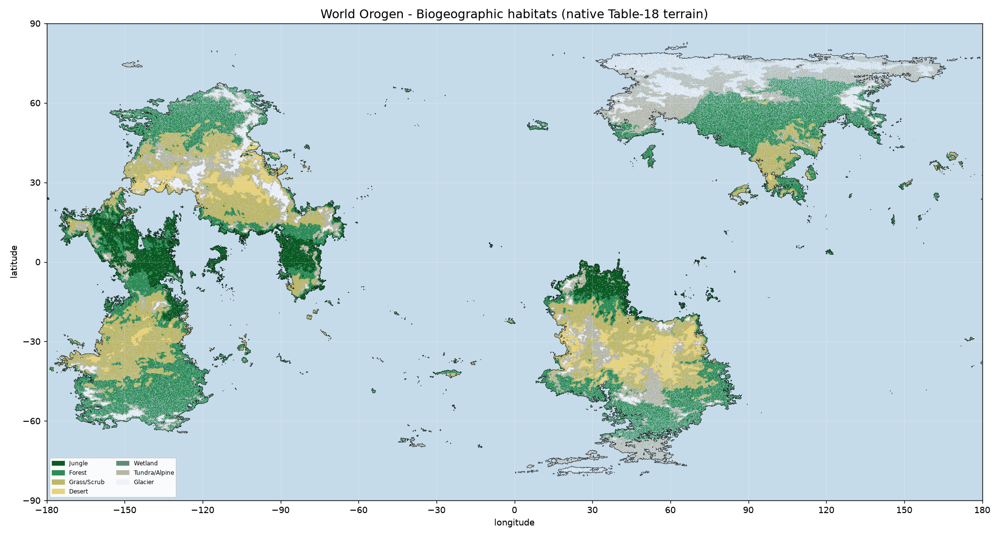

# Biogeography

Habitat provinces of Orogen planet `06cy8w6z6a89kow6psje93`. Every land cell is classified into a Table-18 terrain class (a port of `tools/regional-report/classify.mjs`), grouped into seven macro-habitats, and assigned to the connected landmass it belongs to. NPP is the ice-corrected Miami model (Köppen-EF ice caps = 0).

Tags: continent **shapes** `MEASURED`; craton composition `INTERPRETED` (reconstructed history); Köppen→terrain `INTERPRETED`; continent **names** `INVENTED` (`continents.yaml`).

## Provinces (continent × habitat, ≥ 2,000 cells)

| continent | cratons | habitat | dom. terrain | % land | lat span | elev | T °C | P mm | NPP |
|---|---|---|---|---:|---|---:|---:|---:|---:|
| Selvana | C·E·F | Forest | Forest medium | 9.93 | -64→27 | 0.97 | 16.2 | 1082 | 1354 |
| Borea | G | Forest | Forest medium | 8.74 | 21→70 | 0.94 | 6.6 | 1114 | 1028 |
| Meridia | A·I·J | Grass/Scrub | Scrub/brush | 8.12 | -15→54 | 1.42 | 22.6 | 541 | 891 |
| Sirocca | B·D·H | Grass/Scrub | Scrub/brush | 7.57 | -55→-9 | 1.39 | 23.6 | 497 | 831 |
| Selvana | C·E·F | Grass/Scrub | Scrub/brush | 7.52 | -53→28 | 0.72 | 21.6 | 538 | 888 |
| Meridia | A·I·J | Forest | Forest light | 6.64 | -15→67 | 1.22 | 16.6 | 1078 | 1372 |
| Sirocca | B·D·H | Forest | Forest medium | 6.63 | -68→-4 | 1.11 | 16.3 | 1002 | 1312 |
| Selvana | C·E·F | Jungle | Jungle heavy | 5.4 | -23→21 | 0.87 | 24.8 | 1701 | 2023 |
| Borea | G | Tundra/Alpine | Tundra | 4.92 | 25→78 | 1.69 | -5.0 | 874 | 418 |
| Sirocca | B·D·H | Tundra/Alpine | Barren | 4.3 | -76→-0 | 3.26 | 6.4 | 640 | 630 |
| Meridia | A·I·J | Tundra/Alpine | Barren | 4.2 | -12→68 | 3.59 | 6.1 | 466 | 608 |
| Sirocca | B·D·H | Desert | Desert rocky | 3.93 | -46→-20 | 1.53 | 24.5 | 237 | 435 |
| Borea | G | Glacier | Glacier | 3.0 | 44→79 | 3.28 | -19.7 | 568 | 0 |
| Meridia | A·I·J | Desert | Desert rocky | 2.64 | 20→45 | 1.66 | 22.7 | 219 | 404 |
| Meridia | A·I·J | Jungle | Jungle heavy | 2.53 | -14→34 | 0.96 | 25.4 | 1774 | 2068 |
| Sirocca | B·D·H | Jungle | Jungle heavy | 2.5 | -27→1 | 1.11 | 25.5 | 1698 | 2017 |
| Meridia | A·I·J | Glacier | Glacier | 2.23 | -10→66 | 5.12 | -18.6 | 313 | 0 |
| Borea | G | Grass/Scrub | Scrub/brush | 2.08 | 24→62 | 0.93 | 15.4 | 491 | 819 |
| Islands | — | Forest | Forest medium | 1.82 | -67→66 | 0.32 | 17.1 | 1129 | 1365 |
| Selvana | C·E·F | Tundra/Alpine | Barren | 1.53 | -64→15 | 3.56 | 6.4 | 902 | 988 |
| Islands | — | Jungle | Jungle heavy | 0.85 | -23→22 | 0.34 | 25.7 | 1759 | 2058 |
| Islands | — | Grass/Scrub | Scrub/brush | 0.75 | -43→44 | 0.26 | 20.5 | 575 | 941 |
| Sirocca | B·D·H | Glacier | Glacier | 0.64 | -67→-6 | 4.98 | -12.5 | 452 | 0 |
| Selvana | C·E·F | Desert | Desert sandy | 0.49 | -42→28 | 0.53 | 22.9 | 279 | 504 |
| Selvana | C·E·F | Glacier | Glacier | 0.47 | -63→14 | 4.95 | -21.5 | 563 | 0 |

Glacier provinces read **NPP 0** (ice caps carry no standing vegetation); tundra keeps its real low productivity. EF ice caps occur at high *elevation* as well as high latitude, so a glacier province can reach low latitudes. Generated by `tools/tectonics-pipeline/scripts/97_biogeography.py`.

