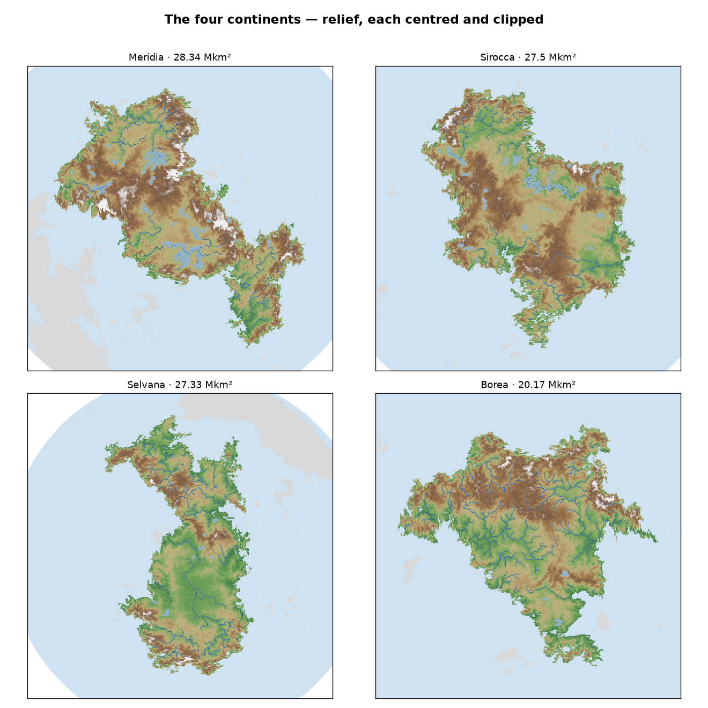

# Continents

The four major landmasses of Orogen planet `06cy8w6z6a89kow6psje93`, named in `tools/tectonics-pipeline/continents.yaml`. Continent membership is the shared connected-landmass assignment (`lib/continents.py`, also used by the biogeography); areas are the inventory's canonical continent areas. Köppen bands (`docs/DATA_DICTIONARY.md`) and ice-corrected Miami NPP (Köppen-EF = 0) are rolled up per continent.

| continent | cratons | area (Mkm²) | % land | A | B | C | D | E | mean NPP (g/m²/yr) | mountainous % | mean elev (km) |
|---|---|---:|---:|---:|---:|---:|---:|---:|---:|---:|---:|
| **Meridia** | A,I,J | 28.34 | 26.4 | 24.8 | 35.6 | 15.6 | 9.3 | 14.7 | 956 | 1.9 | 2.01 |
| **Sirocca** | B,D,H | 27.5 | 25.6 | 20.1 | 44.2 | 21.2 | 4.8 | 9.7 | 957 | 1.9 | 1.71 |
| **Selvana** | C,E,F | 27.33 | 25.4 | 39.9 | 20.8 | 18.4 | 16.6 | 4.3 | 1295 | 1.2 | 1.09 |
| **Borea** | G | 20.17 | 18.8 | 0.1 | 3.3 | 12.5 | 43.2 | 40.9 | 681 | 1.8 | 1.51 |

## Maps

Each continent centred and clipped — relief, Köppen climate and native habitats, with the major-river network and endorheic (closed-basin) lakes overlaid (hydrography from the Node regional pipeline, see [`HYDROLOGY_VALIDATION.md`](../reports/regional/HYDROLOGY_VALIDATION.md)): [Meridia](../reports/tectonics/maps/continents/Meridia.png) · [Sirocca](../reports/tectonics/maps/continents/Sirocca.png) · [Selvana](../reports/tectonics/maps/continents/Selvana.png) · [Borea](../reports/tectonics/maps/continents/Borea.png).

See [`REGION_CROSSWALK.md`](REGION_CROSSWALK.md) for which regional gazetteers cover each continent (and by how much), and [`BIOGEOGRAPHY.md`](BIOGEOGRAPHY.md) for per-continent habitat provinces.

Köppen bands: **A** tropical · **B** arid · **C** temperate · **D** continental · **E** polar (percent of each continent's land cells). Generated by `tools/tectonics-pipeline/scripts/95_continent_profiles.py`.

