# Geological history of planet `06cy8w6z6a89kow6psje93`

*Orogen seed 10673275 — 2,560,001 surface regions,
20.89% land, physical relief -9.281 to
+8.538 km.*

This document reconstructs a plate-tectonic history for a procedurally generated
world. The generator produces only a **single present-day snapshot** — plates,
boundaries, orogens, hotspots and margins, but no time axis. Following the
method in Worldbuilding Pasta's *Constructing a Plate Tectonic History*, we read
the planet's present tectonic features and then build a forward history — one
full supercontinent cycle, **T-750 Myr to present in 50-Myr stages** — that
*explains* what we see today. Every claim is checked against the quantitative
rules of thumb from the same essays (see [Validation](#validation)).

## 1. Tectonic regime

We adopt **Earth-like mobile-lid plate tectonics**, the regime the source
material treats as the baseline for an active, habitable world. The planet
qualifies on the usual grounds: it is Earth-sized, has deep water oceans
(~79% ocean), a cool surface, and — decisively — its data show the diagnostic
signature of mobile-lid tectonics that the *Alternatives to Plate Tectonics*
essay says no stagnant- or squishy-lid world produces: long, continuous
divergent ridges facing matching convergent trench systems, asymmetric
subduction with back-arc basins, linear hotspot chains recording plate drift,
and paired active/passive continental margins. Stagnant-lid (Mars/Venus-style),
heat-pipe (Io), and squishy/sluggish-lid regimes are all ruled out by these
features; we note them only to justify the choice.

The cycle modeled here is **mixed (predominantly extroversion)**: the supercontinent S1
(all ten cratons) assembled by T-650, held for ~200 Myr, and broke up at
T-450. Most fragments dispersed across the old exterior ocean (extroversion),
while the B-D-H core ran a small nested introverted Wilson cycle (the H-B
Seaway opened and closed again).


## 2. Nomenclature

Functional labels (after the essay's A-J / i-ii-iii / 1-2-3 convention):

- **Cratons** `A`-`J`: the ten ancient, rigid continental nuclei. They persist
  intact for the whole history and are the anchor points of every reconstruction.
- **Microcontinents** `micro_1`-`micro_11`: smaller continental blocks, arc
  terranes, and oceanic plateaus that rift, drift, and accrete.
- **Continents**: the four major landmasses carry names (authored in
  `continents.yaml`) alongside their craton-group key — Borea (`G`), Meridia (`AIJ`), Selvana (`CEF`), Sirocca (`BDH`).
- **Ocean basins**: named (Exterior, Central, Western, Northern, H-B Seaway).
- **Present-day ocean plates**: roman numerals `i`-`xvi` by area.
- **Features**: orogens `O1`-`On`, trenches `T1`-`Tn`, back-arc basins
  `B1`-`Bn`, hotspots `H1`-`Hn`.
- **Stages**: `T-750` … `T-0`, in Myr before present.


## 3. Present-day tectonic inventory

The starting point: what the generated planet looks like today.

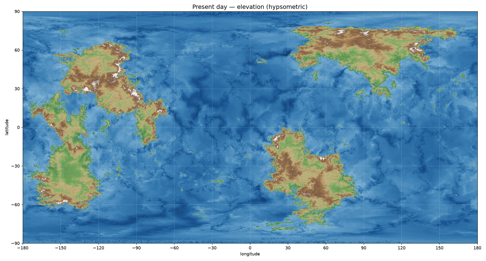

**Continents.** 4 major landmasses — **Borea** (`G`, 20.17 Mkm²), **Meridia** (`AIJ`, 28.34 Mkm²), **Selvana** (`CEF`, 27.33 Mkm²), **Sirocca** (`BDH`, 27.5 Mkm²), plus 11 microcontinents and many islands.

**Plates.** 20 super-plates (16 oceanic, 4 continental). Inferred motions come from a slab-pull/ridge-push force balance (plate Euler poles are not exported, so directions are heuristic; see the confidence column in `out/INVENTORY.md`).

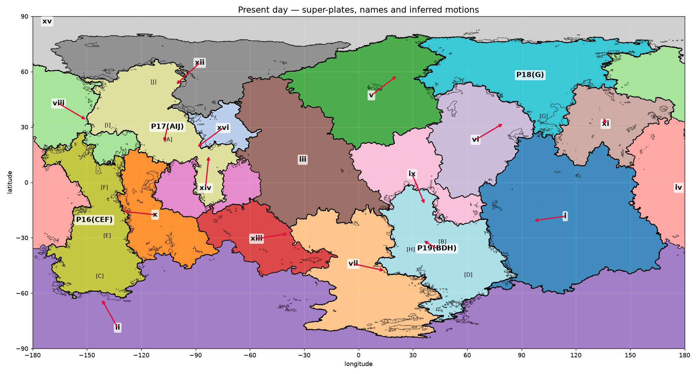

**Boundaries.** Classified from the generator's `margins` field and boundary-pixel stress: ridges (divergent), trenches (convergent, with subduction polarity from back-arc and trench placement), and transforms.

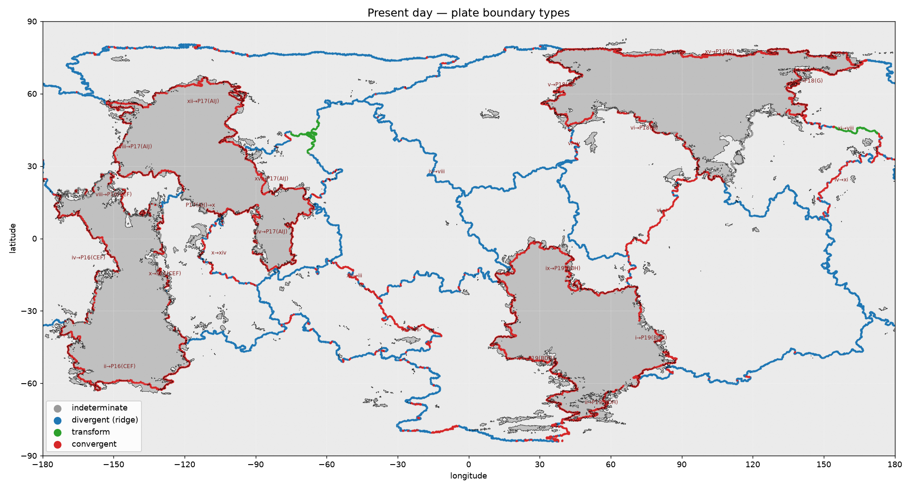

**Tectonic features.** The belts, trenches, basins, fold ridges and hotspots that the history must explain:

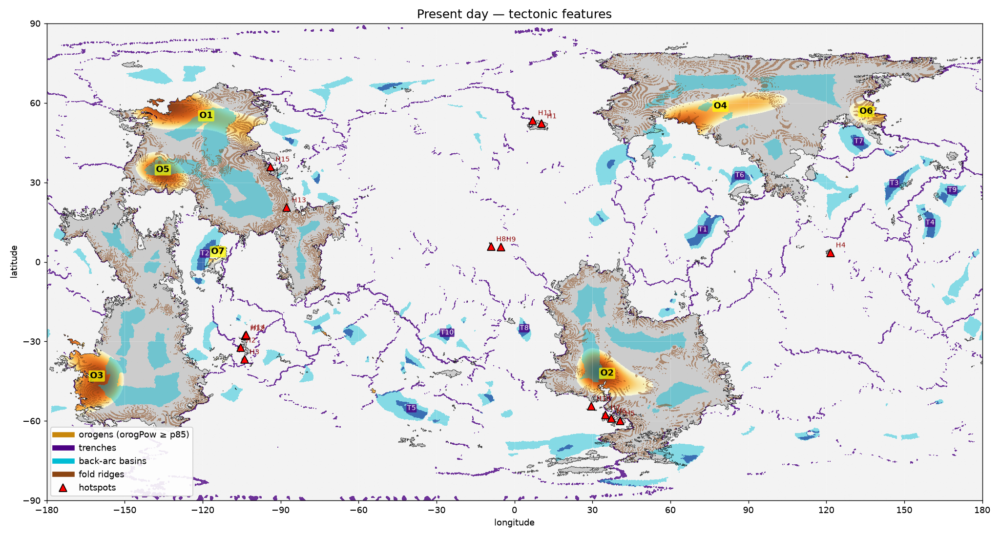

| feature | location | character |
|---|---|---|
| O1 orogen | [54.3, -118.6] | 3.22 Mkm², mean 1.58 km / max 7.54 km, blocks ['A', 'I', 'J'] |
| O2 orogen | [-42.9, 35.7] | 3.046 Mkm², mean 1.89 km / max 5.18 km, blocks ['B', 'D', 'H'] |
| O3 orogen | [-43.9, -160.7] | 3.035 Mkm², mean 1.53 km / max 6.65 km, blocks ['C'] |
| O4 orogen | [57.9, 79.3] | 2.529 Mkm², mean 1.15 km / max 5.09 km, blocks ['G'] |
| O5 orogen | [33.9, -135.3] | 2.148 Mkm², mean 2.65 km / max 8.43 km, blocks ['I'] |
| O6 orogen | [55.9, 135.4] | 0.569 Mkm², mean 2.34 km / max 7.15 km, blocks ['G'] |
| O7 orogen | [3.0, -114.1] | 0.238 Mkm², mean 0.4 km / max 1.68 km, blocks ['micro_7'] |
| T1 trench | [11.5, 72.5] | min -4.26 km |
| T2 trench | [2.5, -119.1] | min -3.28 km |
| T3 trench | [29.0, 146.2] | min -4.21 km |
| T4 trench | [14.1, 160.0] | min -4.06 km |
| T5 trench | [-55.9, -39.6] | min -4.36 km |
| T6 trench | [32.0, 86.7] | min -3.27 km |

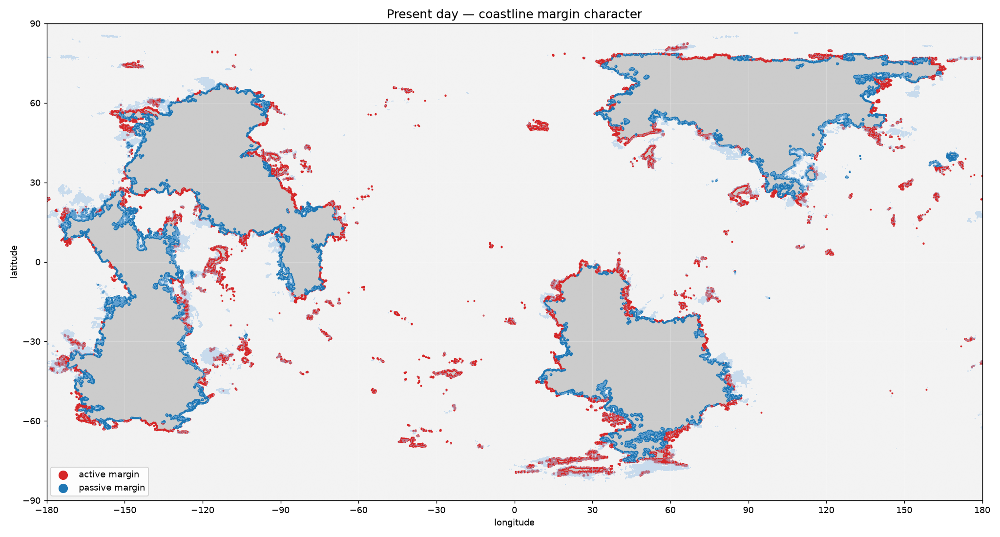

Coastlines split roughly half active / half passive — consistent with a world ~100 Myr past a supercontinent breakup.


## 4. The supercontinent cycle, stage by stage

Across the cycle: 5 LIP, 2 arc accretion, 3 failed rift, 5 hotspot track, 5 note, 9 orogeny, 1 reversal, 3 ridge birth, 2 ridge death, 5 rift, 7 subduction init, 1 subduction jump, 1 triple junction.

### Stage T-750 Myr

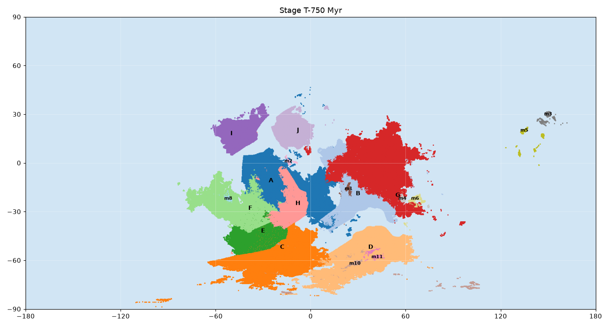

The story opens mid-convergence. The ten cratons ride six shrinking plates toward a common center near 25S 0E, pulled by the slab girdle of the closing pre-cycle oceans. Active margins face inward on almost every block.

| event | type | where | detail |
|---|---|---|---|
|  | note | - | Pre-S1 dispersal: ten cratons and their terranes scattered over ~120 deg of the southern hemisphere, all converging. A girdle of subduction zones rings the assembling core; the previous cycle's interior basins are nearly consumed. |

### Stage T-700 Myr

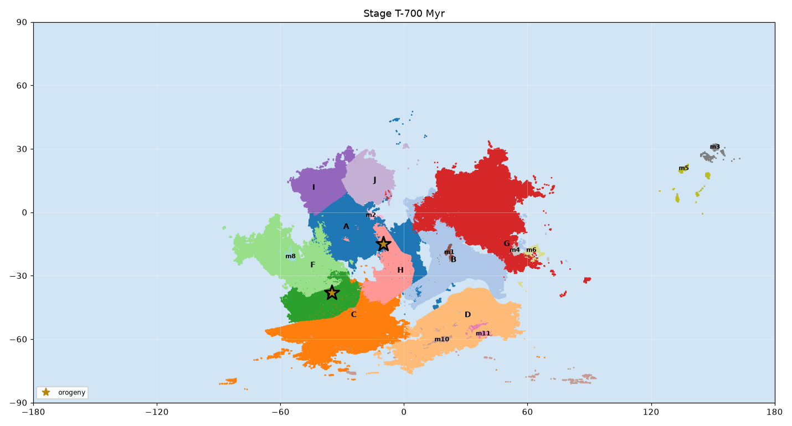

First assembly collisions. The A-J group meets H along a north-south suture; the southern belt C-E-F docks soon after. These Ural-type orogens have had 700 Myr of erosion; today they survive only as basement structure inside the continents.

| event | type | where | detail |
|---|---|---|---|
| ['A', 'J', 'H', 'B'] | orogeny *(ural)* | [-15, -10] | S1 western suture: the A-J group docks against H and the B-core margin. Today eroded to basement. |
| ['C', 'E', 'F'] | orogeny *(ural)* | [-38, -35] | S1 southern suture: C-E-F belt docks. Today eroded to basement. |

### Stage T-650 Myr


G arrives last and S1 is complete: every craton in one landmass centered near 25S, ringed by trenches dipping under its margins. Sea level falls; the interior dries into a vast continental climate. EXT, the world-ocean, surrounds everything.

| event | type | where | detail |
|---|---|---|---|
| ['G', 'B', 'D'] | orogeny *(ural)* | [-12, 42] | Final docking of G completes S1. |
|  | subduction_init | [-25, 95] | Circum-S1 subduction girdle locks in: the extroversion engine. The exterior ocean (EXT) now rings the supercontinent. |

### Stage T-600 Myr

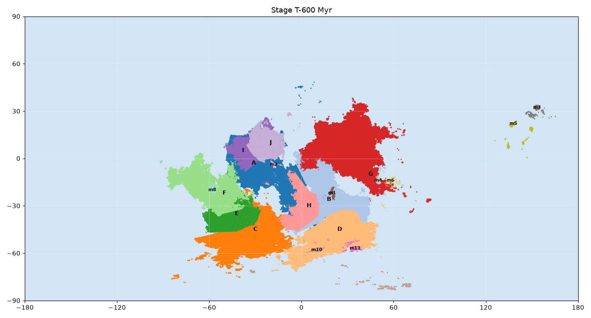

Quiet tenure. Heat trapped under the huge lid builds plume heads beneath the western flank and the C-D gap. The land bulges in broad domes; rivers radiate off them. The exterior margins remain active, slowly pulling at the lid from all sides.

| event | type | where | detail |
|---|---|---|---|
|  | note | - | S1 tenure. Thermal blanketing: mantle plumes incubate beneath the supercontinent; epeirogenic doming begins along the future rift lines. |

### Stage T-550 Myr


The first Large Igneous Province (L1) erupts across the A-F neighborhood: kilometer-thick flood basalts over a few hundred thousand years. The crust beneath is weakened and primed to tear.

| event | type | where | detail |
|---|---|---|---|
|  | LIP | [-15, -30] | L1 flood basalts over the western-flank plume head: first magmatic precursor of breakup. |

### Stage T-500 Myr

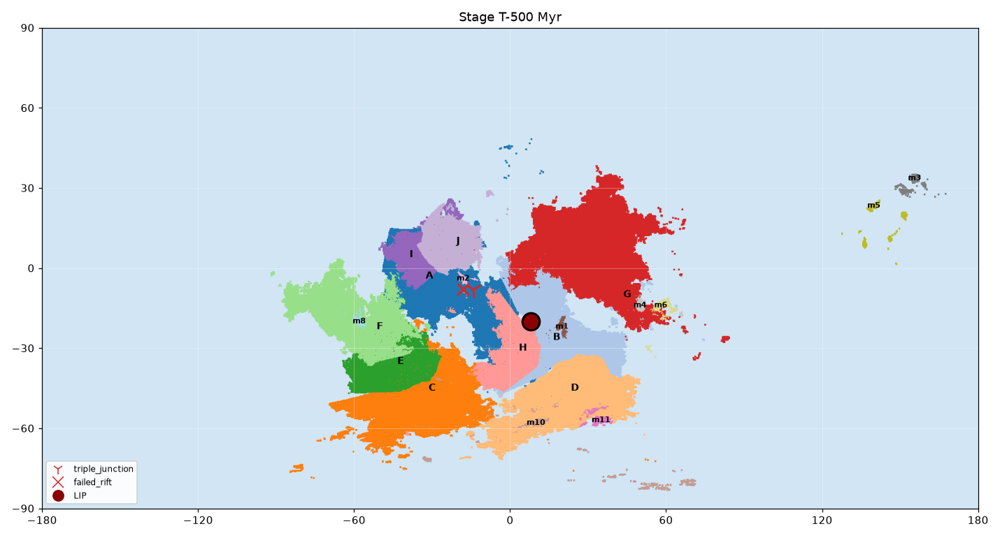

Rifting begins. A three-armed rift (R1) opens on the old L1 scar; two arms link into a through-going rift between the western flank and the core, while the third arm fails and is preserved as aulacogen AU1 in A. L2 floods the junction as the lithosphere finally parts.

| event | type | where | detail |
|---|---|---|---|
|  | triple_junction | [-8, -14] | R1 triple junction nucleates on the L1 scar between the A-flank and the H-B core. |
| ['A'] | failed_rift | [-8, -18] | AU1 aulacogen: the failed third arm runs into A; today a sediment-filled trough on AIJ's southeastern margin. |
|  | LIP | [-20, 8] | L2 erupts at the R1 junction. |

### Stage T-450 Myr

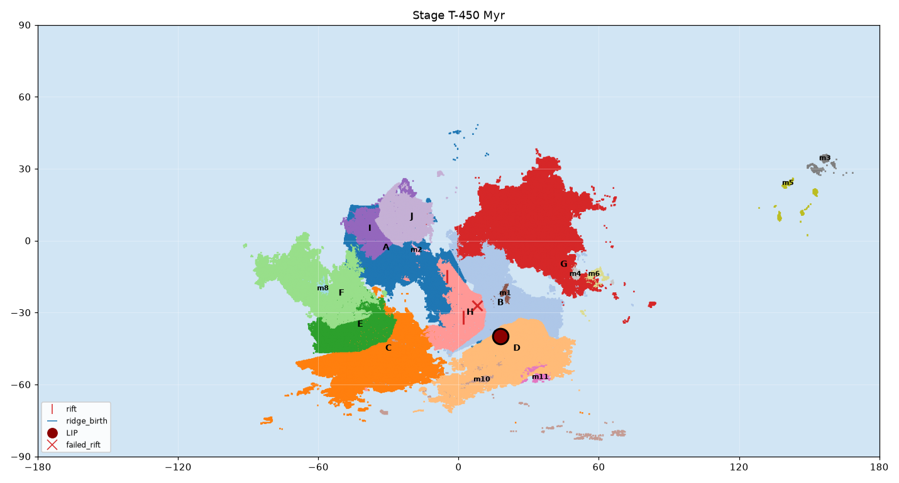

Breakup. The western flank (A, I, J, C, E, F and their terranes) tears away along the new Central Ridge; zig-zag rifted margins face the young CENTRAL ocean. H splits from B across the small H-B Seaway. S1 is dead after ~200 Myr of tenure.

| event | type | where | detail |
|---|---|---|---|
| ['A', 'I', 'J', 'F', 'E', 'C'] | rift | [-15, -5] | R1 goes to seafloor spreading: breakup of S1. |
|  | ridge_birth | [-18, -8] | Central Ridge born; CENTRAL ocean opens. |
| ['H'] | rift | [-32, 2] | H-B Seaway rift: H detaches westward from B - a small interior ocean. |
|  | LIP | [-40, 18] | L3 floods the C-D gap as the southern arm unzips. |
| ['B'] | failed_rift | [-27, 8] | AU2 aulacogen on B's western margin. |

### Stage T-400 Myr

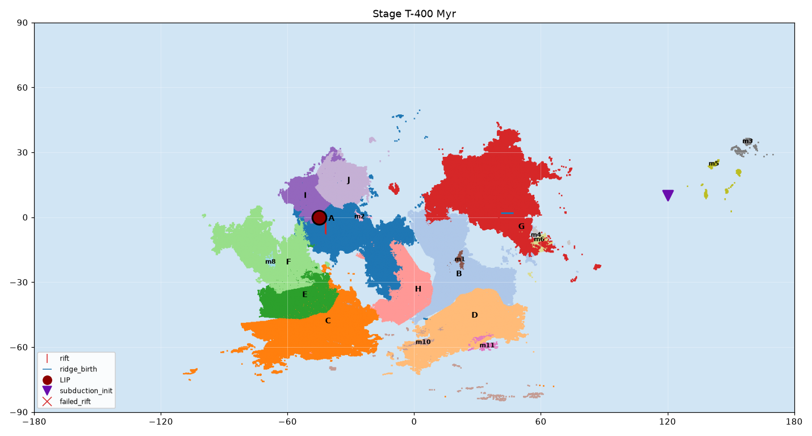

Dispersal in earnest. The west flank itself splits along the Western Ridge: A-J-I head northwest, C-E-F southwest. G casts off toward the northeast across the new Northern Ocean. Four LIPs in 100 Myr - L1 through L4 - have peppered the breakup, and a fifth is coming. The fragments now ride toward the trenches of EXT.

| event | type | where | detail |
|---|---|---|---|
| ['A', 'J', 'I', 'C', 'E', 'F'] | rift | [-5, -42] | R3 splits the west flank: AJ-I group parts from C-E-F. |
|  | ridge_birth | [-8, -45] | Western Ridge born; WESTERN ocean opens. |
| ['G'] | rift | [-2, 40] | G detaches northeast from the core. |
|  | ridge_birth | [2, 44] | Northern Ridge born; NORTHERN ocean opens. |
|  | LIP | [0, -45] | L4 erupts along the R3 axis. |
|  | subduction_init | [10, 120] | EXT trenches advance: the exterior girdle begins consuming ocean ahead of the dispersing fragments (extroversion). |
| ['G'] | failed_rift | [-12, 50] | AU3 aulacogen on G's trailing (southwestern) margin. |

### Stage T-350 Myr

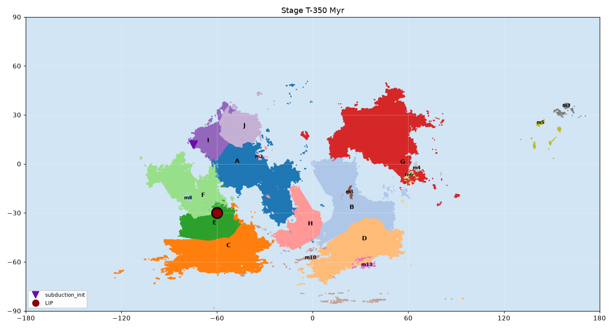

The leading edges harden. Old exterior crust founders in new trenches ahead of I and the C-E-F group; coastal volcanic arcs rise. Behind them, passive margins quietly accumulate shelf sediment. L5 erupts at sea - the last gasp of the breakup plume family.

| event | type | where | detail |
|---|---|---|---|
|  | subduction_init | [12, -75] | Ocean plate ahead of I founders; I's leading (western) margin turns Andean. |
|  | LIP | [-30, -60] | L5: last breakup-series LIP, on the young WESTERN ocean floor; its plume survives today under plate ii (hotspot chain H2-H3-H12-H14). |

### Stage T-300 Myr

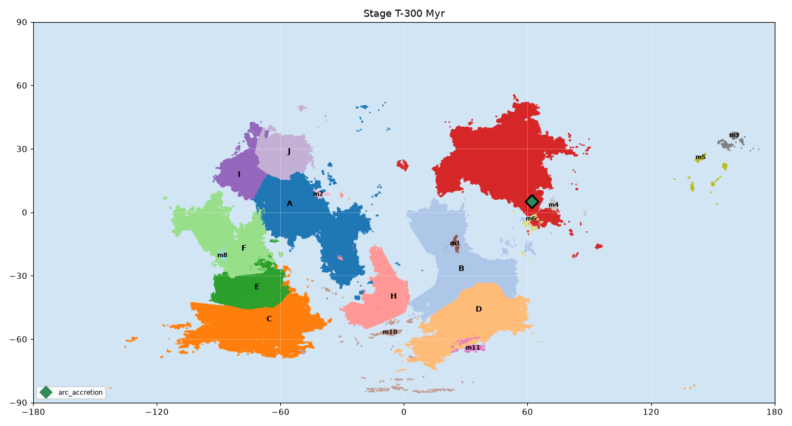

G plows north, sweeping up island arcs along its leading edge. The CENTRAL ocean is now wide enough that its ridge breaks into long transform-offset segments. H drifts at its farthest from B; the H-B Seaway is at maximum width.

| event | type | where | detail |
|---|---|---|---|
| ['G'] | arc_accretion | [5, 62] | Offshore arcs dock onto G's northern leading margin - groundwork of the O4 belt. |
|  | note | - | Central Ridge reorganizes; long transform faults segment the CENTRAL ocean. |

### Stage T-250 Myr

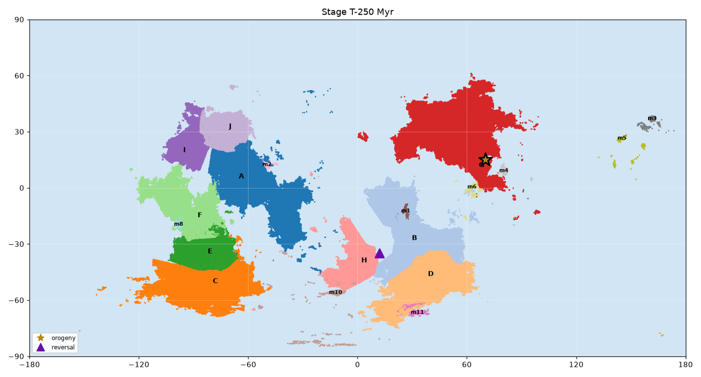

Fast-moving G overruns young, buoyant ridge crust: the slab goes flat and Laramide-style basement uplifts sweep 1300 km into G's interior - the O4 belt. Meanwhile the old H-B Seaway crust grows dense enough to founder; a new east-dipping trench under B begins pulling H home.

| event | type | where | detail |
|---|---|---|---|
| ['G'] | orogeny *(laramide)* | [15, 70] | O4: the Northern Ridge's eastern limb subducts under G - flat-slab episode, broad interior uplift (today's 2.5 Mkm2 belt at 58N 79E, eroded to 1.15 km mean). |
|  | reversal | [-35, 12] | Subduction polarity in the H-B Seaway flips east: the seaway starts to close under B's margin. |

### Stage T-200 Myr

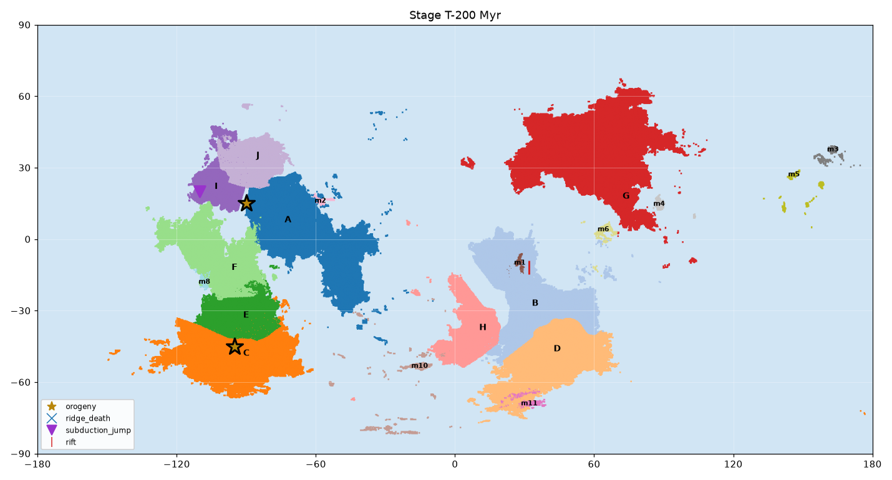

The first great post-breakup collision: A and J close on I from two sides and weld into the continent AIJ along the broad O1 belt - 700 km of stacked crust, 4 km peaks in its day. Subduction steps outboard to AIJ's Pacific-style western rim. Far south, C's seaward margin settles into the long Andean regime that still builds the O3 cordillera.

| event | type | where | detail |
|---|---|---|---|
| ['A', 'I', 'J'] | orogeny *(himalayan)* | [15, -90] | O1: A and J converge on I; broad collision belt (3.2 Mkm2). AIJ is assembled and moves as one continent hereafter. |
|  | ridge_death | [8, -60] | The A-I ridge segment is consumed in the collision. |
|  | subduction_jump | [20, -110] | Subduction jumps outboard to AIJ's new western margin. |
| ['micro_1'] | rift | [-12, 32] | micro_1 detaches from B's northern margin and rides north. |
| ['C'] | orogeny *(andean)* | [-45, -95] | O3: C's southwestern margin enters its sustained Andean phase (belt still active today). |

### Stage T-150 Myr

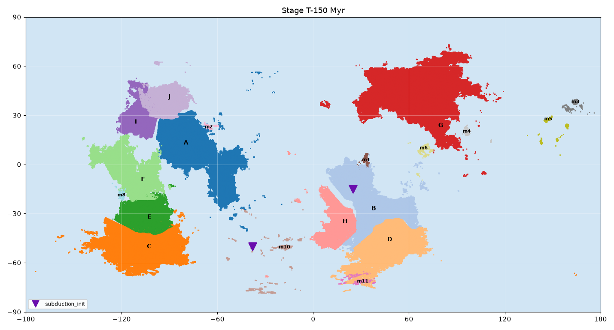

The CENTRAL ocean, now 300 Myr old at its eastern edge, begins to be consumed: a trench locks in along BDH's west coast. The planet is entering the early signs of the NEXT assembly even as the current oceans still widen elsewhere - exactly Earth's present condition.

| event | type | where | detail |
|---|---|---|---|
|  | subduction_init | [-15, 25] | CENTRAL ocean's eastern flank founders under BDH's western margin (today's T8 trench and B5 back-arc). |
|  | subduction_init | [-50, -38] | Southern ocean trench T5 system initiates. |
|  | note | - | H closes to within 1000 km of B; seaway crust nearly consumed. |

### Stage T-100 Myr

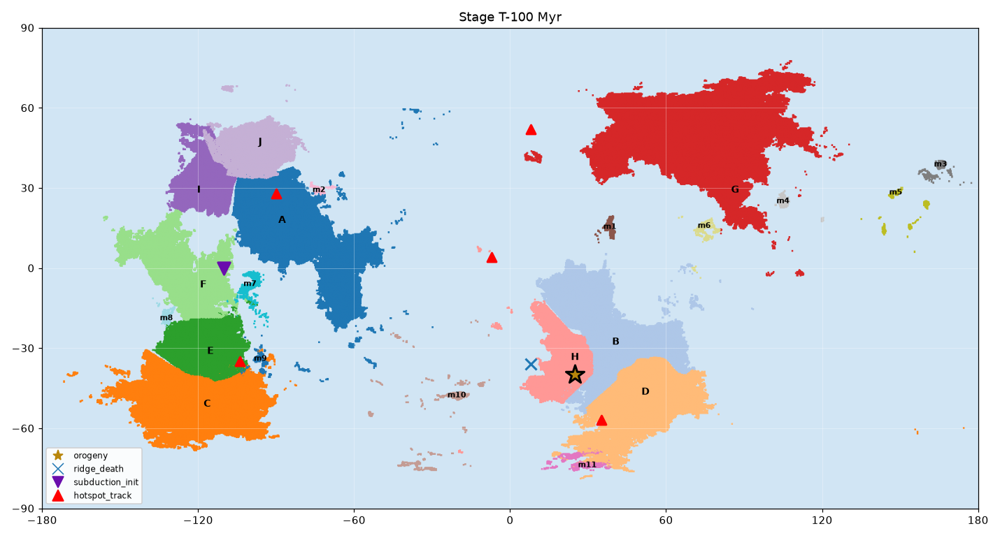

H comes home: the seaway closes and the O2 belt rises across the B-D-H triple suture, completing the continent BDH almost exactly where its pieces stood in S1 - a textbook introverted Wilson cycle nested inside the larger extroversion. In the oceans, five mantle plumes light up the hotspot chains we can still trace.

| event | type | where | detail |
|---|---|---|---|
| ['B', 'D', 'H'] | orogeny *(himalayan)* | [-40, 25] | O2: H docks against B and D; the seaway dies. Introverted Wilson cycle complete; BDH assembled (today 1.89 km mean, consistent with ~120 Myr age). |
|  | ridge_death | [-36, 8] | H-B Seaway ridge destroyed. |
|  | subduction_init | [0, -110] | Intra-oceanic subduction starts in the WESTERN ocean: trench T2; the micro_7 arc begins building. |
|  | hotspot_track | [-35, -104] | Plume P1 (L5 relic) under plate ii: chain H2-H3-H12-H14 starts recording plate motion. |
|  | hotspot_track | [-57, 35] | Plume P2 under the southern ocean: chain H5-H6-H7-H10. |
|  | hotspot_track | [4, -7] | Plume P3, equatorial CENTRAL ocean: H8-H9. |
|  | hotspot_track | [52, 8] | Plume P4, northern ocean: H1-H11. |
|  | hotspot_track | [28, -90] | Plume P5 under AIJ's old AU1 rift scar: continental hotspots H13-H15. |

### Stage T-50 Myr

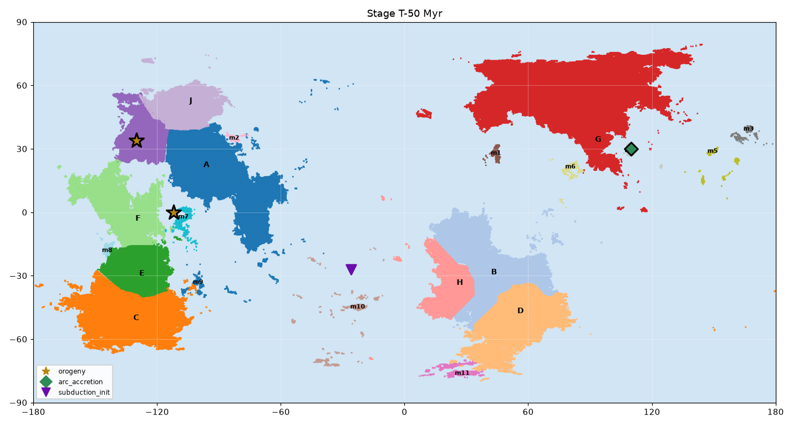

The modern mountain age. AIJ's far western rim takes the full force of fast convergence - ridge crust subducts, arcs dock, and the O5 cordillera shoots past 8 km, the planet's highest ground. On the far side of the world micro_4 slams into G, raising O6. Even the young CENTRAL ocean now hosts a new trench: the long turn toward the next supercontinent has begun.

| event | type | where | detail |
|---|---|---|---|
| ['I'] | orogeny *(himalayan)* | [34, -130] | O5: ridge subduction plus arc pile-up on I's western margin; the belt is still rising (8.4 km peaks today). |
| ['G', 'micro_4'] | arc_accretion | [30, 110] | O6: the micro_4 arc terrane docks onto G's eastern margin (2.3 km mean, ~30 Myr). |
|  | subduction_init | [-27, -26] | T10: a young trench breaks the CENTRAL ridge's western flank - subduction invading a young ocean. |
| ['micro_7'] | orogeny *(andean)* | [0, -112] | O7: the micro_7 arc grows into a low orogen above trench T2 (still building). |

### Stage T-0 (present) Myr

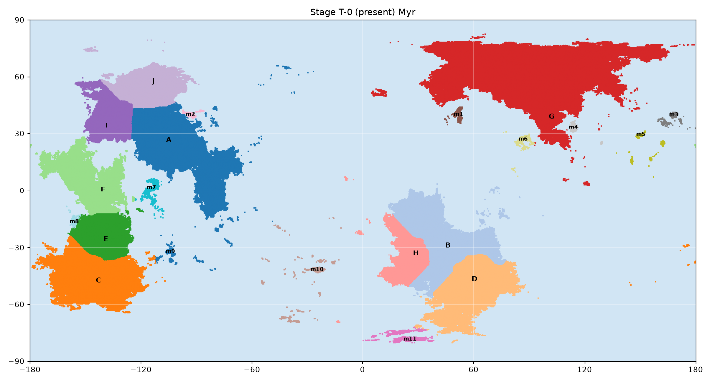

Today the planet looks like Earth ~100 Myr after a breakup: four dispersed continents, half the coastline active, young interior sutures (O1, O2) wearing down while collision belts on the rims (O5, O6) still climb. The CENTRAL and WESTERN oceans are aging into their first trenches. The cycle is turning over.

| event | type | where | detail |
|---|---|---|---|
|  | note | - | Present day. Active systems: trenches T1-T10, Andean margins on I, C and G, back-arcs B1-B7, hotspot chains from plumes P1-P5. AIJ, CEF and G converge broadly northward; BDH walks south alone. Projected next supercontinent: a boreal assembly of AIJ+CEF+G in ~200-300 Myr. |


## 5. Ocean basins

| basin | born | died | note |
|---|---|---|---|
| EXT (Exterior Ocean) | None | None | Eastern world basin. The basin is ancient but its crust is young: continuously renewed at exterior ridges and consumed at the T3/T4/T9 trench cluster. Present plates xi, iii, xiv occupy it. |
| CENTRAL (Central Ocean) | -450 | None | Opened along rift R1 between the S1 west flank and the B-D-H core. |
| WESTERN (Western Ocean) | -400 | None | Opened along rift R3, splitting the west flank into AJ-I and C-E-F groups. |
| NORTHERN (Northern Ocean) | -400 | None | Opened when G detached northeast from the core. |
| HB (H-B Seaway) | -450 | -100 | Introverted Wilson cycle; closed at the O2 collision. |

## 6. Feature provenance

Every present-day tectonic feature traced to the event that made it. This is the core test of the reconstruction: the history is only valid if it accounts for what the planet actually shows.

| present-day feature | explained by |
|---|---|
| O1 orogen at [54.3, -118.6] (blocks A,I,J) | T-200 himalayan collision assembling AIJ; 185 Myr of erosion to 1.58 km mean |
| O2 orogen at [-42.9, 35.7] (blocks B,D,H) | T-100 himalayan closure of the H-B Seaway (introverted Wilson cycle); 1.89 km mean fits ~120 Myr age |
| O3 orogen at [-43.9, -160.7] (block C) | Sustained Andean margin on C's seaward coast since T-200 (event at stage T-200) |
| O4 orogen at [57.9, 79.3] (block G) | T-250 laramide flat-slab episode (ridge subduction under fast-moving G); 1.15 km mean fits ~270 Myr age |
| O5 orogen at [33.9, -135.3] (block I) | T-50..now himalayan-grade margin orogeny on I (ridge subduction + arc pile-up); still rising, 8.43 km max |
| O6 orogen at [55.9, 135.4] (block G) | T-50 arc_accretion of micro_4 onto G's eastern margin |
| O7 orogen at [3.0, -114.1] (micro_7) | Active intra-oceanic arc above trench T2 (subduction_init T-100) |
| T1 trench at [11.5, 72.5] | NORTHERN/CENTRAL ocean floor subducting beneath the micro_6 arc system (lineage of the T-150 eastern-flank foundering) |
| T2 trench at [2.5, -119.1] | T-100 intra-oceanic subduction_init in the WESTERN ocean; feeds the micro_7/O7 arc |
| T3 trench at [29.0, 146.2] | Long-lived EXT girdle subduction (since T-400) |
| T4 trench at [14.1, 160.0] | Long-lived EXT girdle subduction (since T-400) |
| T5 trench at [-55.9, -39.6] | T-150 southern-ocean subduction_init |
| T6 trench at [32.0, 86.7] | NORTHERN ocean beginning to close against G's trailing margin (next-assembly precursor) |
| T7 trench at [44.8, 132.5] | EXT margin subduction under G's eastern (O6) rim |
| T8 trench at [-25.7, 3.8] | T-150 foundering of old CENTRAL-ocean crust under BDH's west coast |
| T9 trench at [26.4, 168.5] | Long-lived EXT girdle subduction (since T-400) |
| T10 trench at [-27.4, -25.9] | T-50 subduction invasion of the young CENTRAL ridge flank |
| B1 back-arc at [25.6, -105.3] | Continental back-arc behind the O5/O1 convergent system on AIJ |
| B2 back-arc at [-47.5, -144.5] | Back-arc of the O3 Andean margin on CEF |
| B3 back-arc at [48.3, -117.5] | Northern back-arc of the AIJ convergent rim |
| B4 back-arc at [-30.0, 50.3] | Back-arc east of the O2 suture / BDH eastern margin system |
| B5 back-arc at [-15.4, 29.1] | Back-arc of the T8 trench on BDH's northwest |
| B6 back-arc at [4.4, -118.7] | Back-arc of the micro_7/T2 intra-oceanic arc |
| B7 back-arc at [37.0, 37.1] | Back-arc of the northern-ocean subduction system feeding micro_1's arc fringe |
| B8 back-arc at [11.8, 72.1] | Back-arc of the T1 trench / micro_6 arc system |
| B9 back-arc at [35.7, -130.8] | Back-arc within the O5 convergent system on I's margin |
| B10 back-arc at [-35.9, 29.6] | Retro-arc basin on the flank of the O2 suture (BDH southwestern margin system) |
| H1, H11 hotspots near [52, 8] | Plume P4 (active since ~T-100) |
| H2, H3, H12, H14 chain near [-32, -104] | Plume P1, relic of LIP L5; chain records plate ii's northward drift |
| H4 hotspot at [3.5, 121.7] | Young plume under the EXT margin west of micro_4's wake (last ~30 Myr) |
| H5, H6, H7, H10 chain near [-57, 35] | Plume P2; chain records southern-ocean plate motion since T-100 |
| H8, H9 hotspots near [5.8, -7] | Plume P3, equatorial CENTRAL ocean |
| H13, H15 hotspots under eastern AIJ | Plume P5 exploiting the AU1 aulacogen scar (continental hotspots) |

## 7. Validation

Generated by `tools/tectonics-pipeline/scripts/60_validate.py`, which checks the history against the essays' quantitative rules of thumb. The run passes with zero hard failures; remaining warnings are sub-30% block overlaps during the tightly-packed supercontinent assembly, where continents are expected to abut.


## Block speeds (cm/yr per 50-Myr stage)

| block | max speed | stage | verdict |
|---|---:|---|---|
| A | 2.02 | T-200..T-150 | ok |
| B | 1.46 | T-750..T-700 | ok |
| C | 1.93 | T-100..T-50 | ok |
| D | 1.23 | T-750..T-700 | ok |
| E | 2.38 | T-200..T-150 | ok |
| F | 2.59 | T-150..T-100 | ok |
| G | 1.80 | T-50..T0 | ok |
| H | 1.51 | T-200..T-150 | ok |
| I | 3.19 | T-350..T-300 | ok |
| J | 2.84 | T-350..T-300 | ok |
| micro_1 | 3.05 | T-100..T-50 | ok |
| micro_2 | 2.15 | T-200..T-150 | ok |
| micro_3 | 0.27 | T-600..T-550 | ok |
| micro_4 | 2.11 | T-200..T-150 | ok |
| micro_5 | 0.25 | T-400..T-350 | ok |
| micro_6 | 1.75 | T-200..T-150 | ok |
| micro_7 | 1.79 | T-100..T-50 | ok |
| micro_8 | 2.55 | T-100..T-50 | ok |
| micro_9 | 0.78 | T-50..T0 | ok |
| micro_10 | 1.09 | T-750..T-700 | ok |
| micro_11 | 0.54 | T-450..T-400 | ok |

## Oceans and cycle timing

- EXT (Exterior Ocean): open basin (crust renewed at its ridges)
- CENTRAL (Central Ocean): open basin (crust renewed at its ridges)
- WESTERN (Western Ocean): open basin (crust renewed at its ridges)
- NORTHERN (Northern Ocean): open basin (crust renewed at its ridges)
- HB (H-B Seaway): basin life 350 Myr
- S1 assembled T-650, breakup T-450: tenure 200 Myr
- modeled cycle span 750 Myr (rule of thumb 400-750)

## Orogen heights vs erosion model (2500 m - 5 m/Myr x age)

| orogen | event stage | age Myr | predicted mean m | observed mean m | verdict |
|---|---|---:|---:|---:|---|
| O1 | T-200 | 200 | 1500 | 1580 | ok |
| O2 | T-100 | 100 | 2000 | 1890 | ok |
| O3 | T-200 | 200 | active belt | 1530 | exempt (still building) |
| O4 | T-250 | 250 | 1250 | 1150 | ok |
| O5 | T-50 | 50 | active belt | 2650 | exempt (still building) |
| O6 | T-50 | 50 | active belt | 2340 | exempt (still building) |
| O7 | T-50 | 50 | active belt | 400 | exempt (still building) |

## Provenance coverage

- all 42 present-day features have an explaining event

## Block overlaps

- stage T-750: C overlaps micro_10 by 13%
- stage T-750: E overlaps H by 15%
- stage T-700: C overlaps H by 17%
- stage T-700: C overlaps micro_10 by 14%
- stage T-400: micro_4 overlaps micro_6 by 29%
- stage T-250: B overlaps micro_6 by 13%
- stage T-250: H overlaps micro_10 by 13%

## Endpoint and conservation

- all blocks end at their present positions with zero spin
- all 10 cratons persist across the full span

## Hotspots and LIPs

- hotspot tracks confined to the last 100 Myr
- LIPs: 5 at stages [-550, -500, -450, -400, -350] (rule of thumb ~5 per breakup)

## Summary

- failures: 0
- warnings: 7

- warn: stage T-750: C overlaps micro_10 by 13%
- warn: stage T-750: E overlaps H by 15%
- warn: stage T-700: C overlaps H by 17%
- warn: stage T-700: C overlaps micro_10 by 14%
- warn: stage T-400: micro_4 overlaps micro_6 by 29%
- warn: stage T-250: B overlaps micro_6 by 13%
- warn: stage T-250: H overlaps micro_10 by 13%


## 8. Reproducing this history

The whole package is regenerated from the planet data by running, from the repo
root:

```bash
pip install -r tools/tectonics-pipeline/requirements.txt
python3 tools/tectonics-pipeline/scripts/00_env_check.py
python3 tools/tectonics-pipeline/scripts/10_ingest.py        # -> out/cache/columns.npz
python3 tools/tectonics-pipeline/scripts/15_rasterize.py     # -> out/cache/rasters.npz
python3 tools/tectonics-pipeline/scripts/20_boundaries.py    # -> out/boundary_segments.json
python3 tools/tectonics-pipeline/scripts/25_inventory.py     # -> out/inventory.json, INVENTORY.md
python3 tools/tectonics-pipeline/scripts/30_render_present.py # -> maps/present/*.png
python3 tools/tectonics-pipeline/scripts/50_render_stages.py # -> maps/stages/*.png
python3 tools/tectonics-pipeline/scripts/60_validate.py      # -> out/VALIDATION.md (exit 0 = valid)
python3 tools/tectonics-pipeline/scripts/70_build_doc.py     # -> docs/GEOLOGICAL_HISTORY.md
```

To revise the history, edit `tools/tectonics-pipeline/history/history.yaml` (block keyframes,
events, ocean basins, orogen ages), then re-run `50_render_stages.py`,
`60_validate.py`, and `70_build_doc.py`. The validator gates correctness; keep it
at zero failures.

*Caveats.* Plate motion **directions** are inferred heuristically (the
generator does not export Euler poles), so the absolute longitudes of the
paleogeographic stages are one self-consistent solution among several that fit
the present map — exactly the ambiguity the source essays warn about when
working backward from a finished map. The **relative** sequence of rifting,
drift, collision and accretion, and the feature provenance, are constrained by
the data.

