# Paleoclimate of planet `06cy8w6z6a89kow6psje93`

A 750-Myr climate history layered on the plate-tectonic reconstruction in
[GEOLOGICAL_HISTORY.md](GEOLOGICAL_HISTORY.md). For every 50-Myr stage of the
tectonic history, a simplified zonal climate model is run on that stage's
paleogeography under an authored greenhouse forcing curve
(`tectonics/history/paleoclimate.yaml`), producing Köppen-style climate maps,
a global temperature curve, and emergent ice ages.

## 1. Method

The model transcribes the planet generator's own climate rules (verified
against its source) and runs them on each stage's rotated geography:

- **ITCZ**: land-following and per-longitude, like the generator's — candidate
  latitudes within ±32° scored by solar insolation, an ocean prior, and local
  land thermal boost, then smoothed along longitude (the rain belt bulges
  poleward over large summer landmasses).
- **Ocean currents**: parameterized gyres derived from each stage's land mask —
  warm western-boundary currents poleward along the west side of every ocean
  basin, cold eastern-boundary currents equatorward on the east side, and a
  polar warm drift (North-Atlantic-Drift analog) past ~50°. The field feeds up
  to ±16 °C over ocean and diffuses ±14 °C into coastal land, fading inland.
- **Temperature**: base profile `28 − 47·((|lat−ITCZ|−13°)/77°)^1.4` °C on the
  local ITCZ; the generator's continentality swing table (latitude-gated);
  only the *extra* swing beyond ITCZ seasonality is added (40 % summer / 60 %
  winter); current warmth and the +5 °C hyperoceanic offset; moisture-dependent
  lapse on an effective-elevation scale fitted at T-0; the stage's `dT_global`
  forcing added uniformly.
- **Precipitation**: the generator's zonal curve (ITCZ core → trade-wind
  falloff → subtropical desert factory → westerlies plateau → polar desert)
  with ITCZ convective uplift and fixed-latitude subtropical-high suppression;
  **downwind moisture advection** (trades and polar easterlies carry ocean
  moisture westward, westerlies eastward, relative to the local ITCZ) with
  ITCZ convective recycling over land; Mediterranean dry summers; coastal
  drying wherever the gyre field puts a cold current offshore.
- **Köppen classification**: the generator's exact thresholds (30 classes).
- **Per-stage inputs**: land cells rotated by the tectonic block rotations;
  per-cell elevation carried from the present, with **orogen belts scaled by
  age** using the same erosion model as the tectonic validator (belts rise as
  they form and decay afterwards; absent before their orogeny); continentality,
  ITCZ, gyres and moisture all recomputed from each stage's geography.
- **Simplifications** (documented, not hidden): no orographic wind shadowing,
  a two-season year, uniform (non-amplified) forcing, and parameterized rather
  than dynamic currents.

Ice ages are **emergent**: the forcing curve only sets `dT_global`; ice
appears where cold air meets land (Köppen EF/ET), so glaciations require
polar landmasses — exactly the Earth-theory coupling between tectonics and
climate.

## 2. Present-day calibration

The model at T-0 (true geography, dT = 0) against the generator's full
climate solution (2,560,001 cells):

| Köppen major class | generator (truth) | zonal model | deviation |
|---|---:|---:|---:|
| A | 23.3% | 14.6% | 8.8 pp |
| B | 27.0% | 26.4% | 0.6 pp |
| C | 17.8% | 23.9% | 6.0 pp |
| D | 16.3% | 19.6% | 3.3 pp |
| E | 15.4% | 15.5% | 0.1 pp |

Per-pixel agreement of the full pipeline against the rasterized ground truth:
**49%** on major class
(20% on the exact 30-class code — a harsh
metric, since one-class boundary shifts count as misses). Formula-only run on
the true per-cell geography: seasonal temperature RMSE
**7.6 / 7.4 °C** (summer/winter),
annual precipitation RMSE 468 mm.
Global mean temperature from the data: **16.22 °C**
(modeled at T-0: 17.24 °C).

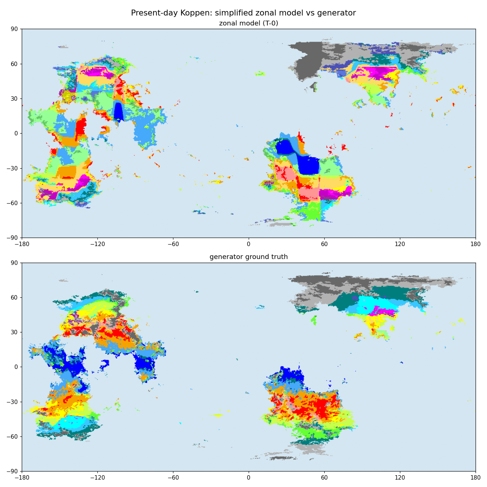

With the parameterized gyres, land-following ITCZ and moisture advection in
place, every major class lands within ~9 pp of the generator (B, D and E
within ~3 pp). The residual gap is concentrated in A vs C around the
subtropical margins, where the generator's dynamic wind/advection solution
draws slightly different monsoon boundaries than the parameterized bands. The
formula-only RMSE row above measures the zonal temperature core alone
(without the grid-derived currents/advection fields, which need a map, not a
cell).

## 3. The 750-Myr climate curve

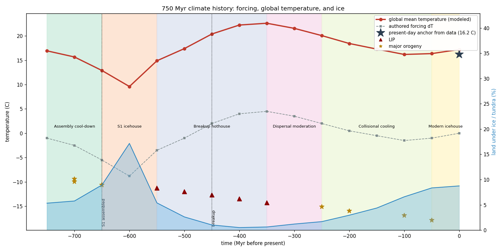

| stage | dT (°C) | CO₂ (ppm)* | global mean (°C) | land ice+tundra | ice state |
|---|---:|---:|---:|---:|---|
| T-750 | -1.0 | 230 | 16.9 | 5% | polar |
| T-700 | -2.5 | 155 | 15.7 | 6% | polar |
| T-650 | -5.5 | 85 | 12.9 | 9% | polar |
| T-600 | -8.8 | 38 | 9.6 | 17% | major_glaciation |
| T-550 | -3.5 | 125 | 14.9 | 5% | polar |
| T-500 | -1.0 | 220 | 17.4 | 3% | polar |
| T-450 | +2.0 | 445 | 20.4 | 1% | none |
| T-400 | +4.0 | 700 | 22.2 | 0% | none |
| T-350 | +4.5 | 790 | 22.6 | 1% | none |
| T-300 | +3.5 | 630 | 21.6 | 1% | none |
| T-250 | +2.0 | 445 | 20.1 | 2% | none |
| T-200 | +0.5 | 315 | 18.4 | 3% | none |
| T-150 | -0.5 | 250 | 17.3 | 4% | polar |
| T-100 | -1.5 | 200 | 16.2 | 7% | polar |
| T-50 | -1.0 | 222 | 16.4 | 8% | polar |
| T0 | +0.0 | 280 | 17.2 | 9% | polar |

\* illustrative, ~3 °C per CO₂ doubling from a 280 ppm anchor.

The drivers behind every swing are the events of the tectonic history — each
stage's forcing lists them in `paleoclimate.yaml`, and the validator rejects
any forcing change without a matching tectonic event.

## 4. Climate eras

### Assembly cool-down (T-750 … T-650)

Converging continents close the pre-cycle oceans; fresh collisional orogens (the S1 sutures) weather rapidly and draw CO2 down. The world slides from mild into cold as S1 locks together.

**Stage T-750** — Mild-cool world of dispersed converging continents.

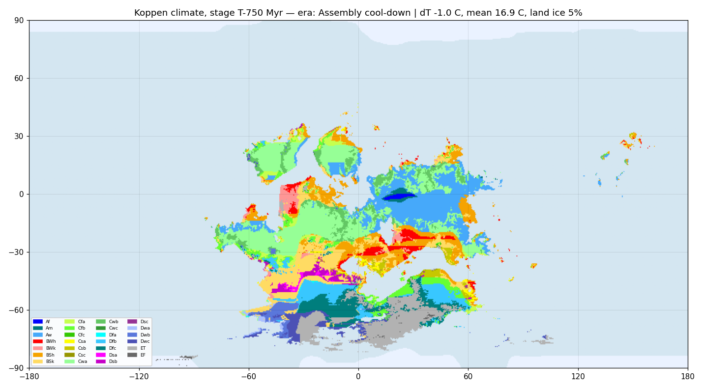

**Stage T-700** — First assembly collisions; weathering accelerates.

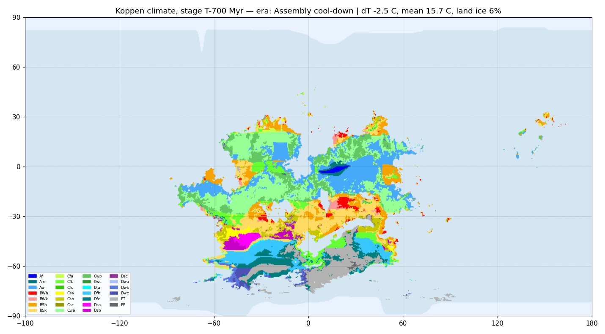

### S1 icehouse (T-650 … T-550)

The deep freeze of the cycle. A single supercontinent centered near 25S pushes its southern margins (D, micro_10, micro_11) past 55S, weathering stays high, and ridge length - and so CO2 outgassing - is at a minimum. Continental ice sheets grow on the southern flank of S1; this is the major glaciation of the modeled history.

**Stage T-650** — S1 assembled; cold deepens, southern ice sheets nucleate.

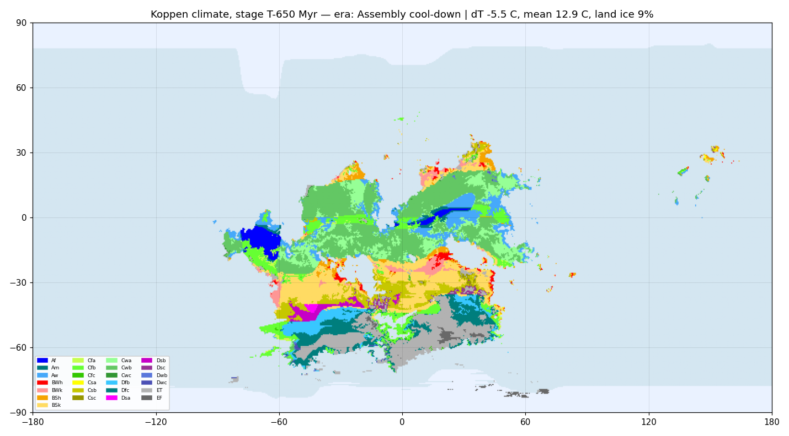

**Stage T-600** — Glacial maximum of the S1 icehouse.

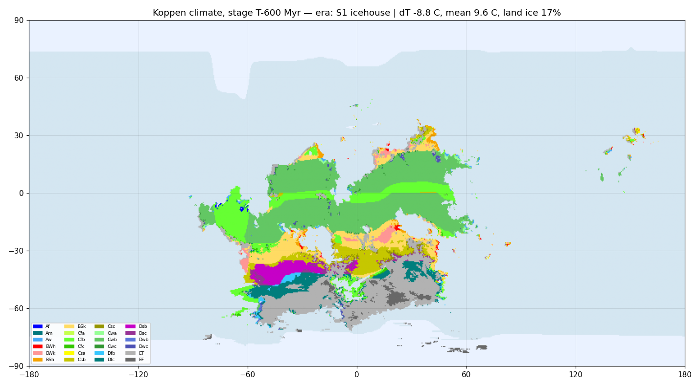

### Breakup hothouse (T-550 … T-350)

LIPs L1-L5 erupt in sequence as S1 rifts apart, and thousands of kilometers of new mid-ocean ridge (Central, Western, Northern) outgas CO2 far faster than the young passive margins can weather it. The ice sheets collapse and the planet swings to its warmest state, peaking around T-400..T-350 with essentially ice-free poles.

**Stage T-550** — L1 erupts; the thaw begins.

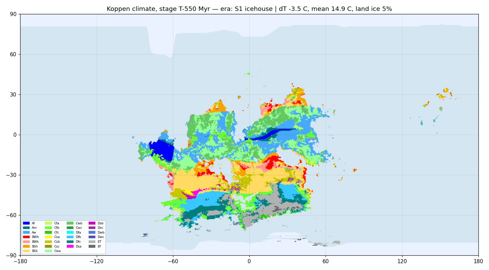

**Stage T-500** — Rifting starts; outgassing climbs.

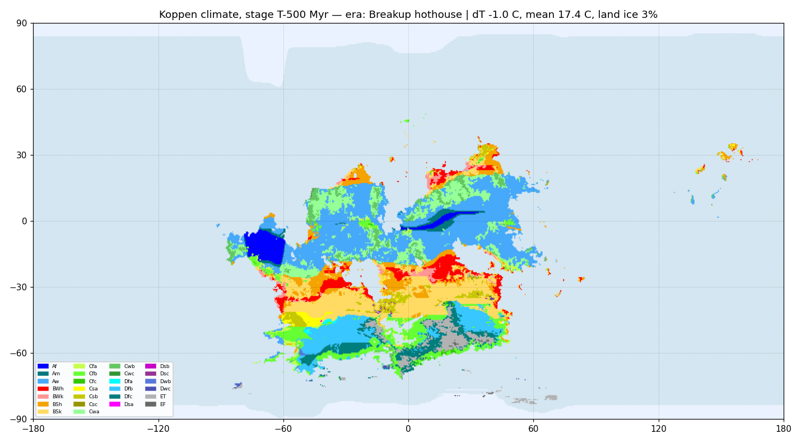

**Stage T-450** — Breakup; new ridges outgas freely.

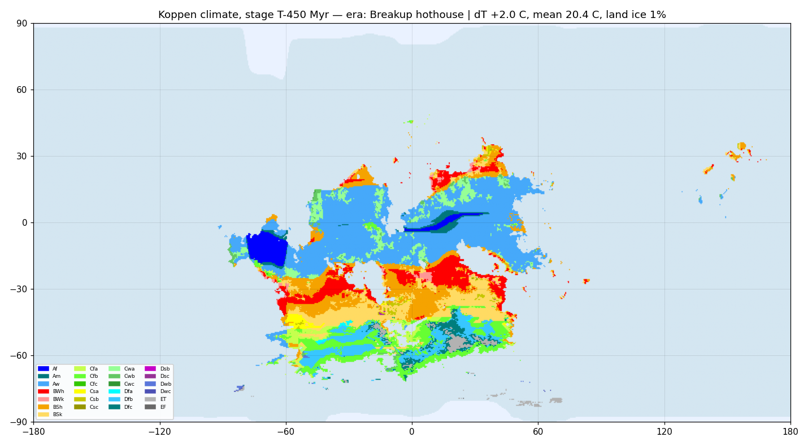

**Stage T-400** — Hothouse; three young oceans spreading at once.

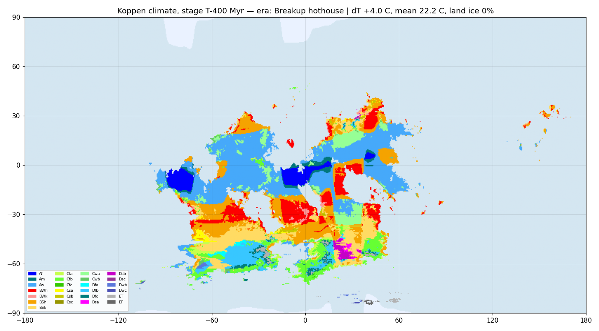

### Dispersal moderation (T-350 … T-250)

The LIP era ends and ridge production stabilizes. The dispersing continents green up; climate settles into a warm but moderating state.

**Stage T-350** — Peak warmth; ice-free poles.

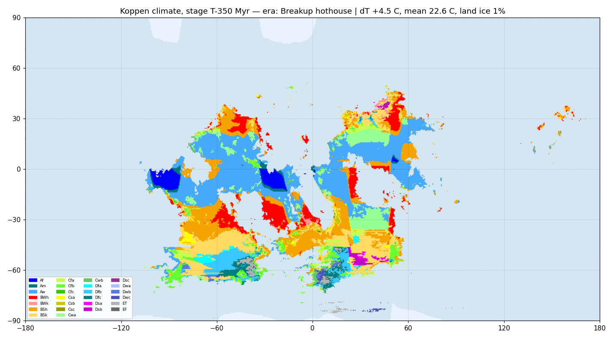

**Stage T-300** — LIP era over; slow moderation.

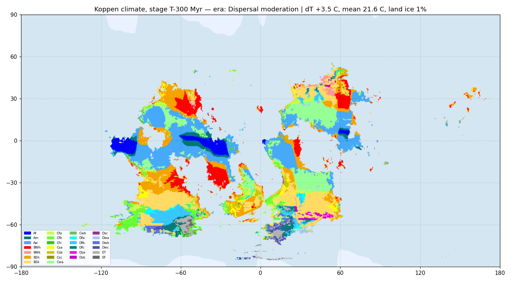

### Collisional cooling (T-250 … T-50)

The great drawdown. The O4 flat-slab uplift on G, then the O1 (AIJ assembly) and O2 (H-B closure) himalayan collisions expose vast tracts of fresh rock at low latitudes; silicate weathering accelerates and CO2 falls for 200 Myr. By T-100 polar ice has returned to the far-southern lands (micro_11 is drifting over 70S).

**Stage T-250** — O4 uplift starts the long drawdown.

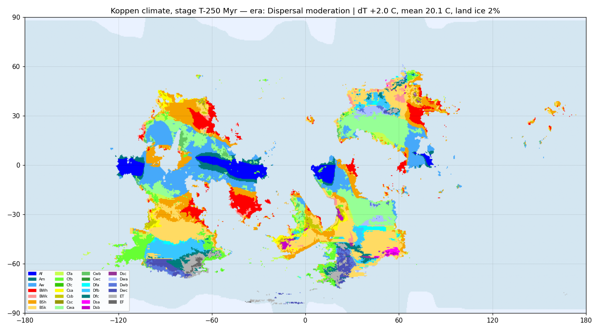

**Stage T-200** — O1 collision; fresh himalayan-scale weathering.

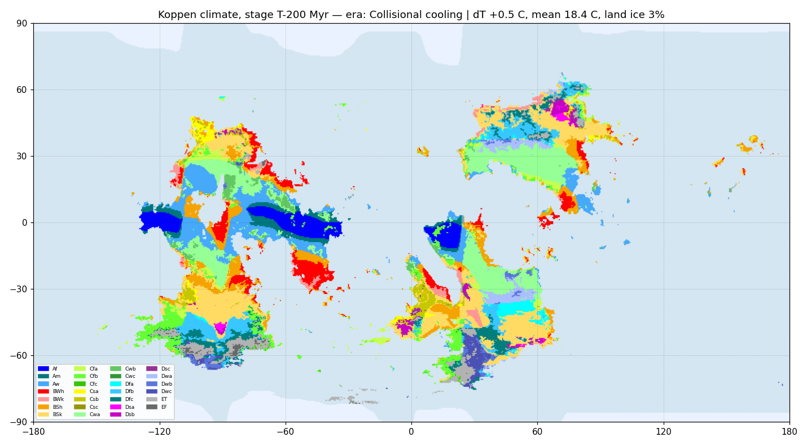

**Stage T-150** — Cooling continues; far-southern frost returns.

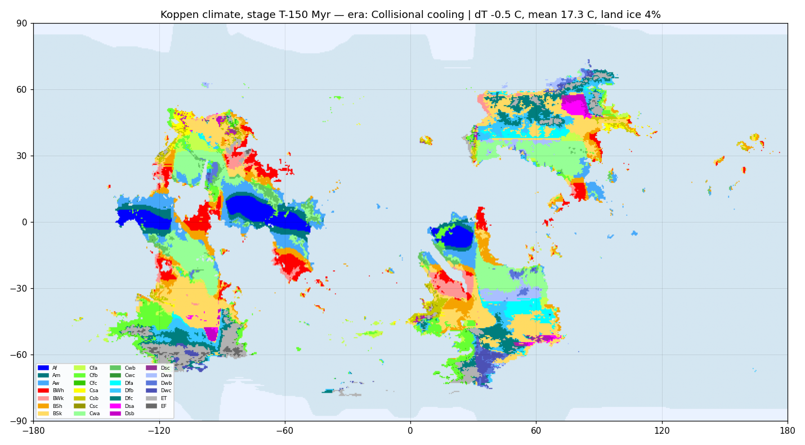

**Stage T-100** — O2 collision; polar ice locks in on micro_11.

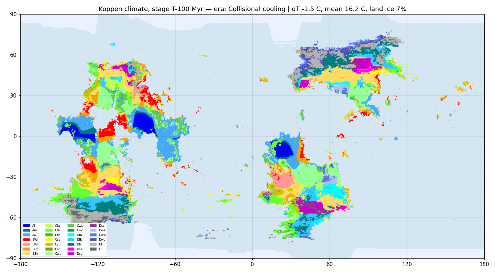

### Modern icehouse (T-50 … T0)

The present regime: a moderately cold world with permanent polar ice on the far-southern fragments and high-latitude tundra fringes on G and J, active O5/O6 orogens still weathering, and dispersed continents keeping the climate zonal and wet-margined - analogous to Earth's late Cenozoic.

**Stage T-50** — Slight recovery as O2 weathering wanes; O5/O6 rise.

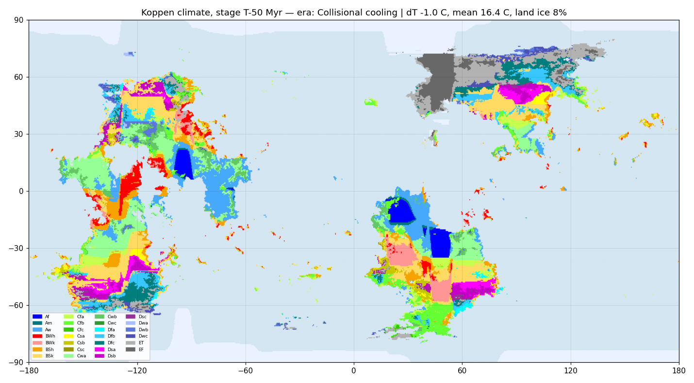

**Stage T-0 (present)** — Present day - the calibration anchor; permanent ice at the far south.

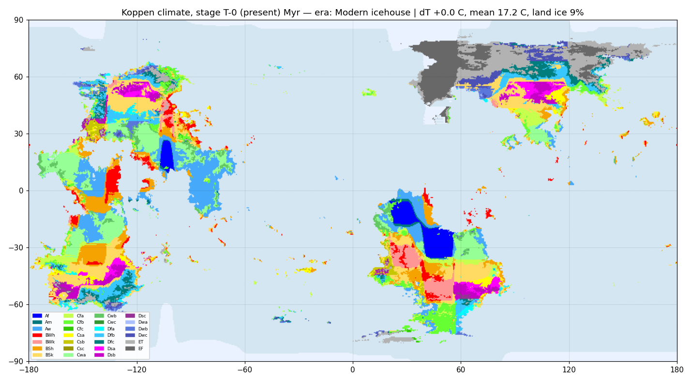

## 5. The S1 glaciation

The modeled history's one major ice age peaks at **T-600** with
17% of all land under ice or tundra and global
mean temperature 9.6 °C. It is the textbook
supercontinent glaciation: S1's assembly killed most subduction-ridge systems
(minimum CO₂ outgassing) while its fresh collisional sutures weathered at
maximum rate, and the D/micro_10/micro_11 flank of the supercontinent sat
poleward of 55 S — so when the forcing bottomed out, continental ice sheets
had land to grow on. The thaw is equally tectonic: the L1–L5 LIP series and
thousands of kilometers of new ridge at breakup drove the planet into the
T-400…T-350 hothouse with essentially ice-free poles.

The smaller late-history cooling (T-150 … T-50) is the weathering signature of
the O1/O2 collisions; it never reaches full glaciation because by then the
only truly polar land is the small micro_11 fragment — a reminder that ice
ages need geography as much as they need CO₂.

## 6. Caveats

- Plate motion directions (and so paleo-longitudes) inherit the tectonic
  reconstruction's heuristic-inference caveat.
- The zonal model has no ocean currents, orographic wind shadowing, or
  monsoon dynamics; regional climates on the stage maps are indicative, not
  definitive. Class-fraction accuracy at T-0 is ±10 pp per major class.
- The forcing curve is authored (validated against the event record), not an
  output of a carbon-cycle model.
- Pre-T-700 sutures are fully eroded and carry no paleo-elevation in the
  model.

## 7. Reproducing

```bash
python3 tectonics/scripts/80_paleoclimate.py   # compute + calibrate + cache
python3 tectonics/scripts/85_render_climate.py # maps + curve figures
python3 tectonics/scripts/90_build_climate_doc.py
```

`80_paleoclimate.py` exits non-zero if the T-0 calibration drifts more than
20 pp on any Köppen major class or the stage geometry no longer reproduces
the present land mask.

