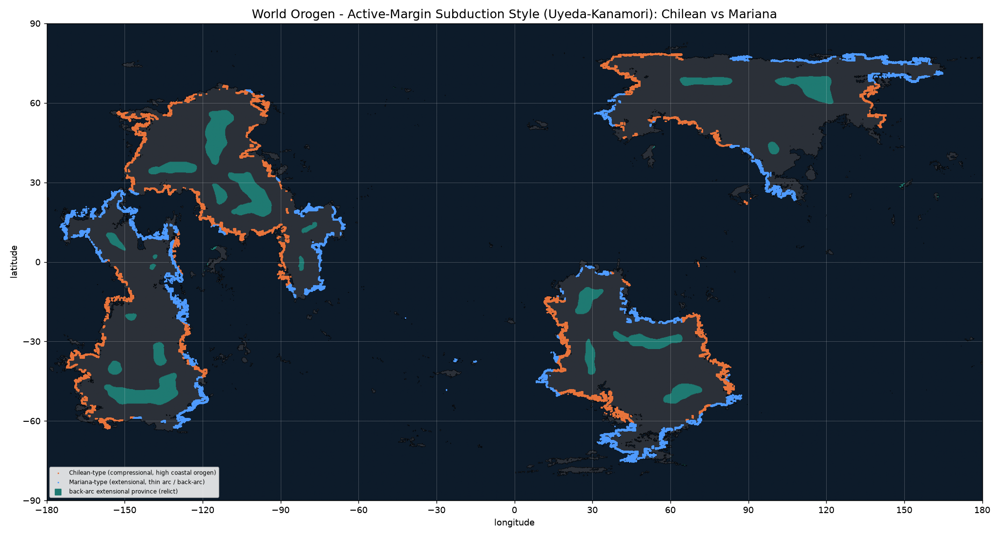

# Subduction style

Active continental margins of Orogen planet `06cy8w6z6a89kow6psje93`, classified into the two **Uyeda-Kanamori** end-members from the overriding plate's deformation, with interior back-arc extensional provinces marked separately.

| measure | value |
|---|---:|
| Active-margin pixels | 28,741 |
| Chilean-type (compressional) | 14,702 (51%) |
| Mariana-type (extensional) | 14,039 (49%) |
| Back-arc provinces (relict) | 36,936 px (~14.14 Mkm²) |
| Median back-arc decoupling | ~783 km |

## By continent

| continent | dominant style | Chilean px | Mariana px |
|---|---|---:|---:|
| Sirocca (`BDH`) | chilean | 4,116 | 3,782 |
| Selvana (`CEF`) | mariana | 2,737 | 4,754 |
| Meridia (`AIJ`) | chilean | 5,053 | 1,703 |
| Borea (`G`) | mariana | 2,547 | 3,769 |

*Method:* a coastal land pixel on a subduction overriding plate is Chilean where local `orogPow` (compression) outweighs `backArc` extension, Mariana otherwise; back-arc provinces are strong-basin land more than ~391 km from any live margin. Derived from data by `tools/tectonics-pipeline/scripts/35_subduction_style.py`.

