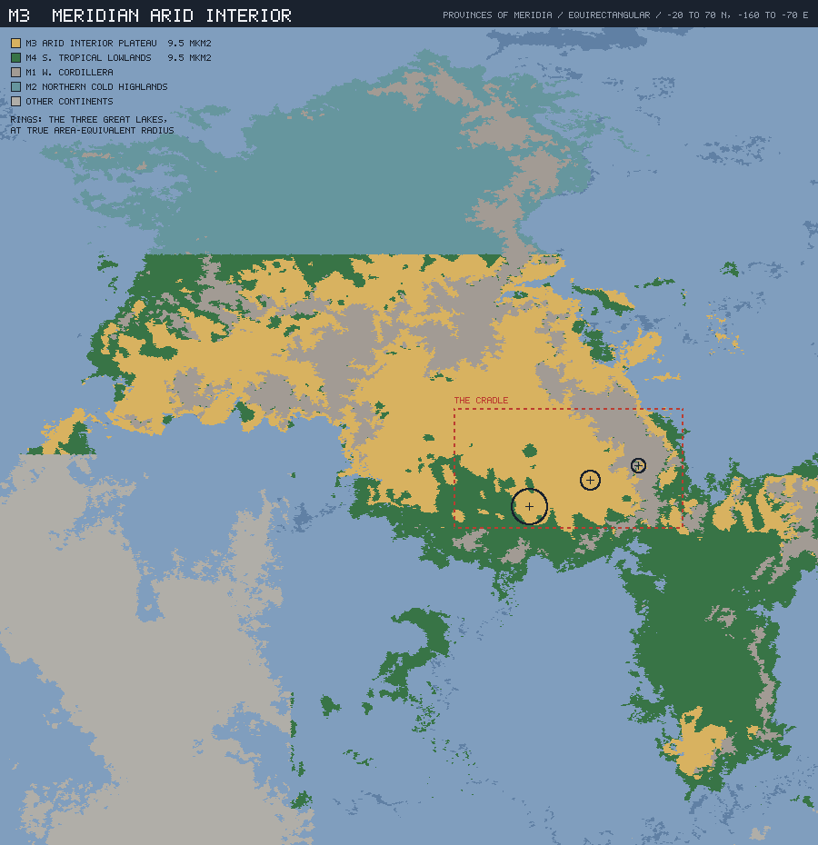
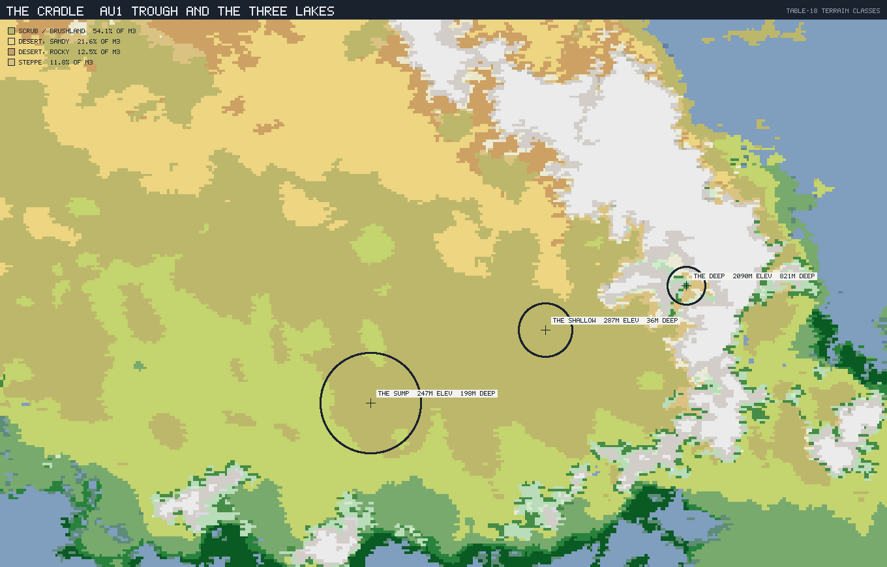
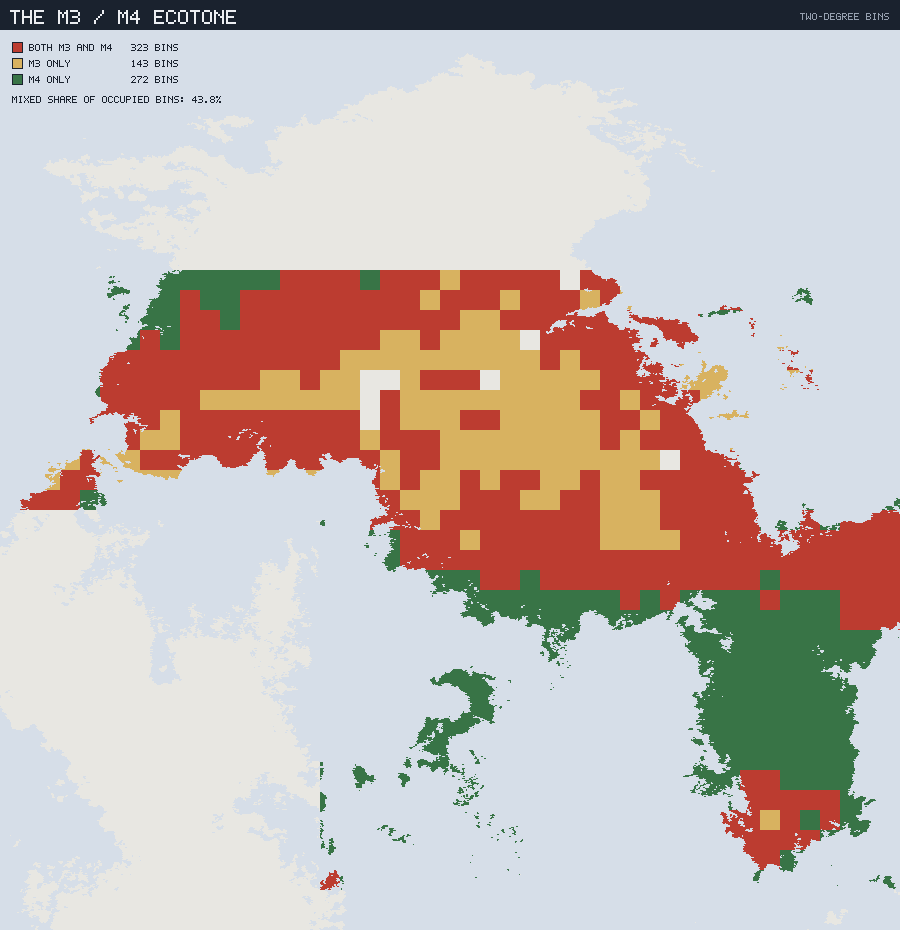

# The Meridian Arid Interior — M3

*Planet `06cy8w6z6a89kow6psje93` · the first regional ecology: the province the
peoples came from, and the reference biota every later arid ecology is measured
against.*

This is the first document in the layer to name organisms. Everything before it
built the frame — the founding tree ([`00`](00_TREE_OF_LIFE.md)), the realm map
([`01`](01_BIOGEOGRAPHIC_REALMS.md)), the deep-time history
([`02`](02_LIFE_THROUGH_DEEP_TIME.md)), and the humanoid ancestry
([`03`](03_HUMANOID_ANCESTRY.md)). This one fills a province.

**M3 is first for a reason.** It is the homeland of the crown Aulacine, so doc
03 §5 already asserts a set of body traits motivated by this ecology without
ever populating it. It is also the **reference set** for two of doc 03 §8's five
deliverables: Selvana's **V3** must be *homologous* to what is written here, and
Sirocca's **S2** must be *convergent* with it. Neither can be written until this
one exists.

### Labels, and one new caution

**MEASURED** / **INTERPRETED** / **INVENTED** as elsewhere. Every measured figure
below was recomputed for this document by `tools/province-ecology/`, which
streams the full 2.56 M-cell v2 export through the province rules of
[`../culture/00_PROVINCE_CONSTRAINT_VECTORS.md`](../culture/00_PROVINCE_CONSTRAINT_VECTORS.md)
§2. The province totals reproduce the published vectors exactly (9.49 Mkm²,
22.3 °C, 304 mm, NPP 539) — which is the check that the sub-province figures,
which that table does not carry, are computed the same way. Regenerate with:

```sh
node tools/province-ecology/main.mjs M3 --box 15,28,-110,-85 --label cradle --compare M4
node tools/province-ecology/render.mjs        # the three plates below
```



*The province, in context. M3 (gold) is the continental interior; M4 (green)
fringes it south and east; M1 (grey) is the cordillera spine and M2 (teal) the
northern highlands. The dashed box is the cradle of doc 03; the three rings are
the great lakes of §2, drawn at true area-equivalent radius.*

The new caution: **organisms are INVENTED, but their roles are not free.** A
province with no frost, one rainy half-year, and three lakes at three different
depths can only support certain kinds of living. The discipline here is to let
the numbers pick the roles, then invent something to fill them.

---

## 1. What M3 actually is — and the correction it forces

**MEASURED.** The name "Arid Interior Plateau" and the shorthand "desert" have
been doing damage. The Köppen composition says otherwise:

| Köppen | Share of M3 | What it is |
|---|---:|---|
| **BSh** hot steppe | **54.1 %** | semi-arid scrub and brushland |
| BWh hot desert | 25.7 % | true hot desert |
| BSk cold steppe | 11.8 % | semi-arid, cool season |
| BWk cold desert | 8.4 % | true cool desert |

**Two-thirds of M3 is steppe, not desert.** By terrain class it is 54.1 %
scrub/brushland, 21.6 % sandy desert, 12.5 % rocky desert, 11.8 % steppe. The
province is a vast semi-arid *shrubland* with deserts inside it, not a sand sea
with margins.

Three more measured facts set every constraint that follows:

- **It effectively never freezes.** 97.9 % of the province is frost-free; mean
  cold-season temperature is **17.7 °C**. There is no winter here in any sense
  a temperate ecologist would recognise.
- **The year has one dry half.** 64.5 % of precipitation falls in the wetter
  half-year, on a 304 mm annual mean.
- **It is not uniform.** Annual precipitation ranges **86 → 676 mm**, an
  eightfold spread inside one province, and elevation runs 0.05 → 2.00 km
  (p05 → cap).

**INTERPRETED — the single most important consequence.** On Earth, the
survival bottleneck in a seasonal biome is usually *cold*. Here it cannot be.
The bottleneck is **water**, always, everywhere, and it arrives on a schedule.
So this province should be read against Earth's tropical savannas and thorn
scrub, not its temperate steppes — and every adaptation below is a solution to
drought and heat rather than to frost:

| Earth temperate solution | M3 equivalent |
|---|---|
| Hibernation | **Aestivation** — dormancy through the dry half |
| Fat reserves against winter | **Water and starch storage** — tubers, stem tissue, fat as water source |
| Deciduous in autumn (cold cue) | **Drought-deciduous** — leaf drop cued by drying, not by daylength |
| Annual seed dormancy over winter | **Ephemeral flush** — germinate, seed and die inside one wet season |
| Migration to escape cold | **Migration to follow rain** — no fixed destination |

The last row matters most for doc 03: a herd that migrates to escape winter goes
to the *same place* every year. A herd following rain in an eightfold
precipitation gradient does not. Anything that follows those herds has to
navigate, remember, and predict — and that is the pressure the Aulacines grew up
under.

---

## 2. The three lakes — the spine of the province

**MEASURED, and the most surprising result of the profiling.** Of the planet's
**ten great closed-basin lakes**, Meridia holds six, and **three of them lie
inside the cradle box** (15–28 °N, 110–85 °W) — at three utterly different
elevations and depths:

| Lake | Area | Surface elev. | Max depth | Position |
|---|---:|---:|---:|---|
| **The Sump** (great lake 1) | 128,383 km² | 247 m | 198 m | 17.3 °N 101.8 °W |
| **The Shallow** (great lake 3) | 33,200 km² | 287 m | 36 m | 20.1 °N 95.1 °W |
| **The Deep** (great lake 8) | 18,664 km² | **2,090 m** | **821 m** | 21.8 °N 89.7 °W |

A 1,843 m vertical spread across roughly 1,300 km of one basin system, with a
5.2 km N–S mountain front standing beside The Deep at 21.8 °N 87.3 °W. This is
the AU1 aulacogen and the P5 hotspot field expressed in water.



*The cradle in Table-18 terrain classes. The olive scrub matrix runs west to
east; sandy desert (tan) occupies the north-west; the pale high ground on the
right is the barren rift shoulder that carries The Deep at 2,090 m; the greens
breaking in from the south and east are M4. The three lakes are drawn at true
area-equivalent radius — the size difference between The Sump and The Deep is
real, and so is the inversion behind it: the smallest of the three is four
times deeper than the largest.*

**INTERPRETED — three lakes, three water regimes, three ecological roles.** The
depths are not decoration; they decide behaviour under the orbital forcing that
doc 03 §3 established:

- **The Deep — the refuge that never fails.** 821 m of water at 2,090 m
  elevation, in a graben beside a 5 km front. Nothing in the climate record
  empties this. It is cold, oligotrophic, and permanent, and it is the one place
  in the cradle where a lineage can wait out *any* dry phase. Expect ancient
  endemics and a fauna unlike anything on the plain 1,800 m below.
- **The Shallow — the pump.** 33,200 km² at **36 m maximum depth**: a lake
  broader than the Sump's basin floor and shallower than a modest hill. On the
  wet–dry cycles of §3 this basin **fills and empties**, repeatedly, and it is
  the single mechanism doc 03 §6 was describing without a name. Every fill
  reconnects the basin's margins; every drying cuts them into isolates on the
  shoulders and volcanic highs. **This is where the speciation pump physically
  runs.**
- **The Sump — the terminal, concentrating basin.** 128,383 km², 198 m deep,
  the lowest point of the system and the place with no outlet. Water arrives and
  only leaves by evaporation, so it is **saline and getting more so**. Permanent,
  productive at its margins, and physiologically hostile — a Caspian, as the
  culture layer insisted, not a playa.

**The gradient is the point.** A creature living in this basin has, within a few
hundred kilometres, access to permanent deep cold water, an unreliable vast
shallow one, a salt sea, and 2 km of vertical relief between them. Doc 03 §5
claims altitude tolerance is *ancestral* to the Aulacines rather than acquired.
The Deep sits at 2,090 m — above the M1 threshold — and it is in their homeland.
That claim is now grounded: they did not descend from highland specialists, they
simply never lived anywhere that was only one altitude.

---

## 3. The flora — the west-flank xeric stem, made concrete

**INVENTED**, descended from the drought-tolerant **xeric stem** that doc 02 §5
places in the west-flank biota *before* the T-400 Meridia–Selvana split. All are
*viror*-green (doc 00 §2). Their V3 counterparts in Selvana are cousins, not
copies — that is doc 05's problem.

| Working name | Form | The measured fact it answers |
|---|---|---|
| **Ashscrub** | Waxy grey-green shrub, 1–3 m, deep taproot, drought-deciduous | 54.1 % of M3 is scrub/brushland — this is the province's matrix plant, and the thing "scrub" actually *is* |
| **Flushgrass** | Ephemeral; germinates, seeds and dies inside one wet half-year | 64.5 % of rain in one half; large seed set is the only way to use it |
| **Waterstem** | Succulent columnar stem, shallow wide root mat, stores months of water | 86 mm at the dry extreme — the BWh quarter of the province needs a plant that banks water, not one that hunts it |
| **Sun-tuber** | Rosette with a large buried starch–water storage organ; aestivates | Frost-free ground (97.9 %) means a buried organ is safe year-round — no freeze risk, so storage below ground always beats storage above it |
| **Saltmat** | Low halophyte turf, salt-excreting | The Sump is closed and evaporating; its margins are saline |
| **Cloudscrub** | Dense small-leaved shrub of the rift shoulders above ~1.8 km | The Deep's basin walls intercept moisture the plain never sees |

**INTERPRETED — why the storage organs matter more here than on Earth.** In a
temperate biome, a buried tuber is a frost refuge as much as a drought refuge.
In a province that is **97.9 % frost-free**, it is *purely* a water-and-energy
bank — so there is no cold ceiling on how large it can get, and no seasonal
signal telling it to stay small. The Sun-tuber can be an enormous, long-lived,
year-round-available food object. That is a rare thing in an arid land, and §7
is about what the peoples eventually do with it.

---

## 4. The fauna — a blue-blooded province

**INTERPRETED, from a measured fact with large consequences.** M3 is 97.9 %
frost-free with a cold-season mean of 17.7 °C. Doc 00 §8 fixes the ancestral
Zoan respiratory pigment as **copper-based and blue**, efficient in cold and
oxygen-rich conditions, with the iron-red carrier derived only in "the most
active warm-blooded lineages."

A province that never freezes has no thermal floor forcing endothermy. So M3 is
— and should be written as — **an ectotherm's province**: large, slow, blue-
blooded Zoa dominate the biomass, and the red-blooded Thermozoa are a
conspicuous *minority*.

This is the doc's best gift to the ancestry story. **The Aulacines were odd at
home.** Their clade was never the dominant one in their own province; they were
the small warm-blooded exception among big cold-blooded neighbours, which is
exactly the position from which an animal wins by being clever, fast in the heat
of the day, and active at hours when the majority is torpid.

| Working name | Grade | Role | The measured fact it answers |
|---|---|---|---|
| **Plainbacks** | Zoan ectotherm | Large slow grazers, herds on the BSh matrix; aestivate through the dry half | 54 % scrub at NPP 539 supports bulk grazers, and no frost means no need to burn fuel keeping warm |
| **Stiltwaders** | Zoan ectotherm | Long-legged lake-margin foragers, follow the Shallow's edge as it moves | A 36 m-deep, 33,200 km² lake has an enormous, constantly relocating shoreline |
| **Sandswimmers** | Zoan ectotherm | Burrowing insectivore-analogues of the BWh quarter | 25.7 % of M3 is true hot desert; below ground is the only stable habitat there |
| **Rainherds** | **Thermozoan** | Mid-sized endothermic herd grazers that **migrate to follow rain** | The 86–676 mm gradient makes rain-following viable *only* for an animal that can sustain long daily movement — i.e. an endotherm |
| **Coursers** | **Thermozoan** | Cursorial pack predators of the Rainherds | A migratory endothermic prey animal can only be hunted by something that keeps up |
| **Deepfin** | Zoan ectotherm | Ancient endemic fish-analogues of The Deep, found nowhere else | 821 m of permanent water in an isolated graben is a museum |

**The Rainherds are the load-bearing invention.** They are the reason M3 has
endotherms at all: rain-following at this gradient is a movement problem, and
movement at that scale is an endotherm's game. They are also the stock that doc
03 §8's **pack-and-milk animal for M1** must come from — and §7 returns to them.

---

## 5. The cradle community

**MEASURED — and this is the sharpest number in the document.** Profiling the
cradle box separately from the rest of M3 gives two genuinely different places:

| | Cradle box (15–28 °N) | M3 remainder |
|---|---:|---:|
| Area | 2.24 Mkm² | 7.25 Mkm² |
| Mean annual temp | **26.5 °C** | 21.0 °C |
| Warm / cold season | 27.7 / **25.2 °C** | 26.5 / 15.4 °C |
| **Annual range** | **2.4 °C** | 11.2 °C |
| Frost-free | **100.0 %** | 97.2 % |
| Precipitation | 386 mm | 279 mm |
| NPP | 672 | 497 |
| BSh share | **76.0 %** | 47.3 % |

**The cradle has a mean annual temperature range of 2.4 °C and is 100 %
frost-free — every cell, no exceptions.** It is thermally almost seasonless,
while being strongly seasonal in water (62.5 % of rain in one half). It is also
hotter, wetter, and half again as productive as the rest of the province.

**INTERPRETED.** This settles doc 03 §5's central claim rather than merely
supporting it. The homeland has **no cold season at any point, anywhere**, and
sits at 26.5 °C mean with warm-season means near 28 °C. A large active forager
here is thermally loaded every single day of its life and never gets a recovery
season. The copper-blue carrier is the wrong molecule for that, permanently —
so the switch to the iron-red carrier is not a lineage quirk, it is the entry
fee for the niche. **The peoples are red-blooded because their homeland has no
winter to hide in.**

The community the Aulacines actually lived among, then:

- **The Shallow's moving shore** — Stiltwaders, seasonal fish-analogue
  concentrations as the water withdraws, and a shoreline that relocates far
  enough each year to be worth walking to. Stranded-fish windfalls at the
  drying edge are the cheapest protein in the province and require only that
  you know when and where to be.
- **The volcanic field** — the P5 hotspots (H13, H15) keep producing fresh
  fine-grained rock. A tool-using lineage originating on a hotspot field never
  has to solve raw-material scarcity, which is a genuine constraint on Earth
  and simply absent here.
- **The ecotone edge** — Rainherds and their Coursers moving through on the
  rain, Plainbacks resident and aestivating, Sun-tubers available in the dry
  half when nothing else is.
- **The vertical escape** — 2 km of relief to The Deep's shoulders, reachable
  and cooler, and unlike the plain it never dries.

That is the full toolkit of a generalist: a reliable dry-season staple below
ground, a seasonal protein windfall at a predictable edge, permanent water at
altitude, and unlimited stone.

---

## 6. The ecotone, measured

Doc 03 §1 argued that M3 and M4 form a continental-scale ecotone and rested a
lot on it. It is now quantified. Binning Meridian land into 2° cells and asking
which contain both provinces:

> **43.8 % of occupied bins contain both M3 and M4** (323 mixed · 143 M3-only ·
> 272 M4-only).



*The ecotone, mapped. Red bins contain both provinces. The pure-M3 core (gold)
is a small island inside a vast red band that wraps it on every side — the
mixed zone is not a seam between two blocks, it is most of the boundary
region's area, and it is where the interesting living happens.*

**INTERPRETED.** The boundary is not a line, it is a **zone occupying nearly
half the two provinces' shared extent** — unsurprising once you note that the
province rule separates them on Köppen group alone below 45 °N and 2 km, so
they interdigitate wherever rainfall does. And what interdigitates is dramatic:

| | M3 | M4 |
|---|---:|---:|
| Precipitation | 304 mm | 982 mm |
| NPP | 539 | 1378 |
| Dominant Köppen | BSh 54.1 % | Aw 46.3 %, Af 27.1 % |
| Dominant terrain | Scrub 54.1 % | Grassland 28.6 %, Heavy jungle 24.2 % |

Scrub against savanna-and-rainforest, threefold in both water and productivity,
interleaved across 323 shared bins at nearly identical temperature (22.3 vs
23.6 °C). An animal that can work both sides has a range no specialist on either
side can match — and in a climate that oscillates, the position of the boundary
is precisely what moves.

---

## 7. What this hands to the culture layer

Doc 03 §8 asked for five things. This document delivers the first three, and
constrains the other two.

- **The cradle fauna** (§4–§5) — delivered.
- **The storable cereal-analogue** — its ancestor is **Flushgrass**. A plant
  that must complete its whole life inside one wet half-year already invests
  everything in a large, hard, storable seed set; carried north into the NW
  lakeland's winter-wet `Csa`/`BSk` regime, that is a cereal waiting to happen.
  The domestication story is therefore not "a grass was found" but **"a
  homeland plant was carried into a better rainfall regime"** — which fits doc
  03 §7's sequence of becoming people in the south and farmers in the north.
- **The pack-and-milk animal** — its ancestor is the **Rainherd**. It is
  already endothermic, already migratory, already used to walking a
  precipitation gradient, and already accustomed to the vertical range around
  The Deep. That is most of the specification for an animal that can work M1's
  cordillera (NPP 331, 21 % frost-free), and the culture layer is explicit that
  without such an animal M1 is "transit only, not residence."
- **The Selvanan mirror set (V3)** — must be *homologous*: V3's plants descend
  from the same pre-T-400 xeric stem, so expect recognisable counterparts to
  Ashscrub, Flushgrass and the Sun-tuber, diverged by 400 Myr but genuinely
  related and genuinely usable.
- **The Siroccan trap set (S2)** — must be *convergent*: S2 needs its own
  Ashscrub-analogue, its own Waterstem-analogue, its own storage geophyte, all
  built from core-branch stock and all unrelated. They should look right and be
  wrong.

---

## 8. What this fixes, and what comes next

**Fixed (this province's ecology — later work should honour it):**

- M3 is **two-thirds steppe**, not desert: a semi-arid shrubland with deserts
  inside it, matrix plant **Ashscrub**.
- The bottleneck is **water on a schedule**, never cold: aestivation not
  hibernation, drought-deciduous not autumn-deciduous, rain-following not
  cold-fleeing migration.
- The province is **ectotherm-dominated**; the red-blooded Thermozoa
  (Rainherds, Coursers) are a conspicuous minority, which made the Aulacines
  odd at home.
- **Three lakes, three roles** — The Deep (821 m, permanent refuge), The
  Shallow (36 m, the speciation pump), The Sump (saline, terminal).
- The cradle is **thermally seasonless** (2.4 °C annual range, 100 % frost-free)
  and hotter, wetter and more productive than the rest of M3 — which is what
  forces the iron-red carrier.
- **Flushgrass → cereal** and **Rainherd → pack-and-milk animal** are the two
  domestication lines, both originating here and both maturing elsewhere.

**Open for the next documents:**

- **`05` — Selvana's Interior Dry Basin (V3)**, the homologous mirror. The
  natural next document: it is defined against this one, and writing it
  immediately is what proves the homology rule does real work.
- **`06` — Sirocca's Arid Heart (S2)**, the convergent trap.
- The remaining Meridian provinces (M1, M2, M4) and everything outside Meridia.
- Marine ecologies — untouched by any document so far, on a planet that is
  79 % ocean.
