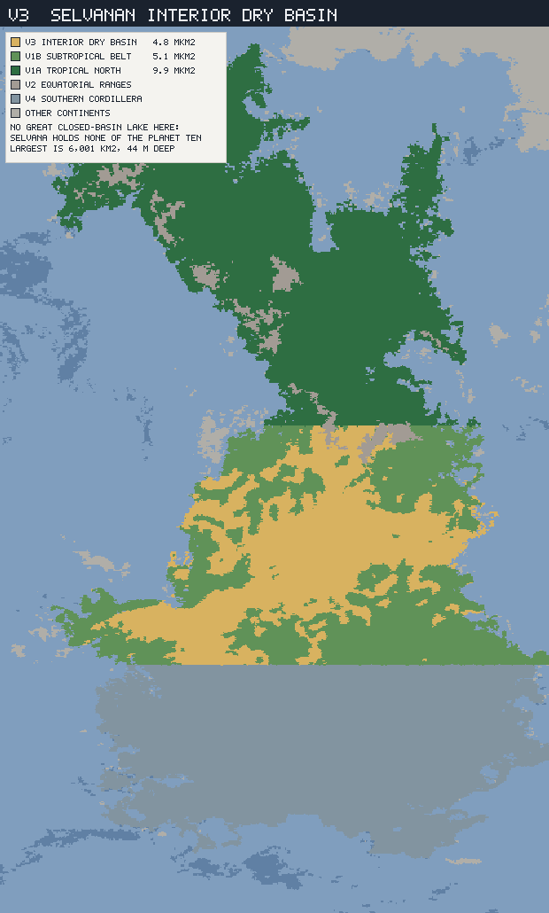
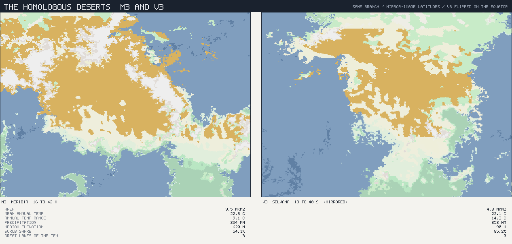
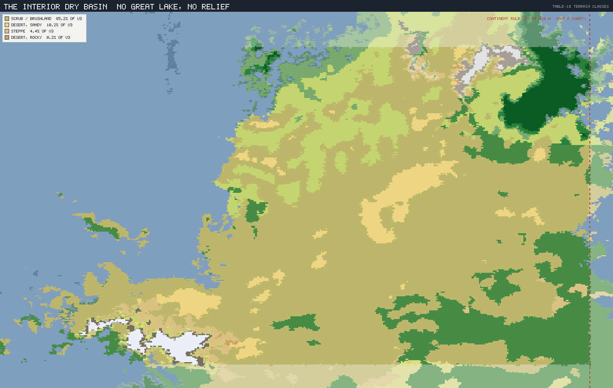
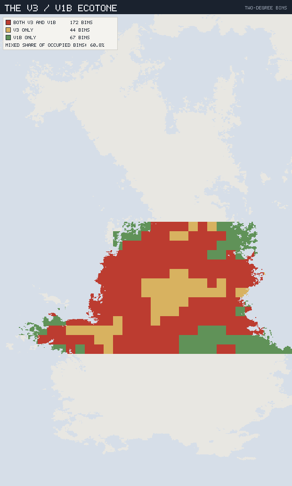

# The Selvanan Interior Dry Basin — V3

*Planet `06cy8w6z6a89kow6psje93` · the homologous mirror of M3: the same
ancestral stock, at the mirror-image latitude, on a completely different stage.*

This is the second regional ecology and the first test of the framework. Doc 01
§4 asserts that resemblance **within** the western hemisphere is real kinship —
that Meridia's Arid Interior Plateau and Selvana's Interior Dry Basin are "one
west-flank arid inheritance." Doc 02 §5 dates it: a drought-tolerant xeric stem
arose in the west-flank biota *before* the T-400 Meridia–Selvana split, and each
continent later built its own rain-shadow desert from that shared stem.

Doc 04 wrote the Meridian half. This one writes the Selvanan half, and the point
of writing it immediately is that **a homology claim is only worth anything if
the two halves are described independently and still line up.**

They do line up — and the interesting part is *where they don't*.

### Labels and reproduction

**MEASURED** / **INTERPRETED** / **INVENTED** as elsewhere. Measured figures come
from `tools/province-ecology/`, streaming the full 2.56 M-cell v2 export through
the province rules of
[`../culture/00_PROVINCE_CONSTRAINT_VECTORS.md`](../culture/00_PROVINCE_CONSTRAINT_VECTORS.md)
§2; the province totals reproduce the published vectors (4.8 Mkm², 22.1 °C,
352 mm, NPP 621). Both use the **connected-landmass** continent assignment
adopted in §7. Regenerate with:

```sh
node tools/province-ecology/main.mjs V3 --compare V1b
node tools/province-ecology/render.mjs V3
```



*V3 (gold) is a broad band across Selvana's southern half, thoroughly
interleaved with the wetter V1b (light green). Note the hard horizontal edges:
the province rule cuts V1a off at 15 °S and V4 at 42 °S, so those boundaries are
definitional, not geographic. The continent boundary, by contrast, is now a real
coastline — §7 is about the meridian that used to stand there instead.*

---

## 1. The twin, measured

Set the two provinces side by side. The first four rows are the homology claim
paying off; everything after them is the surprise.

| | **M3** Meridia | **V3** Selvana |
|---|---:|---:|
| Latitude band | **16–42 °N** | **18–40 °S** |
| Mean annual temperature | **22.3 °C** | **22.1 °C** |
| Annual precipitation | 303 mm | 352 mm |
| Frost-free | 97.8 % | **99.6 %** |
| Wet-season share | 64.6 % | 68.1 % |
| — | | |
| Area | 9.27 Mkm² | **4.84 Mkm²** |
| Annual temperature range | **9.1 °C** | **14.3 °C** |
| Warm / cold season | 26.8 / 17.7 °C | **29.2 / 14.9 °C** |
| Median elevation | **620 m** | **90 m** |
| Elevation p95 | 1,810 m | 930 m |
| Köppen BSh (hot steppe) | 53.3 % | **85.2 %** |
| True desert (BW) | **34.7 %** | 10.3 % |
| NPP | 537 | **621** |
| Mixed bins with wetter neighbour | 49.6 % | **60.8 %** |
| Great lakes (of the planet's ten) | **3** | **0** |

**MEASURED — the four rows that make the homology real.** The two deserts sit at
**mirror-image latitudes in opposite hemispheres**, and their mean annual
temperatures differ by **0.2 °C**. Both are effectively frost-free; both take
about two-thirds of their rain in one half-year. If you were handed the climate
envelope alone you would call them the same place.

**INTERPRETED — and the rows that say they are not.** V3 is half the size, twice
as seasonal, seven times flatter, far more uniform, more productive, more
thoroughly interleaved with its neighbour, and — the fact this document turns
on — **it has no great lake at all.**



*The two deserts at identical scale, with V3 mirrored on the equator so the
mirror-image latitude bands align. M3 (left) is larger, more fragmented, and
broken by relief; V3 (right) is a compact, solid, low block. Same colour because
they are the same thing — the same stem, at the same latitude, in opposite
hemispheres.*

---

## 2. Where the twins diverge

Four structural differences, each measured, each with a biological consequence.

### 2.1 V3 is flat

**Median elevation 90 m; p95 930 m.** M3's median is 620 m and its p95 is
1,810 m, with the cradle's rift shoulders standing to 2 km. V3 is a genuine
lowland basin — not a plateau, despite "Interior Dry Basin" and "Arid Interior
Plateau" being near-synonyms in plain English.

**Consequence:** there is no vertical escape. No alpine flank, no sky islands, no
cool refuge a few hundred metres up. Anything that cannot tolerate the basin has
to leave it horizontally.

### 2.2 V3 has a real cool season

**Annual range 14.3 °C against M3's 9.1 °C**, driven from both ends: V3's warm
season is hotter (29.2 vs 26.8 °C, max 36.2) and its cool season is genuinely
cooler (14.9 vs 17.7 °C — and against the cradle's 25.2 °C, a different world
entirely). It is still 99.6 % frost-free, so this is a cool season, not a winter.

**Consequence, and it is the most useful result in this document:** V3 organisms
have **two independent seasonal cues** — moisture *and* temperature — where the
Meridian cradle has only one. A plant here can time germination on cooling as
well as on wetting. §5 is about what that does to a farmer.

### 2.3 V3 is monotonous

**BSh 85.2 %**, with only 10.3 % true desert. M3 is a mosaic: 53.3 % steppe,
34.7 % desert, spread across 2 km of relief. V3 is one habitat, repeated.

**Consequence:** fewer distinct niches, and therefore fewer specialists.

### 2.4 V3 has no permanent deep water

The decisive one. **Selvana holds none of the planet's ten great closed-basin
lakes** (Meridia holds six; Sirocca four). Its largest endorheic lake is
**6,001 km², surface 53 m, maximum depth 44 m**, with the next four at 3,036 /
3,012 / 2,723 / 2,439 km². Against the cradle's three:

| | Largest | Deepest |
|---|---:|---:|
| M3 cradle | **128,383 km²** (The Sump) | **821 m** (The Deep) |
| V3 | 6,001 km² | 44 m |

Twenty-one times smaller, and nineteen times shallower.

**Consequence:** every V3 basin is shallow enough to fail in a dry phase. There
is no equivalent of The Deep — nothing that holds water through *any* excursion
of the climate. And with no permanent refuge and no vertical escape, V3 has
**no speciation pump**. The mechanism doc 04 §2 identified as the cradle's
endemism engine is simply absent here.



*The basin in Table-18 terrain classes: an almost unbroken scrub matrix with a
little sandy desert, and none of the white high ground or ringed water bodies
that structure the Meridian cradle.*

---

## 3. The homologous biota

**INVENTED**, and constrained on both ends: descended from the same pre-T-400
xeric stem as doc 04's M3 flora and fauna, and shaped by §2's four differences.
Names are provisional working labels, as everywhere.

The rule this table applies: **congeners, not copies.** Each V3 form is a real
relative of its Meridian counterpart — same genus-equivalent, divergent for
400 Myr — and the divergence runs along whichever measured axis §2 identified.

| M3 (doc 04) | V3 congener | What diverged, and the fact that drove it |
|---|---|---|
| **Ashscrub** | **Palescrub** | The same matrix shrub, but far more dominant (85.2 % vs 53.3 %) and correspondingly less varied: one widespread species complex where Meridia has several. Monotony of habitat, monotony of shrub. |
| **Flushgrass** | **Coldflush** | The key divergence. Germinates on the **cooling cue** as well as the wetting cue (§2.2), so its season is longer and far more predictable than its Meridian cousin's. Bigger, softer seed; less dormancy. |
| **Sun-tuber** | **Pan-tuber** | Shallower and broader — a flat basin has a shallow water table and no slope drainage, so the organ spreads rather than plunges. Available year-round, as in M3. |
| **Waterstem** | *marginal* | Only 10.3 % of V3 is true desert against M3's 34.1 %, so the water-banking succulent is a minor plant of the sandy west, not a province-wide strategy. |
| **Saltmat** | **Saltmat** (reduced) | Present, but ringing 6,000 km² lakes rather than a 128,000 km² sea. A local community, not a landscape. |
| **Cloudscrub** | **absent** | Requires ground above ~1.8 km. V3's p95 is 930 m. There is nowhere for it to live. |
| **Plainbacks** | **Broadbacks** | Ectotherm bulk grazers as in M3, but with much larger individual ranges — nothing subdivides this basin. |
| **Rainherds** | **Basinherds** | Still endothermic, still rain-following across an 87–660 mm gradient, but on flat ground: they move further and more freely, and their movements are horizontal rather than around relief. |
| **Coursers** | **Longcoursers** | The pack predator that keeps up with Basinherds — over flat, open, unbroken country, so pursuit is longer and more sustained. |
| **Stiltwaders** | **Stiltwaders** (reduced) | The shrinking-shoreline forager survives, but on lakes a twentieth the size and prone to failing entirely in a dry phase. A boom-bust specialist here, not a reliable resident. |
| **Sandswimmers** | *marginal* | Burrowing desert specialists, with only a tenth of the province to live in. |
| **Deepfin** | **absent** | The M3 relict of a lake that never fails. V3 has no lake that never fails, so it has no relicts. |

---

## 4. The diversity inversion

**INTERPRETED, and it is the framework's first real prediction.** Put §2's
mechanisms together and the two provinces should carry *oppositely structured*
biotas from the *same* ancestry:

| | M3 | V3 |
|---|---|---|
| Isolating mechanism | vertical relief · permanent deep water · habitat mosaic | none within the province |
| Escape in a dry phase | up (2 km of relief), or to The Deep | sideways, into V1b |
| Contact with the wetter neighbour | 49.6 % of bins | **60.8 % of bins**, same lat/lon envelope |
| Expected outcome | **many species, small ranges**, deep endemism, ancient relicts | **few species, huge ranges**, shallow endemism, no relicts |

The V3/V1b interdigitation figure is doing the work here. At **60.8 %** — and
across an identical latitude–longitude envelope, since the two are separated by
Köppen group alone — V3 and V1b are not neighbours so much as **interleaved
phases of one landscape**. In a wet excursion V1b's biota floods in; in a dry
one V3's spreads out. Nothing stays isolated long enough to become a separate
thing.



*Red bins hold both provinces. Compare doc 04's M3/M4 plate: there, a compact
arid core sat inside a mixed ring. Here there is barely a core at all.*

So the honest summary of the homology is: **the lineages are cousins; the
communities are not.** Same stock, same climate, opposite diversity structure —
and every step of the divergence traces to a measured feature of the ground.

---

## 5. What this means for the peoples

Doc 03 §7 makes Selvana the peoples' first foreign land — easy to reach across
the Equatorial Western Sea, and **genuinely kin**. V3 is where that pays off,
and this document can now say precisely how far it pays.

**What transfers.** Coldflush and Pan-tuber are congeners of the two Meridian
plants doc 04 §7 identified as the domestication lines. They are edible on the
same terms, processable by the same methods, and vulnerable to the same
diseases. Basinherds are congeners of the Rainherds. A Meridian arid toolkit —
crops, herds, pharmacopoeia, the whole inherited sense of what is food — works
here. This is why the western hemisphere becomes one connected human world
early.

> **What it costs to get here, added by [`10`](10_SELVANAN_TROPICAL_NORTH.md)
> §5.** "Crosses intact" turns out to be much more expensive than this section
> could know. The Meridians land at **27 °N in V1a's arid tip**
> ([`09`](09_THE_MERIDIAN_INTERVAL.md) §3), and the nearest V3 cell is
> **4,715 km** from that beach. Between the two lie 9.67 Mkm² of rainforest and
> savanna at NPP 1,596 where an arid toolkit is not wrong so much as irrelevant.
> The toolkit survives the water; then it has to survive the continent. And the
> calendar problem below starts earlier than this document places it — the
> landing zone's annual range is already **10.0 °C**, against the cradle's 2.4.

**What does not, and this is the specific and usable part.** A Meridian
planting calendar is keyed to **rain alone**, because the cradle has no
temperature season to key to (2.4 °C annual range). Coldflush germinates on
**cooling as well as wetting**. So a people arriving from Meridia with a
working agriculture would find their crop's cousin behaving wrongly — sprouting
early, or refusing to sprout on a rain that came at the wrong temperature — and
would have to learn a second cue their homeland never taught them. The
knowledge transfers; **the calendar does not.**

That is a good first lesson for a species that has never left home: the world
is related to you, and it still requires re-learning.

**And what is missing.** V3 has no Deepfin, no Cloudscrub, no great lake, no
volcanic field. For a people whose oldest stories are set among three lakes and
a field of fresh black stone, Selvana's basin is a place with **no deep past in
it** — familiar, usable, and utterly without landmarks.

---

## 6. Why V3 could not have made the peoples

**INTERPRETED — and this is the strongest result of writing the mirror.**

Doc 03 §2 named three physical requirements for the cradle: a **rift structure**
with local relief, **permanent deep water**, and an **active volcanic field**
supplying fresh workable stone. V3 has the climate — to within 0.2 °C — and the
ancestral stock, and half the area. It has none of the three:

| Cradle requirement (doc 03 §2) | M3 cradle | V3 |
|---|---|---|
| Rift structure with relief | AU1 aulacogen, shoulders to 2 km | median **90 m**, p95 930 m |
| Permanent deep water | The Deep, **821 m**, never fails | deepest **44 m**, fails in any dry phase |
| Fresh-stone volcanic field | P5 plume, hotspots H13–H15 | none — the P5 field is Meridian |

**So the mirror desert is a control.** It holds the climate constant, holds the
ancestry constant, and removes the geology — and gets no speciation pump, no
relict lineages, no vertical range, and no lineage under the kind of repeated
isolate-and-reabsorb pressure that doc 03 §6 made responsible for the crown
Aulacine.

This retroactively strengthens doc 03. The peoples did not arise in Meridia
because Meridia was arid, or hot, or seasonal — Selvana is all three, at the
mirrored latitude, from the same stock. They arose there because of **AU1, P5,
and a lake 821 m deep**. Climate set the stage; the geology cast the play.

---

## 7. The partition, and the defect this document found in it

**MEASURED.** The export carries no continent identifier, so the culture layer's
original rule separated Meridia from Selvana on a **meridian** (Selvana was
`lat < 23 && lon < -128`) and discarded western-hemisphere land below 16 °S as
offshore island. Writing this document meant mapping Selvana, and the map made
the rule's edge visible: the province ended on a straight line of longitude.
Checked against the authoritative continent areas in
`reports/tectonics/inventory.json`:

| Continent | Authoritative | Longitude proxy | Delta |
|---|---:|---:|---:|
| Meridia | 28.34 Mkm² | 29.42 | +1.08 |
| Sirocca | 27.50 | 28.24 | +0.74 |
| **Selvana** | **27.33** | **25.94** | **−1.39** |
| Borea | 20.17 | 21.16 | +0.99 |

The rule **dropped 1.80 Mkm² of land planet-wide (1.69 % of all land)**, in a
strip pressed against the −128° cut running from 16 °S to 64 °S. Selvana — this
document's subject — was the continent it treated worst, undercounting it by
**5.1 %** while inflating the other three. A second, smaller artifact: ~96
southern land cells lie east of +150° and were assigned to Sirocca, though
Selvana's reach to exactly −180.0 suggests they are its western tip.

### The correction, now adopted

The repository already held the right definition and the Node tools could not
reach it. `tools/tectonics-pipeline/lib/continents.py` assigns each land cell by
**connected landmass**, keyed to the inventory centroids, and both
`docs/BIOGEOGRAPHY.md` and the continent profiles were already using it; the
culture layer's rules are Node, so they cut on a meridian instead. The two
halves of the repository were partitioning the planet differently.

[`tools/continents.mjs`](../../tools/continents.mjs) is a faithful port — same
2048×1024 grid, same majority rasterisation with ties to land, same 8-neighbour
categorical gap fill, same 4-connected labelling with longitude wrap — and it
reproduces the authoritative areas to within 0.27 Mkm², the residual being
pixel-area against cell-area summation. It confirms the diagnosis: **1.46 Mkm²
of the dropped strip is Selvana's**, and a further 3.7 Mkm² the proxy folded
into whichever continent its box covered is detached island (the corrected rule
gives **Islands 4.03 Mkm²**, a bucket the proxy lacked and
`docs/BIOGEOGRAPHY.md` already had).

**The culture layer has adopted it, and the published constraint vectors are
regenerated on it** — so this document, doc 04 and
[`../culture/00_PROVINCE_CONSTRAINT_VECTORS.md`](../culture/00_PROVINCE_CONSTRAINT_VECTORS.md)
now describe one partition. Reproduce the superseded table with
`--continents proxy`; print the full delta with:

```sh
node tools/province-vectors/validate-continents.mjs
```

**None of this document's conclusions moved.** V3 went from 4.80 to 4.84 Mkm²
(+0.8 %) and M3 from 9.49 to 9.27 (−2.3 %); every climate figure held to a
decimal place or a single unit. The mirror-latitude homology, the four
divergences, the diversity inversion and §6's control all stand on the
regenerated numbers.

Two things did move, and both cut in this document's favour. The **M3/M4
ecotone rose from 43.8 % to 49.6 %** of mixed bins — the proxy had been
inflating M4-only bins with land that is not M4's — so doc 04's ecotone is
wider than it claimed. And **V3/V1b fell from 63.0 % to 60.8 %**, which leaves
§4's contrast between them intact.

**Where the correction bites is elsewhere**, and it is worth knowing before the
remaining provinces are written: **B1** (Borea's Southern Maritime Coast)
**−21 %**, the largest single change on the planet; **V4** +15.2 %; **M4**
−9.6 %; **S3** −7.3 %; **S1** −5 %; **V1b** +6.8 %. The culture layer's "four
provinces that will carry the world" survives the change — V1b in fact pulls
further clear — but B1's fifth is gone, and any Borean work should start from
the corrected figure.

---

## 8. What this fixes, and what comes next

**Fixed (this province's ecology):**

- V3 and M3 are **climate twins at mirror-image latitudes** (18–40 °S vs
  16–42 °N; 22.1 vs 22.3 °C) built from **one west-flank xeric stem** — the
  homology of doc 01 §4 and doc 02 §5, made concrete.
- They diverge on four measured axes: V3 is **flat** (median 90 m), **twice as
  seasonal** (range 14.3 °C), **monotonous** (BSh 85.2 % against M3's 53.3 %),
  and **has no
  permanent deep water** (deepest lake 44 m; Selvana holds none of the ten).
- The **two-cue season** — V3 organisms time on cooling as well as wetting —
  and the planting-calendar failure it causes for Meridian arrivals.
- The **diversity inversion**: same ancestry, opposite structure. M3 many
  species with small ranges and ancient relicts; V3 few species with huge
  ranges and none.
- The congener set (Palescrub, Coldflush, Pan-tuber, Broadbacks, Basinherds,
  Longcoursers) and the **absences** (Cloudscrub, Deepfin) — doc 03 §8's
  Selvanan mirror set, delivered.
- **V3 could not have produced the peoples**: it has the climate and the stock
  and lacks all three of doc 03 §2's geological requirements.

**Open for the next documents:**

- **`06` — Sirocca's Arid Heart (S2)**, the convergent trap, and the third leg
  of the desert experiment. It is the natural next document: with M3 and V3
  both written, S2 is the control that shows what a *core-branch* solution to
  the same climate looks like — and doc 03 §7 makes it the place a Meridian
  toolkit lethally fails.
- The remaining provinces, and the marine realms, still untouched.
