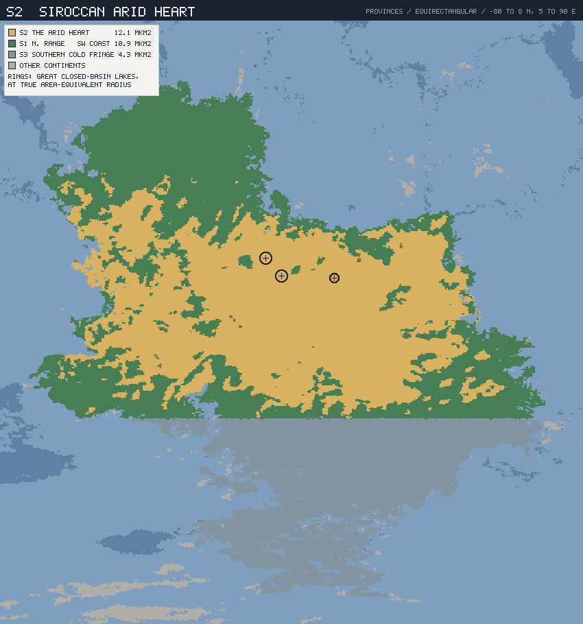
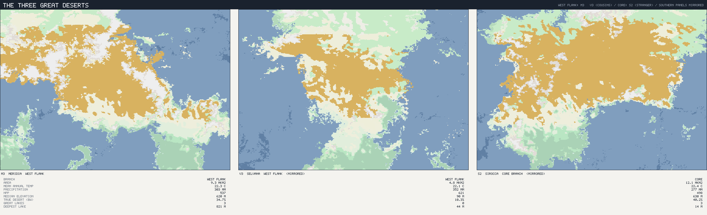
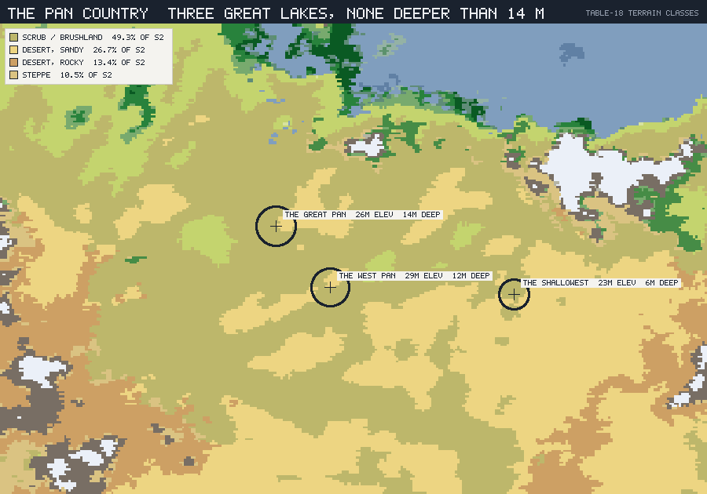

# The Siroccan Arid Heart — S2

*Planet `06cy8w6z6a89kow6psje93` · the convergent stranger: the desert that
looks most like the peoples' homeland and is related to nothing in it.*

This is the third regional ecology and the one the framework was built to
predict. Doc 01 §4 splits the planet's three great deserts two-to-one by
ancestry: **M3** (Meridia) and **V3** (Selvana) are west-flank cousins from one
xeric stem; **S2** is core branch, sundered at T-450 and never in contact since.
Doc 03 §7 makes S2 the trap — the place a Meridian toolkit fails.

Doc 04 and doc 05 wrote the cousins. This one writes the stranger, and it
returns a result sharper than the framework asked for.

### Labels and reproduction

**MEASURED** / **INTERPRETED** / **INVENTED** as elsewhere; figures from
`tools/province-ecology/` on the connected-landmass partition, reproducing the
published vectors (12.1 Mkm², 22.4 °C, 277 mm, NPP 498).

```sh
node tools/province-ecology/main.mjs S2 --compare S1
node tools/province-ecology/render.mjs S2
```



*S2 (gold) is the continental interior, wrapped by S1 (green) on the north and
west and closed by S3 (grey-blue) below 50 °S. The rings are its three great
closed-basin lakes at true area-equivalent radius — the same count as the
Meridian cradle's.*

---

## 1. The result nobody ordered

Set all three deserts side by side. The first block is what the framework
predicted; the second is what the data actually says.

| | **M3** Meridia | **V3** Selvana | **S2** Sirocca |
|---|---:|---:|---:|
| **Branch** | west flank | **west flank** | **core** |
| Relation to M3 | — | **cousin** | **stranger** |
| — | | | |
| Mean annual temperature | 22.3 °C | 22.1 °C | **22.4 °C** |
| Annual precipitation | 303 mm | 352 mm | **277 mm** |
| Frost-free | 97.8 % | 99.6 % | 98.5 % |
| Wet-season share | 64.6 % | 68.1 % | 63.6 % |
| NPP | 537 | 621 | **498** |
| — | | | |
| Area | 9.27 Mkm² | 4.84 Mkm² | **12.08 Mkm²** |
| Annual temperature range | 9.1 °C | 14.3 °C | **9.5 °C** |
| Median elevation | 620 m | 90 m | **630 m** |
| Elevation p95 | 1,810 m | 930 m | **1,990 m** |
| Köppen BSh | 53.3 % | 85.2 % | **49.3 %** |
| True desert (BW) | 34.7 % | 10.3 % | **40.2 %** |
| Mixed bins with wetter neighbour | 49.6 % | 60.8 % | **52.8 %** |

**MEASURED, and it is the whole point of this document.** Take the six
structural axes in the bottom block — annual range, median elevation, p95
elevation, scrub share, desert share, interdigitation — and ask which province
M3 most resembles.

**S2 wins all six.** Median elevation 630 m against M3's 620 (V3: 90). Annual
range 9.5 against 9.1 (V3: 14.3). Interdigitation 52.8 % against 49.6 %
(V3: 60.8 %). On relief, seasonality, mosaic structure and the shape of its
boundary, **M3's nearest twin on this planet is the one desert it is not
related to.**



*The framework's whole claim in one image, southern panels mirrored so the
latitude bands align. M3 and S2 — the outer two — are both large, fragmented,
shot through with pale true desert and grey high ground. V3, in the middle, is
the compact solid block. The two that look alike are the two that are not kin.*

**INTERPRETED.** This is the strongest available vindication of doc 01 §4's
rule, precisely because it is uncomfortable. The rule says **kinship is not
readable from appearance** — that homology follows the divergence tree and
convergence follows the climate. If the cousins had also looked most alike, the
rule would have cost nothing to believe. Instead the data hands us the reverse:
same climate plus same geological style produces the same-looking desert, and
400 million years of shared ancestry produces a flat basin that looks like
neither.

For doc 03 §7 it means the trap is worse than that document could state. It
predicted a desert whose *climate* matched home. The truth is that S2 matches
Meridia's homeland on climate **and on landscape** — and shares not one lineage
with it.

---

## 2. Three lakes, and not one of them deep

**MEASURED.** S2 holds **three of the planet's ten great closed-basin lakes** —
the same number as the Meridian cradle. There the resemblance stops.

| | Area | Surface elev. | Max depth |
|---|---:|---:|---:|
| **The Great Pan** | 23,172 km² | 26 m | **14 m** |
| **The West Pan** | 20,226 km² | 29 m | **12 m** |
| **The Shallowest** | 12,428 km² | 23 m | **6 m** |
| *S2 total* | *55,826 km²* | | *deepest 14 m* |
| — | | | |
| M3 cradle total | 180,247 km² | | **deepest 821 m** |

Three great lakes against three great lakes; **14 m against 821 m.** Fifty-nine
times shallower, and all three sit within 6 m of each other's surface elevation
— a floor, not a set of basins.



*The pan country in Table-18 terrain classes. Note what is absent: the white
high ground that carries The Deep in the Meridian cradle has no counterpart
beside these pans.*

**INTERPRETED — and this completes the planet's water taxonomy.** The three
deserts now demonstrate three different answers to the same orbital forcing:

| | Great lakes | Deepest | Regime |
|---|---:|---:|---|
| **M3** cradle | 3 | 821 m | **pump *with* a refuge** — basins isolate and reconnect, and The Deep never fails |
| **V3** | 0 | 44 m | **no pump, no refuge** — nothing isolates, nothing persists |
| **S2** | 3 | 14 m | **pump *without* a refuge** — everything isolates, nothing persists |

S2 has the cradle's mechanism and none of its insurance. Pans of 12,000 to
23,000 km² at six to fourteen metres will fill to inland seas and vanish
entirely on the wet–dry cycles doc 03 §3 established, and when they vanish
there is nowhere in the province holding water. The isolating engine runs at
full stroke, and every isolate it makes is eventually killed.

---

## 3. What that builds

**INVENTED**, from the regime above and from core-branch stock. The prediction
is specific and it is not the same as either cousin's:

- **High species richness, low persistence.** The pans partition the province as
  effectively as the cradle's basins do, so S2 should be *rich* — far richer
  than V3, whose flat interleaving prevents isolation at all. But nothing
  survives a deep drought in place.
- **No relicts, anywhere.** M3 has the Deepfin because The Deep never empties.
  S2 can have no equivalent. Its oldest lineages are as old as its last severe
  dry phase, and no further back.
- **Survival as propagule, not as population.** With no refuge to wait in, the
  winning strategy is to **stop being alive for a while**: desiccation-resistant
  eggs, cysts, spores and hard seed, banked in dry sediment, hatching on the
  flood. The province's biological memory is in the dust, not in a lake.
- **Boom and bust as the normal condition.** A filled Great Pan is 23,000 km² of
  shallow warm water at NPP far above the surrounding 498 — an enormous, brief,
  utterly unreliable pulse. Everything mobile converges on it; everything
  sessile races to seed before it goes.

### The convergent set

Doc 03 §8 asked for core-branch look-alikes of the Meridian species the peoples
know best. These are them. **Not one is related to its Meridian counterpart** —
the resemblance is 450 Myr of the same climate solving the same problem twice.

| M3 (doc 04) | S2 convergent look-alike | The difference that matters |
|---|---|---|
| **Ashscrub** | **Thornmat** | Fills the same matrix role at almost the same share (49.3 % vs 53.3 %) and looks the part — grey-green, deep-rooted, drought-deciduous. Core-branch *green-flora*; no shared genus, no shared chemistry. |
| **Flushgrass** | **Sparkgrass** | The ephemeral of the pan margins, germinating on flood rather than on rain. Sets a hard storable seed, as Flushgrass does — and hulls it in a silica armour Meridian threshing was never designed for. |
| **Sun-tuber** | **Ashen-root** | **The trap in one organism.** Same rosette, same buried starch-and-water organ, same year-round availability, same everything a Meridian forager reads as food. Core-branch stock defends its storage organs with a bitter alkaloid the west flank never evolved against. It is the single most dangerous object in the province to a people who have eaten Sun-tuber all their lives. |
| **Waterstem** | **Bloatstem** | More important here than in M3: 40.2 % of S2 is true desert against M3's 34.7 %, so stem-water banking is a mainstream strategy rather than a specialist one. |
| **Saltmat** | **Panmat** | Rings three pans instead of one sump, and must tolerate wetting and complete desiccation rather than steady salinity. |
| **Plainbacks** | **Dustbacks** | Ectotherm bulk grazers, aestivating through the dry half exactly as in M3 — the same solution, from the same ancestral blue-blooded stock both continents did inherit. |
| **Rainherds · Coursers** | **absent** | See §4. |
| **Deepfin** | **absent** | No lake that never fails, so no relict. |

---

## 4. A world without warm blood

**INTERPRETED, and it is the sharpest consequence of the divergence tree.**

Doc 03 §4 places the **Thermozoa** — endothermy and the iron-red carrier — on
the **west-flank stem, between the T-450 and T-400 rifts**. Meridia and Selvana
inherit it; the core branch never does. Doc 02 §5 already said as much from the
other direction, giving Borea's cold specialists "the ancestral blue blood of
the Zoan plan… paying off in exactly the cold it was first tuned to."

So **S2 has no endotherms at all.** No Rainherds, no Coursers, no analogue of
either. Its entire animal fauna is copper-blue and ectothermic, and that changes
how the province works rather than merely how it looks:

- **Nothing follows the rain.** M3's Rainherds exist because sustained
  long-distance movement across an eightfold precipitation gradient is an
  endotherm's game. S2 has the same gradient (78–680 mm) and no animal that can
  work it that way. Its large fauna waits instead: aestivates, and moves when
  the moving is cheap.
- **The pans are exploited slowly.** A filled pan is a pulse, and no Siroccan
  animal can cross the province fast enough to catch it early. Expect arrival by
  drift, by egg bank, and by the slow convergence of things that were already
  near.
- **Peak activity is the hottest hours, not the longest range.** With a
  warm-season mean of 27.1 °C and a maximum of **38.1 °C** — the hottest of the
  three deserts — S2's ectotherms are fast when M3's would be resting, and
  immobile when M3's Coursers would be hunting.

**And for the peoples this is the detail that lands.** They bleed red; every
large animal in S2 bleeds blue. The first Meridian to open a Siroccan carcass
sees the wrong colour come out. Nothing in half a world of inherited butchery,
medicine or hunting lore was learned on an animal like this.

---

## 5. The trap, stated exactly

Doc 03 §7 predicted that a Meridian people crossing the Eastern Ocean would find
"the one place that looks most like home… where the peoples' entire inherited
knowledge of what is food, what is medicine, and what is poison silently stops
applying." §1 and §3 make that precise:

| What a Meridian arrival reads | What is true |
|---|---|
| The climate is home's, to 0.1 °C | Correct, and irrelevant |
| The landscape is home's — same relief, same mosaic, same desert fraction | Correct, and it is **why** the trap works |
| The matrix shrub is Ashscrub | It is Thornmat. Unrelated. |
| That rosette is a Sun-tuber | It is Ashen-root, and it is poisonous |
| The grass seed threshes like Flushgrass | Silica-hulled; the tools fail |
| The game will behave like Rainherds | There is no such animal here |
| The blood will be red | It is blue |

**The asymmetry is total.** In Selvana — reachable, cousin — everything looked
somewhat different and *was* usable. In Sirocca — unreachable, stranger —
everything looks identical and is not. Doc 05 §5 noted that Selvana taught the
peoples one lesson, that a related world still needs re-learning. Sirocca
teaches the opposite and much harder one: **that resemblance is not evidence.**

That is a good thing for a species to have to learn on a continent it crossed an
ocean to reach, and it is the reason doc 03 §7 calls the Eastern Ocean crossing
the most consequential possible event in the world's history.

---

## 6. What this fixes, and what comes next

**Fixed (this province's ecology):**

- S2 is the **largest, driest and least productive** of the three deserts
  (12.08 Mkm², 277 mm, NPP 498) and the **most truly desert** (BW 40.2 %).
- On six structural axes it is **M3's nearest twin**, closer than M3's actual
  cousin V3 — the framework's central claim, confirmed the uncomfortable way.
- **Three great lakes, deepest 14 m**: a speciation pump with no refuge, so
  high richness, no relicts, and survival banked in desiccation-resistant
  propagules rather than in populations.
- The convergent set — **Thornmat · Sparkgrass · Ashen-root · Bloatstem ·
  Panmat · Dustbacks** — delivering doc 03 §8's Siroccan trap, with **Ashen-root**
  as its single most dangerous object.
- **No endotherms.** The Thermozoa are a west-flank invention, so S2's animal
  world is entirely copper-blue: nothing follows the rain, and the peoples'
  own blood is the wrong colour for the continent.

**Open:**

- The three great deserts are now written and the desert experiment is closed.
  The remaining provinces are the wet and cold ones — **M4**, **S1**, **V1a**
  and the Borean B1–B3 — where the framework has been tested least.
- **B1** should be next among them: it carries the largest correction from the
  partition fix (−21 %), the culture layer rates B-group coasts a top
  state-formation bet, and no Borean ecology exists at all.
- Marine ecologies remain untouched, on a planet that is 79 % ocean.
