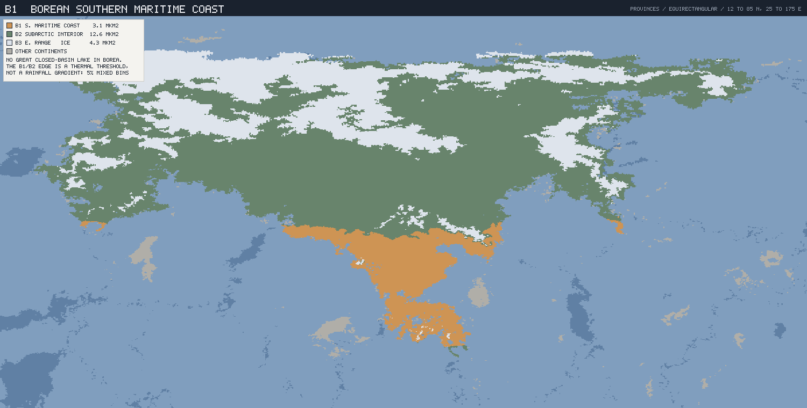
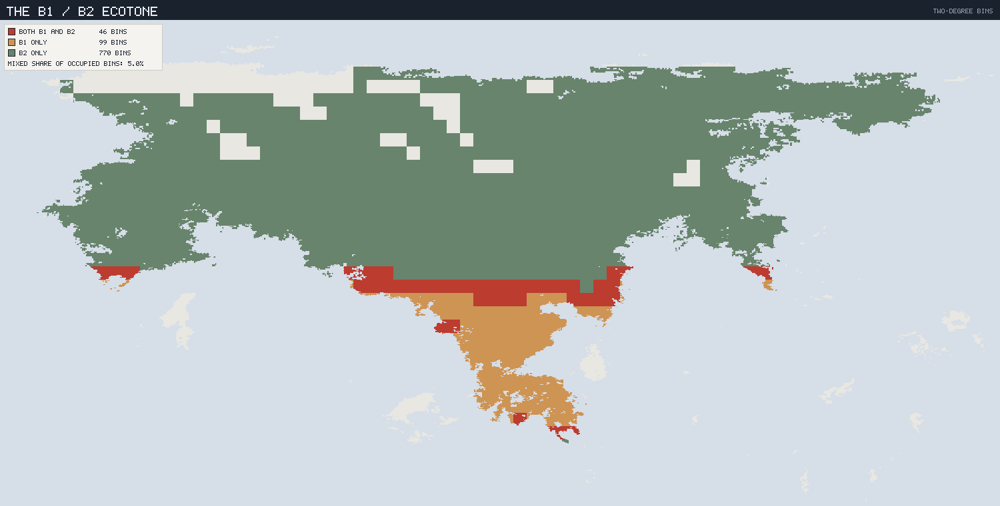
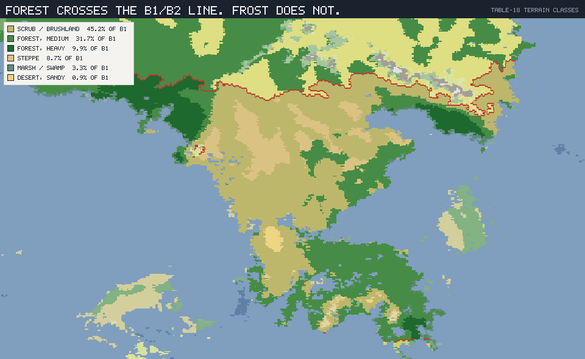
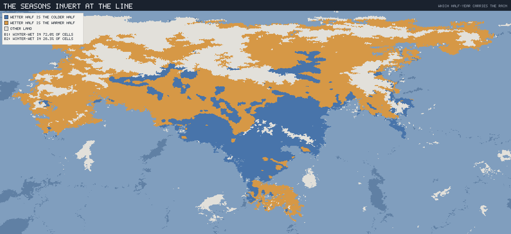

# The Borean Southern Maritime Coast — B1

*Planet `06cy8w6z6a89kow6psje93` · the hardest line on the planet, and the
refuge behind it.*

This is the fourth regional ecology and the first that is neither a desert nor
west-flank. Docs 04–06 wrote the three great deserts and closed that
experiment; doc 06 §6 named **B1** as the province to take next, on three
grounds — it carried the largest correction from the partition fix (−21 %), the
culture layer rates B-group coasts a top state-formation bet, and no Borean
ecology existed at all.

It turns out to be the right choice for a fourth reason nobody had listed. The
three deserts were an experiment in **how alike unrelated things become**. B1 is
the opposite experiment: the one boundary on this planet where two adjacent
biotas refuse to mix at all, and the record of *why*.

### Labels and reproduction

**MEASURED** / **INTERPRETED** / **INVENTED** as elsewhere; figures from
`tools/province-ecology/` on the connected-landmass partition, reproducing the
published vectors (3.13 Mkm², 17.1 °C, 643 mm, NPP 950).

```sh
node tools/province-ecology/main.mjs B1 --compare B2
node tools/province-ecology/render.mjs B1
```



*B1 (ochre) is a thin southern rim on a very large cold continent: B2's
subarctic interior (sage) is four times its size, and B3's eastern range and
northern ice (white) is larger still. Borea holds none of the planet's ten
great closed-basin lakes, so there are no rings on this plate.*

---

## 1. The hardest line on the planet

**MEASURED.** Every regional ecology so far has reported how interdigitated its
province is with its wetter neighbour, as the share of 2° bins holding both.
Three deserts gave three similar answers. B1 does not.

| Pair | Both | Hero only | Neighbour only | Mixed share | Mixed, as a share of the **hero's** bins |
|---|---:|---:|---:|---:|---:|
| **M3 / M4** Meridia | 302 | 128 | 179 | 49.6 % | 70.2 % |
| **V3 / V1b** Selvana | 172 | 44 | 67 | 60.8 % | 79.6 % |
| **S2 / S1** Sirocca | 334 | 124 | 175 | 52.8 % | 72.9 % |
| **B1 / B2** Borea | **46** | **99** | **770** | **5.0 %** | **31.7 %** |

The headline figure is 5.0 % against 49.6–60.8 %, but that comparison is unfair
on its own: B2 is four times B1's size, and a large neighbour drags the
symmetric share down mechanically. The last column removes that objection by
asking only about **B1's own** bins — of the 145 bins B1 occupies, how many also
hold B2? The answer is 31.7 %, against 70.2, 79.6 and 72.9 % for the three
deserts. Normalised or not, **B1 interleaves with its neighbour less than half
as much as any province yet measured.**



*The other three ecotones are mottled — hero, neighbour and mixed bins tangled
through each other for hundreds of kilometres. This one is a line. The mixed
bins (red) form a strip a few bins deep across an otherwise clean division
between the ochre south and the sage north.*

### And there is nothing there

**MEASURED, and it is the part that makes this worth a document.** Every other
hard boundary in this canon is a wall. Doc 01 lists them as such: S1 is set off
by a **6.98 km** wall, M1 is a cordillera, B3 is an ice-capped range averaging
1.97 km and topping out at 6.12 km. The obvious explanation for a sharp
boundary is relief.

There is no relief here.

| | Mean elevation | Median | p95 | Mountain cells |
|---|---:|---:|---:|---:|
| The 46 **border bins** | **0.38 km** | 0.28 km | 1.16 km | **2.2 %** |
| B1 overall | 0.22 km | 0.15 km | 0.65 km | 1.0 % |
| B2 overall | 0.45 km | 0.33 km | 1.26 km | 1.8 % |
| *B3, for scale* | *1.97 km* | *1.87 km* | *3.69 km* | *2.4 %* |

The border band averages **380 m** and is 2.2 % mountain cells — statistically
indistinguishable from the ordinary ground on either side of it. The planet's
sharpest ecological boundary sits on gentle, unremarkable, low country.



*The B1/B2 line traced in red over Table-18 terrain classes. Scrub, medium
forest and heavy forest all run straight through it: B1 is 31.7 % medium forest
and B2 is 27.2 % medium forest, so in vegetation-structure terms the two
provinces are nearly the same place. The line is invisible to the terrain
classifier and absolute to everything else.*

So doc 01's entry for this province originally read "the warm C-group refuge,
**walled off inland**" — right about the isolation and wrong about the
mechanism. Nothing is walled. The barrier is climatic, and §2 says which part
of the climate. [`01`](01_BIOGEOGRAPHIC_REALMS.md) has been corrected
accordingly, and gains the **B3** row it was missing.

---

## 2. Two dormancies, in opposite halves of the year

**MEASURED.** Start with the crude version, which is already stark:

| | B1 | B2 | B3 |
|---|---:|---:|---:|
| Cold-season mean | **7.2 °C** | −10.8 °C | −28.5 °C |
| Warm-season mean | 27.0 °C | 14.8 °C | −5.2 °C |
| **Frost-free** (share of area, cold-season mean > 0 °C) | **100 %** | **0.2 %** | 0.5 % |

Crossing the line, the frost-free share goes from **100 % to 0.2 %** in the
space of one 2° bin. That is a *threshold*, not a gradient — and it is a
threshold by construction, because Köppen's C/D boundary is drawn on
cold-month temperature. Rainfall gradients interleave, because rainfall varies
smoothly over hundreds of kilometres; a temperature threshold does not
interleave, because a cell is either above it or below it. That alone explains
much of §1.

But the temperature threshold is not the whole story, and the rest of it is
better.

### The rain changes season

**MEASURED.** Ask a hemisphere-independent question of each cell: *is the
wetter half-year also the colder half-year?*

| | Winter-wet cells | Wet-season concentration | Cool-half rain | Warm-half rain |
|---|---:|---:|---:|---:|
| **B1** | **72.0 %** | 71.9 % | 355 mm | 288 mm |
| **B2** | **28.3 %** | 58.8 % | 389 mm | 442 mm |
| B3 | 11.7 % | 59.7 % | 208 mm | 276 mm |

(The two middle columns are different quantities that happen to land close
together for B1. "Winter-wet cells" is *which* half-year is wetter; "wet-season
concentration" is *how much* of the year's rain falls in whichever half is
wetter. B1 scores high on both; B2 is middling on the second and inverted on
the first.)

B1 is predominantly **winter-wet**. B2 is **summer-wet**. Crossing the line
northward, the rain does not merely change amount — it changes *which half of
the year it falls in*.



*Blue where the wetter half-year is the colder half-year, ochre where it is the
warmer one, over B1 and B2 only (B3 is greyed). The solid blue block is B1's
Mediterranean core; the ochre field above it is B2.*

### Which means B1 is not one place

**MEASURED, and this was not expected.** The winter-wet share is not uniform
within B1. It is a clean function of latitude:

| Band | Share of B1 | Dominant Köppen | Winter-wet | Precipitation |
|---|---:|---|---:|---:|
| 22–26 °N | 5.0 % | `Cfa` 69 % | **6 %** | 849 mm |
| 26–30 °N | 15.5 % | `Cfa` 39 · `Cwa` 31 | 17 % | 594 mm |
| 30–34 °N | 10.6 % | `Cwa` 33 · `Csa` 25 | 40 % | 501 mm |
| 34–38 °N | 15.9 % | `Csa` 52 % | 91 % | 446 mm |
| 38–42 °N | 24.2 % | `Csa` 44 % | 94 % | 538 mm |
| 42–46 °N | 27.6 % | `Csa` 45 · `Cfa` 39 | **98 %** | 868 mm |
| 46–50 °N | 1.2 % | `Cfc` 45 · `Cfa` 37 | 56 % | 1,265 mm |

B1 contains **its own seasonality reversal**, running north to south and
flipping at about **32 °N**:

- a **winter-wet Mediterranean north**, 34–46 °N, **67.6 %** of the province,
  `Csa`-dominant, 91–98 % winter-wet;
- a **summer-wet subtropical south**, 22–30 °N, **20.6 %** of the province,
  `Cfa`/`Cwa`, only 6–17 % winter-wet;
- a transition between them at 30–34 °N, 10.6 %, split almost evenly.

**INTERPRETED — and this is the mechanism behind §1.** The two-thirds of B1
that is winter-wet is precisely the two-thirds that lies **against the B2
border**. So the inversion is not merely present at the line; it is at its
*maximum* at the line. B1 meets B2 along its 38–46 °N edge — where 52 % of the
province's area sits — at **94–98 %** winter-wet, and B2 answers at 28.3 %. The
provinces are at their most seasonally opposite exactly where they meet.

That converts the boundary from a temperature threshold into something much
harder to cross. A lineage moving north out of B1's Mediterranean belt is not
simply moving somewhere colder. It is moving somewhere where **the growing
season has changed months**. It arrives timed to grow in the cool wet half and
rest through the warm dry one — and lands in a province whose warm half is the
wet one and whose cool half is lethal. Its entire annual cycle is inverted with
respect to its new home, and dormancy timing is not a thing an organism adjusts
casually: it is usually wired to photoperiod.

**This is a phenological barrier, and phenological barriers do not
interdigitate.** Two populations can share a rainfall gradient and blend across
it over 500 km. Two populations whose dormant seasons are six months out of
phase cannot blend at all — the hybrids are dormant at the wrong time on both
sides. 31.7 % against 70–80 % is what that looks like in bins.

---

## 3. What that builds

**INVENTED**, from the regime above and from core-branch stock. Borea inherits
the same constraint as Sirocca, and doc 06 §4 states it: the **Thermozoa** —
endothermy and the iron-red carrier — sit on the **west-flank stem**, so
**Borea has no endotherms at all.** Its entire animal world is copper-blue and
ectothermic, on a continent that is 84.1 % Köppen D+E.

That gives the continent a single organising problem, and B1 a unique exemption
from it.

### The province's own bind

An ectotherm in B1 faces a difficulty neither desert province has. Its
thermally best season and its biologically richest season are **not the same
season**:

- **Summer** — 27.0 °C mean, 31.6 °C maximum — is excellent for an ectotherm
  and poor for the vegetation, which is in drought.
- **Winter** — 7.2 °C mean — is when the plants grow, and is too cool for an
  ectotherm to be efficient.

Neither half of the year is lethal, and neither is good. The prediction is
therefore a **bimodal annual cycle**: two activity peaks, in the shoulder
seasons where warmth and water briefly overlap, separated by a summer
aestivation and a winter torpor. **B1's animals should have the most complex
annual cycle on the planet** — two dormancies a year, where M3 has one, S2 has
one, and B2 has one.

### The Borean set

| Role | B1 | Notes |
|---|---|---|
| **Matrix shrub** (scrub/brushland 45.2 %) | **Hardleaf** | Evergreen sclerophyll: small, thick, hard leaves held year-round because there is no season cheap enough to rebuild them in. Grows on the winter rain, shuts down through the summer drought. The dominant vegetation of the Mediterranean two-thirds. |
| **Forest** (medium 31.7 % + heavy 9.9 %) | **Coastwood** | Two populations that the terrain classifier cannot tell apart: a summer-wet southern forest below 32 °N, and a winter-wet northern one at 42–46 °N where 868 mm is enough for closed canopy under a Mediterranean regime. Same growth form, opposite calendars. |
| **The winter annual** | **Winterseed** | Germinates on the first winter rains, races the drought, and dies having set a hard, dry, storable seed before summer. The single most important organism in this document — see §5. |
| **Storage organ** | **Drybulb** | Summer-dormant geophyte. Mediterranean climates are bulb country: an underground store is the cheapest way to sit out a predictable annual drought and be first up when the rain returns. |
| **Coastal marsh** (3.3 %) | **Tidemat** | The `-mat` habit of M3's Saltmat and S2's Panmat, on the planet's most maritime mainland province (13.1 % coastal, the highest of any). |
| **Bulk browser** | **Leafbacks** | The core branch's ectotherm bulk-grazer form — M3's Plainbacks, S2's Dustbacks, V3's Broadbacks — here browsing sclerophyll. Twice dormant a year. |
| **Predator** | **Duskrunners** | Shoulder-season hunters, active in the two brief windows when their prey is. Ambush rather than pursuit: nothing here can sustain a chase, because sustained pursuit is an endotherm's game (doc 06 §4). |
| **Wet-season breeder** | **Winterspawn** | Breeds in the winter rains, in water that is seasonal but reliable — the one resource B1 has and B2 does not, because B2's equivalent water is frozen when B1's is falling. |
| **Rainherds · Coursers** | **absent** | No endotherms anywhere on the continent. |
| *Across the line, in B2* | ***Frostbacks*** | *The Leafback counterpart, and the continent's real innovation: an ectotherm that survives being frozen. See §4.* |

---

## 4. The refuge that holds a continent

**MEASURED, and it is the most consequential number in this document.**

| | Area | Share of Borea | Frost-free | Share of Borea's frost-free land |
|---|---:|---:|---:|---:|
| **B1** | 3.13 Mkm² | **15.6 %** | 100 % | **98.7 %** |
| B2 | 12.64 Mkm² | 63.1 % | 0.2 % | 0.7 % |
| B3 | 4.27 Mkm² | 21.3 % | 0.5 % | 0.6 % |
| *Borea* | *20.04 Mkm²* | | *15.9 %* | |

**B1 is 15.6 % of Borea and holds 98.7 % of its frost-free land.** On a
continent with no endotherms, that is not a regional statistic. It is the
continent's entire biological structure in one line.

**INTERPRETED.** Three consequences follow. The first two run in opposite
directions, and the third is a prediction.

**First: B2 and B3 required an invention, and B1 did not.** Every ectotherm
lineage that holds Borea's interior — 16.9 Mkm² of it — has had to solve
surviving a cold-season mean of −10.8 °C, and −28.5 °C on the ranges. Freeze
*avoidance* does not scale to a province this size; there is nowhere to go. So
Borea's interior fauna are **freeze-tolerant**: they survive frozen rather than
avoiding freezing, on cryoprotectants and controlled ice nucleation, and their
year is one long winter shutdown with a short summer. **Frostbacks** are the
form that owns the taiga. This is Borea's great evolutionary achievement, and
doc 02 §5 anticipated it — the ancestral copper-blue carrier "paying off in
exactly the cold it was first tuned to."

**Second: B1 is the conservative province, not the exotic one.** It is easy to
read B1 as Borea's anomaly. Biologically it is the reverse. B1's animals do
what core-branch ectotherms have always done, and what S2's Dustbacks still do
on the other side of the world: shut down through the dry heat and wait. It is
**B2 and B3 that are derived**, holding a novelty — freeze tolerance — that no
other province on the planet needed to evolve.

So the hard line of §1 separates an **ancestral** biota from a **derived** one,
and separates them asymmetrically. Moving north out of B1 requires acquiring
freeze tolerance *and* re-phasing the annual cycle by six months. Moving south
out of B2 requires losing an adaptation that costs nothing to keep, and
re-phasing by six months anyway. Both directions are hard; the northward
direction is much harder. **B1 only 99 bins against B2 only 770** is the
footprint of a continent that expanded away from its refuge and could not
easily come back.

**Third: B1 should be Borea's endemism reservoir.** It is small, it is the
ancestral condition, it is
climatically buffered (100 % frost-free, 100 % growing season), and it is
almost sealed. That is the standard recipe for relict lineages. Where S2 has no
relicts because nothing persists (doc 06 §2), B1 should be full of them — the
old Borean lineages that never needed the freeze-tolerance innovation and never
left. **Borea's deepest branches are in its smallest province.**

---

## 5. What this hands the culture layer

**INTERPRETED.** Doc 00 of the culture layer already rates B1 highly — "the
only part of Borea where agriculture is easy; a population sink for the whole
continent." This document confirms the rating and changes the reasons, in ways
that matter for what gets invented there.

**Agriculture is not merely easy here — this is the best cereal-domestication
setting on the planet.** A Mediterranean regime is the one climate that
*manufactures* domesticable cereals, because a hard summer drought selects
directly for large-seeded winter annuals that bank everything in a dry, hard,
storable seed and die. **Winterseed** is that plant, and §2 puts it across
**67.6 %** of the province. This is a domestication envelope entirely
independent of Meridia's: doc 04's **Flushgrass** is a flood-ephemeral in a
2.4 °C-annual-range basin, and B1 is a 19.8 °C-range winter-rainfall coast. The
two cradles share nothing — not the lineage, not the climate, not the cue the
plant reads.

**And no animal can be added to it.** Borea has no endotherms, so B1 has no
pack animal, no milk animal, no traction animal, and no wool. Every second
half of the Meridian package (doc 04's **Rainherds**) is simply unavailable.
The consequences are structural, not decorative:

- **No plough, ever, without an import.** Hoe cultivation caps field size and
  therefore farm size, which caps surplus per household and pushes toward dense
  intensive gardens rather than extensive grain estates.
- **No pastoral neighbours.** The steppe-nomad relationship that shapes so much
  of Earth's agrarian history has no possible analogue in Borea. Whatever
  pressure B1 feels from B2 will be from foragers and fishers, not from
  horsemen.
- **But live protein is nearly free to store.** An ectotherm of a given mass
  needs on the order of a tenth of an endotherm's food. **Leafbacks** cannot be
  herded, driven, milked or worked — but they can be *penned*, and kept alive
  for months at almost no fodder cost, which is exactly the thing a temperate
  farming society normally cannot do. The invariant is not "no animal
  husbandry". It is **husbandry as a larder rather than as a herd**: you do not
  raise them, you keep them.

The closest Earth analogue is therefore not the one currently cited. It is
**Mediterranean California** — a winter-wet climate of extraordinary plant
wealth whose peoples built dense, sedentary, socially complex societies on
stored plant food with **no domesticated large animals at all**. That is B1's
structural situation exactly, with the difference that B1 also has the
winter-annual grasses California lacked.

### Corrections this document forced

Profiling B1 contradicted one word and five figures already in the canon. All
have been fixed at source.

In [`../culture/00_PROVINCE_CONSTRAINT_VECTORS.md`](../culture/00_PROVINCE_CONSTRAINT_VECTORS.md)
§4's B1 block — its master table in §3 was already right, having been
regenerated on the corrected partition:

| Was | Is | Why it mattered |
|---|---|---|
| "summer-wet" | **winter-wet** (72.0 % of cells) | Reverses the planting calendar and the whole eHRAF analogue set — which has been replaced |
| "19.4 % coastal" | **13.1 %** | Still the highest of any mainland province, but not by the margin claimed |
| "81 % D+E" | **84.1 %** | Makes B1's refuge role sharper, not weaker |
| `Köppen Cfa` | **`Csa` 34.2 % · `Cfa` 32.2 %** | `Csa` is the plurality; the block named the runner-up |
| `NPP ~955` | **~950** | Stale against the regenerated table |

And in [`03`](03_HUMANOID_ANCESTRY.md), twice: B2's frost-free share was given
as **1 % "of the year"**, on both counts wrong — it is **0.2 %**, and the
metric is a share of *area* (cells whose cold-season mean is above freezing),
not of the calendar. Both were left over from the superseded longitude
partition, along with B2's NPP (768 → **761**).

---

## 6. What this fixes, and what comes next

**Fixed (this province's ecology):**

- B1 is **3.13 Mkm², 17.1 °C, 643 mm (a floor), NPP 950 (a floor)**, 100 %
  frost-free, 13.1 % coastal — the most maritime mainland province on the
  planet.
- Its boundary with B2 is **the hardest ecological line on the planet**: 31.7 %
  of B1's bins mixed, against 70–80 % for all three deserts — and it sits on
  ground averaging **380 m**, with no wall of any kind. *(Qualified since by
  [`10`](10_SELVANAN_TROPICAL_NORTH.md) §2. V1a/V1b measures lower still —
  3.9 % — but that pair is separated by a bare `lat ≤ -15` cut with no physical
  criterion in its rule, so it measures the ruler, not an ecology. B1/B2 remains
  the hardest boundary **that is a boundary**.)*
- The mechanism is **phenological, not topographic**: a Köppen C/D thermal
  threshold (frost-free 100 % → 0.2 %) compounded by a **seasonality
  inversion** (winter-wet 72.0 % → 28.3 %) that is at its maximum exactly along
  the line.
- B1 contains its own reversal at ~32 °N: a **winter-wet Mediterranean north**
  (67.6 %) against a **summer-wet subtropical south** (20.6 %).
- **98.7 % of Borea's frost-free land is B1**, on 15.6 % of its area. B1 is the
  ancestral, unfrozen refuge; **B2 and B3 hold the derived innovation**,
  freeze tolerance, on a continent with no endotherms.
- The Borean set — **Hardleaf · Coastwood · Winterseed · Drybulb · Tidemat ·
  Leafbacks · Duskrunners · Winterspawn**, and **Frostbacks** across the line —
  with a **bimodal annual cycle** (two dormancies a year) unique to this
  province.
- For the culture layer: an **independent cereal cradle** in Winterseed, and
  **no animal for the other half of the package** — husbandry as larder, not as
  herd; no plough without an import.

**Open:**

- **B2** is the natural next province, and this document has run up a debt to
  it: Frostbacks, freeze tolerance, and the claim that the interior is derived
  are all asserted here and unprofiled there. It is also the planet's second
  largest province (12.64 Mkm²), and its precipitation is the least reliable
  figure in the table (overstated ~2–2.5×, §2.2 of the culture doc), so it
  needs care rather than assumption.
- **M4** is the alternative, and the culture layer's stronger claim: it is the
  peoples' own neighbour, the first place a Meridian expansion actually goes,
  and one of doc 00 §5's "four provinces that will carry the world" — none of
  which has an ecology yet.
- B1's predicted **relict fauna** is a specific, checkable claim that the
  deep-time record in doc 02 has not yet been asked about.
- Marine ecologies remain untouched, on a planet that is 79 % ocean — and B1,
  at 13.1 % coastal against a cold-water province, is the first land province
  whose ecology genuinely depends on one.
