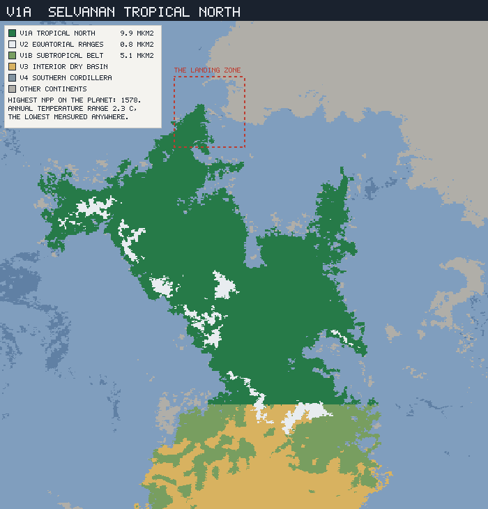
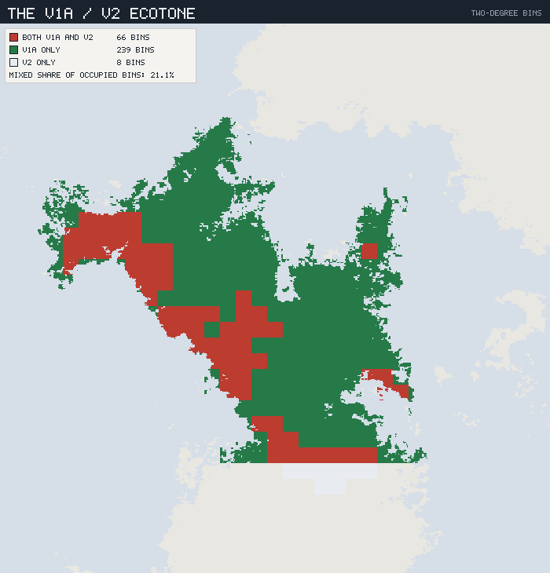
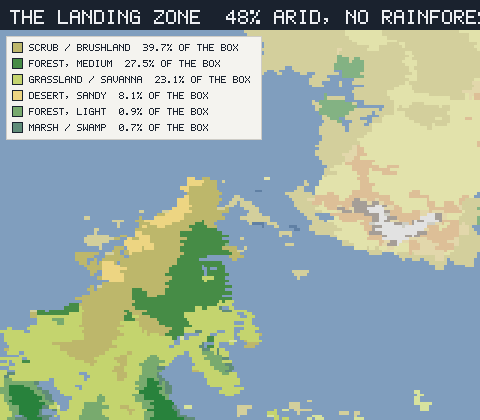

# The Selvanan Tropical North — V1a

*Planet `06cy8w6z6a89kow6psje93` · the richest province on the planet, the
flattest ecology in the canon, and the beach the peoples actually land on.*

This is the fifth regional ecology and the first written because another
document needed it. Doc 09 put a Meridian population on Selvana's coast at
~90 kyr and could not say what they found, because V1a had never been profiled.

It also arrives with the highest numbers in the canon — **9.91 Mkm² at NPP
1,578**, the most productive province on the planet, one of doc 00 §5's "four
provinces that will carry the world," and first among them. The expectation
going in was a rainforest.

What the profiling returns instead is a province with **no horizontal structure
at all**, a boundary that turns out to be a ruler rather than an ecology, and a
landing beach that is drier than the desert the peoples left.

### Labels and reproduction

**MEASURED** / **INTERPRETED** / **INVENTED** as elsewhere, on the
connected-landmass partition, reproducing the published vectors (9.9 Mkm²,
24.6 °C, 1,160 mm, NPP 1,578).

```sh
node tools/province-ecology/main.mjs V1a --compare V2
node tools/province-ecology/main.mjs V1a --box 22,32,-155,-145 --label "landing zone"
node tools/province-ecology/render.mjs V1a
```



*V1a (dark green) is the whole northern two-thirds of Selvana, speckled with
V2's sky-islands (white). The dashed box at the top is doc 09's landing zone.
Look at the bottom edge: the boundary with V1b (pale green) and V3 (ochre) is a
**dead-straight horizontal line across the continent**. Nothing in nature draws
that. §2 is about what it is.*

---

## 1. A province that varies in one dimension

**MEASURED.** V1a is enormous, hot, wet and productive, and it is the least
seasonal place yet profiled:

| | V1a |
|---|---:|
| Area | 9.91 Mkm² |
| NPP | **1,578** — highest on the planet |
| Mean temperature | 24.6 °C |
| **Annual temperature range** | **2.3 °C** — lowest measured anywhere |
| Frost-free · growing season | 100 % · 100 % |
| Precipitation | 1,160 mm — but **201 to 1,627** |
| Median elevation | 230 m |

Set the two spreads against each other. Temperature varies by **2.3 °C** across
9.91 Mkm². Precipitation varies **eightfold**. Whatever structure this province
has is made of water and nothing else — it has no thermal seasons, no thermal
gradient, and effectively no relief.

That water structure is a clean latitudinal band, and it is symmetric:

| Band | Area | Dominant Köppen | Rainforest (`Af`+`Am`) | Precip |
|---|---:|---|---:|---:|
| 25–30 °N | 0.09 Mkm² | `BSh` 57 · `Cfa` 24 · `BWh` 19 | **0 %** | 376 mm |
| 20–25 °N | 0.36 | `Aw` 59 · `BSh` 20 · `Cfa` 14 | 6 % | 684 mm |
| 15–20 °N | 1.03 | `Aw` 53 · `Am` 22 · `Af` 20 | 42 % | 1,022 mm |
| 10–15 °N | 1.68 | `Af` 37 · `Aw` 30 · `Am` 17 | 54 % | 1,092 mm |
| 5–10 °N | 1.81 | `Aw` 35 · `Am` 32 · `Af` 30 | 62 % | 1,246 mm |
| 0–5 °N | 1.55 | `Af` 61 · `Am` 22 · `Aw` 13 | 83 % | 1,375 mm |
| **5–0 °S** | **1.41** | **`Af` 76** · `Am` 13 · `Aw` 10 | **89 %** | **1,418 mm** |
| 10–5 °S | 1.01 | `Aw` 69 · `Af` 20 · `Am` 9 | 29 % | 1,108 mm |
| 15–10 °S | 0.97 | `Aw` 62 · `BSh` 21 · `Af` 7 | 12 % | 848 mm |

A rainforest core just south of the equator at **89 % `Af`/`Am`**, decaying
through savanna in both directions, and running out into semi-desert at the
northern tip. Province-wide that is `Af` 36.9 % · `Aw` 35.5 % · `Am` 18 % —
**55 % rainforest against 36 % savanna**, which is a mosaic, not a jungle.

---

## 2. The boundary that is not one

**MEASURED, and it is a defect rather than a discovery.**

Every regional ecology so far reports its interdigitation with a neighbour.
V1a's, against V1b, comes back at **2.3 % mixed** — 12 bins of 532. Taken at
face value that is less than half of B1/B2's 5.0 %, and doc 07 calls that "the
hardest ecological line on the planet."

It is not a line at all. Read the province rule:

```
Selvana   h≥2.0km & |lat|<20 → V2 · lat≤-42 → V4 · B & lat≤-15 → V3
          · lat≤-15 → V1b · else V1a
```

**V1a and V1b are separated by `lat ≤ -15` and nothing else.** No Köppen term,
no height term, no physical criterion of any kind. The 12 "mixed" bins are
exactly the 2° bins that straddle the 15 °S parallel. The measurement is of the
ruler, not of the world — which is why the plate above shows it as a straight
edge running clean across a continent.

Doc 00 §2 was ahead of this: it flags V1b as "**an operational zone**" that is
"not in the realms document," broken out because averaging Selvana's subtropical
belt into the Tropical North "destroys both." That warning was about vectors.
It applies to ecotones with more force, because an ecotone statistic is *only*
about the boundary.

### What this does to doc 07's claim

Of the five province pairs now measured, four are drawn on physical criteria and
one is not:

| Pair | Rule | Mixed | Mixed, of the hero's bins |
|---|---|---:|---:|
| V3 / V1b | Köppen `B` + latitude | 60.8 % | 79.6 % |
| S2 / S1 | Köppen `B` | 52.8 % | 72.9 % |
| M3 / M4 | Köppen `B` | 49.6 % | 70.2 % |
| **B1 / B2** | **Köppen `C`/`B` vs `D`/`E`** | **5.0 %** | **31.7 %** |
| *V1a / V1b* | *latitude only* | *2.3 %* | *3.9 %* |

**Doc 07's result survives, and needs one word.** B1/B2 is the hardest
ecological boundary on the planet *among boundaries that are ecological*. V1a's
southern edge is a smaller number and not a competitor, because it is not
measuring an ecology. Doc 07 has been annotated to say so.

---

## 3. The real edge is vertical

**MEASURED.** V1a's only genuine internal boundary is with **V2**, the
Equatorial Ranges — and it is not an edge, it is a puncture.

| | V1a | V2 |
|---|---:|---:|
| Area | 9.91 Mkm² | **0.75 Mkm²** |
| Mean temperature | 24.6 °C | **6.5 °C** |
| Cold-season mean | 23.4 °C | 3.0 °C |
| Frost-free | 100 % | **68.3 %** |
| Elevation p05 / p50 / p95 | 0 / 0.23 / 1.5 km | **2.03 / 2.47 / 3.88 km** |
| Glacier | — | **9.8 %** |
| NPP | 1,578 | 968 |

**Eighteen degrees of cooling, and ten per cent glacier, inside a province whose
own annual range is 2.3 °C.**



*66 bins hold both; 239 hold only V1a; **8** hold only V2. That last number is
the result: **89.2 % of V2's occupied bins also contain V1a**. V2 is not
adjacent to V1a, it is suspended inside it — a branching archipelago of cold
islands in a hot sheet.*

**INTERPRETED — and it closes the isolation taxonomy the layer has been
building.** Four documents have now measured the machinery a province has for
making and keeping species:

| | Isolating pump | Refuge | Result |
|---|---|---|---|
| **M3** cradle | 3 lakes, deepest 821 m | yes | richness **and** relicts |
| **S2** | 3 lakes, deepest 14 m | no | richness, **no** relicts |
| **V3** | none | none | neither |
| **B1** | none | thermal, sealed | relicts, low richness |
| **V1a** | **none in the horizontal** | — | vast shallow diversity |
| **V2** | **the best on the planet** | each island | **deep, narrow endemism** |

V1a is a productivity engine with no isolating machinery of its own, wrapped
around the finest isolating machinery in the canon. On a flat aseasonal sheet
nothing separates: a lineage can walk from 15 °S to 20 °N without crossing a
frost, a mountain, or a season. But every V2 island is a cold refuge in a hot
matrix, unreachable from the next one without descending 2 km into lethal heat.

**The prediction is therefore lopsided, and it is checkable.** V1a's lowland
diversity should be enormous and **shallow** — many forms, few of them old, none
of them narrowly endemic. V2's should be tiny and **deep** — few forms, ancient,
and endemic island by island. **Selvana's oldest lineages are in 7.6 % of its
richest province, on the tops.**

One caveat the data itself imposes: doc 00 §2.2 marks V2's precipitation
**unknown** — "tropical alpine has no Earth counterpart at this scale, and the
`ET` bias was measured on polar tundra. Do not transfer it." Its 755 mm is not
usable. Everything above rests on V2's *temperature* and *elevation*, which are
not affected.

---

## 4. What that builds

**INVENTED**, from §1's water gradient and §3's vertical structure. V1a is
west-flank, so unlike Sirocca and Borea it **has endotherms** — the Thermozoa
reach here by descent, and Meridian forms have true congeners.

| Role | V1a | Notes |
|---|---|---|
| **Canopy** (jungle heavy 35.1 %) | **Crownwood** | The emergent of the `Af` core. In a place with no dry season and no cold season there is no synchronising cue at all, so Crownwood flowers **asynchronously** — never a whole-forest event, always some fraction in fruit. |
| **Epiphytes** | **Airroot** | The signature guild of no-dry-season ground, and V1a's real diversity reservoir: an entire flora that never touches soil. Absent from every other documented province. |
| **Understorey** (forest light 21.5 %) | **Shadeleaf** | |
| **Savanna grass** (`Aw` 35.5 %) | **Bandgrass** | The one plant in the province with a real dry season to answer, and therefore the **only possible cereal ancestor here** — see §6. |
| **Storage organ** | **Vine-tuber** | The `Af` core's staple, and the line's fourth form after M3's **Sun-tuber**, V3's **Pan-tuber** and S2's **Ashen-root**. A climbing aroid-analogue with a large starchy corm — and, because nothing here selects for a hard dry seed, it propagates **vegetatively**. That single fact drives §6. |
| **Marsh** (5.5 %) | **Reedmat** | The `-mat` habit of Saltmat, Panmat and Tidemat, in fresh water for the first time. |
| **Bulk browser** | **Vinebacks** | The core ectotherm `-back` form — Plainbacks, Dustbacks, Broadbacks, Leafbacks — here in closed canopy, and for once **not dormant for part of the year**. Nothing in V1a's climate requires a dormant season at all. |
| **Herd** | **Bandherds** | Endothermic, congeneric with M3's **Rainherds** and V3's **Basinherds**, and confined to the savanna band: a herd cannot work closed canopy. The province's one domesticable animal, and it does not live in the rich part. |
| **Predator** | **Limbstalkers** | Arboreal ambush. The Courser line's pursuit strategy is useless under canopy, so V1a's endotherm predators went up instead of fast. |
| *On the V2 tops* | ***Frostcrown*** | *The treeline relict — the only plant in Selvana's tropics that meets frost every year, on islands it cannot leave.* |

**The thing that is missing is a dormant season.** Every other province
documented so far organises its biota around one: M3 and S2 aestivate through
the dry heat, V3 the same, B1 runs two dormancies a year, B2 freezes solid.
V1a has none — no frost, a 2.3 °C range, and rain in every month somewhere in
the core. It is the only province in the canon where **life runs continuously**,
and that, rather than the rainfall, is why NPP is 1,578.

---

## 5. The arrival, corrected

**MEASURED, and it overturns a sentence in doc 09.**

Doc 09 §3.4 ends: *"The crossing runs from the driest coast on Meridia to the
richest ground in the world, across 75 km of island water."* The first half is
right. The second half is wrong, and §1's latitude table already shows why —
the landing is at **27 °N**, and V1a's riches are 2,000 km south of it.

Profiling the landing zone doc 09 defines (22–32 °N, 155–145 °W) against the
rest of the province:

| | Landing zone | V1a remainder |
|---|---:|---:|
| Area | **0.24 Mkm²** (2.4 %) | 9.67 Mkm² |
| Mean temperature | 22.5 °C | 24.7 °C |
| **Annual range** | **10.0 °C** | **2.1 °C** |
| Precipitation | **511 mm** | 1,176 mm |
| NPP | **846** | **1,596** |
| Köppen | `BSh` 40 · `Cfa` 28 · `Aw` 24 · `BWh` 8 | `Af` 38 · `Aw` 36 · `Am` 19 |
| Rainforest | **0 %** | 57 % |
| Terrain | scrub 40 · forest 28 · savanna 23 · **desert 8** | jungle 53 · forest 22 |



*Both shores of the crossing. Selvana's landing coast at left — scrub, savanna
and sand — and Meridia's departure coast at right, muted. The legend is tallied
over the landing box only, not the province.*

**They cross 75 km of water and arrive somewhere drier than the desert they
left.** The 25–30 °N band of V1a runs **376 mm**; doc 09 measured the Meridian
cradle at **386 mm**. Two continents, one strait, and the same landscape on both
sides of it.

Three distances fix the rest of the story:

- **680 km** from the landing point to the nearest true rainforest (`Af`/`Am`).
- **4,715 km** from the landing point to the nearest cell of **V3** — the
  province where doc 05 placed the congeners (**Coldflush**, **Pan-tuber**,
  **Basinherds**) that let a Meridian arid toolkit work.
- **2.4 %** of V1a is the arid fringe they hold on arrival.

So doc 05's "the toolkit crosses intact" is true and much more expensive than it
sounded. The toolkit survives the water and then has to survive **4,715 km** of
country it was not built for to reach the ground where its congeners grow.
Between the beach and those congeners lie 9.67 Mkm² of rainforest and savanna at
NPP 1,596 where an arid toolkit is not wrong so much as irrelevant.

**And the calendar problem starts on the beach.** Doc 05's finding was that V3
"plants time on cooling as well as wetting, a cue the Meridian homeland (2.4 °C
annual range) never taught." The landing zone's annual range is **10.0 °C** — so
the first ground they stand on already breaks the homeland calendar, 4,715 km
before they reach the province doc 05 was talking about.

---

## 6. What this hands the culture layer

**INTERPRETED.** V1a is first among doc 00 §5's four provinces by NPP × area,
and the ecology sharpens that ranking rather than confirming it.

**The wet core cannot make a cereal.** A seed crop is manufactured by a dry
season: something has to select for a large, hard, storable, dormant seed, and
in the `Af` core nothing does. Doc 07 made this argument for B1's **Winterseed**
from the other end — a Mediterranean summer drought *manufactures* storable
winter annuals. V1a's core has no dry season to do that work, so its staple is
**Vine-tuber**: propagated vegetatively, harvested as needed, and — the
consequence that matters — **not storable**.

An economy on a non-storable staple is a different animal:

- **No granary, so no granary politics.** The classic route from surplus to
  hierarchy runs through storable, countable, seizable grain. A tuber left in
  the ground until needed is a bank that cannot be taxed, raided, or
  requisitioned in one visit.
- **But food security is trivial.** NPP 1,596, no frost, no dormant season, and
  a canopy that fruits asynchronously means there is no hungry month. What the
  wet core lacks is not calories, it is *concentration*.
- **The savanna band is a different economy in the same province.** `Aw` 35.5 %
  has a real dry season, **Bandgrass** to domesticate, and **Bandherds** — the
  only herd animal in V1a. Grain, storage, animals and therefore surplus live in
  the savanna belt; the rainforest core has abundance without any of them.

**So V1a is two economies, and the boundary between them is latitude.** Expect
the province's states, if it has them, in the savanna band — and expect the
richest ground on the planet to hold the *least* politically concentrated
societies in it.

Two further notes. **The arrivals land in neither of them** (§5): the fringe at
27 °N is arid scrub, and it is where a Meridian toolkit works best. And **V2 is
the reason to look up** — 0.75 Mkm² of cold, frost-touched islands standing
above a province that has never seen frost, close enough to every lowland
population to be reached and far enough to be a different world.

---

## 7. What this fixes, and what comes next

**Fixed (this province's ecology):**

- V1a is **9.91 Mkm² at NPP 1,578**, the planet's most productive province, and
  its **2.3 °C annual range is the lowest measured anywhere**. All of its
  variation is water: precipitation spans **eightfold** while temperature does
  not move.
- It is a **latitudinal band** — an 89 % rainforest core just south of the
  equator, savanna flanks, and semi-desert tips.
- **Its southern boundary is not a boundary.** V1a/V1b is a bare `lat ≤ -15`
  cut, so its 2.3 % interdigitation measures the ruler. **Doc 07's "hardest
  ecological line" survives** — B1/B2 is the hardest boundary *that is an
  ecology* — and has been annotated.
- **The real edge is vertical and it is an embedding**: 89.2 % of V2's bins hold
  V1a. So V1a has vast **shallow** diversity and V2 holds the **deep** endemism,
  on 7.6 % of the area.
- The biota — **Crownwood · Airroot · Shadeleaf · Bandgrass · Vine-tuber ·
  Reedmat · Vinebacks · Bandherds · Limbstalkers**, and **Frostcrown** on the
  tops — organised around the one thing V1a lacks: **a dormant season**.
- **The landing zone is 0 % rainforest, 48 % arid, NPP 846, range 10.0 °C.** The
  peoples cross 75 km of water onto ground **drier than the cradle they left**
  (376 mm against 386). Doc 09 §3.4 has been corrected; the rainforest is
  **680 km** further, and doc 05's congeners are **4,715 km** further still.
- For the culture layer: **the wet core cannot make a cereal**, so its staple is
  vegetative and unstorable — abundance without concentration — while grain,
  herds and storage live in the savanna band. One province, two economies, split
  by latitude.

**Open:**

- **V2 needs its own document and cannot have one yet.** It is the planet's best
  speciation engine and doc 00 §2.2 declares its precipitation untransferable.
  Its ecology has to be written from temperature and elevation alone, or the
  data caveat has to be resolved first.
- **V1b is still an operational zone**, and this document has now shown that the
  cost of that is not only a blurred vector but a meaningless ecotone. Selvana's
  subtropical belt should be given a real boundary before anything is designed
  against it.
- **B2 and M4** remain the standing ecology debts from docs 07 and 06 — M4 the
  more pressing, since doc 09 makes it the province most of Meridia's people
  actually live in.
- The **first contact scene** is now fully specified on the physical side and
  entirely unwritten on the human one.
