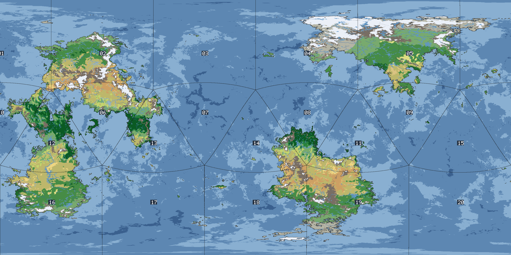

# Regional Geography Reports

Chapter-style physical-geography write-ups (after Chapter 3, *Continents and Geography*, of the AD&D World Builder's Guidebook) for the exported World Orogen planet — derived from the simulation data itself rather than dice rolls.

| | |
|---|---|
| Planet code | [`06cy8w6z6a89kow6psje93`](https://www.orogen.studio/#06cy8w6z6a89kow6psje93) |
| Seed | 10673275 |
| Cells | 2,560,001 |
| Land fraction | 20.89 % |
| Extracted | 2026-06-06T15:53:50.116Z |



Terrain/ocean colors: [legend](maps/legend.png).

**See also the [Physical Atlas](atlas/README.md)** — 13 global plates (relief, erosion, tectonics, climate, ocean currents, drainage basins, vegetation) plus a planetary records gazetteer.

## The 20 regions

The globe is divided into the 20 triangular faces of an icosahedron with one vertex at each pole (the book's "polyhedral mapping system"): regions 01–05 ring the north pole, 06–15 span the equatorial belt, and 16–20 ring the south pole. Faces are numbered by descending center latitude, then ascending longitude; the partition's rotation about the polar axis is arbitrary (a north-cap face is centered on the 36° E meridian). Each face covers ~25.5 M km².

| Region | Character | Hydrography | Land | Dominant band | Dominant terrain | Mtn. systems | Major rivers | Lakes |
|---|---|---|---|---|---|---|---|---|
| [01](regions/region_01.md) | Sub-tropical coastline with offshore islands | Coastline with offshore islands | 6.5 % | Sub-tropical | Scrub / brushland | 12 | 5 | 6 |
| [02](regions/region_02.md) | Sub-tropical multiple coastlines | Multiple coastlines | 49.8 % | Sub-tropical | Forest, medium | 22 | 26 | 88 |
| [03](regions/region_03.md) | Open ocean | Open ocean | 0.1 % | — | — | 0 | 0 | 0 |
| [04](regions/region_04.md) | Arctic coastline with offshore islands | Coastline with offshore islands | 20.5 % | Arctic | Tundra | 12 | 22 | 45 |
| [05](regions/region_05.md) | Sub-arctic multiple coastlines | Multiple coastlines | 54.9 % | Sub-arctic | Forest, medium | 26 | 29 | 120 |
| [06](regions/region_06.md) | Sub-tropical multiple coastlines | Multiple coastlines | 40.5 % | Sub-tropical | Scrub / brushland | 19 | 37 | 53 |
| [07](regions/region_07.md) | Open ocean | Open ocean | 0.0 % | — | — | 0 | 0 | 0 |
| [08](regions/region_08.md) | Tropical coastline with offshore islands | Coastline with offshore islands | 15.9 % | Tropical | Jungle, heavy | 10 | 10 | 39 |
| [09](regions/region_09.md) | Sub-tropical coastline with offshore islands | Coastline with offshore islands | 4.7 % | Sub-tropical | Forest, medium | 2 | 0 | 1 |
| [10](regions/region_10.md) | Tropical coastline with offshore islands | Coastline with offshore islands | 12.2 % | Tropical | Forest, light | 6 | 3 | 10 |
| [11](regions/region_11.md) | Sub-tropical coastline with offshore islands | Coastline with offshore islands | 14.7 % | Sub-tropical | Scrub / brushland | 9 | 10 | 17 |
| [12](regions/region_12.md) | Tropical multiple coastlines | Multiple coastlines | 52.0 % | Tropical | Jungle, heavy | 27 | 33 | 87 |
| [13](regions/region_13.md) | Tropical multiple coastlines | Multiple coastlines | 21.1 % | Tropical | Jungle, heavy | 9 | 14 | 26 |
| [14](regions/region_14.md) | Tropical coastline with offshore islands | Coastline with offshore islands | 14.0 % | Tropical | Barren | 10 | 6 | 17 |
| [15](regions/region_15.md) | Open ocean | Open ocean | 0.1 % | — | — | 0 | 0 | 0 |
| [16](regions/region_16.md) | Sub-tropical coastline with offshore islands | Coastline with offshore islands | 44.1 % | Sub-tropical | Forest, medium | 13 | 14 | 71 |
| [17](regions/region_17.md) | Temperate coastline with offshore islands | Coastline with offshore islands | 0.8 % | Temperate | Forest, medium | 0 | 0 | 0 |
| [18](regions/region_18.md) | Sub-tropical multiple coastlines | Multiple coastlines | 17.8 % | Sub-tropical | Forest, medium | 12 | 5 | 27 |
| [19](regions/region_19.md) | Sub-tropical multiple coastlines | Multiple coastlines | 47.8 % | Sub-tropical | Forest, medium | 38 | 27 | 74 |
| [20](regions/region_20.md) | Open ocean | Open ocean | 0.1 % | — | — | 0 | 0 | 0 |

## How this was generated

Generated by `tools/regional-report` (zero-dependency Node.js). Pipeline: stream the 13 gzipped CSV parts into typed arrays → assign each cell to an icosahedral face → rasterize to a 0.125° equirectangular grid (area-weighted) → classify climate bands and Table-18 terrain from Köppen class, elevation and precipitation → derive hydrology (priority-flood depression filling, precipitation-driven flow accumulation, rivers, and water-balanced lakes — freshwater where inflow beats evaporation, endorheic salt lakes otherwise) → per-region connected-component analysis for landmasses, mountain systems and enclosed waters → render maps and write these reports.

Regenerate with:

```bash
node tools/regional-report/main.mjs
```
