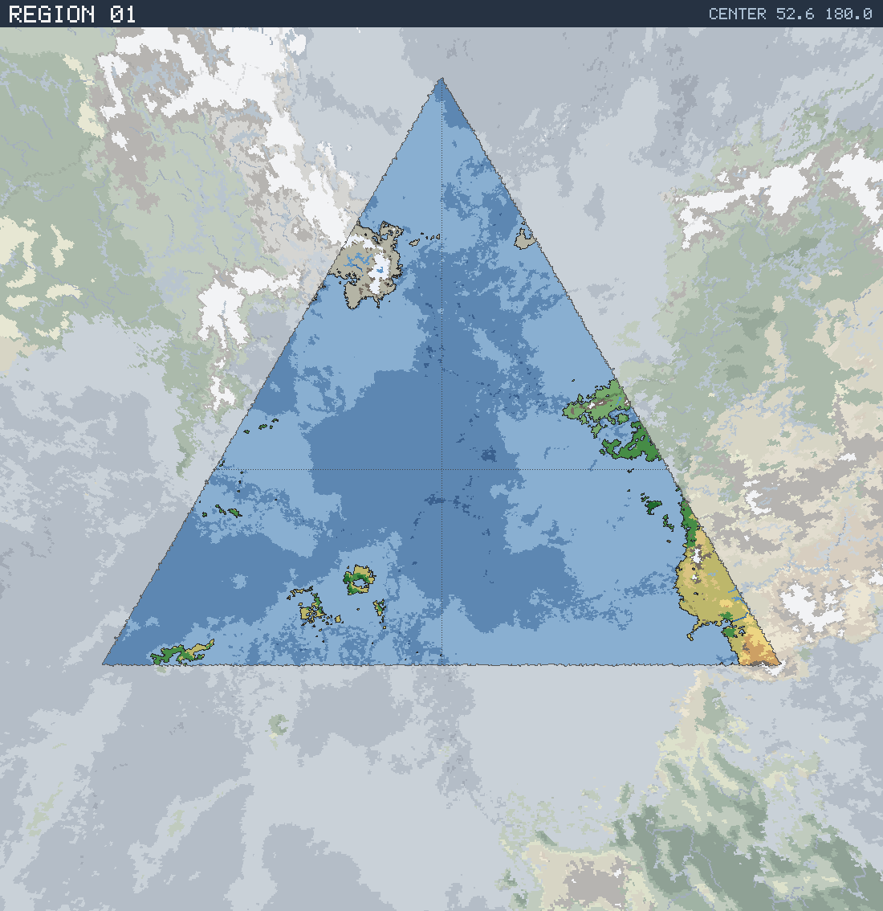

# Region 01 — Sub-tropical coastline with offshore islands

Triangular face centered at 52.6°N 180.0°E · area 25,503,330 km² (1/20 of the planet).

*All percentages are area-weighted. Terrain colors are keyed in the [legend](../maps/legend.png).*

## At a Glance

| | |
|---|---|
| Hydrography | **Coastline with offshore islands** |
| Land share | 6.5 % (1,670,397 km²) |
| Dominant climate band | Sub-tropical |
| Dominant terrain | Scrub / brushland |
| Mountain systems | 12 |
| Mean land temperature | 16.7 °C (Jun half-year) / -2.3 °C (Dec half-year) |
| Mean annual precipitation | 829 mm |

## Hydrography

Classified as **Coastline with offshore islands** (Table 15 vocabulary), based on:

- Land covers 6.5 % of the region.
- Largest land body: 615,562 km² (part of a larger landmass continuing into a neighboring region).
- 44 island(s) ≥ 600 km² fully inside the region; 10 landmass(es) of continental scale or continuing beyond the region's edges.
- 28,848 km² of enclosed (landlocked) water.

## Landforms

| System | Quadrant | Length × width | Trend | Peak | Mean elev. |
|---|---|---|---|---|---|
| 1 (34,517 km²) | NW | 829 × 101 km | N-S | 4.7 km at 72.8°N 160.4°E | 1.2 km |
| 2 (22,775 km²) | NW | 371 × 248 km | NW-SE | 3.0 km at 74.7°N 155.1°E | 0.9 km |
| 3 (21,576 km²) | SE | 636 × 116 km | NW-SE | 2.5 km at 34.2°N 149.3°W | 0.9 km |
| 4 (20,486 km²) | NE | 401 × 72 km | E-W | 3.9 km at 55.9°N 148.1°W | 1.6 km |
| 5 (11,077 km²) | SE | 319 × 96 km | N-S | 3.5 km at 38.4°N 146.6°W | 0.9 km |
| 6 (8,873 km²) | SE | 266 × 89 km | E-W | 3.2 km at 32.1°N 148.7°W | 1.2 km |
| 7 (8,409 km²) | NW | 174 × 68 km | NE-SW | 5.0 km at 70.4°N 159.8°E | 1.5 km |
| 8 (7,393 km²) | NW | 248 × 62 km | NE-SW | 1.9 km at 69.4°N 155.6°E | 0.8 km |

…plus 4 lesser system(s).

Relief of the land area:

| Lowlands (< 0.3 km) | Hills (0.3–0.8 km) | Highlands (0.8–2 km) | Mountains (> 2 km) |
|---|---|---|---|
| 26.0 % | 21.3 % | 33.6 % | 19.1 % |

## Climate

Climate-band composition of the land area (the book's five latitudinal bands, assigned from the simulated Köppen class of each cell):

| Tropical | Sub-tropical | Temperate | Sub-arctic | Arctic |
|---|---|---|---|---|
| 0.0 % | 41.8 % | 5.9 % | 19.8 % | 32.5 % |

Leading Köppen classes on land:

| Class | Type | Share of land |
|---|---|---|
| ET | Tundra | 26.5 % |
| Csa | Hot-summer Mediterranean | 17.3 % |
| Dfc | Subarctic | 10.7 % |
| Cfa | Humid subtropical | 10.4 % |
| BSh | Hot steppe | 8.9 % |
| Dfb | Warm-summer continental | 7.9 % |

## Prevailing Winds & Moisture

Wind direction is the direction the wind blows **from** (area-weighted mean over each quadrant); strength is relative to the planet-wide mean. "Variable" marks quadrants where the seasonal vectors largely cancel (monsoonal or convergence zones). Seasons follow the northern-hemisphere convention: "Jun" is the June–August half-year — southern-hemisphere summer is the Dec column.

| Quadrant | Jun wind | Dec wind | Land precip. | Regime | Rain shadow |
|---|---|---|---|---|---|
| NW | from NNE, moderate, variable | from NE, light, variable | 900 mm (year-round) | sub-humid | 14 % of land |
| NE | from NE, moderate, variable | from NE, light, variable | 1,471 mm (year-round) | humid | 26 % of land |
| SW | from SW, moderate, variable | from SW, moderate | 729 mm (year-round) | sub-humid | — |
| SE | from SW, moderate | from SW, moderate | 454 mm (winter-wet) | semi-arid | — |

A pronounced rain shadow affects the NE quadrant(s), leeward of the NW mountain system.

## Predominant Terrain

Terrain classes (Table 18 vocabulary) derived per cell from Köppen class, elevation and annual precipitation:

| Terrain | Share of land |
|---|---|
| Scrub / brushland | 27.3 % |
| Tundra | 22.7 % |
| Forest, medium | 17.3 % |
| Forest, light | 10.6 % |
| Glacier | 6.0 % |
| Barren | 5.4 % |
| Desert, sandy | 3.2 % |
| Steppe | 3.1 % |
| Desert, rocky | 2.7 % |
| Forest, heavy | 1.4 % |

Notable expanses (largest contiguous areas):

- A forest of 116,027 km² in the NE quadrant.

## Water Bodies

Enclosed below-sea-level seas (basins with no ocean outlet, almost certainly saline):

| Body | Kind | Area | Max. depth | Quadrant |
|---|---|---|---|---|
| 1 | great lake | 3,328 km² | 1.3 km | NW |
| 2 | great lake | 2,720 km² | 4.0 km | NE |
| 3 | great lake | 2,477 km² | 2.6 km | NW |

Lakes (computed hydrology — depressions in the terrain holding water above sea level):

| Lake | Type | Area | Surface elev. | Max. depth | Quadrant |
|---|---|---|---|---|---|
| 1 | freshwater (with outlet) | 8,492 km² | 815 m | 271 m | NW |
| 2 | freshwater (with outlet) | 5,088 km² | 747 m | 382 m | NW |
| 3 | freshwater (with outlet) | 3,780 km² | 157 m | 102 m | SE |
| 4 | freshwater (with outlet) | 3,118 km² | 3,347 m | 529 m | NW |
| 5 | freshwater (with outlet) | 2,095 km² | 247 m | 129 m | NE |
| 6 | salt (no outlet) | 2,040 km² | 623 m | 15 m | SE |

## Rivers

5 major river system(s) reach the sea (or a terminal lake) in this region — the book expects 4d6 for a typical region. Discharge is annual flow at the mouth; for scale, the Rhine carries ≈ 70 km³/yr and the Mississippi ≈ 580 km³/yr.

| River | Discharge | Main-stem length | Source | Mouth | Empties into |
|---|---|---|---|---|---|
| 1 | 73 km³/yr | 636 km | NW quadrant | NW, 70.9°N 153.1°E | sea |
| 2 | 63 km³/yr | 2,679 km | SE quadrant | SE, 31.2°N 145.9°W | sea |
| 3 | 28 km³/yr | 173 km | NE quadrant | NE, 49.9°N 144.3°W | sea |
| 4 | 21 km³/yr | 234 km | NW quadrant | NW, 70.6°N 161.6°E | sea |
| 5 | 16 km³/yr | 87 km | NW quadrant | NW, 73.8°N 163.7°E | sea |

> **Method note.** Rivers and lakes are not part of the Orogen export; they are derived by this tool with standard terrain hydrology: priority-flood depression filling over the elevation raster, steepest-descent flow routing, runoff from annual precipitation minus temperature-driven evapotranspiration (Ol'dekop curve), and a per-depression water balance — humid basins fill to their spill point and drain onward (freshwater), arid basins shrink to the area where evaporation matches inflow (salt lakes). Below-sea-level enclosed seas come directly from the export's elevation field.
