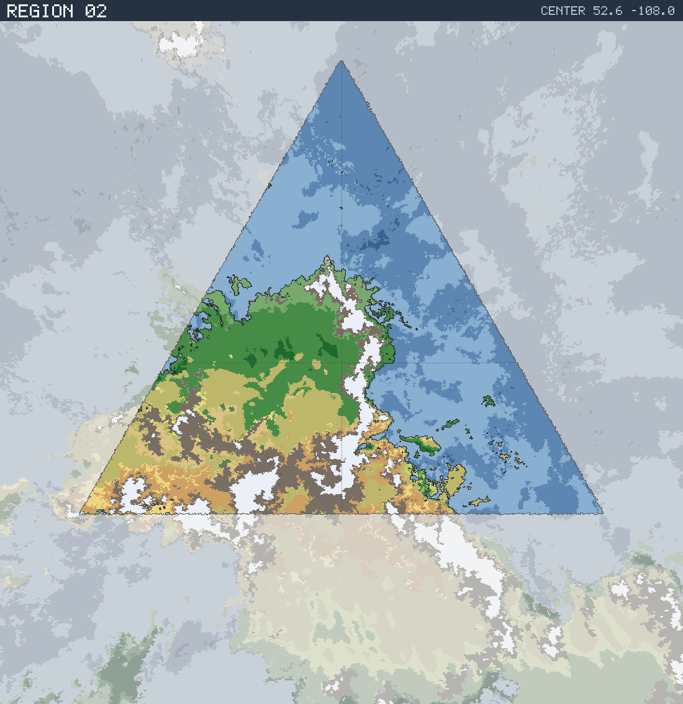

# Region 02 — Sub-tropical multiple coastlines

Triangular face centered at 52.6°N 108.0°W · area 25,497,889 km² (1/20 of the planet).

*All percentages are area-weighted. Terrain colors are keyed in the [legend](../maps/legend.png).*

## At a Glance

| | |
|---|---|
| Hydrography | **Multiple coastlines** |
| Land share | 49.8 % (12,709,947 km²) |
| Dominant climate band | Sub-tropical |
| Dominant terrain | Forest, medium |
| Mountain systems | 22 |
| Mean land temperature | 17.8 °C (Jun half-year) / -0.2 °C (Dec half-year) |
| Mean annual precipitation | 562 mm |

## Hydrography

Classified as **Multiple coastlines** (Table 15 vocabulary), based on:

- Land covers 49.8 % of the region.
- Largest land body: 12,453,553 km² (part of a larger landmass continuing into a neighboring region).
- 33 island(s) ≥ 600 km² fully inside the region; 3 landmass(es) of continental scale or continuing beyond the region's edges.
- 87,905 km² of enclosed (landlocked) water.

## Landforms

| System | Quadrant | Length × width | Trend | Peak | Mean elev. |
|---|---|---|---|---|---|
| 1 (86,170 km²) | SE | 869 × 744 km | NW-SE | 7.3 km at 40.4°N 105.3°W | 1.8 km |
| 2 (81,989 km²) | SE | 1,393 × 238 km | N-S | 6.6 km at 47.2°N 103.3°W | 1.9 km |
| 3 (28,469 km²) | NE | 678 × 283 km | N-S | 2.1 km at 60.1°N 101.7°W | 1.0 km |
| 4 (22,517 km²) | NW | 519 × 127 km | NW-SE | 2.9 km at 55.8°N 143.8°W | 0.8 km |
| 5 (20,832 km²) | SE | 449 × 103 km | N-S | 3.8 km at 33.3°N 94.6°W | 1.1 km |
| 6 (19,766 km²) | SW | 392 × 87 km | N-S | 5.7 km at 37.9°N 119.2°W | 4.0 km |
| 7 (18,362 km²) | SE | 445 × 86 km | NW-SE | 3.0 km at 32.1°N 92.4°W | 1.2 km |
| 8 (17,013 km²) | NW | 356 × 84 km | NW-SE | 4.3 km at 64.9°N 110.8°W | 1.3 km |

…plus 14 lesser system(s).

Relief of the land area:

| Lowlands (< 0.3 km) | Hills (0.3–0.8 km) | Highlands (0.8–2 km) | Mountains (> 2 km) |
|---|---|---|---|
| 4.8 % | 11.9 % | 35.6 % | 47.8 % |

## Climate

Climate-band composition of the land area (the book's five latitudinal bands, assigned from the simulated Köppen class of each cell):

| Tropical | Sub-tropical | Temperate | Sub-arctic | Arctic |
|---|---|---|---|---|
| 0.5 % | 41.2 % | 21.9 % | 17.1 % | 19.3 % |

Leading Köppen classes on land:

| Class | Type | Share of land |
|---|---|---|
| Cfa | Humid subtropical | 13.7 % |
| EF | Ice cap | 11.1 % |
| BSh | Hot steppe | 10.8 % |
| BSk | Cold steppe | 9.0 % |
| BWh | Hot desert | 8.4 % |
| Csa | Hot-summer Mediterranean | 8.4 % |

## Prevailing Winds & Moisture

Wind direction is the direction the wind blows **from** (area-weighted mean over each quadrant); strength is relative to the planet-wide mean. "Variable" marks quadrants where the seasonal vectors largely cancel (monsoonal or convergence zones). Seasons follow the northern-hemisphere convention: "Jun" is the June–August half-year — southern-hemisphere summer is the Dec column.

| Quadrant | Jun wind | Dec wind | Land precip. | Regime | Rain shadow |
|---|---|---|---|---|---|
| NW | from N, moderate, variable | from NNE, moderate, variable | 1,095 mm (year-round) | humid | — |
| NE | from E, moderate, variable | from ENE, moderate, variable | 921 mm (year-round) | sub-humid | — |
| SW | from NNW, strong, variable | from WSW, strong, variable | 386 mm (year-round) | semi-arid | — |
| SE | from SSE, strong, variable | from SW, strong, variable | 350 mm (year-round) | semi-arid | — |

## Predominant Terrain

Terrain classes (Table 18 vocabulary) derived per cell from Köppen class, elevation and annual precipitation:

| Terrain | Share of land |
|---|---|
| Forest, medium | 25.6 % |
| Barren | 19.5 % |
| Scrub / brushland | 19.3 % |
| Glacier | 11.1 % |
| Desert, rocky | 9.0 % |
| Forest, light | 5.8 % |
| Steppe | 4.7 % |
| Desert, sandy | 2.0 % |
| Forest, heavy | 1.5 % |
| Prairie | 0.8 % |
| Grassland / savanna | 0.4 % |

Notable expanses (largest contiguous areas):

- A desert of 519,460 km² in the SW quadrant.
- A forest of 3,484,342 km² in the NW quadrant.
- A grassland of 111,306 km² in the SW quadrant.
- A glacier of 607,712 km² in the SE quadrant.

## Water Bodies

| Body | Kind | Area | Max. depth | Quadrant |
|---|---|---|---|---|
| 1 | great lake | 11,469 km² | 3.8 km | SE |
| 2 | great lake | 7,698 km² | 3.8 km | NW |
| 3 | great lake | 7,374 km² | 4.6 km | SE |
| 4 | great lake | 4,429 km² | 2.6 km | NW |
| 5 | great lake | 3,774 km² | 2.0 km | SW |
| 6 | great lake | 2,314 km² | 2.4 km | NW |
| 7 | great lake | 2,095 km² | 1.1 km | SE |
| 8 | great lake | 2,061 km² | 1.9 km | SE |

**Likely river systems** (inference — see limitations):

- The NE ranges receive ~1,498 mm of rain a year and likely drain north toward the nearby coast as one or more major river systems.
- The NW ranges receive ~876 mm of rain a year and likely drain south-west toward the nearby coast as one or more major river systems.
- The SE ranges receive ~799 mm of rain a year and likely drain north toward the nearby coast as one or more major river systems.

> **Limitations.** The export models no rivers and no above-sea-level lake water; the water bodies above are below-sea-level basins not connected to the World Ocean. River statements are qualitative inferences from precipitation, relief and the direction of the nearest coast.
