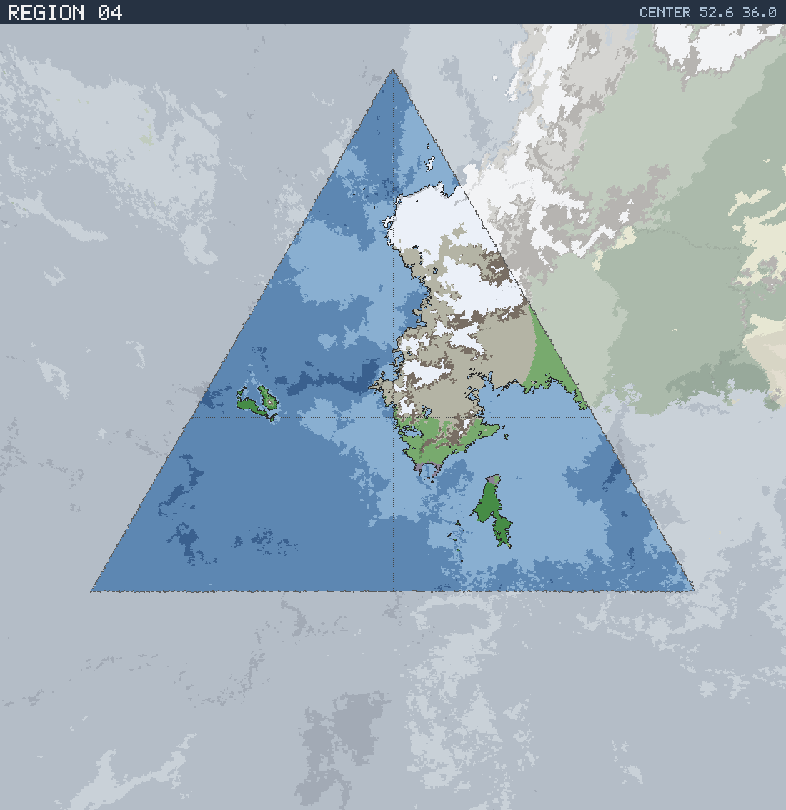

# Region 04 — Arctic coastline with offshore islands

Triangular face centered at 52.6°N 36.0°E · area 25,506,710 km² (1/20 of the planet).

*All percentages are area-weighted. Terrain colors are keyed in the [legend](../maps/legend.png).*

## At a Glance

| | |
|---|---|
| Hydrography | **Coastline with offshore islands** |
| Land share | 20.5 % (5,234,056 km²) |
| Dominant climate band | Arctic |
| Dominant terrain | Tundra |
| Mountain systems | 12 |
| Mean land temperature | 2.8 °C (Jun half-year) / -13.5 °C (Dec half-year) |
| Mean annual precipitation | 872 mm |

## Hydrography

Classified as **Coastline with offshore islands** (Table 15 vocabulary), based on:

- Land covers 20.5 % of the region.
- Largest land body: 4,927,572 km² (part of a larger landmass continuing into a neighboring region).
- 22 island(s) ≥ 600 km² fully inside the region; 1 landmass(es) of continental scale or continuing beyond the region's edges.
- 43,847 km² of enclosed (landlocked) water.

## Landforms

| System | Quadrant | Length × width | Trend | Peak | Mean elev. |
|---|---|---|---|---|---|
| 1 (39,817 km²) | NE | 820 × 183 km | NE-SW | 4.7 km at 59.1°N 39.1°E | 1.3 km |
| 2 (25,290 km²) | SE | 487 × 95 km | N-S | 3.2 km at 48.4°N 41.3°E | 1.4 km |
| 3 (20,465 km²) | SE | 362 × 69 km | N-S | 4.3 km at 52.2°N 52.2°E | 1.2 km |
| 4 (16,828 km²) | NE | 401 × 75 km | NE-SW | 5.7 km at 61.4°N 38.6°E | 1.9 km |
| 5 (12,733 km²) | NE | 390 × 68 km | NE-SW | 1.7 km at 67.2°N 48.2°E | 0.5 km |
| 6 (10,816 km²) | NW | 363 × 54 km | NE-SW | 3.9 km at 76.1°N 38.1°E | 1.2 km |
| 7 (10,741 km²) | NE | 235 × 72 km | NE-SW | 5.5 km at 75.4°N 71.6°E | 2.6 km |
| 8 (8,581 km²) | NE | 325 × 42 km | NE-SW | 3.2 km at 78.4°N 54.4°E | 1.1 km |

…plus 4 lesser system(s).

Relief of the land area:

| Lowlands (< 0.3 km) | Hills (0.3–0.8 km) | Highlands (0.8–2 km) | Mountains (> 2 km) |
|---|---|---|---|
| 15.8 % | 18.0 % | 31.7 % | 34.5 % |

## Climate

Climate-band composition of the land area (the book's five latitudinal bands, assigned from the simulated Köppen class of each cell):

| Tropical | Sub-tropical | Temperate | Sub-arctic | Arctic |
|---|---|---|---|---|
| 0.0 % | 0.0 % | 4.1 % | 15.5 % | 80.4 % |

Leading Köppen classes on land:

| Class | Type | Share of land |
|---|---|---|
| ET | Tundra | 49.8 % |
| EF | Ice cap | 30.6 % |
| Dfc | Subarctic | 14.1 % |
| Cfb | Oceanic | 3.1 % |
| Dfb | Warm-summer continental | 1.4 % |
| Cfc | Subpolar oceanic | 0.9 % |

## Prevailing Winds & Moisture

Wind direction is the direction the wind blows **from** (area-weighted mean over each quadrant); strength is relative to the planet-wide mean. "Variable" marks quadrants where the seasonal vectors largely cancel (monsoonal or convergence zones). Seasons follow the northern-hemisphere convention: "Jun" is the June–August half-year — southern-hemisphere summer is the Dec column.

| Quadrant | Jun wind | Dec wind | Land precip. | Regime | Rain shadow |
|---|---|---|---|---|---|
| NW | from NE, light, variable | from NE, light | 1,512 mm (year-round) | humid | 27 % of land |
| NE | from NW, strong, variable | from N, strong, variable | 773 mm (year-round) | sub-humid | — |
| SW | from SW, moderate | from SW, moderate | 1,435 mm (year-round) | humid | — |
| SE | from SW, moderate | from SW, moderate | 1,260 mm (year-round) | humid | 12 % of land |

A pronounced rain shadow affects the NW quadrant(s), leeward of the NE mountain system.

## Predominant Terrain

Terrain classes (Table 18 vocabulary) derived per cell from Köppen class, elevation and annual precipitation:

| Terrain | Share of land |
|---|---|
| Tundra | 38.8 % |
| Glacier | 30.6 % |
| Forest, light | 14.3 % |
| Barren | 11.0 % |
| Forest, medium | 4.5 % |
| Moor | 0.7 % |

Notable expanses (largest contiguous areas):

- A forest of 388,049 km² in the SE quadrant.
- A glacier of 753,714 km² in the NE quadrant.

## Water Bodies

| Body | Kind | Area | Max. depth | Quadrant |
|---|---|---|---|---|
| 1 | great lake | 7,571 km² | 0.7 km | NE |
| 2 | great lake | 2,542 km² | 1.7 km | NE |

**Likely river systems** (inference — see limitations):

- The NE ranges receive ~1,248 mm of rain a year and likely drain north toward the nearby coast as one or more major river systems.
- The SE ranges receive ~1,507 mm of rain a year and likely drain north toward the nearby coast as one or more major river systems.
- The SE ranges receive ~768 mm of rain a year and likely drain north-east toward the nearby coast as one or more major river systems.

> **Limitations.** The export models no rivers and no above-sea-level lake water; the water bodies above are below-sea-level basins not connected to the World Ocean. River statements are qualitative inferences from precipitation, relief and the direction of the nearest coast.
