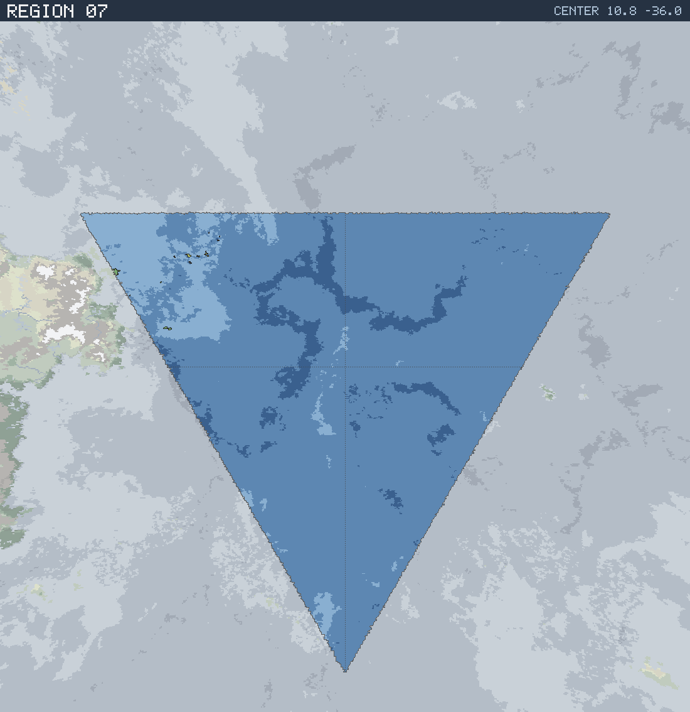

# Region 07 — Open ocean

Triangular face centered at 10.8°N 36.0°W · area 25,497,087 km² (1/20 of the planet).

*All percentages are area-weighted. Terrain colors are keyed in the [legend](../maps/legend.png).*

## At a Glance

| | |
|---|---|
| Hydrography | **Open ocean** |
| Land share | 0.0 % (12,384 km²) |
| Dominant climate band | — |
| Dominant terrain | — |
| Mountain systems | 0 |
| Mean land temperature | 26.6 °C (Jun half-year) / 21.4 °C (Dec half-year) |
| Mean annual precipitation | 1,090 mm |

## Hydrography

Classified as **Open ocean** (Table 15 vocabulary), based on:

- Land covers 0.0 % of the region.
- Largest land body: 3,971 km² (part of a larger landmass continuing into a neighboring region).
- 4 island(s) ≥ 600 km² fully inside the region; 1 landmass(es) of continental scale or continuing beyond the region's edges.

## Landforms

No mountain system of significant extent (≥ 5,000 km²) rises in this region.

Relief of the land area:

| Lowlands (< 0.3 km) | Hills (0.3–0.8 km) | Highlands (0.8–2 km) | Mountains (> 2 km) |
|---|---|---|---|
| 97.2 % | 2.8 % | 0.0 % | 0.0 % |

## Climate

Climate-band composition of the land area (the book's five latitudinal bands, assigned from the simulated Köppen class of each cell):

| Tropical | Sub-tropical | Temperate | Sub-arctic | Arctic |
|---|---|---|---|---|
| 94.5 % | 5.5 % | 0.0 % | 0.0 % | 0.0 % |

Leading Köppen classes on land:

| Class | Type | Share of land |
|---|---|---|
| Aw | Tropical savanna | 94.5 % |
| BSh | Hot steppe | 5.5 % |

## Prevailing Winds & Moisture

Wind direction is the direction the wind blows **from** (area-weighted mean over each quadrant); strength is relative to the planet-wide mean. "Variable" marks quadrants where the seasonal vectors largely cancel (monsoonal or convergence zones). Seasons follow the northern-hemisphere convention: "Jun" is the June–August half-year — southern-hemisphere summer is the Dec column.

| Quadrant | Jun wind | Dec wind | Land precip. | Regime | Rain shadow |
|---|---|---|---|---|---|
| NW | from NE, moderate | from NE, light | 1,090 mm (summer-wet) | humid | — |
| NE | from NE, moderate, variable | from NE, light | no land | — | — |
| SW | from S, light | from N, light | no land | — | — |
| SE | from S, light | from N, light | no land | — | — |

## Predominant Terrain

Terrain classes (Table 18 vocabulary) derived per cell from Köppen class, elevation and annual precipitation:

| Terrain | Share of land |
|---|---|
| Forest, light | 60.4 % |
| Grassland / savanna | 34.1 % |
| Scrub / brushland | 5.5 % |

## Water Bodies

No enclosed seas or significant lakes detected in this region.

## Rivers

No major river reaches the sea within this region — the land here is too arid, too fragmented, or drains into neighboring regions.

> **Method note.** Rivers and lakes are not part of the Orogen export; they are derived by this tool with standard terrain hydrology: priority-flood depression filling over the elevation raster, steepest-descent flow routing, runoff from annual precipitation minus temperature-driven evapotranspiration (Ol'dekop curve), and a per-depression water balance — humid basins fill to their spill point and drain onward (freshwater), arid basins shrink to the area where evaporation matches inflow (salt lakes). Below-sea-level enclosed seas come directly from the export's elevation field.
