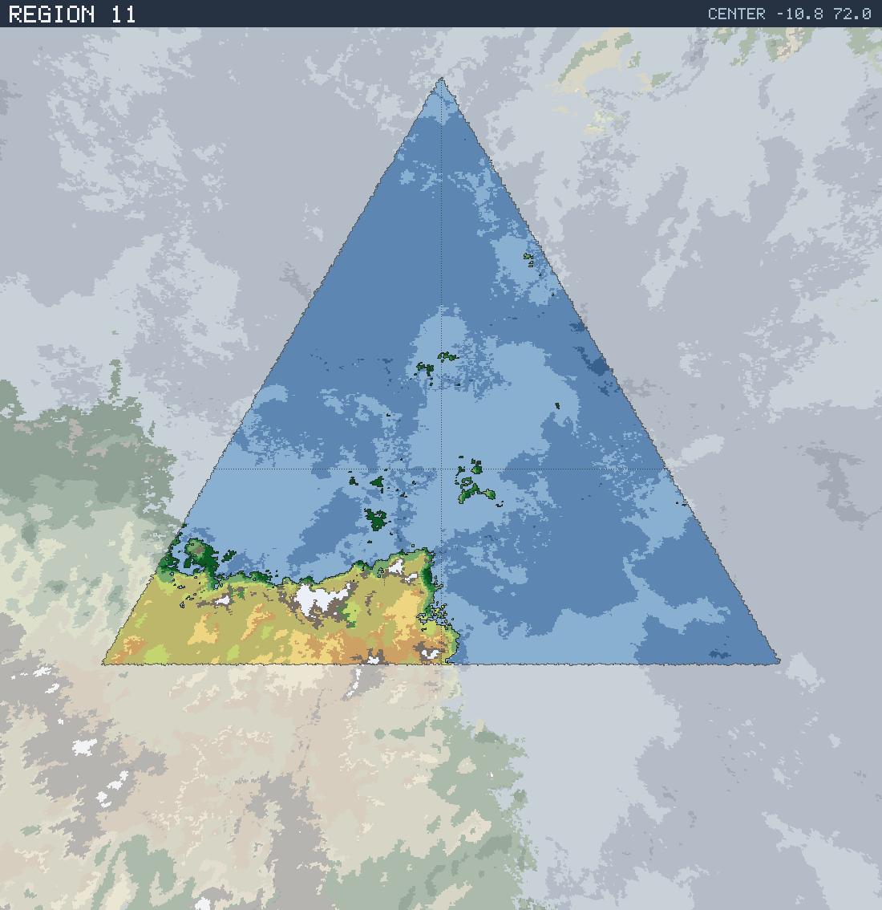

# Region 11 — Sub-tropical coastline with offshore islands

Triangular face centered at 10.8°S 72.0°E · area 25,498,382 km² (1/20 of the planet).

*All percentages are area-weighted. Terrain colors are keyed in the [legend](../maps/legend.png).*

## At a Glance

| | |
|---|---|
| Hydrography | **Coastline with offshore islands** |
| Land share | 14.7 % (3,738,707 km²) |
| Dominant climate band | Sub-tropical |
| Dominant terrain | Scrub / brushland |
| Mountain systems | 9 |
| Mean land temperature | 20.8 °C (Jun half-year) / 24.2 °C (Dec half-year) |
| Mean annual precipitation | 586 mm |

## Hydrography

Classified as **Coastline with offshore islands** (Table 15 vocabulary), based on:

- Land covers 14.7 % of the region.
- Largest land body: 3,558,050 km² (part of a larger landmass continuing into a neighboring region).
- 34 island(s) ≥ 600 km² fully inside the region; 3 landmass(es) of continental scale or continuing beyond the region's edges.
- 28,555 km² of enclosed (landlocked) water.

## Landforms

| System | Quadrant | Length × width | Trend | Peak | Mean elev. |
|---|---|---|---|---|---|
| 1 (31,972 km²) | SE | 465 × 119 km | N-S | 4.8 km at 30.6°S 71.8°E | 1.6 km |
| 2 (24,541 km²) | SW | 342 × 133 km | NE-SW | 3.0 km at 21.7°S 45.9°E | 1.2 km |
| 3 (22,022 km²) | SW | 698 × 73 km | NE-SW | 2.2 km at 22.4°S 59.8°E | 1.0 km |
| 4 (20,227 km²) | SW | 374 × 110 km | N-S | 3.3 km at 20.9°S 70.6°E | 0.9 km |
| 5 (19,094 km²) | SW | 382 × 111 km | NE-SW | 4.4 km at 17.8°S 45.9°E | 1.3 km |
| 6 (17,857 km²) | SW | 510 × 65 km | NE-SW | 3.1 km at 21.7°S 63.3°E | 1.0 km |
| 7 (17,787 km²) | SW | 334 × 88 km | NE-SW | 5.9 km at 23.6°S 55.3°E | 2.5 km |
| 8 (12,809 km²) | SW | 270 × 72 km | NE-SW | 3.0 km at 24.3°S 71.2°E | 1.0 km |

…plus 1 lesser system(s).

Relief of the land area:

| Lowlands (< 0.3 km) | Hills (0.3–0.8 km) | Highlands (0.8–2 km) | Mountains (> 2 km) |
|---|---|---|---|
| 12.8 % | 23.0 % | 35.0 % | 29.2 % |

## Climate

Climate-band composition of the land area (the book's five latitudinal bands, assigned from the simulated Köppen class of each cell):

| Tropical | Sub-tropical | Temperate | Sub-arctic | Arctic |
|---|---|---|---|---|
| 22.2 % | 63.8 % | 7.0 % | 0.0 % | 7.0 % |

Leading Köppen classes on land:

| Class | Type | Share of land |
|---|---|---|
| BSh | Hot steppe | 42.9 % |
| BWh | Hot desert | 20.8 % |
| Aw | Tropical savanna | 13.7 % |
| Af | Tropical rainforest | 5.4 % |
| EF | Ice cap | 4.0 % |
| Am | Tropical monsoon | 3.2 % |

## Prevailing Winds & Moisture

Wind direction is the direction the wind blows **from** (area-weighted mean over each quadrant); strength is relative to the planet-wide mean. "Variable" marks quadrants where the seasonal vectors largely cancel (monsoonal or convergence zones). Seasons follow the northern-hemisphere convention: "Jun" is the June–August half-year — southern-hemisphere summer is the Dec column.

| Quadrant | Jun wind | Dec wind | Land precip. | Regime | Rain shadow |
|---|---|---|---|---|---|
| NW | from NW, light | from N, light | 1,724 mm (year-round) | humid | — |
| NE | from ENE, moderate | from N, light | 1,613 mm (year-round) | humid | — |
| SW | from ESE, strong, variable | from E, strong, variable | 557 mm (year-round) | sub-humid | — |
| SE | from ESE, light | from SE, moderate, variable | 1,079 mm (winter-wet) | humid | 25 % of land |

A pronounced rain shadow affects the SE quadrant(s), leeward of the SE mountain system.

## Predominant Terrain

Terrain classes (Table 18 vocabulary) derived per cell from Köppen class, elevation and annual precipitation:

| Terrain | Share of land |
|---|---|
| Scrub / brushland | 42.6 % |
| Desert, rocky | 10.8 % |
| Desert, sandy | 10.4 % |
| Barren | 8.6 % |
| Grassland / savanna | 7.4 % |
| Forest, light | 6.1 % |
| Jungle, heavy | 5.3 % |
| Glacier | 4.0 % |
| Jungle, medium | 3.2 % |
| Forest, medium | 0.8 % |
| Steppe | 0.7 % |
| Marsh / swamp | 0.2 % |

Notable expanses (largest contiguous areas):

- A desert of 312,778 km² in the SW quadrant.

## Water Bodies

| Body | Kind | Area | Max. depth | Quadrant |
|---|---|---|---|---|
| 1 | great lake | 2,587 km² | 0.4 km | SW |
| 2 | great lake | 2,401 km² | 0.1 km | SW |
| 3 | great lake | 2,154 km² | 1.3 km | SW |
| 4 | great lake | 2,008 km² | 0.3 km | SW |

**Likely river systems** (inference — see limitations):

- The SW ranges receive ~1,002 mm of rain a year and likely drain east toward the nearby coast as one or more major river systems.
- The SW ranges receive ~942 mm of rain a year and likely drain north-west toward the nearby coast as one or more major river systems.
- The SW ranges receive ~1,543 mm of rain a year and likely drain south-west toward the nearby coast as one or more major river systems.

> **Limitations.** The export models no rivers and no above-sea-level lake water; the water bodies above are below-sea-level basins not connected to the World Ocean. River statements are qualitative inferences from precipitation, relief and the direction of the nearest coast.
