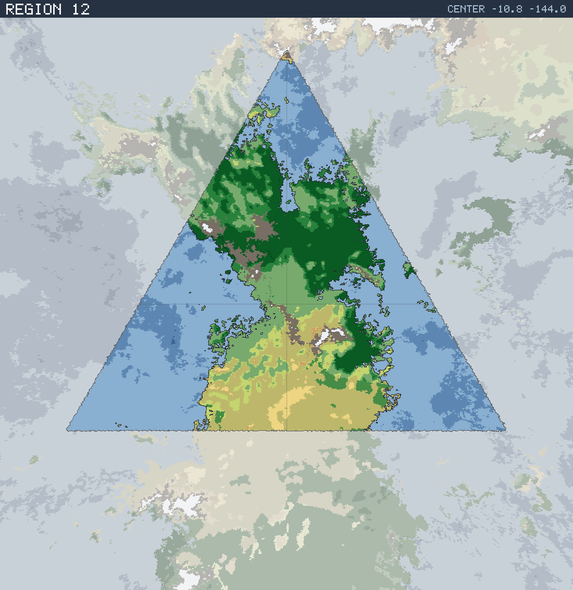

# Region 12 — Tropical multiple coastlines

Triangular face centered at 10.8°S 144.0°W · area 25,508,248 km² (1/20 of the planet).

*All percentages are area-weighted. Terrain colors are keyed in the [legend](../maps/legend.png).*

## At a Glance

| | |
|---|---|
| Hydrography | **Multiple coastlines** |
| Land share | 52.0 % (13,267,696 km²) |
| Dominant climate band | Tropical |
| Dominant terrain | Jungle, heavy |
| Mountain systems | 27 |
| Mean land temperature | 21.8 °C (Jun half-year) / 25.5 °C (Dec half-year) |
| Mean annual precipitation | 1,162 mm |

## Hydrography

Classified as **Multiple coastlines** (Table 15 vocabulary), based on:

- Land covers 52.0 % of the region.
- Largest land body: 12,875,515 km² (part of a larger landmass continuing into a neighboring region).
- 74 island(s) ≥ 600 km² fully inside the region; 9 landmass(es) of continental scale or continuing beyond the region's edges.
- 136,983 km² of enclosed (landlocked) water.

## Landforms

| System | Quadrant | Length × width | Trend | Peak | Mean elev. |
|---|---|---|---|---|---|
| 1 (75,292 km²) | NW | 1,197 × 323 km | NW-SE | 5.7 km at 0.6°N 155.8°W | 1.6 km |
| 2 (33,736 km²) | NW | 556 × 125 km | N-S | 5.5 km at 11.1°S 146.6°W | 1.8 km |
| 3 (29,893 km²) | NW | 520 × 93 km | NW-SE | 2.6 km at 1.9°S 147.3°W | 1.6 km |
| 4 (25,832 km²) | SW | 432 × 91 km | NW-SE | 4.5 km at 16.8°S 143.1°W | 1.8 km |
| 5 (23,630 km²) | NE | 465 × 83 km | NW-SE | 5.3 km at 5.8°S 130.6°W | 2.0 km |
| 6 (19,591 km²) | NW | 498 × 73 km | N-S | 1.0 km at 4.6°N 145.8°W | 0.3 km |
| 7 (19,577 km²) | SW | 297 × 96 km | N-S | 3.7 km at 13.7°S 144.1°W | 2.2 km |
| 8 (17,009 km²) | SE | 326 × 76 km | N-S | 3.4 km at 17.7°S 139.8°W | 1.7 km |

…plus 19 lesser system(s).

Relief of the land area:

| Lowlands (< 0.3 km) | Hills (0.3–0.8 km) | Highlands (0.8–2 km) | Mountains (> 2 km) |
|---|---|---|---|
| 25.1 % | 30.3 % | 32.1 % | 12.5 % |

## Climate

Climate-band composition of the land area (the book's five latitudinal bands, assigned from the simulated Köppen class of each cell):

| Tropical | Sub-tropical | Temperate | Sub-arctic | Arctic |
|---|---|---|---|---|
| 66.1 % | 28.0 % | 4.2 % | 0.0 % | 1.7 % |

Leading Köppen classes on land:

| Class | Type | Share of land |
|---|---|---|
| Aw | Tropical savanna | 29.4 % |
| Af | Tropical rainforest | 25.7 % |
| BSh | Hot steppe | 22.1 % |
| Am | Tropical monsoon | 10.9 % |
| BWh | Hot desert | 2.6 % |
| Cfa | Humid subtropical | 2.2 % |

## Prevailing Winds & Moisture

Wind direction is the direction the wind blows **from** (area-weighted mean over each quadrant); strength is relative to the planet-wide mean. "Variable" marks quadrants where the seasonal vectors largely cancel (monsoonal or convergence zones). Seasons follow the northern-hemisphere convention: "Jun" is the June–August half-year — southern-hemisphere summer is the Dec column.

| Quadrant | Jun wind | Dec wind | Land precip. | Regime | Rain shadow |
|---|---|---|---|---|---|
| NW | from SE, strong, variable | from NNE, moderate, variable | 1,548 mm (year-round) | humid | 15 % of land |
| NE | from SSE, moderate | from NNW, moderate | 1,597 mm (year-round) | humid | — |
| SW | from ESE, light | from SSE, moderate, variable | 762 mm (winter-wet) | sub-humid | — |
| SE | from SE, moderate, variable | from E, strong | 753 mm (year-round) | sub-humid | 20 % of land |

A pronounced rain shadow affects the SE quadrant(s), leeward of the NW mountain system.

## Predominant Terrain

Terrain classes (Table 18 vocabulary) derived per cell from Köppen class, elevation and annual precipitation:

| Terrain | Share of land |
|---|---|
| Jungle, heavy | 25.1 % |
| Forest, light | 23.1 % |
| Scrub / brushland | 23.0 % |
| Jungle, medium | 10.8 % |
| Grassland / savanna | 6.3 % |
| Barren | 5.7 % |
| Forest, medium | 2.5 % |
| Desert, sandy | 2.4 % |
| Glacier | 0.5 % |
| Marsh / swamp | 0.3 % |
| Desert, rocky | 0.2 % |
| Steppe | 0.2 % |

Notable expanses (largest contiguous areas):

- A desert of 229,184 km² in the SE quadrant.
- A jungle of 3,944,471 km² in the NE quadrant.
- A forest of 1,618,275 km² in the SW quadrant.
- A grassland of 115,676 km² in the SW quadrant.

## Water Bodies

| Body | Kind | Area | Max. depth | Quadrant |
|---|---|---|---|---|
| 1 | great lake | 12,322 km² | 1.4 km | NE |
| 2 | great lake | 7,652 km² | 0.4 km | NE |
| 3 | great lake | 5,729 km² | 0.4 km | SE |
| 4 | great lake | 5,347 km² | 0.2 km | NE |
| 5 | great lake | 3,929 km² | 0.1 km | NW |
| 6 | great lake | 3,685 km² | 2.7 km | SW |
| 7 | great lake | 3,646 km² | 0.3 km | SE |
| 8 | great lake | 3,617 km² | 0.1 km | SE |
| 9 | great lake | 3,237 km² | 0.2 km | NE |
| 10 | great lake | 3,179 km² | 0.2 km | SW |
| 11 | great lake | 3,016 km² | 0.1 km | NW |
| 12 | great lake | 2,876 km² | 0.3 km | NE |
| 13 | great lake | 2,870 km² | 0.4 km | NE |
| 14 | great lake | 2,792 km² | 0.3 km | SW |
| 15 | great lake | 2,446 km² | 0.7 km | SE |
| 16 | great lake | 2,422 km² | 0.2 km | SE |
| 17 | great lake | 2,297 km² | 0.7 km | NE |

**Likely river systems** (inference — see limitations):

- The NW ranges receive ~1,864 mm of rain a year and likely drain west toward the nearby coast as one or more major river systems.
- The SW ranges receive ~655 mm of rain a year and likely drain north-west toward the coast ≈ 390 km away as one or more major river systems.
- The NE ranges receive ~1,282 mm of rain a year and likely drain south toward the nearby coast as one or more major river systems.

> **Limitations.** The export models no rivers and no above-sea-level lake water; the water bodies above are below-sea-level basins not connected to the World Ocean. River statements are qualitative inferences from precipitation, relief and the direction of the nearest coast.
