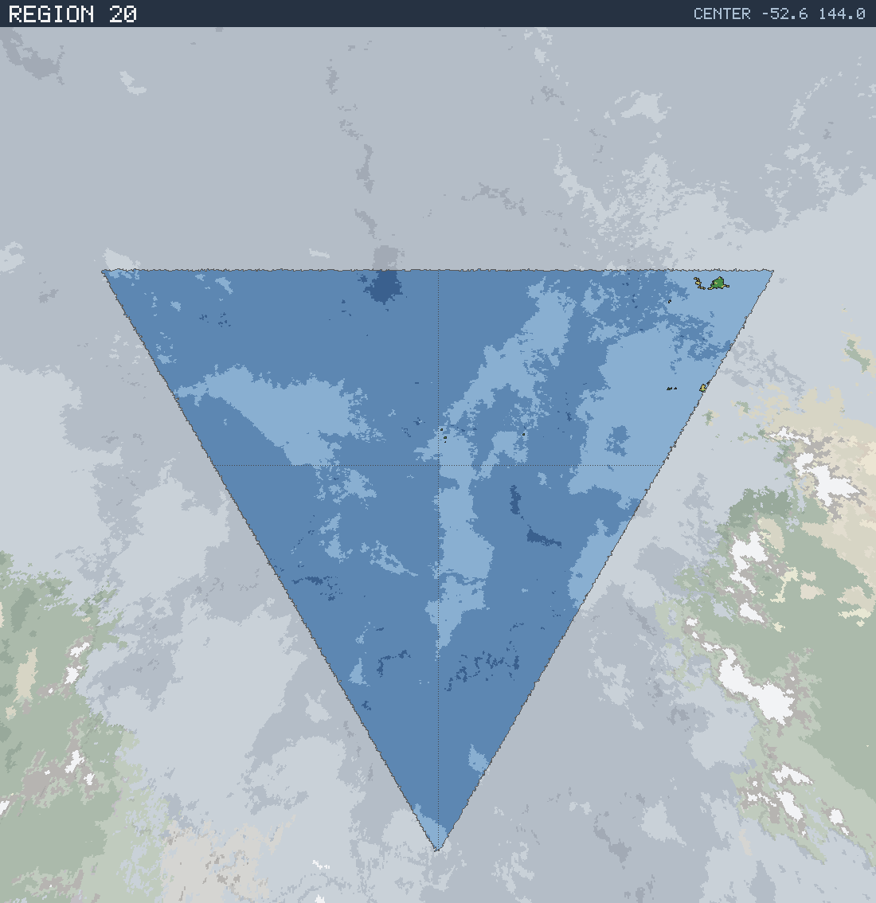

# Region 20 — Open ocean

Triangular face centered at 52.6°S 144.0°E · area 25,492,858 km² (1/20 of the planet).

*All percentages are area-weighted. Terrain colors are keyed in the [legend](../maps/legend.png).*

## At a Glance

| | |
|---|---|
| Hydrography | **Open ocean** |
| Land share | 0.1 % (19,756 km²) |
| Dominant climate band | — |
| Dominant terrain | — |
| Mountain systems | 0 |
| Mean land temperature | 12.1 °C (Jun half-year) / 27.5 °C (Dec half-year) |
| Mean annual precipitation | 626 mm |

## Hydrography

Classified as **Open ocean** (Table 15 vocabulary), based on:

- Land covers 0.1 % of the region.
- Largest land body: 10,817 km² (fully contained in this region).
- 5 island(s) ≥ 600 km² fully inside the region; 0 landmass(es) of continental scale or continuing beyond the region's edges.

## Landforms

No mountain system of significant extent (≥ 5,000 km²) rises in this region.

Relief of the land area:

| Lowlands (< 0.3 km) | Hills (0.3–0.8 km) | Highlands (0.8–2 km) | Mountains (> 2 km) |
|---|---|---|---|
| 92.4 % | 7.6 % | 0.0 % | 0.0 % |

## Climate

Climate-band composition of the land area (the book's five latitudinal bands, assigned from the simulated Köppen class of each cell):

| Tropical | Sub-tropical | Temperate | Sub-arctic | Arctic |
|---|---|---|---|---|
| 0.0 % | 94.9 % | 5.1 % | 0.0 % | 0.0 % |

Leading Köppen classes on land:

| Class | Type | Share of land |
|---|---|---|
| Cfa | Humid subtropical | 48.7 % |
| BSh | Hot steppe | 30.6 % |
| Csa | Hot-summer Mediterranean | 15.6 % |
| Dfa | Hot-summer continental | 5.1 % |

## Prevailing Winds & Moisture

Wind direction is the direction the wind blows **from** (area-weighted mean over each quadrant); strength is relative to the planet-wide mean. "Variable" marks quadrants where the seasonal vectors largely cancel (monsoonal or convergence zones). Seasons follow the northern-hemisphere convention: "Jun" is the June–August half-year — southern-hemisphere summer is the Dec column.

| Quadrant | Jun wind | Dec wind | Land precip. | Regime | Rain shadow |
|---|---|---|---|---|---|
| NW | from NW, moderate | from WNW, moderate, variable | no land | — | — |
| NE | from NW, moderate | from NW, moderate, variable | 626 mm (year-round) | sub-humid | — |
| SW | from ESE, light, variable | from ESE, light, variable | no land | — | — |
| SE | from SE, light, variable | from SE, light, variable | no land | — | — |

## Predominant Terrain

Terrain classes (Table 18 vocabulary) derived per cell from Köppen class, elevation and annual precipitation:

| Terrain | Share of land |
|---|---|
| Forest, medium | 53.8 % |
| Scrub / brushland | 46.2 % |

## Water Bodies

No enclosed seas or great lakes detected in this region.

> **Limitations.** The export models no rivers and no above-sea-level lake water; the water bodies above are below-sea-level basins not connected to the World Ocean. River statements are qualitative inferences from precipitation, relief and the direction of the nearest coast.
