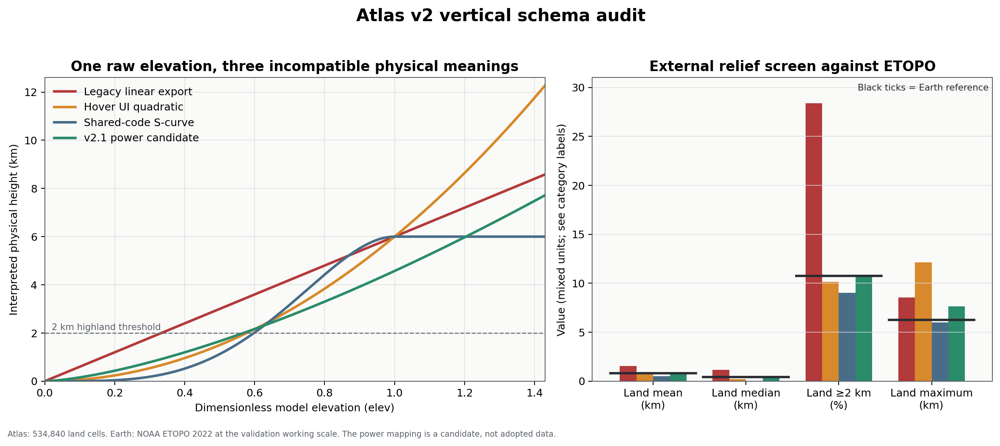
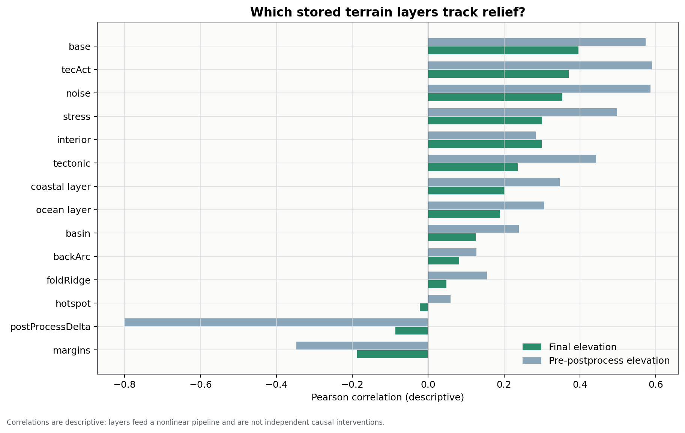
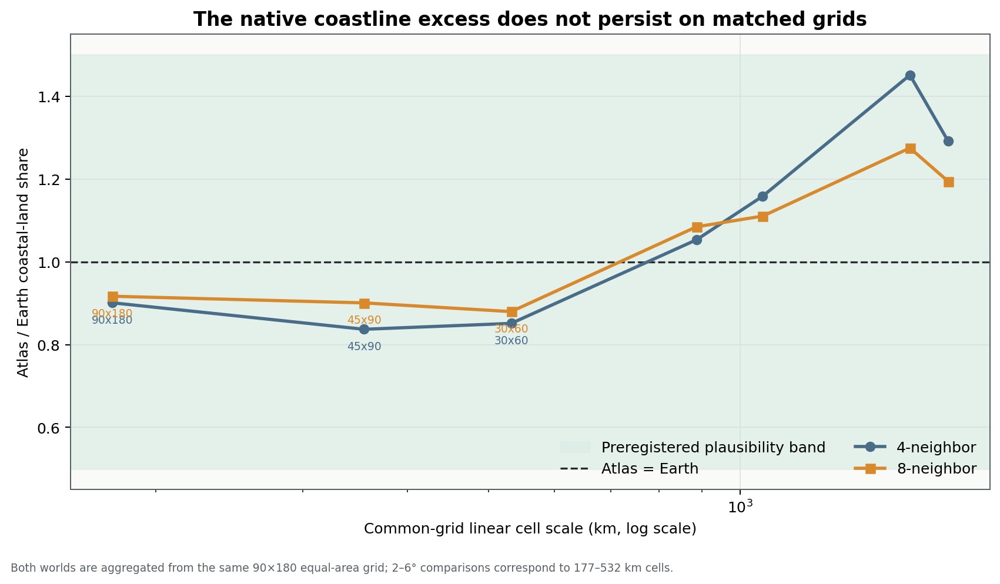
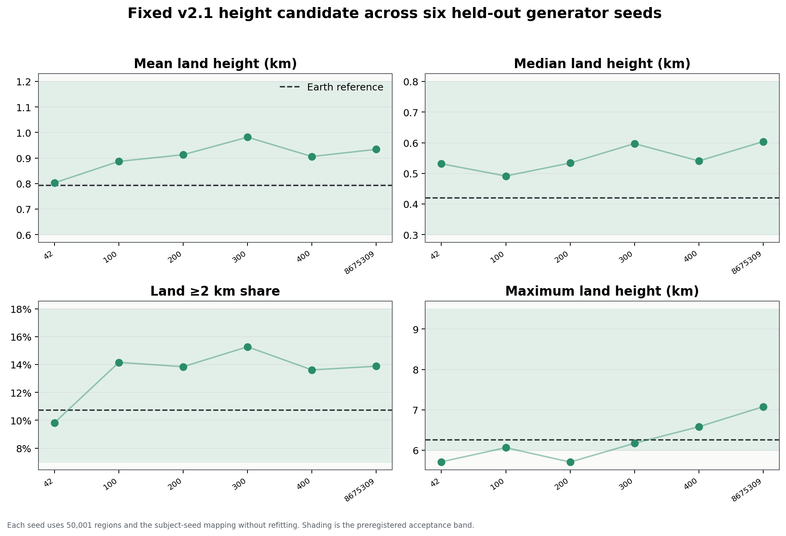

# Atlas v2 relief and coastline diagnostic

**Status:** completed diagnostic; v2.1 candidate only  
**Subject:** planet code `06cy8w6z6a89kow6psje93`, seed `10673275`  
**Dataset:** 2,560,001 cells, 534,840 land cells, 58 fields  
**Date:** 2026-07-19

## Executive decision

Do **not** tune uplift, erosion, roughness, smoothing, or terrain warp yet. The
first implementation required for Atlas v2.1 is a single canonical conversion
from dimensionless model elevation (`elev`) to physical height.

The earlier conclusion that Atlas v2 has excessively elevated continents is
not currently a valid generator-morphology diagnosis. It was computed from the
exported `elev_km` field, which uses a linear land conversion, while the
generator's physical consumers use a different S-curve and its hover UI uses a
third conversion. The same raw terrain therefore acquires three incompatible
physical meanings.

The earlier coastline concern is also not a robust trigger for terrain tuning.
Atlas has a larger native coastal-cell share than the 10-arc-minute Earth
working grid, but the excess disappears when both worlds use the same equal-area
topology at 2–6° resolution. At those matched scales Atlas/Earth ratios are
0.837–0.917, inside the preregistered 0.5–1.5 plausibility band.

Life modelling should remain paused. A changed height mapping propagates into
temperature, precipitation, wind pressure/orography, hydrology, terrain
classes, and every ecological suitability layer.

## What was audited

This diagnostic is read-only with respect to canonical Atlas v2. It used:

- all 13 corrected `orogen_regions_full_v2_part_*.csv.gz` files;
- the v2 metadata and SHA-256 manifest;
- the supplied generator snapshot and the current GitHub `main` branch;
- prior common-grid Atlas products;
- NOAA ETOPO 2022 v1 as the external relief/topology reference;
- WorldClim 2.1 only as the already-ingested empirical temperature benchmark;
- six held-out generator seeds at 50,001 regions each for a reduced-resolution
  portability screen.

All 13 v2 parts match their recorded byte sizes and SHA-256 hashes. IDs are
continuous, the header contains 58 fields, and the exact identity
`elev = prePost + postProcessDelta` holds with maximum floating-point
reconstruction error `2.22×10⁻¹⁶`.

## Finding 1 — the vertical physical schema is inconsistent

The connected GitHub repository confirms that the conflict is present on the
current `main` branch, not only in the attached snapshot:

| Consumer | Land conversion | Role |
|---|---:|---|
| [`docs/DATA_DICTIONARY_V2.md`](https://github.com/oWilsonBarbosa/0r063N/blob/main/docs/DATA_DICTIONARY_V2.md) | `6 × elev` | Declared exported `elev_km` |
| [`js/import-main.js`](https://github.com/oWilsonBarbosa/0r063N/blob/main/third_party/planet_heightmap_generation/js/import-main.js) | `6 × elev²` | Hover display |
| [`js/color-map.js`](https://github.com/oWilsonBarbosa/0r063N/blob/main/third_party/planet_heightmap_generation/js/color-map.js) | `6t⁴(5−4t)`, `t=min(elev,1)` | Shared renderer and physical consumers |
| [`js/terrain-metrics.js`](https://github.com/oWilsonBarbosa/0r063N/blob/main/third_party/planet_heightmap_generation/js/terrain-metrics.js) | raw cutoffs 0.21/0.31/0.40 | Bands labelled approximately 50/200/500 m |

The stored `elev_km` field reproduces the linear formula to export rounding
(maximum error `5.2×10⁻⁵ km`). The terrain-band metadata separately reproduces
the hard-coded raw thresholds to rounding (maximum share error `4.70×10⁻⁵`).
Both implementations are internally reproducible, but they are not mutually
compatible physical definitions.



### Consequence for the external relief verdict

| Height interpretation | Land mean (km) | Land median (km) | Land ≥2 km | Maximum (km) | Broad gate |
|---|---:|---:|---:|---:|---|
| Legacy linear export | 1.540 | 1.173 | 28.39% | 8.538 | HOLD |
| Hover UI quadratic | 0.678 | 0.229 | 10.16% | 12.149 | HOLD |
| Shared-code S-curve | 0.525 | 0.037 | 9.00% | 6.000 | HOLD |
| v2.1 power candidate | 0.768 | 0.421 | 10.74% | 7.662 | PASS |
| Earth reference | 0.794 | 0.421 | 10.74% | 6.259 | — |

The legacy mapping produces the apparent high-continent problem. The S-curve
reverses the diagnosis: the median becomes only 37 m and the mean falls below
the preregistered range. Thus the raw terrain has not yet been shown to be too
high or too low in physical units; the conversion itself must be made coherent
first.

Existing Atlas temperature is descriptively more compatible with the S-curve
than with the legacy field. In regressions of annual temperature on absolute
latitude and mapped height, R² rises from 0.767 (linear export) to 0.873
(S-curve). This is supporting consistency evidence, not an independent causal
validation; the code lineage itself establishes which mapping the temperature
routine calls.

## Finding 2 — post-processing is not simply inflating the continents

Across final land cells, `postProcessDelta` has:

- mean `−0.10784` raw units;
- median `−0.05559` raw units;
- a negative value in 67.15% of land cells.

The final land mask contains 42,366 cells that were not land at the `prePost`
snapshot and loses 19,383 pre-snapshot land cells; mask Jaccard similarity is
0.8886. The pipeline therefore redistributes shorelines while lowering land
elevation overall. It does not support a simple “post-processing lifts the
continents too much” explanation.

The strongest simple correlations with final raw elevation are `base` (0.396),
`tecAct` (0.370), `noise` (0.354), `stress` (0.300), and `interior` (0.300).
These are descriptive associations inside a nonlinear pipeline, not isolated
causal effects.



## Finding 3 — coastline realism is scale dependent

At native working scales, coastal land is 7.623% in Atlas versus 3.853% on the
four-neighbour Earth grid or 5.027% with eight neighbours. Those percentages
are not directly commensurable: Atlas uses a quasi-uniform spherical mesh with
approximately six neighbours, while Earth uses a regular raster.

Both surfaces were therefore classified and coarsened from the same 90×180
equal-area grid. Majority land was recomputed at every scale and coastline was
measured with the same neighbourhood on both worlds.

| Common grid | Approx. cell scale | 4-neighbour ratio | 8-neighbour ratio |
|---|---:|---:|---:|
| 90×180 | 177 km / ~2° | 0.901 | 0.917 |
| 45×90 | 355 km / ~4° | 0.837 | 0.901 |
| 30×60 | 532 km / ~6° | 0.851 | 0.880 |

All six prespecified 2–6° ratios pass. At much coarser scales, ratios cross 1
because the comparison becomes dominated by the number and global arrangement
of the four Atlas continents rather than small-scale coastline roughness.



**Decision:** retain `terrainWarp = 0.75`. A lower-warp sensitivity run reduces
native coastal share, but the matched-grid test already passes, so that
intervention has no validated target.

## v2.1 height candidate

The provisional land mapping is:

```text
height_km = 4.574236096629359 × elev^1.4622457219144074, for elev > 0
height_km = 10 × elev,                              for elev ≤ 0
```

Its two parameters were fitted to the Earth land median and the Earth share at
or above 2 km. The subject seed therefore supplies calibration evidence, not
validation evidence. It also passes broad checks on mean and maximum without
those quantities being fitted.

The formula was then frozen and applied without refitting to held-out seeds
`42`, `100`, `200`, `300`, `400`, and `8675309`, each at 50,001 regions. Mean
metrics across those seeds are 0.904 km mean height, 0.550 km median, 13.43% at
or above 2 km, and 6.220 km maximum. All four ensemble-mean gates pass.



This is enough to justify a full-resolution v2.1 candidate implementation. It
is not enough to declare a new generator default.

## Parameter decision

| Parameter | Current | Proposed | Decision |
|---|---:|---:|---|
| Terrain warp | 0.75 | 0.75 | No change |
| Roughness | 0.40 | 0.40 | No change |
| Smoothing | 0.10 | 0.10 | No change |
| Glacial erosion | 0.50 | 0.50 | No change |
| Hydraulic erosion | 0.50 | 0.50 | No change |
| Thermal erosion | 0.10 | 0.10 | No change |
| Ridge sharpening | 0.50 | 0.50 | No change |

The first v2.1 implementation is a schema-and-physics change:

1. preserve `elev` as the dimensionless primary model value;
2. rename the existing physical field to `elev_km_legacy_linear` rather than
   silently changing its semantics;
3. create one shared `elevToHeightKm` implementation and a canonical
   `elev_km` field;
4. store `heightMappingId`, scale, exponent, and formula in metadata;
5. make the renderer, hover UI, temperature, precipitation, wind, terrain
   metrics, hydrology, and atlas builders call that one implementation;
6. regenerate every height-dependent product before ecological modelling.

## What changes in primary and derived data

| Layer | v2 status | v2.1 implication |
|---|---|---|
| `elev` | Primary dimensionless output | Unchanged |
| Land/ocean mask and mesh geometry | Primary topology | Unchanged by height mapping; revalidate after full run |
| `elev_km` | Legacy linear interpretation | Preserve as explicitly legacy; do not treat as canonical physics |
| `prePost`, debug terrain components | Primary/intermediate diagnostics | Numerically unchanged; physical-height summaries must use the canonical mapping |
| `tS`, `tW` | Derived with shared-code S-curve | Regenerate under the candidate mapping |
| precipitation, wind pressure/orography | Height-dependent derived fields | Regenerate |
| hydrology, terrain classes, atlas relief products | Downstream derived products | Rebuild and externally revalidate |
| life/biome suitability | Not yet a stable scientific layer | Keep on hold until the physical stack is coherent |

## Acceptance gates for the full-resolution implementation

- land mean height: 0.6–1.2 km;
- land median height: 0.3–0.8 km;
- land share at or above 2 km: 7–18%;
- maximum land height: 6.0–9.5 km;
- common-grid coastal-share ratio: 0.5–1.5 at 2°, 4°, and 6°;
- at least five held-out seeds at 200,000 or more regions;
- no divergence among export, UI, climate, terrain metrics, and atlas code;
- renewed ETOPO and WorldClim validation after regeneration.

## Limitations

- Earth is a plausibility reference, not a requirement that the fictional
  world duplicate Earth.
- The power candidate uses two Earth targets and should be challenged with
  alternatives, not treated as uniquely correct.
- Held-out runs are reduced-resolution screens; resolution changes terrain and
  coastline statistics.
- Common-grid coastline tests measure cell adjacency, not fractal coastline
  length, geomorphic process, shelf bathymetry, or river-mouth structure.
- Terrain-component regressions are descriptive because the inputs interact
  nonlinearly and are not randomized interventions.
- Existing climate fields cannot validate a new height mapping without being
  regenerated; the current regression comparison is diagnostic only.

## Reproducibility and sources

Run from the workspace root:

```bash
node work/relief_calibration/bin/run_generator_ensemble.mjs
python3 work/relief_calibration/bin/run_relief_coast_diagnostic.py
python3 work/relief_calibration/bin/make_figures.py
python3 work/relief_calibration/tests/validate_relief_coast.py
```

External references:

- [NOAA ETOPO Global Relief Model](https://www.ncei.noaa.gov/products/etopo-global-relief-model),
  ETOPO 2022 v1 ice-surface elevation;
- [WorldClim 2.1 historical climate data](https://www.worldclim.org/data/worldclim21.html),
  monthly average temperature for 1970–2000;
- [Orogen repository](https://github.com/oWilsonBarbosa/0r063N), current `main`
  reconciled through the connected GitHub app on 2026-07-19.

Machine-readable results are in `outputs/relief_coast_diagnostic_results.json`;
the proposed change contract is in `outputs/v2_1_parameter_proposal.json`; and
the complete test ledger is in `outputs/diagnostic_ledger.csv`.
