# Physical Atlas of Planet `06cy8w6z6a89kow6psje93`

A natural-physical atlas derived from the [World Orogen](https://www.orogen.studio/#06cy8w6z6a89kow6psje93) full export (seed 10673275, 2,560,001 cells, 20.89 % land). Everything below is computed from the simulation data; hydrology (rivers, lakes, basins) and NPP are derived by this tool — see the method notes at the end.

## I. Relief & Hypsometry

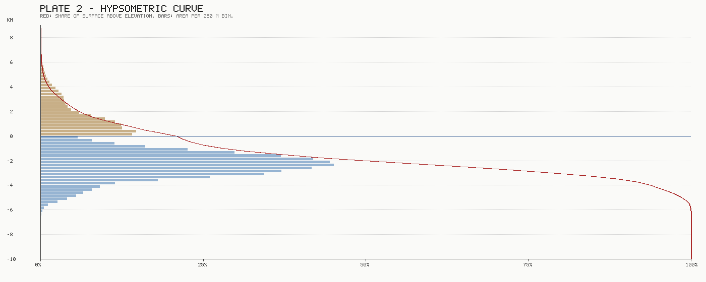

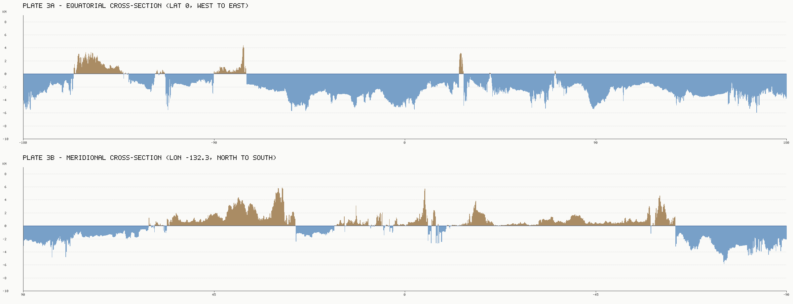

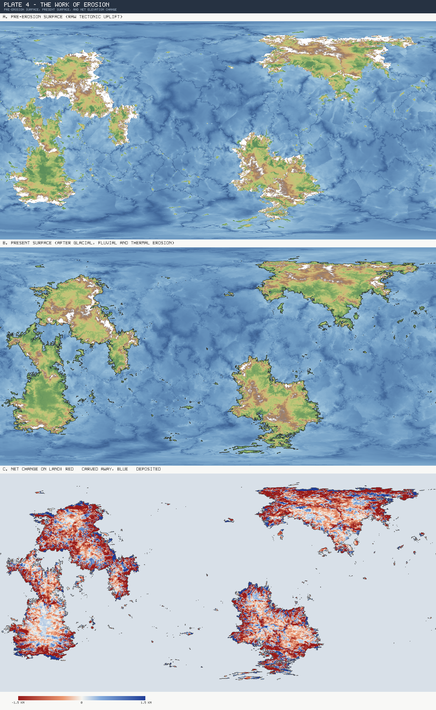

## II. Tectonics

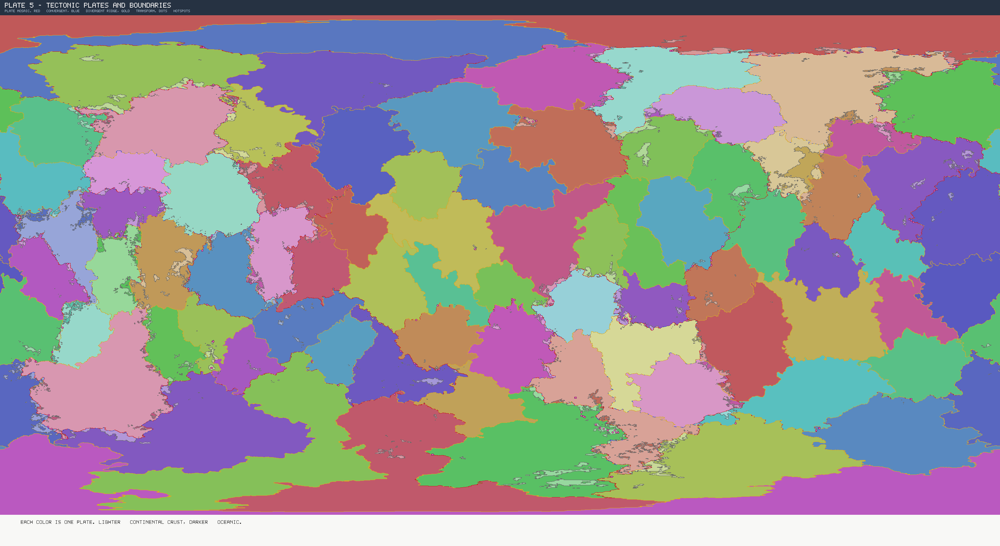

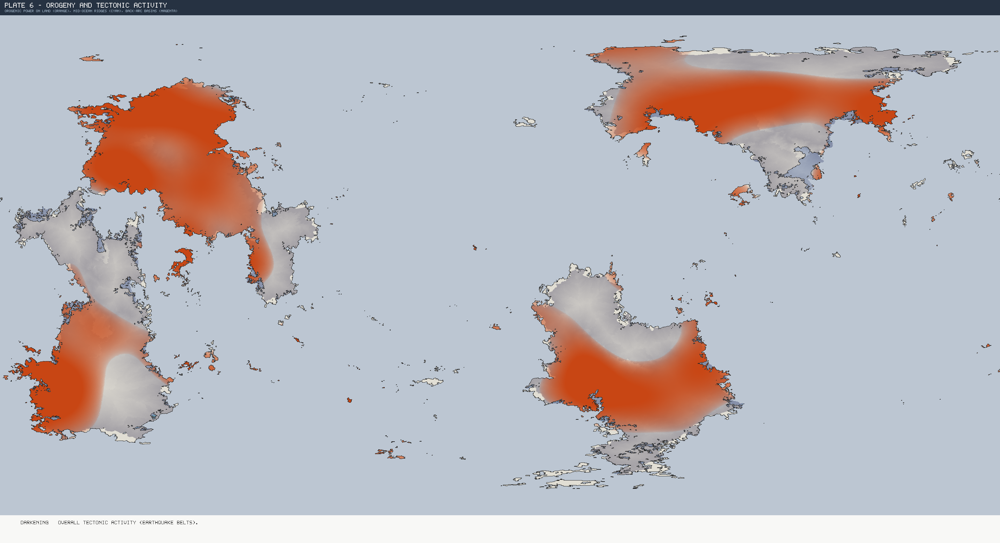

## III. Climate

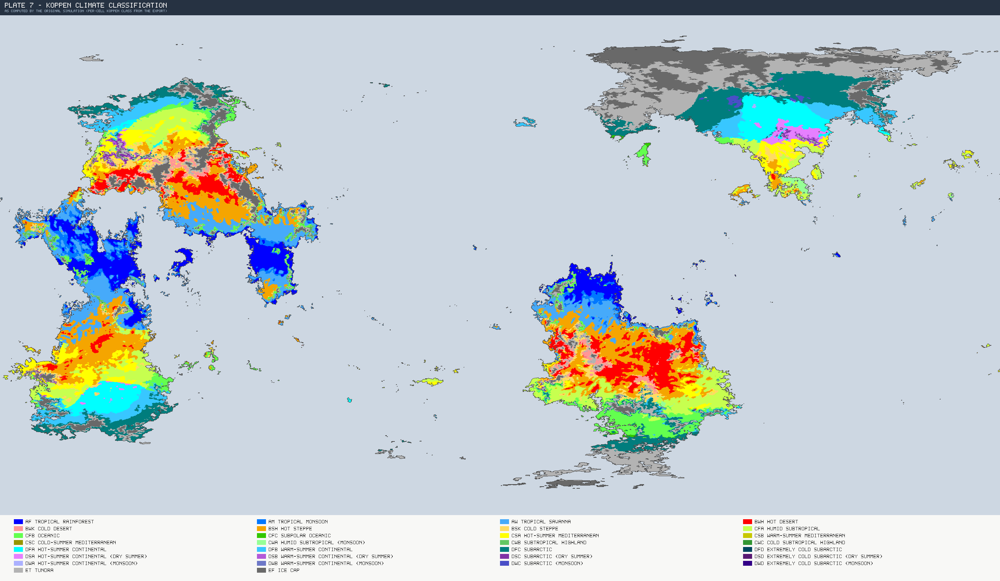

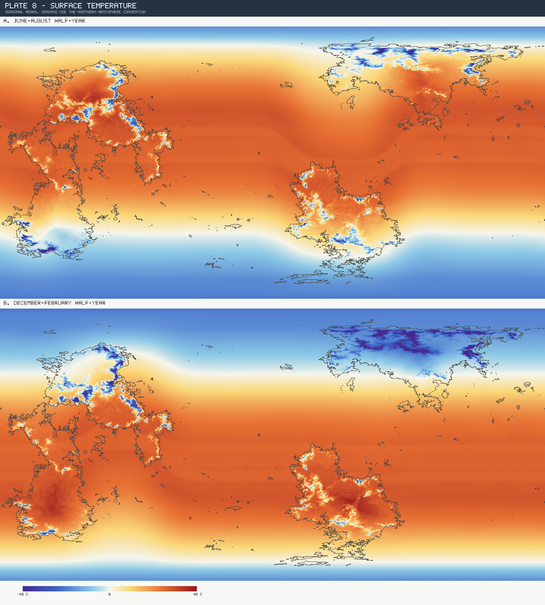

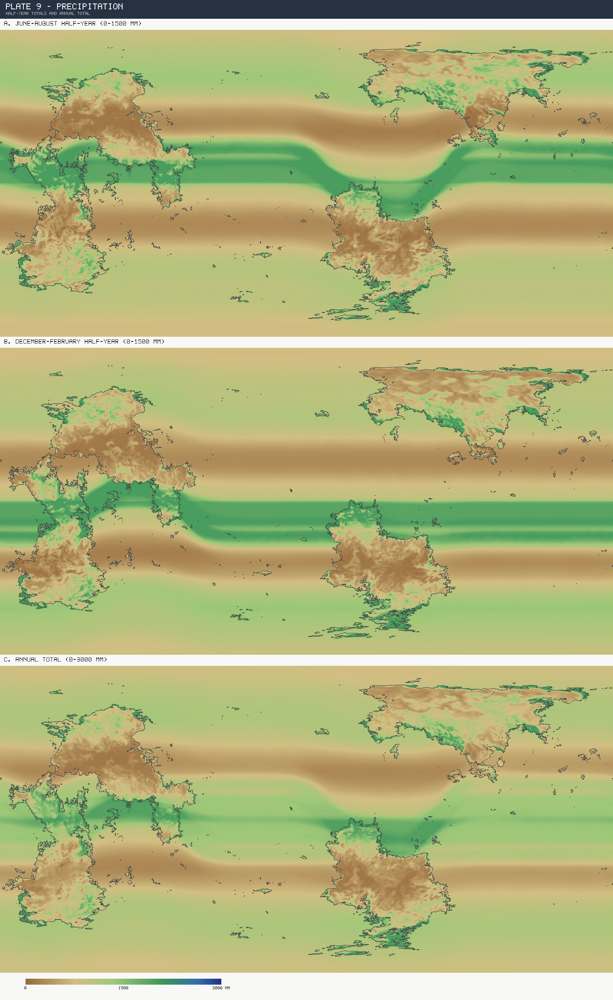

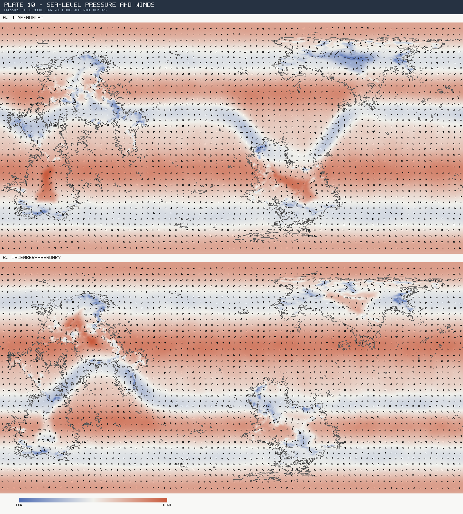

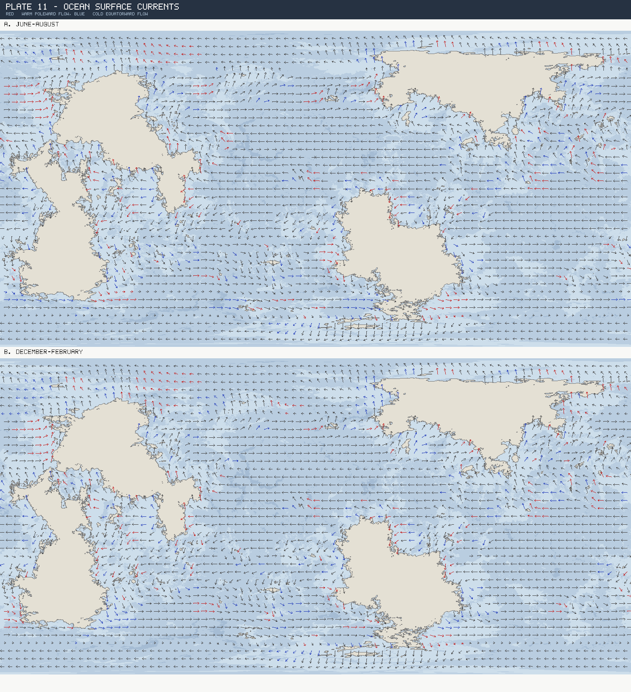

## IV. Hydrography

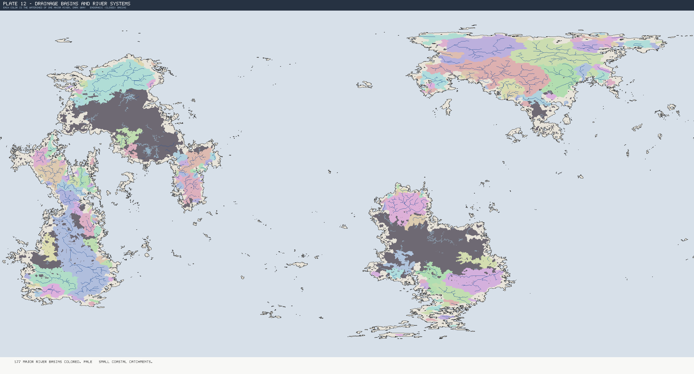

## V. Ecology

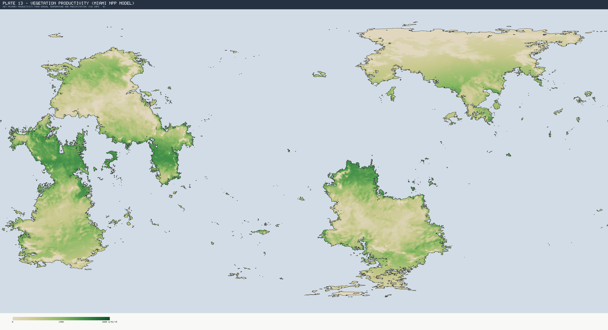

## VI. Planetary Records

| Record | Value | Where |
|---|---|---|
| Highest peak | 8.54 km | 28.6°N 130.4°W (Region 06) |
| Deepest trench | -9.28 km | 26.4°N 96.2°E (Region 09) |
| Hottest place (seasonal mean) | 38.1 °C | 37.6°S 51.8°E (Region 19) |
| Coldest place (seasonal mean) | -45.0 °C | 58.8°N 39.3°E (Region 04) |
| Wettest place | 2,000 mm/yr | 7.1°S 18.9°E (Region 14) |
| Driest place | 96 mm/yr | 39.9°S 59.5°E (Region 19) |
| Continents (≥ 3 M km²) | 4 | 28M km², 27M km², 27M km², 20M km² |
| Largest island | 372,877 km² | 1.5°N 114.3°W |
| Greatest river (discharge) | 2,034 km³/yr | mouth 53.6°N 68.2°E |
| Longest river (main stem) | 7,904 km | mouth 16.6°S 152.7°W |
| Largest freshwater lake | 206,614 km² | 34.0°S 145.7°W |
| Largest salt lake | 206,469 km² | 17.3°N 101.8°W |
| Major rivers planet-wide | 241 | ≥ 15 km³/yr at the mouth |
| Lakes ≥ 2,000 km² | 681 | 620 freshwater, 61 salt |

### The ten great rivers

| # | Discharge | Main stem | Mouth | Empties into |
|---|---|---|---|---|
| 1 | 2,034 km³/yr | 4,347 km | 53.6°N 68.2°E | sea |
| 2 | 1,484 km³/yr | 7,904 km | 16.6°S 152.7°W | sea |
| 3 | 1,397 km³/yr | 2,801 km | 67.4°N 132.8°E | sea |
| 4 | 1,363 km³/yr | 2,880 km | 56.9°N 131.4°W | sea |
| 5 | 1,353 km³/yr | 3,243 km | 11.7°S 40.8°E | sea |
| 6 | 834 km³/yr | 2,578 km | 12.4°N 153.2°W | sea |
| 7 | 703 km³/yr | 2,481 km | 69.9°N 51.7°E | sea |
| 8 | 621 km³/yr | 2,037 km | 52.9°N 119.8°E | sea |
| 9 | 597 km³/yr | 1,980 km | 5.7°S 85.4°W | sea |
| 10 | 456 km³/yr | 2,824 km | 5.3°S 135.7°W | sea |

### The ten great lakes

| # | Type | Area | Surface | Max. depth | Where |
|---|---|---|---|---|---|
| 1 | freshwater | 206,614 km² | 282 m | 207 m | 34.0°S 145.7°W |
| 2 | salt | 206,469 km² | 861 m | 590 m | 17.3°N 101.8°W |
| 3 | freshwater | 96,477 km² | 346 m | 183 m | 48.2°S 69.3°E |
| 4 | freshwater | 93,841 km² | 702 m | 235 m | 53.3°N 111.9°W |
| 5 | salt | 91,027 km² | 754 m | 272 m | 45.1°N 113.0°W |
| 6 | freshwater | 87,899 km² | 563 m | 317 m | 8.4°S 144.6°W |
| 7 | freshwater | 85,894 km² | 422 m | 307 m | 11.6°S 29.9°E |
| 8 | freshwater | 64,459 km² | 665 m | 222 m | 54.7°S 131.9°W |
| 9 | freshwater | 62,383 km² | 526 m | 229 m | 58.6°N 121.5°E |
| 10 | freshwater | 53,973 km² | 654 m | 209 m | 44.2°N 97.3°E |

## Method notes

- Rasterized at 0.125° from the 2.56 M-cell Fibonacci-sphere export; all areas are cos-latitude weighted.
- **Relief, erosion, tectonics, Köppen, temperature, precipitation, pressure, winds, currents** come directly from exported per-cell fields (`elev_km`, `prePost`, `plate`, `stress`, `foldRidge`, `backArc`, `hotspot`, `koppen`, `tS/tW`, `pS/pW`, `prS/prW` [pressure], `wind*`, `oc*`, `ow*`).
- **Hydrology** is derived: priority-flood depression filling, steepest-descent routing, Ol'dekop runoff, per-depression water balance (see the regional reports for details).
- **NPP** uses the Miami model: `min(3000/(1+e^(1.315−0.119T)), 3000(1−e^(−0.000664P)))` g/m²/yr, ice-corrected (Köppen-EF ice caps set to 0).
- Plate-boundary types on Plate 5 are heuristic: ridge field → divergent, high collision stress → convergent, otherwise transform.
- Seasons follow the northern-hemisphere convention (June vs December half-years).

Regenerate with: `node tools/regional-report/atlas-main.mjs`
