# Physical Atlas of Planet `06cy8w6z6a89kow6psje93`

A natural-physical atlas derived from the [World Orogen](https://www.orogen.studio/#06cy8w6z6a89kow6psje93) full export (seed 10673275, 2,560,001 cells, 20.89 % land). Everything below is computed from the simulation data; hydrology (rivers, lakes, basins) and NPP are derived by this tool — see the method notes at the end.

## I. Relief & Hypsometry

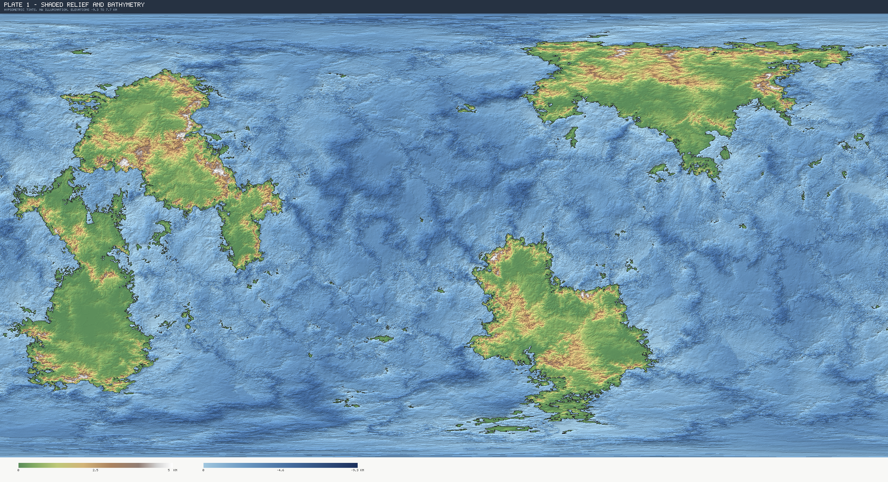

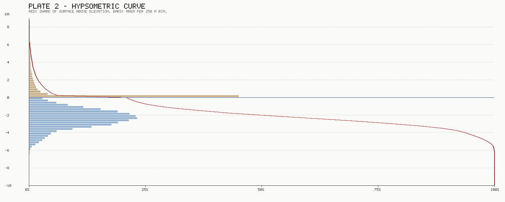

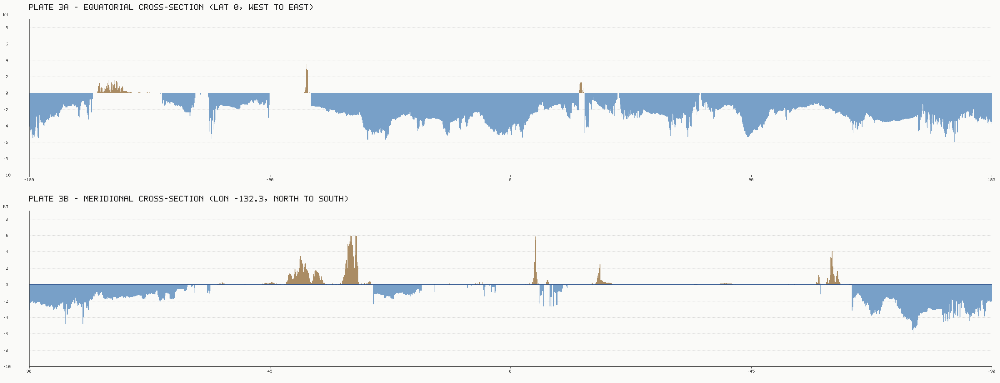

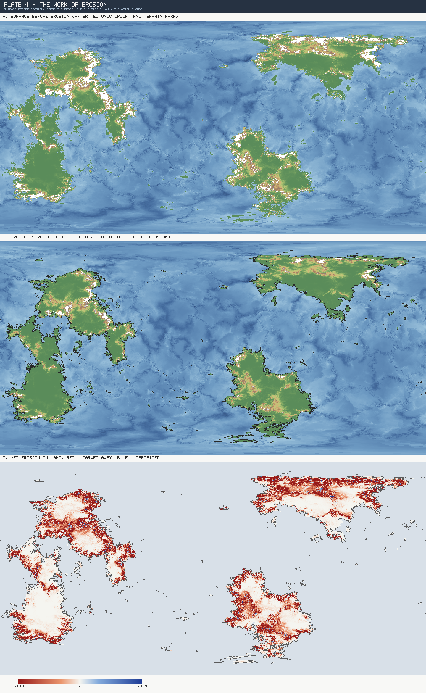

## II. Tectonics

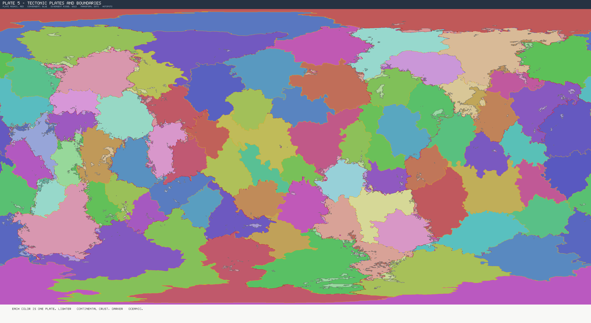

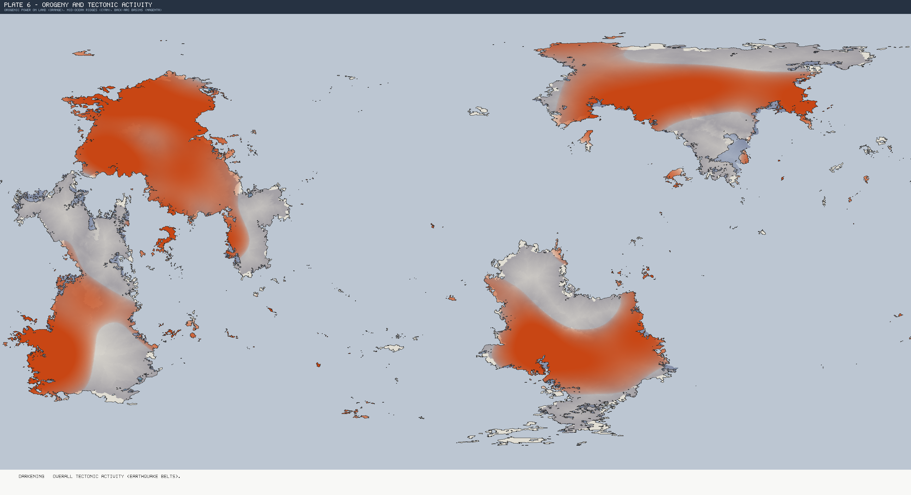

## III. Climate

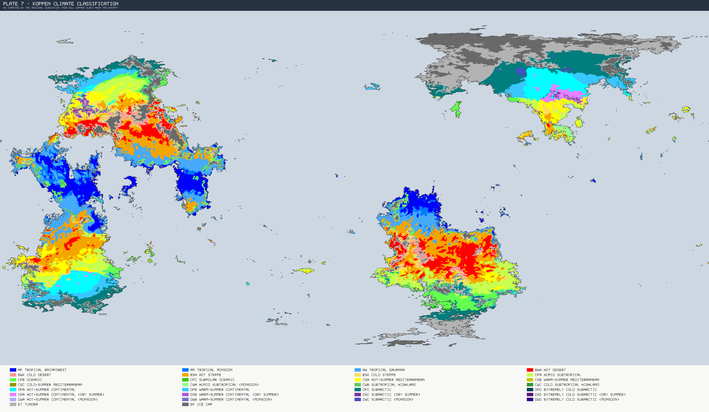

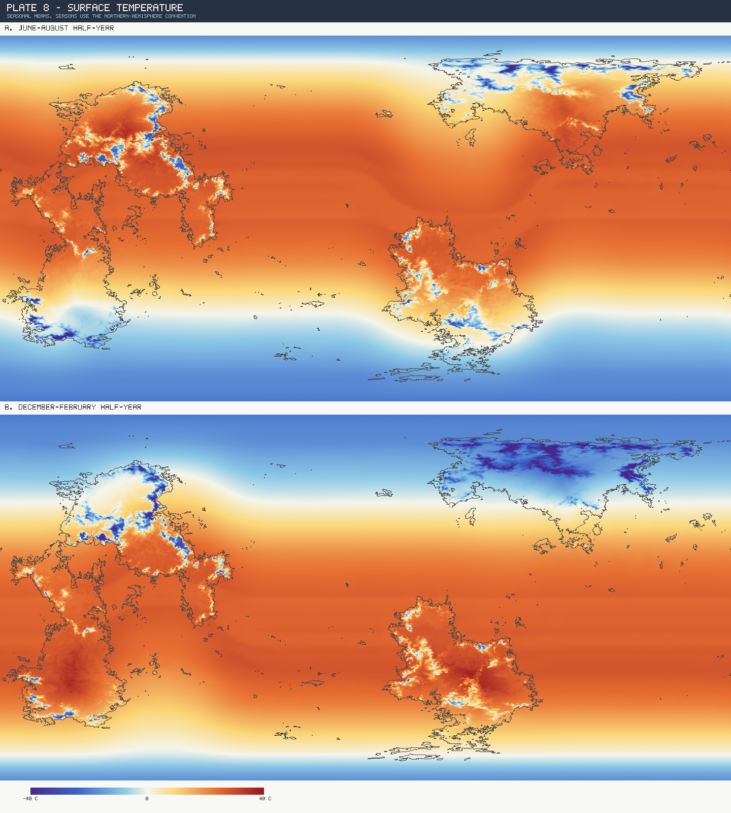

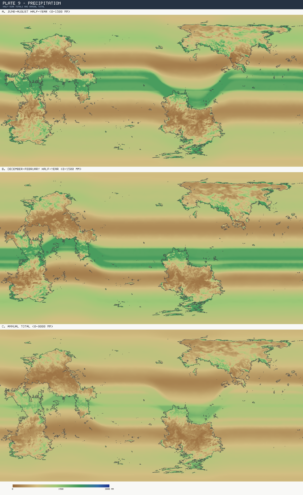

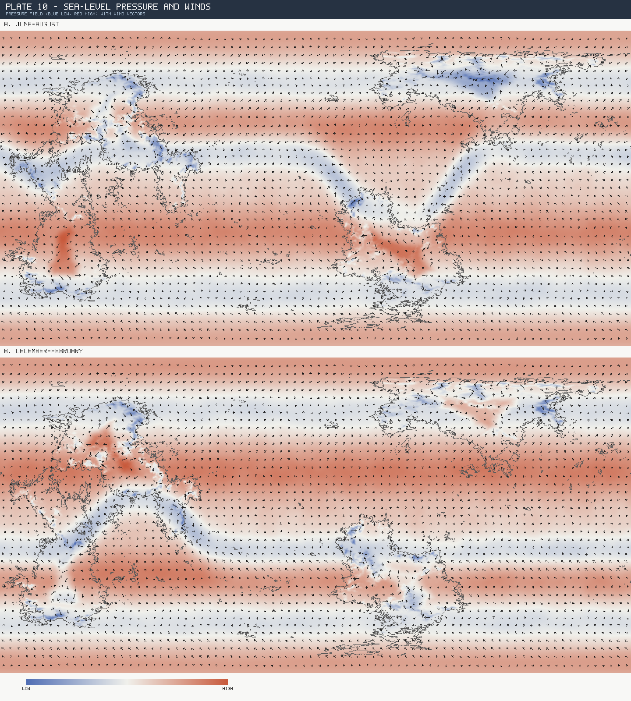

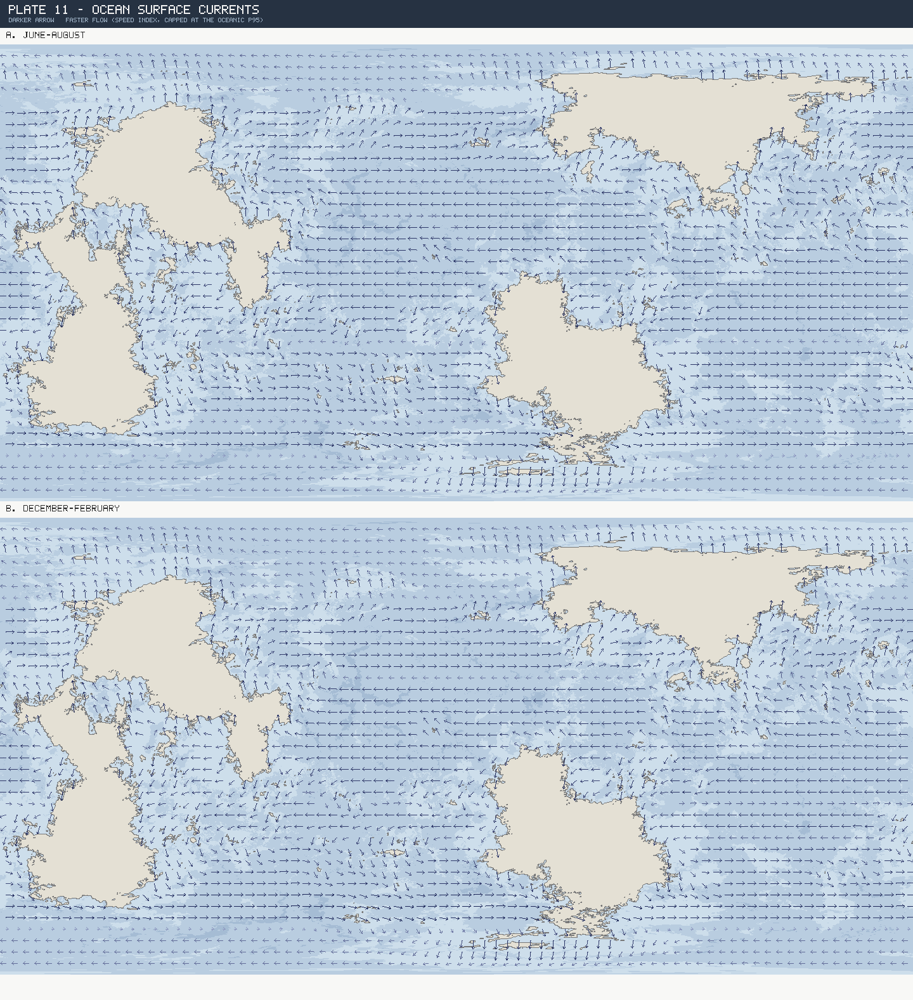

## IV. Hydrography

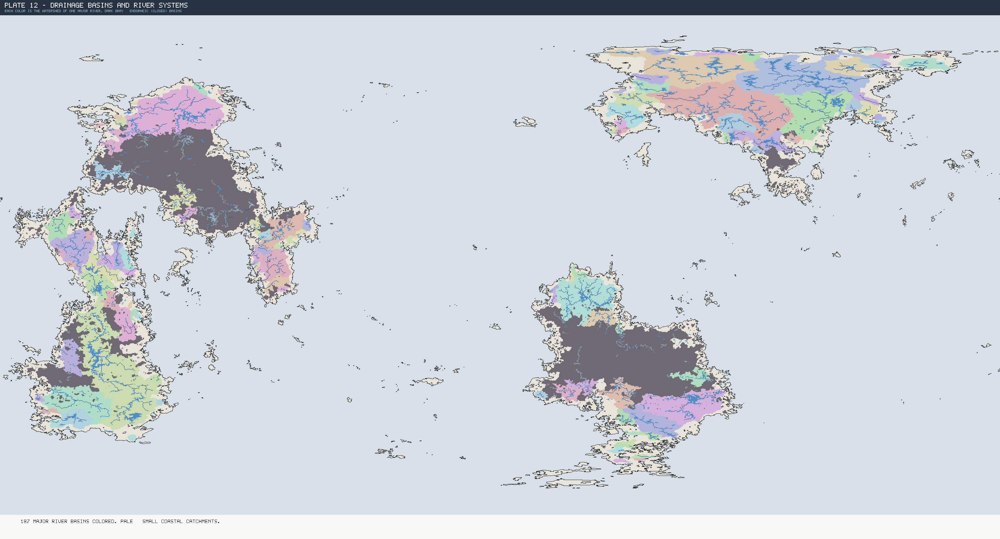

## V. Ecology

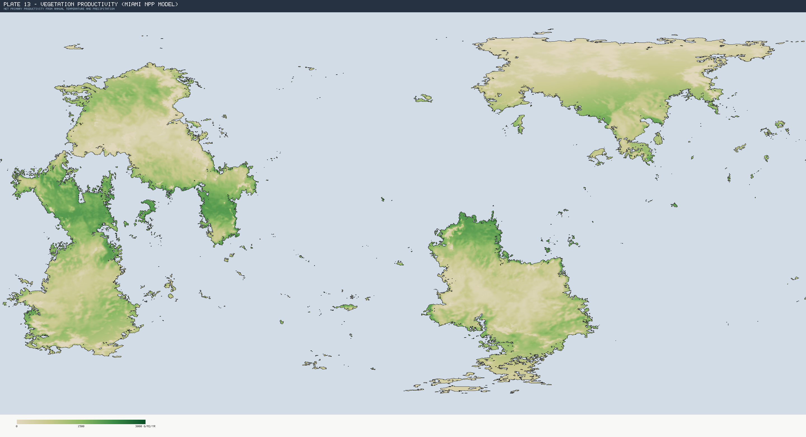

## VI. Planetary Records

| Record | Value | Where |
|---|---|---|
| Highest peak | 7.66 km | 28.6°N 130.4°W (Region 06) |
| Deepest trench | -9.28 km | 26.4°N 96.2°E (Region 09) |
| Hottest place (seasonal mean) | 38.1 °C | 37.6°S 51.8°E (Region 19) |
| Coldest place (seasonal mean) | -45.0 °C | 58.8°N 39.3°E (Region 04) |
| Wettest place | 1,677 mm/yr | 7.1°S 18.9°E (Region 14) |
| Driest place | 80 mm/yr | 39.9°S 59.5°E (Region 19) |
| Continents (≥ 3 M km²) | 4 | 28M km², 27M km², 27M km², 20M km² |
| Largest island | 372,877 km² | 1.5°N 114.3°W |
| Greatest river (discharge) | 1,545 km³/yr | mouth 53.6°N 68.2°E |
| Longest river (main stem) | 7,874 km | mouth 16.6°S 152.7°W |
| Largest freshwater lake | 206,614 km² | 34.0°S 145.7°W |
| Largest salt lake | 137,774 km² | 17.3°N 101.8°W |
| Major rivers planet-wide | 187 | ≥ 15 km³/yr at the mouth |
| Lakes ≥ 2,000 km² | 643 | 559 freshwater, 84 salt |

### The ten great rivers

| # | Discharge | Main stem | Mouth | Empties into |
|---|---|---|---|---|
| 1 | 1,545 km³/yr | 4,288 km | 53.6°N 68.2°E | sea |
| 2 | 1,116 km³/yr | 2,757 km | 67.4°N 132.8°E | sea |
| 3 | 1,047 km³/yr | 7,874 km | 16.6°S 152.7°W | sea |
| 4 | 968 km³/yr | 2,864 km | 56.9°N 131.4°W | sea |
| 5 | 925 km³/yr | 3,243 km | 11.7°S 40.8°E | sea |
| 6 | 571 km³/yr | 2,466 km | 69.9°N 51.7°E | sea |
| 7 | 565 km³/yr | 2,559 km | 12.4°N 153.2°W | sea |
| 8 | 450 km³/yr | 2,008 km | 52.9°N 119.8°E | sea |
| 9 | 409 km³/yr | 1,980 km | 5.7°S 85.4°W | sea |
| 10 | 319 km³/yr | 1,655 km | 49.6°N 77.9°E | sea |

### The ten great lakes

| # | Type | Area | Surface | Max. depth | Where |
|---|---|---|---|---|---|
| 1 | freshwater | 206,614 km² | 52 m | 45 m | 34.0°S 145.7°W |
| 2 | salt | 137,774 km² | 249 m | 200 m | 17.3°N 101.8°W |
| 3 | freshwater | 96,477 km² | 71 m | 47 m | 48.2°S 69.3°E |
| 4 | freshwater | 93,841 km² | 198 m | 89 m | 53.3°N 111.9°W |
| 5 | freshwater | 87,899 km² | 144 m | 101 m | 8.4°S 144.6°W |
| 6 | freshwater | 85,894 km² | 94 m | 80 m | 11.6°S 29.9°E |
| 7 | freshwater | 64,459 km² | 183 m | 82 m | 54.7°S 131.9°W |
| 8 | freshwater | 62,383 km² | 130 m | 74 m | 58.6°N 121.5°E |
| 9 | salt | 62,233 km² | 195 m | 80 m | 45.1°N 113.0°W |
| 10 | freshwater | 53,973 km² | 179 m | 77 m | 44.2°N 97.3°E |

## Method notes

- Rasterized at 0.125° from the 2.56 M-cell Fibonacci-sphere export; all areas are cos-latitude weighted.
- **Relief, erosion, tectonics, Köppen, temperature, precipitation, pressure, winds, currents** come directly from exported per-cell fields (`elev`, `eroD`, `plate`, `stress`, `foldRidge`, `backArc`, `hotspot`, `koppen`, `tS/tW`, `pS/pW`, `prS/prW` [pressure], `wind*`, `oc*`). Built from the corrected v2 export (`data/orogen_regions_full_v2/`).
- **Physical height in km** uses the repository's canonical Earth-fitted power mapping of `elev` (`4.574·elev^1.462`; land peaks ~7.7 km, Earth-plausible distribution). The stored `elev_km` column is the legacy linear mapping and is not used here. The generator's exported climate (temperature, Köppen, precipitation, winds) was computed on the generator's own internal profile and is preserved as published.
- `pS/pW`, `wsS/wsW`, and `ocSpeed*` are p95-normalized and capped at 1, so values at the cap are floors (≥ p95), not exact maxima; precipitation-mm figures in the wettest areas are lower bounds.
- **Hydrology** is derived: priority-flood depression filling, steepest-descent routing, Ol'dekop runoff, per-depression water balance (see the regional reports for details).
- **NPP** uses the Miami model: `min(3000/(1+e^(1.315−0.119T)), 3000(1−e^(−0.000664P)))` g/m²/yr.
- Plate-boundary types on Plate 5 are heuristic: ridge field → divergent, high collision stress → convergent, otherwise transform.
- Seasons follow the northern-hemisphere convention (June vs December half-years).

Regenerate with: `node tools/regional-report/atlas-main.mjs`
