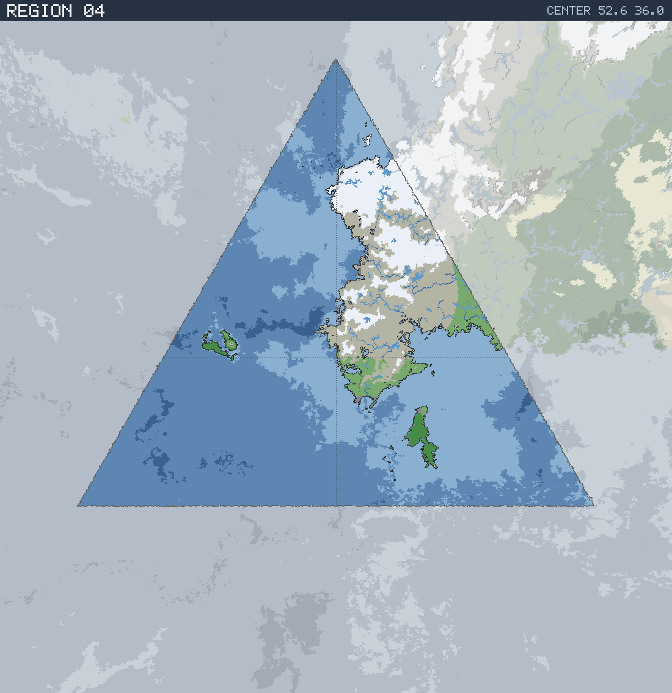

# Region 04 — Arctic coastline with offshore islands

Triangular face centered at 52.6°N 36.0°E · area 25,506,710 km² (1/20 of the planet).

*All percentages are area-weighted. Terrain colors are keyed in the [legend](../maps/legend.png).*

## At a Glance

| | |
|---|---|
| Hydrography | **Coastline with offshore islands** |
| Land share | 20.5 % (5,234,056 km²) |
| Dominant climate band | Arctic |
| Dominant terrain | Tundra |
| Mountain systems | 12 |
| Mean land temperature | 2.8 °C (Jun half-year) / -13.5 °C (Dec half-year) |
| Mean annual precipitation | 709 mm |

## Hydrography

Classified as **Coastline with offshore islands** (Table 15 vocabulary), based on:

- Land covers 20.5 % of the region.
- Largest land body: 4,927,572 km² (part of a larger landmass continuing into a neighboring region).
- 22 island(s) ≥ 600 km² fully inside the region; 1 landmass(es) of continental scale or continuing beyond the region's edges.
- 43,847 km² of enclosed (landlocked) water.

## Landforms

| System | Quadrant | Length × width | Trend | Peak | Mean elev. |
|---|---|---|---|---|---|
| 1 (39,817 km²) | NE | 820 × 183 km | NE-SW | 3.2 km at 59.1°N 39.1°E | 0.6 km |
| 2 (25,290 km²) | SE | 487 × 95 km | N-S | 1.8 km at 48.4°N 41.3°E | 0.6 km |
| 3 (20,465 km²) | SE | 362 × 69 km | N-S | 2.8 km at 52.2°N 52.2°E | 0.5 km |
| 4 (16,828 km²) | NE | 401 × 75 km | NE-SW | 4.3 km at 61.4°N 38.6°E | 1.0 km |
| 5 (12,733 km²) | NE | 390 × 68 km | NE-SW | 0.7 km at 67.2°N 48.2°E | 0.2 km |
| 6 (10,816 km²) | NW | 363 × 54 km | NE-SW | 2.4 km at 76.1°N 38.1°E | 0.5 km |
| 7 (10,741 km²) | NE | 235 × 72 km | NE-SW | 4.1 km at 75.4°N 71.6°E | 1.5 km |
| 8 (8,581 km²) | NE | 325 × 42 km | NE-SW | 1.8 km at 78.4°N 54.4°E | 0.4 km |

…plus 4 lesser system(s).

Relief of the land area:

| Lowlands (< 0.3 km) | Hills (0.3–0.8 km) | Highlands (0.8–2 km) | Mountains (> 2 km) |
|---|---|---|---|
| 38.0 % | 24.1 % | 29.5 % | 8.4 % |

## Climate

Climate-band composition of the land area (the book's five latitudinal bands, assigned from the simulated Köppen class of each cell):

| Tropical | Sub-tropical | Temperate | Sub-arctic | Arctic |
|---|---|---|---|---|
| 0.0 % | 0.0 % | 4.1 % | 15.5 % | 80.4 % |

Leading Köppen classes on land:

| Class | Type | Share of land |
|---|---|---|
| ET | Tundra | 49.8 % |
| EF | Ice cap | 30.6 % |
| Dfc | Subarctic | 14.1 % |
| Cfb | Oceanic | 3.1 % |
| Dfb | Warm-summer continental | 1.4 % |
| Cfc | Subpolar oceanic | 0.9 % |

## Prevailing Winds & Moisture

Wind direction is the direction the wind blows **from** (area-weighted mean over each quadrant); strength is relative to the planet-wide mean. "Variable" marks quadrants where the seasonal vectors largely cancel (monsoonal or convergence zones). Seasons follow the northern-hemisphere convention: "Jun" is the June–August half-year — southern-hemisphere summer is the Dec column.

| Quadrant | Jun wind | Dec wind | Land precip. | Regime | Rain shadow |
|---|---|---|---|---|---|
| NW | from NE, light, variable | from NE, light | 1,230 mm (year-round) | humid | 27 % of land |
| NE | from NW, strong, variable | from N, strong, variable | 629 mm (year-round) | sub-humid | — |
| SW | from SW, moderate | from SW, moderate | 1,168 mm (year-round) | humid | — |
| SE | from SW, moderate | from SW, moderate | 1,025 mm (year-round) | humid | 12 % of land |

A pronounced rain shadow affects the NW quadrant(s), leeward of the NE mountain system.

## Predominant Terrain

Terrain classes (Table 18 vocabulary) derived per cell from Köppen class, elevation and annual precipitation:

| Terrain | Share of land |
|---|---|
| Tundra | 49.8 % |
| Glacier | 30.6 % |
| Forest, light | 14.4 % |
| Forest, medium | 4.0 % |
| Marsh / swamp | 0.8 % |
| Moor | 0.3 % |

Notable expanses (largest contiguous areas):

- A forest of 388,049 km² in the SE quadrant.
- A glacier of 753,714 km² in the NE quadrant.

## Water Bodies

Enclosed below-sea-level seas (basins with no ocean outlet, almost certainly saline):

| Body | Kind | Area | Max. depth | Quadrant |
|---|---|---|---|---|
| 1 | great lake | 7,571 km² | 0.7 km | NE |
| 2 | great lake | 2,542 km² | 1.7 km | NE |

Lakes (computed hydrology — depressions in the terrain holding water above sea level):

| Lake | Type | Area | Surface elev. | Max. depth | Quadrant |
|---|---|---|---|---|---|
| 1 | freshwater (with outlet) | 18,284 km² | 183 m | 104 m | NE |
| 2 | freshwater (with outlet) | 14,377 km² | 626 m | 210 m | NE |
| 3 | freshwater (with outlet) | 11,190 km² | 25 m | 24 m | NE |
| 4 | freshwater (with outlet) | 10,111 km² | 213 m | 194 m | NE |
| 5 | freshwater (with outlet) | 8,598 km² | 1,105 m | 147 m | NE |
| 6 | freshwater (with outlet) | 8,552 km² | 28 m | 19 m | NE |
| 7 | freshwater (with outlet) | 8,133 km² | 422 m | 421 m | NE |
| 8 | freshwater (with outlet) | 6,881 km² | 24 m | 16 m | NE |
| 9 | freshwater (with outlet) | 6,821 km² | 397 m | 146 m | NE |
| 10 | freshwater (with outlet) | 6,284 km² | 1,802 m | 162 m | NE |

…plus 35 smaller lakes.

## Rivers

14 major river system(s) reach the sea (or a terminal lake) in this region — the book expects 4d6 for a typical region. Discharge is annual flow at the mouth; for scale, the Rhine carries ≈ 70 km³/yr and the Mississippi ≈ 580 km³/yr.

| River | Discharge | Main-stem length | Source | Mouth | Empties into |
|---|---|---|---|---|---|
| 1 | 1,471 km³/yr | 4,288 km | NE quadrant | NE, 53.6°N 68.2°E | sea |
| 2 | 550 km³/yr | 2,466 km | NE quadrant | NE, 69.9°N 51.7°E | sea |
| 3 | 191 km³/yr | 971 km | SE quadrant | NE, 53.2°N 44.2°E | sea |
| 4 | 171 km³/yr | 1,179 km | NE quadrant | NE, 57.2°N 54.6°E | sea |
| 5 | 116 km³/yr | 1,119 km | NE quadrant | NE, 65.8°N 47.7°E | sea |
| 6 | 111 km³/yr | 623 km | NE quadrant | NE, 54.4°N 62.2°E | sea |
| 7 | 61 km³/yr | 551 km | SE quadrant | SE, 46.7°N 42.3°E | sea |
| 8 | 44 km³/yr | 575 km | NE quadrant | NE, 68.1°N 47.8°E | sea |
| 9 | 33 km³/yr | 267 km | SE quadrant | NE, 52.4°N 43.4°E | sea |
| 10 | 33 km³/yr | 202 km | NE quadrant | NE, 56.2°N 58.6°E | sea |

…plus 4 lesser major rivers.

> **Method note.** Rivers and lakes are not part of the Orogen export; they are derived by this tool with standard terrain hydrology: priority-flood depression filling over the elevation raster, steepest-descent flow routing, runoff from annual precipitation minus temperature-driven evapotranspiration (Ol'dekop curve), and a per-depression water balance — humid basins fill to their spill point and drain onward (freshwater), arid basins shrink to the area where evaporation matches inflow (salt lakes). Below-sea-level enclosed seas come directly from the export's elevation field.
