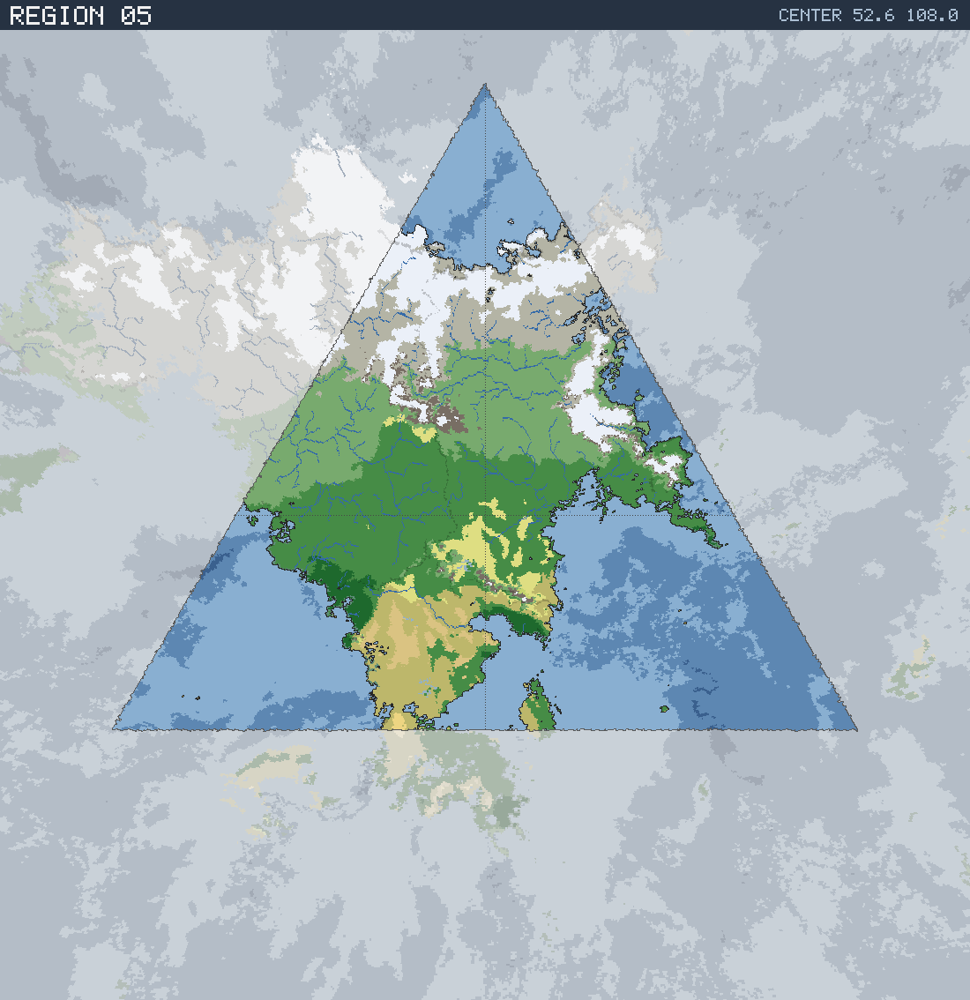

# Region 05 — Sub-arctic multiple coastlines

Triangular face centered at 52.6°N 108.0°E · area 25,500,540 km² (1/20 of the planet).

*All percentages are area-weighted. Terrain colors are keyed in the [legend](../maps/legend.png).*

## At a Glance

| | |
|---|---|
| Hydrography | **Multiple coastlines** |
| Land share | 54.9 % (13,996,110 km²) |
| Dominant climate band | Sub-arctic |
| Dominant terrain | Forest, medium |
| Mountain systems | 26 |
| Mean land temperature | 15.7 °C (Jun half-year) / -12.0 °C (Dec half-year) |
| Mean annual precipitation | 770 mm |

## Hydrography

Classified as **Multiple coastlines** (Table 15 vocabulary), based on:

- Land covers 54.9 % of the region.
- Largest land body: 13,701,076 km² (part of a larger landmass continuing into a neighboring region).
- 40 island(s) ≥ 600 km² fully inside the region; 4 landmass(es) of continental scale or continuing beyond the region's edges.
- 113,035 km² of enclosed (landlocked) water.

## Landforms

| System | Quadrant | Length × width | Trend | Peak | Mean elev. |
|---|---|---|---|---|---|
| 1 (79,017 km²) | NW | 1,337 × 214 km | E-W | 4.4 km at 75.8°N 104.1°E | 0.8 km |
| 2 (50,983 km²) | SW | 855 × 175 km | NE-SW | 2.3 km at 47.6°N 98.3°E | 1.0 km |
| 3 (47,141 km²) | NW | 1,002 × 147 km | N-S | 3.8 km at 61.6°N 94.8°E | 1.2 km |
| 4 (33,500 km²) | NE | 716 × 183 km | NW-SE | 3.7 km at 67.3°N 138.6°E | 0.8 km |
| 5 (29,528 km²) | SE | 576 × 82 km | E-W | 3.2 km at 43.8°N 113.6°E | 0.9 km |
| 6 (29,081 km²) | SW | 631 × 104 km | N-S | 2.9 km at 46.1°N 103.1°E | 1.1 km |
| 7 (24,145 km²) | NE | 586 × 232 km | E-W | 0.7 km at 76.7°N 136.8°E | 0.2 km |
| 8 (23,918 km²) | NW | 601 × 135 km | N-S | 3.8 km at 68.1°N 94.1°E | 2.1 km |

…plus 18 lesser system(s).

Relief of the land area:

| Lowlands (< 0.3 km) | Hills (0.3–0.8 km) | Highlands (0.8–2 km) | Mountains (> 2 km) |
|---|---|---|---|
| 43.0 % | 26.9 % | 20.6 % | 9.4 % |

## Climate

Climate-band composition of the land area (the book's five latitudinal bands, assigned from the simulated Köppen class of each cell):

| Tropical | Sub-tropical | Temperate | Sub-arctic | Arctic |
|---|---|---|---|---|
| 0.0 % | 14.7 % | 25.2 % | 34.5 % | 25.5 % |

Leading Köppen classes on land:

| Class | Type | Share of land |
|---|---|---|
| Dfc | Subarctic | 22.1 % |
| Dfa | Hot-summer continental | 17.5 % |
| ET | Tundra | 14.5 % |
| EF | Ice cap | 11.0 % |
| Dfb | Warm-summer continental | 10.0 % |
| Csa | Hot-summer Mediterranean | 7.9 % |

## Prevailing Winds & Moisture

Wind direction is the direction the wind blows **from** (area-weighted mean over each quadrant); strength is relative to the planet-wide mean. "Variable" marks quadrants where the seasonal vectors largely cancel (monsoonal or convergence zones). Seasons follow the northern-hemisphere convention: "Jun" is the June–August half-year — southern-hemisphere summer is the Dec column.

| Quadrant | Jun wind | Dec wind | Land precip. | Regime | Rain shadow |
|---|---|---|---|---|---|
| NW | from SSW, strong, variable | from ESE, strong, variable | 764 mm (year-round) | sub-humid | — |
| NE | from SE, strong, variable | from NNE, strong, variable | 847 mm (year-round) | sub-humid | — |
| SW | from WSW, moderate | from SW, moderate | 724 mm (year-round) | sub-humid | 18 % of land |
| SE | from SSE, moderate, variable | from SW, moderate | 658 mm (year-round) | sub-humid | — |

A pronounced rain shadow affects the SW quadrant(s), leeward of the NW mountain system.

## Predominant Terrain

Terrain classes (Table 18 vocabulary) derived per cell from Köppen class, elevation and annual precipitation:

| Terrain | Share of land |
|---|---|
| Forest, medium | 29.3 % |
| Forest, light | 23.8 % |
| Tundra | 12.6 % |
| Glacier | 11.0 % |
| Scrub / brushland | 9.0 % |
| Prairie | 7.6 % |
| Forest, heavy | 2.1 % |
| Barren | 1.9 % |
| Steppe | 1.8 % |
| Marsh / swamp | 0.5 % |
| Grassland / savanna | 0.2 % |

Notable expanses (largest contiguous areas):

- A forest of 6,928,426 km² in the NW quadrant.
- A grassland of 729,834 km² in the SE quadrant.
- A glacier of 1,025,896 km² in the NW quadrant.

## Water Bodies

Enclosed below-sea-level seas (basins with no ocean outlet, almost certainly saline):

| Body | Kind | Area | Max. depth | Quadrant |
|---|---|---|---|---|
| 1 | great lake | 10,652 km² | 0.3 km | SW |
| 2 | great lake | 9,666 km² | 1.1 km | NE |
| 3 | great lake | 8,588 km² | 3.6 km | NE |
| 4 | great lake | 7,018 km² | 5.2 km | NE |
| 5 | great lake | 5,975 km² | 0.9 km | NE |
| 6 | great lake | 4,713 km² | 0.6 km | SW |
| 7 | great lake | 3,480 km² | 1.0 km | NE |
| 8 | great lake | 2,626 km² | 0.6 km | NE |

…plus 4 smaller enclosed water bodies.

Lakes (computed hydrology — depressions in the terrain holding water above sea level):

| Lake | Type | Area | Surface elev. | Max. depth | Quadrant |
|---|---|---|---|---|---|
| 1 | freshwater (with outlet) | 62,383 km² | 130 m | 74 m | NE |
| 2 | freshwater (with outlet) | 53,973 km² | 179 m | 77 m | SW |
| 3 | freshwater (with outlet) | 43,018 km² | 169 m | 147 m | NE |
| 4 | freshwater (with outlet) | 40,611 km² | 1,538 m | 339 m | NW |
| 5 | freshwater (with outlet) | 38,074 km² | 1,031 m | 429 m | NW |
| 6 | freshwater (with outlet) | 36,717 km² | 85 m | 37 m | SW |
| 7 | freshwater (with outlet) | 35,724 km² | 168 m | 121 m | NE |
| 8 | freshwater (with outlet) | 35,312 km² | 899 m | 327 m | NW |
| 9 | freshwater (with outlet) | 31,926 km² | 171 m | 162 m | SW |
| 10 | freshwater (with outlet) | 21,259 km² | 168 m | 118 m | NE |

…plus 109 smaller lakes.

## Rivers

25 major river system(s) reach the sea (or a terminal lake) in this region — the book expects 4d6 for a typical region. Discharge is annual flow at the mouth; for scale, the Rhine carries ≈ 70 km³/yr and the Mississippi ≈ 580 km³/yr.

| River | Discharge | Main-stem length | Source | Mouth | Empties into |
|---|---|---|---|---|---|
| 1 | 1,116 km³/yr | 2,757 km | NW quadrant | NE, 67.4°N 132.8°E | sea |
| 2 | 450 km³/yr | 2,008 km | NW quadrant | NE, 52.9°N 119.8°E | sea |
| 3 | 319 km³/yr | 1,655 km | SW quadrant | NW, 49.6°N 77.9°E | sea |
| 4 | 192 km³/yr | 655 km | NE quadrant | NE, 69.8°N 130.6°E | sea |
| 5 | 182 km³/yr | 894 km | SW quadrant | SW, 44.1°N 83.2°E | sea |
| 6 | 151 km³/yr | 1,177 km | NE quadrant | NE, 53.3°N 121.8°E | sea |
| 7 | 138 km³/yr | 438 km | NE quadrant | NE, 54.8°N 127.8°E | sea |
| 8 | 69 km³/yr | 1,818 km | SW quadrant | SW, 41.7°N 105.8°E | sea |
| 9 | 62 km³/yr | 499 km | NE quadrant | NE, 55.8°N 127.6°E | sea |
| 10 | 50 km³/yr | 615 km | NE quadrant | NE, 58.1°N 136.6°E | sea |

…plus 15 lesser major rivers.

> **Method note.** Rivers and lakes are not part of the Orogen export; they are derived by this tool with standard terrain hydrology: priority-flood depression filling over the elevation raster, steepest-descent flow routing, runoff from annual precipitation minus temperature-driven evapotranspiration (Ol'dekop curve), and a per-depression water balance — humid basins fill to their spill point and drain onward (freshwater), arid basins shrink to the area where evaporation matches inflow (salt lakes). Below-sea-level enclosed seas come directly from the export's elevation field.
