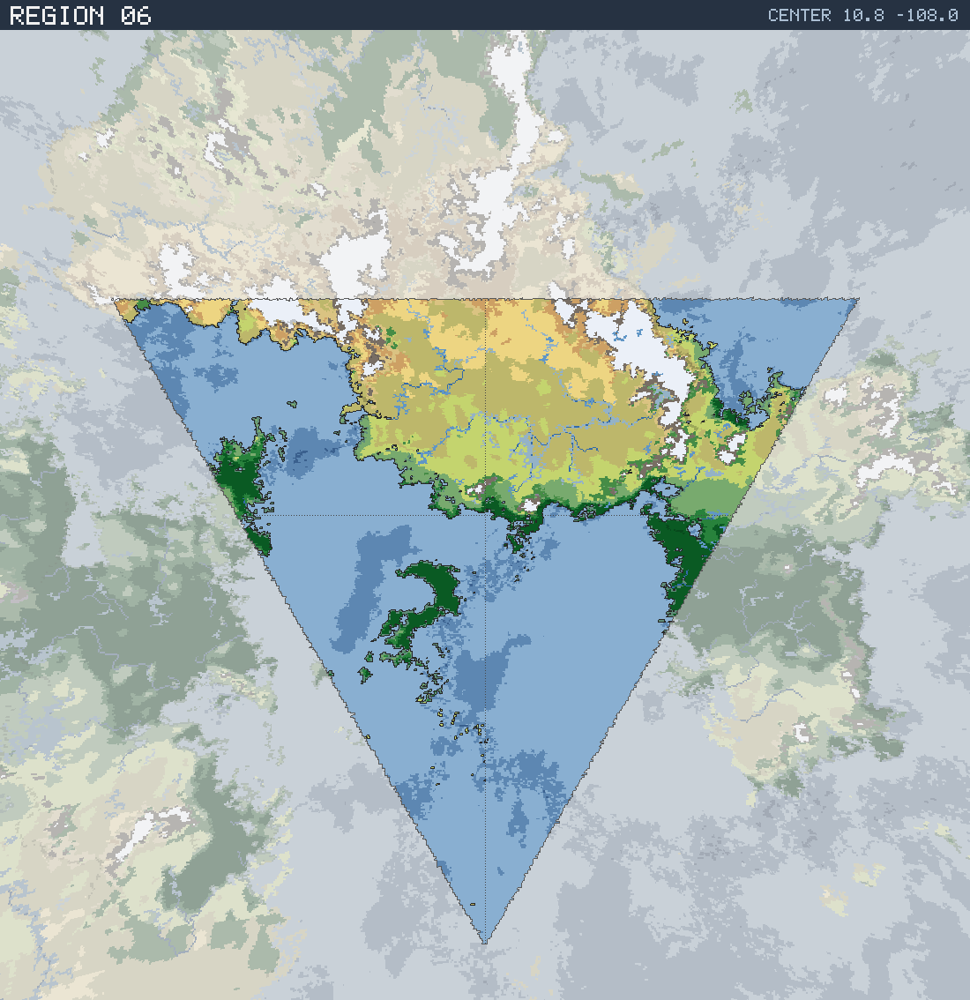

# Region 06 — Sub-tropical multiple coastlines

Triangular face centered at 10.8°N 108.0°W · area 25,506,342 km² (1/20 of the planet).

*All percentages are area-weighted. Terrain colors are keyed in the [legend](../maps/legend.png).*

## At a Glance

| | |
|---|---|
| Hydrography | **Multiple coastlines** |
| Land share | 40.5 % (10,332,045 km²) |
| Dominant climate band | Sub-tropical |
| Dominant terrain | Scrub / brushland |
| Mountain systems | 19 |
| Mean land temperature | 22.1 °C (Jun half-year) / 19.4 °C (Dec half-year) |
| Mean annual precipitation | 639 mm |

## Hydrography

Classified as **Multiple coastlines** (Table 15 vocabulary), based on:

- Land covers 40.5 % of the region.
- Largest land body: 9,459,443 km² (part of a larger landmass continuing into a neighboring region).
- 41 island(s) ≥ 600 km² fully inside the region; 4 landmass(es) of continental scale or continuing beyond the region's edges.
- 138,178 km² of enclosed (landlocked) water.

## Landforms

| System | Quadrant | Length × width | Trend | Peak | Mean elev. |
|---|---|---|---|---|---|
| 1 (96,071 km²) | NE | 1,548 × 275 km | E-W | 4.3 km at 11.9°N 102.3°W | 0.7 km |
| 2 (85,248 km²) | NE | 1,114 × 261 km | N-S | 5.2 km at 21.8°N 87.3°W | 1.3 km |
| 3 (84,635 km²) | NW | 1,457 × 437 km | E-W | 6.5 km at 28.2°N 128.9°W | 1.6 km |
| 4 (34,758 km²) | NE | 569 × 97 km | N-S | 4.3 km at 26.4°N 89.4°W | 1.3 km |
| 5 (30,793 km²) | NE | 661 × 104 km | NE-SW | 2.3 km at 14.7°N 89.7°W | 0.6 km |
| 6 (29,743 km²) | NW | 958 × 234 km | E-W | 5.0 km at 27.3°N 138.1°W | 0.7 km |
| 7 (23,183 km²) | NW | 610 × 112 km | E-W | 1.5 km at 16.4°N 120.4°W | 0.4 km |
| 8 (19,654 km²) | SE | 362 × 108 km | E-W | 1.2 km at 8.7°N 89.7°W | 0.4 km |

…plus 11 lesser system(s).

Relief of the land area:

| Lowlands (< 0.3 km) | Hills (0.3–0.8 km) | Highlands (0.8–2 km) | Mountains (> 2 km) |
|---|---|---|---|
| 28.2 % | 37.1 % | 19.8 % | 14.9 % |

## Climate

Climate-band composition of the land area (the book's five latitudinal bands, assigned from the simulated Köppen class of each cell):

| Tropical | Sub-tropical | Temperate | Sub-arctic | Arctic |
|---|---|---|---|---|
| 38.8 % | 41.7 % | 7.4 % | 0.0 % | 12.0 % |

Leading Köppen classes on land:

| Class | Type | Share of land |
|---|---|---|
| BSh | Hot steppe | 29.5 % |
| Aw | Tropical savanna | 24.5 % |
| BWh | Hot desert | 12.0 % |
| Af | Tropical rainforest | 11.3 % |
| EF | Ice cap | 7.8 % |
| ET | Tundra | 4.2 % |

## Prevailing Winds & Moisture

Wind direction is the direction the wind blows **from** (area-weighted mean over each quadrant); strength is relative to the planet-wide mean. "Variable" marks quadrants where the seasonal vectors largely cancel (monsoonal or convergence zones). Seasons follow the northern-hemisphere convention: "Jun" is the June–August half-year — southern-hemisphere summer is the Dec column.

| Quadrant | Jun wind | Dec wind | Land precip. | Regime | Rain shadow |
|---|---|---|---|---|---|
| NW | from WNW, strong, variable | from NNE, strong, variable | 549 mm (year-round) | sub-humid | — |
| NE | from E, strong, variable | from ENE, strong, variable | 540 mm (year-round) | sub-humid | — |
| SW | from S, light | from E, moderate | 1,485 mm (year-round) | humid | — |
| SE | from S, light | from S, light | 1,571 mm (year-round) | humid | — |

## Predominant Terrain

Terrain classes (Table 18 vocabulary) derived per cell from Köppen class, elevation and annual precipitation:

| Terrain | Share of land |
|---|---|
| Scrub / brushland | 29.7 % |
| Grassland / savanna | 15.3 % |
| Desert, sandy | 10.2 % |
| Jungle, heavy | 9.2 % |
| Forest, light | 8.3 % |
| Glacier | 7.8 % |
| Barren | 4.1 % |
| Marsh / swamp | 4.1 % |
| Desert, rocky | 3.3 % |
| Forest, medium | 2.8 % |
| Steppe | 2.8 % |
| Jungle, medium | 2.3 % |

Notable expanses (largest contiguous areas):

- A desert of 1,026,894 km² in the NE quadrant.
- A jungle of 341,611 km² in the SE quadrant.
- A forest of 288,844 km² in the NW quadrant.
- A grassland of 1,084,004 km² in the NE quadrant.
- A glacier of 459,563 km² in the NE quadrant.

## Water Bodies

Enclosed below-sea-level seas (basins with no ocean outlet, almost certainly saline):

| Body | Kind | Area | Max. depth | Quadrant |
|---|---|---|---|---|
| 1 | great lake | 31,837 km² | 3.8 km | NE |
| 2 | great lake | 14,326 km² | 3.4 km | SE |
| 3 | great lake | 7,112 km² | 3.5 km | SE |
| 4 | great lake | 6,662 km² | 2.9 km | SE |
| 5 | great lake | 5,989 km² | 0.4 km | SW |
| 6 | great lake | 4,363 km² | 2.7 km | NE |
| 7 | great lake | 4,057 km² | 0.4 km | SW |
| 8 | great lake | 3,551 km² | 0.8 km | NW |

…plus 1 smaller enclosed water bodies.

Lakes (computed hydrology — depressions in the terrain holding water above sea level):

| Lake | Type | Area | Surface elev. | Max. depth | Quadrant |
|---|---|---|---|---|---|
| 1 | salt (no outlet) | 137,774 km² | 249 m | 200 m | NE |
| 2 | salt (no outlet) | 35,386 km² | 290 m | 39 m | NE |
| 3 | salt (no outlet) | 19,738 km² | 2,110 m | 840 m | NE |
| 4 | freshwater (with outlet) | 17,172 km² | 128 m | 119 m | NW |
| 5 | freshwater (with outlet) | 13,800 km² | 103 m | 91 m | NW |
| 6 | salt (no outlet) | 12,926 km² | 280 m | 26 m | NE |
| 7 | freshwater (with outlet) | 11,359 km² | 191 m | 51 m | NW |
| 8 | salt (no outlet) | 10,689 km² | 167 m | 31 m | NE |
| 9 | salt (no outlet) | 9,534 km² | 347 m | 53 m | NW |
| 10 | freshwater (with outlet) | 8,200 km² | 177 m | 145 m | NW |

…plus 35 smaller lakes.

## Rivers

40 major river system(s) reach the sea (or a terminal lake) in this region — the book expects 4d6 for a typical region. Discharge is annual flow at the mouth; for scale, the Rhine carries ≈ 70 km³/yr and the Mississippi ≈ 580 km³/yr.

| River | Discharge | Main-stem length | Source | Mouth | Empties into |
|---|---|---|---|---|---|
| 1 | 218 km³/yr | 2,520 km | NE quadrant | SE, 7.7°N 86.9°W | sea |
| 2 | 201 km³/yr | 3,472 km | NE quadrant | NW, 17.1°N 115.2°W | sea |
| 3 | 181 km³/yr | 2,234 km | NE quadrant | NE, 20.3°N 106.7°W | salt lake |
| 4 | 179 km³/yr | 2,131 km | NE quadrant | NE, 20.3°N 105.8°W | salt lake |
| 5 | 178 km³/yr | 2,028 km | NE quadrant | NE, 20.6°N 104.9°W | salt lake |
| 6 | 177 km³/yr | 1,878 km | NE quadrant | NE, 20.4°N 103.6°W | salt lake |
| 7 | 177 km³/yr | 1,751 km | NE quadrant | NE, 19.7°N 103.2°W | salt lake |
| 8 | 148 km³/yr | 1,671 km | NE quadrant | NE, 19.1°N 103.2°W | salt lake |
| 9 | 111 km³/yr | 1,594 km | NE quadrant | NE, 18.6°N 102.7°W | salt lake |
| 10 | 105 km³/yr | 1,349 km | NE quadrant | NE, 18.4°N 101.1°W | salt lake |

…plus 30 lesser major rivers.

> **Method note.** Rivers and lakes are not part of the Orogen export; they are derived by this tool with standard terrain hydrology: priority-flood depression filling over the elevation raster, steepest-descent flow routing, runoff from annual precipitation minus temperature-driven evapotranspiration (Ol'dekop curve), and a per-depression water balance — humid basins fill to their spill point and drain onward (freshwater), arid basins shrink to the area where evaporation matches inflow (salt lakes). Below-sea-level enclosed seas come directly from the export's elevation field.
