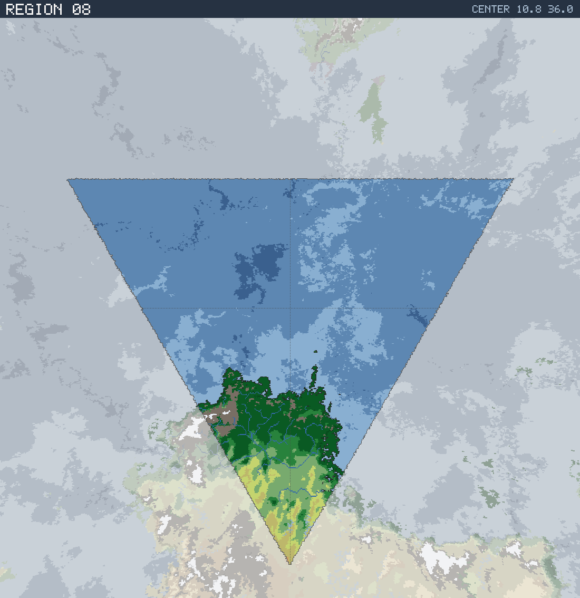

# Region 08 — Tropical coastline with offshore islands

Triangular face centered at 10.8°N 36.0°E · area 25,502,757 km² (1/20 of the planet).

*All percentages are area-weighted. Terrain colors are keyed in the [legend](../maps/legend.png).*

## At a Glance

| | |
|---|---|
| Hydrography | **Coastline with offshore islands** |
| Land share | 15.9 % (4,059,794 km²) |
| Dominant climate band | Tropical |
| Dominant terrain | Jungle, heavy |
| Mountain systems | 10 |
| Mean land temperature | 25.1 °C (Jun half-year) / 25.1 °C (Dec half-year) |
| Mean annual precipitation | 1,441 mm |

## Hydrography

Classified as **Coastline with offshore islands** (Table 15 vocabulary), based on:

- Land covers 15.9 % of the region.
- Largest land body: 4,023,910 km² (part of a larger landmass continuing into a neighboring region).
- 6 island(s) ≥ 600 km² fully inside the region; 1 landmass(es) of continental scale or continuing beyond the region's edges.
- 42,587 km² of enclosed (landlocked) water.

## Landforms

| System | Quadrant | Length × width | Trend | Peak | Mean elev. |
|---|---|---|---|---|---|
| 1 (63,983 km²) | SW | 996 × 174 km | NE-SW | 5.2 km at 6.3°S 22.2°E | 1.9 km |
| 2 (31,849 km²) | SE | 424 × 206 km | NE-SW | 2.7 km at 15.4°S 42.9°E | 0.8 km |
| 3 (31,279 km²) | SE | 466 × 118 km | NE-SW | 4.2 km at 8.6°S 42.8°E | 1.5 km |
| 4 (17,730 km²) | SW | 518 × 79 km | E-W | 4.4 km at 4.6°S 32.6°E | 1.2 km |
| 5 (11,230 km²) | SE | 245 × 88 km | E-W | 1.8 km at 17.9°S 41.2°E | 0.7 km |
| 6 (10,415 km²) | SE | 175 × 88 km | N-S | 1.8 km at 11.3°S 40.7°E | 0.6 km |
| 7 (9,252 km²) | SW | 148 × 68 km | E-W | 2.7 km at 4.1°S 31.3°E | 1.4 km |
| 8 (7,515 km²) | SE | 115 × 73 km | NE-SW | 3.9 km at 4.4°S 36.6°E | 1.6 km |

…plus 2 lesser system(s).

Relief of the land area:

| Lowlands (< 0.3 km) | Hills (0.3–0.8 km) | Highlands (0.8–2 km) | Mountains (> 2 km) |
|---|---|---|---|
| 7.9 % | 35.0 % | 38.2 % | 18.9 % |

## Climate

Climate-band composition of the land area (the book's five latitudinal bands, assigned from the simulated Köppen class of each cell):

| Tropical | Sub-tropical | Temperate | Sub-arctic | Arctic |
|---|---|---|---|---|
| 90.0 % | 4.2 % | 3.6 % | 0.0 % | 2.1 % |

Leading Köppen classes on land:

| Class | Type | Share of land |
|---|---|---|
| Af | Tropical rainforest | 47.2 % |
| Aw | Tropical savanna | 30.0 % |
| Am | Tropical monsoon | 12.9 % |
| BSh | Hot steppe | 4.2 % |
| Cfb | Oceanic | 3.3 % |
| ET | Tundra | 1.8 % |

## Prevailing Winds & Moisture

Wind direction is the direction the wind blows **from** (area-weighted mean over each quadrant); strength is relative to the planet-wide mean. "Variable" marks quadrants where the seasonal vectors largely cancel (monsoonal or convergence zones). Seasons follow the northern-hemisphere convention: "Jun" is the June–August half-year — southern-hemisphere summer is the Dec column.

| Quadrant | Jun wind | Dec wind | Land precip. | Regime | Rain shadow |
|---|---|---|---|---|---|
| NW | from ENE, moderate | from NE, light | no land | — | — |
| NE | from NE, light | from NE, light | no land | — | — |
| SW | from ENE, strong, variable | from N, moderate, variable | 1,460 mm (year-round) | humid | — |
| SE | from NNE, light, variable | from N, light | 1,413 mm (year-round) | humid | — |

## Predominant Terrain

Terrain classes (Table 18 vocabulary) derived per cell from Köppen class, elevation and annual precipitation:

| Terrain | Share of land |
|---|---|
| Jungle, heavy | 44.8 % |
| Forest, light | 20.2 % |
| Jungle, medium | 12.8 % |
| Grassland / savanna | 9.8 % |
| Barren | 7.7 % |
| Scrub / brushland | 4.2 % |
| Glacier | 0.3 % |

Notable expanses (largest contiguous areas):

- A jungle of 2,179,213 km² in the SW quadrant.
- A forest of 746,802 km² in the SW quadrant.
- A grassland of 173,962 km² in the SW quadrant.

## Water Bodies

Enclosed below-sea-level seas (basins with no ocean outlet, almost certainly saline):

| Body | Kind | Area | Max. depth | Quadrant |
|---|---|---|---|---|
| 1 | great lake | 7,525 km² | 0.9 km | SE |
| 2 | great lake | 5,785 km² | 3.8 km | SW |
| 3 | great lake | 3,529 km² | 1.2 km | SE |
| 4 | great lake | 3,477 km² | 3.5 km | SW |
| 5 | great lake | 3,213 km² | 1.2 km | SE |
| 6 | great lake | 2,697 km² | 2.5 km | SW |

Closed-basin (endorheic) lakes — terminal depressions where evaporation balances inflow, holding standing (saline) water with no ocean outlet:

| Lake | Area | Surface elev. | Max. depth | Quadrant |
|---|---|---|---|---|
| 1 | 16,297 km² | 404 m | 66 m | SE |
| 2 | 7,333 km² | 758 m | 70 m | SW |
| 3 | 2,430 km² | 351 m | 213 m | SE |

## Rivers

9 major river system(s) reach the sea (or a terminal lake) in this region — the book expects 4d6 for a typical region. Discharge is annual flow at the mouth; for scale, the Rhine carries ≈ 70 km³/yr and the Mississippi ≈ 580 km³/yr.

| River | Discharge | Main-stem length | Source | Mouth | Empties into |
|---|---|---|---|---|---|
| 1 | 1,291 km³/yr | 3,243 km | SW quadrant | SE, 11.7°S 40.8°E | sea |
| 2 | 92 km³/yr | 623 km | SW quadrant | SW, 3.4°S 31.2°E | sea |
| 3 | 68 km³/yr | 1,447 km | SW quadrant | SE, 17.6°S 40.9°E | sea |
| 4 | 46 km³/yr | 228 km | SW quadrant | SW, 5.3°S 21.3°E | sea |
| 5 | 46 km³/yr | 337 km | SW quadrant | SW, 3.9°S 25.3°E | sea |
| 6 | 33 km³/yr | 148 km | SW quadrant | SW, 0.9°S 27.2°E | sea |
| 7 | 22 km³/yr | 187 km | SE quadrant | SE, 5.4°S 38.8°E | sea |
| 8 | 22 km³/yr | 199 km | SE quadrant | SE, 4.1°S 37.4°E | sea |
| 9 | 20 km³/yr | 123 km | SE quadrant | SE, 3.2°S 39.1°E | sea |

> **Method note.** Rivers and lakes are not part of the Orogen export; they are derived by this tool with standard terrain hydrology: priority-flood depression filling over the elevation raster, steepest-descent flow routing, and runoff from annual precipitation minus temperature-driven evapotranspiration (Ol'dekop curve). Only **closed-basin (endorheic) lakes** are reported as standing water: at the 0.125° grid, exorheic filled depressions are an over-detection artifact (unresolved river incision makes through-flowing valleys look ponded), whereas endorheic closure is resolution-robust — rivers are drawn straight through filled exorheic basins. The full consistency and plausibility checks are in [`HYDROLOGY_VALIDATION.md`](../HYDROLOGY_VALIDATION.md). Below-sea-level enclosed seas come directly from the export's elevation field.
