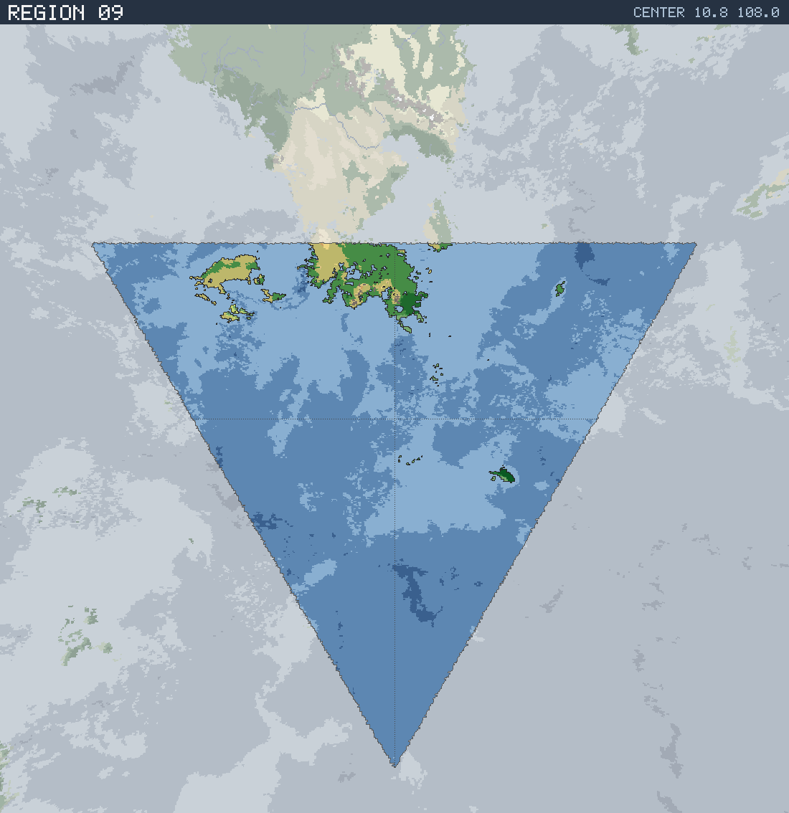

# Region 09 — Sub-tropical coastline with offshore islands

Triangular face centered at 10.8°N 108.0°E · area 25,505,720 km² (1/20 of the planet).

*All percentages are area-weighted. Terrain colors are keyed in the [legend](../maps/legend.png).*

## At a Glance

| | |
|---|---|
| Hydrography | **Coastline with offshore islands** |
| Land share | 4.7 % (1,204,495 km²) |
| Dominant climate band | Sub-tropical |
| Dominant terrain | Forest, medium |
| Mountain systems | 2 |
| Mean land temperature | 26.9 °C (Jun half-year) / 15.2 °C (Dec half-year) |
| Mean annual precipitation | 769 mm |

## Hydrography

Classified as **Coastline with offshore islands** (Table 15 vocabulary), based on:

- Land covers 4.7 % of the region.
- Largest land body: 883,731 km² (part of a larger landmass continuing into a neighboring region).
- 28 island(s) ≥ 600 km² fully inside the region; 2 landmass(es) of continental scale or continuing beyond the region's edges.
- 73,025 km² of enclosed (landlocked) water.

## Landforms

| System | Quadrant | Length × width | Trend | Peak | Mean elev. |
|---|---|---|---|---|---|
| 1 (13,092 km²) | NW | 265 × 96 km | NE-SW | 4.4 km at 24.8°N 102.8°E | 1.3 km |
| 2 (8,912 km²) | NW | 293 × 75 km | E-W | 1.6 km at 27.7°N 100.7°E | 0.7 km |

Relief of the land area:

| Lowlands (< 0.3 km) | Hills (0.3–0.8 km) | Highlands (0.8–2 km) | Mountains (> 2 km) |
|---|---|---|---|
| 46.7 % | 26.7 % | 21.3 % | 5.3 % |

## Climate

Climate-band composition of the land area (the book's five latitudinal bands, assigned from the simulated Köppen class of each cell):

| Tropical | Sub-tropical | Temperate | Sub-arctic | Arctic |
|---|---|---|---|---|
| 7.4 % | 90.0 % | 2.5 % | 0.0 % | 0.0 % |

Leading Köppen classes on land:

| Class | Type | Share of land |
|---|---|---|
| Cfa | Humid subtropical | 33.3 % |
| BSh | Hot steppe | 28.5 % |
| Cwa | Humid subtropical (monsoon) | 24.4 % |
| Aw | Tropical savanna | 5.4 % |
| Csa | Hot-summer Mediterranean | 3.1 % |
| BSk | Cold steppe | 1.9 % |

## Prevailing Winds & Moisture

Wind direction is the direction the wind blows **from** (area-weighted mean over each quadrant); strength is relative to the planet-wide mean. "Variable" marks quadrants where the seasonal vectors largely cancel (monsoonal or convergence zones). Seasons follow the northern-hemisphere convention: "Jun" is the June–August half-year — southern-hemisphere summer is the Dec column.

| Quadrant | Jun wind | Dec wind | Land precip. | Regime | Rain shadow |
|---|---|---|---|---|---|
| NW | from NNE, moderate | from NE, light | 649 mm (year-round) | sub-humid | 23 % of land |
| NE | from NE, moderate, variable | from NE, light | 1,062 mm (summer-wet) | humid | 63 % of land |
| SW | from SSE, light | from N, light | no land | — | — |
| SE | from SSE, light | from N, light | 1,653 mm (year-round) | humid | — |

A pronounced rain shadow affects the NW and NE quadrant(s), leeward of the NW mountain system.

## Predominant Terrain

Terrain classes (Table 18 vocabulary) derived per cell from Köppen class, elevation and annual precipitation:

| Terrain | Share of land |
|---|---|
| Forest, medium | 52.4 % |
| Scrub / brushland | 31.6 % |
| Forest, heavy | 5.0 % |
| Forest, light | 4.6 % |
| Jungle, heavy | 1.5 % |
| Barren | 1.2 % |
| Steppe | 1.2 % |
| Grassland / savanna | 0.8 % |
| Desert, sandy | 0.6 % |
| Jungle, medium | 0.5 % |
| Marsh / swamp | 0.4 % |

Notable expanses (largest contiguous areas):

- A forest of 560,011 km² in the NW quadrant.

## Water Bodies

Enclosed below-sea-level seas (basins with no ocean outlet, almost certainly saline):

| Body | Kind | Area | Max. depth | Quadrant |
|---|---|---|---|---|
| 1 | great lake | 25,016 km² | 1.9 km | NW |
| 2 | great lake | 7,220 km² | 2.5 km | NE |
| 3 | great lake | 6,955 km² | 1.7 km | NW |
| 4 | great lake | 4,057 km² | 0.8 km | NW |
| 5 | great lake | 3,268 km² | 0.6 km | NW |
| 6 | great lake | 2,331 km² | 0.1 km | NE |

## Rivers

No major river reaches the sea within this region — the land here is too arid, too fragmented, or drains into neighboring regions.

> **Method note.** Rivers and lakes are not part of the Orogen export; they are derived by this tool with standard terrain hydrology: priority-flood depression filling over the elevation raster, steepest-descent flow routing, and runoff from annual precipitation minus temperature-driven evapotranspiration (Ol'dekop curve). Only **closed-basin (endorheic) lakes** are reported as standing water: at the 0.125° grid, exorheic filled depressions are an over-detection artifact (unresolved river incision makes through-flowing valleys look ponded), whereas endorheic closure is resolution-robust — rivers are drawn straight through filled exorheic basins. The full consistency and plausibility checks are in [`HYDROLOGY_VALIDATION.md`](../HYDROLOGY_VALIDATION.md). Below-sea-level enclosed seas come directly from the export's elevation field.
