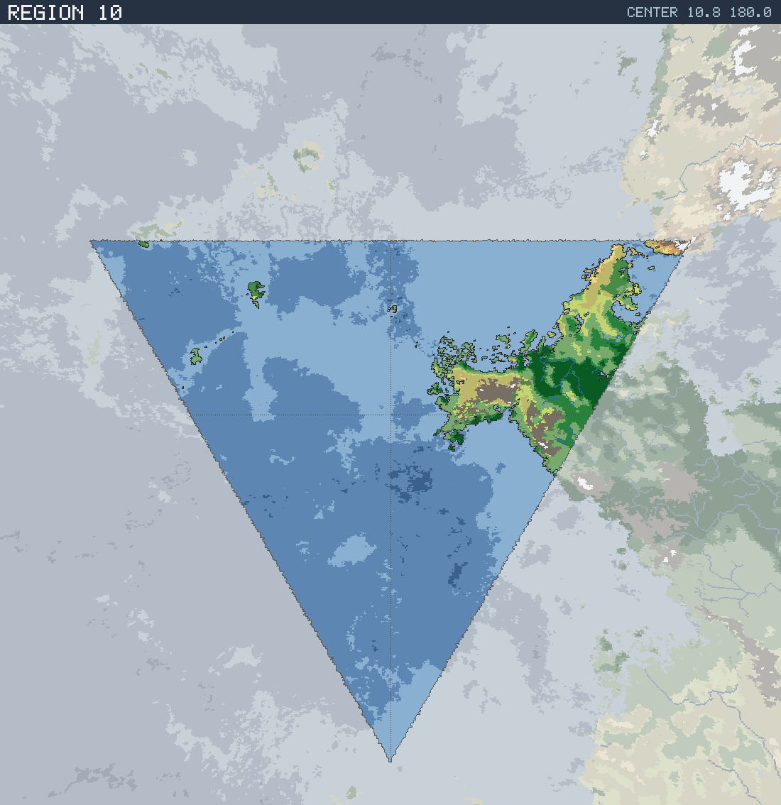

# Region 10 — Tropical coastline with offshore islands

Triangular face centered at 10.8°N 180.0°E · area 25,510,668 km² (1/20 of the planet).

*All percentages are area-weighted. Terrain colors are keyed in the [legend](../maps/legend.png).*

## At a Glance

| | |
|---|---|
| Hydrography | **Coastline with offshore islands** |
| Land share | 12.2 % (3,108,791 km²) |
| Dominant climate band | Tropical |
| Dominant terrain | Forest, light |
| Mountain systems | 6 |
| Mean land temperature | 24.8 °C (Jun half-year) / 19.4 °C (Dec half-year) |
| Mean annual precipitation | 1,112 mm |

## Hydrography

Classified as **Coastline with offshore islands** (Table 15 vocabulary), based on:

- Land covers 12.2 % of the region.
- Largest land body: 2,839,115 km² (part of a larger landmass continuing into a neighboring region).
- 30 island(s) ≥ 600 km² fully inside the region; 3 landmass(es) of continental scale or continuing beyond the region's edges.
- 55,753 km² of enclosed (landlocked) water.

## Landforms

| System | Quadrant | Length × width | Trend | Peak | Mean elev. |
|---|---|---|---|---|---|
| 1 (68,477 km²) | SE | 1,183 × 139 km | NW-SE | 5.9 km at 6.7°N 161.7°W | 1.4 km |
| 2 (44,564 km²) | SE | 851 × 112 km | E-W | 4.3 km at 10.6°N 167.8°W | 1.2 km |
| 3 (14,581 km²) | NE | 300 × 91 km | NE-SW | 2.0 km at 23.1°N 152.1°W | 0.7 km |
| 4 (12,151 km²) | NE | 495 × 101 km | E-W | 5.5 km at 26.2°N 144.7°W | 1.5 km |
| 5 (11,892 km²) | NE | 269 × 165 km | N-S | 1.9 km at 25.7°N 151.2°W | 0.6 km |
| 6 (6,433 km²) | NE | 228 × 45 km | NW-SE | 2.0 km at 11.3°N 172.8°W | 0.9 km |

Relief of the land area:

| Lowlands (< 0.3 km) | Hills (0.3–0.8 km) | Highlands (0.8–2 km) | Mountains (> 2 km) |
|---|---|---|---|
| 29.3 % | 25.7 % | 23.0 % | 22.1 % |

## Climate

Climate-band composition of the land area (the book's five latitudinal bands, assigned from the simulated Köppen class of each cell):

| Tropical | Sub-tropical | Temperate | Sub-arctic | Arctic |
|---|---|---|---|---|
| 71.2 % | 15.9 % | 9.5 % | 0.1 % | 3.2 % |

Leading Köppen classes on land:

| Class | Type | Share of land |
|---|---|---|
| Aw | Tropical savanna | 42.7 % |
| Af | Tropical rainforest | 14.4 % |
| Am | Tropical monsoon | 14.2 % |
| BSh | Hot steppe | 10.7 % |
| Cwb | Subtropical highland | 3.4 % |
| Cfb | Oceanic | 3.1 % |

## Prevailing Winds & Moisture

Wind direction is the direction the wind blows **from** (area-weighted mean over each quadrant); strength is relative to the planet-wide mean. "Variable" marks quadrants where the seasonal vectors largely cancel (monsoonal or convergence zones). Seasons follow the northern-hemisphere convention: "Jun" is the June–August half-year — southern-hemisphere summer is the Dec column.

| Quadrant | Jun wind | Dec wind | Land precip. | Regime | Rain shadow |
|---|---|---|---|---|---|
| NW | from NE, moderate | from NE, light | 1,004 mm (summer-wet) | humid | — |
| NE | from ENE, strong | from NE, moderate, variable | 1,077 mm (year-round) | humid | 38 % of land |
| SW | from S, light | from N, light | no land | — | — |
| SE | from SW, moderate | from NNW, light, variable | 1,278 mm (summer-wet) | humid | — |

A pronounced rain shadow affects the NE quadrant(s), leeward of the SE mountain system.

## Predominant Terrain

Terrain classes (Table 18 vocabulary) derived per cell from Köppen class, elevation and annual precipitation:

| Terrain | Share of land |
|---|---|
| Forest, light | 33.2 % |
| Jungle, heavy | 14.3 % |
| Jungle, medium | 14.2 % |
| Scrub / brushland | 10.7 % |
| Barren | 10.3 % |
| Grassland / savanna | 10.0 % |
| Forest, medium | 4.4 % |
| Desert, sandy | 0.9 % |
| Desert, rocky | 0.5 % |
| Glacier | 0.5 % |
| Steppe | 0.4 % |
| Marsh / swamp | 0.4 % |
| Forest, heavy | 0.2 % |

Notable expanses (largest contiguous areas):

- A jungle of 596,100 km² in the NE quadrant.
- A forest of 261,447 km² in the NE quadrant.
- A grassland of 117,001 km² in the NE quadrant.

## Water Bodies

Enclosed below-sea-level seas (basins with no ocean outlet, almost certainly saline):

| Body | Kind | Area | Max. depth | Quadrant |
|---|---|---|---|---|
| 1 | great lake | 5,775 km² | 1.0 km | NE |
| 2 | great lake | 5,306 km² | 2.4 km | NE |
| 3 | great lake | 2,599 km² | 0.9 km | NE |
| 4 | great lake | 2,246 km² | 0.2 km | NE |
| 5 | great lake | 2,177 km² | 0.3 km | NE |

## Rivers

3 major river system(s) reach the sea (or a terminal lake) in this region — the book expects 4d6 for a typical region. Discharge is annual flow at the mouth; for scale, the Rhine carries ≈ 70 km³/yr and the Mississippi ≈ 580 km³/yr.

| River | Discharge | Main-stem length | Source | Mouth | Empties into |
|---|---|---|---|---|---|
| 1 | 272 km³/yr | 1,726 km | SE quadrant | NE, 17.2°N 160.6°W | sea |
| 2 | 62 km³/yr | 718 km | NE quadrant | NE, 18.7°N 150.6°W | sea |
| 3 | 50 km³/yr | 261 km | NE quadrant | NE, 14.7°N 154.2°W | sea |

> **Method note.** Rivers and lakes are not part of the Orogen export; they are derived by this tool with standard terrain hydrology: priority-flood depression filling over the elevation raster, steepest-descent flow routing, and runoff from annual precipitation minus temperature-driven evapotranspiration (Ol'dekop curve). Only **closed-basin (endorheic) lakes** are reported as standing water: at the 0.125° grid, exorheic filled depressions are an over-detection artifact (unresolved river incision makes through-flowing valleys look ponded), whereas endorheic closure is resolution-robust — rivers are drawn straight through filled exorheic basins. The full consistency and plausibility checks are in [`HYDROLOGY_VALIDATION.md`](../HYDROLOGY_VALIDATION.md). Below-sea-level enclosed seas come directly from the export's elevation field.
