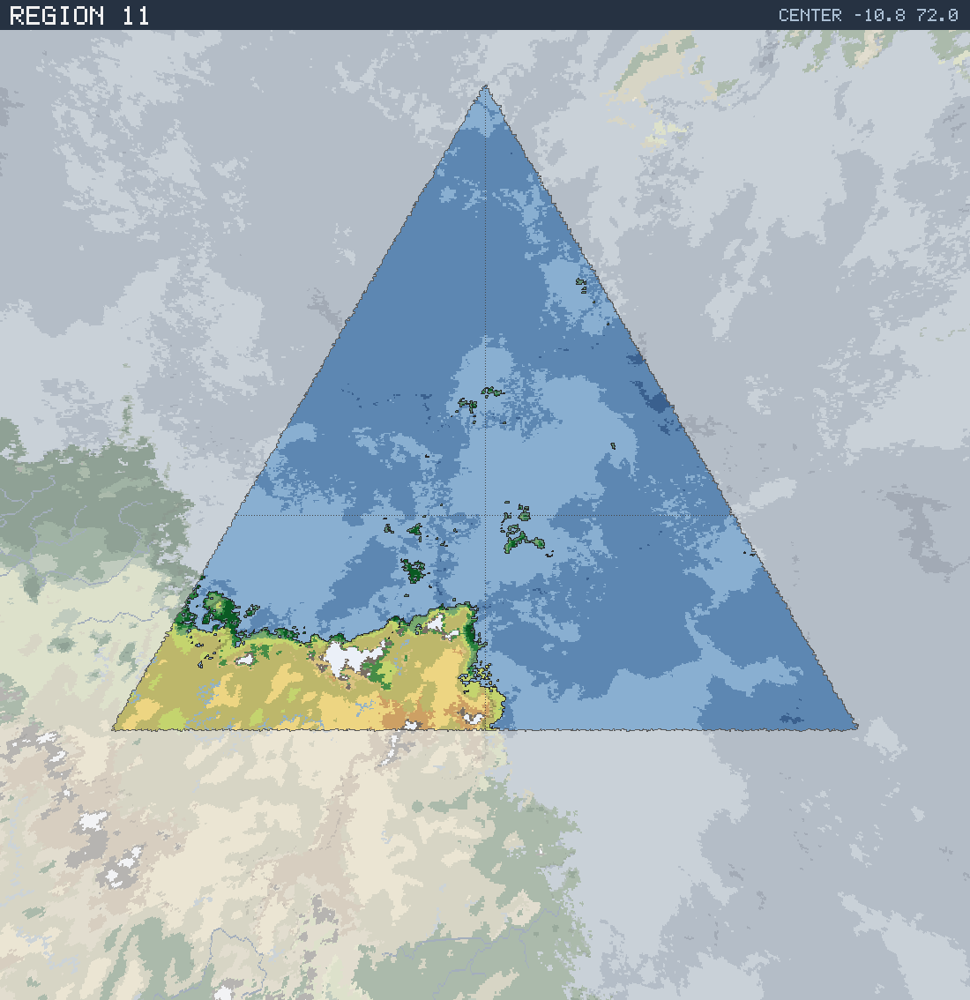

# Region 11 — Sub-tropical coastline with offshore islands

Triangular face centered at 10.8°S 72.0°E · area 25,498,382 km² (1/20 of the planet).

*All percentages are area-weighted. Terrain colors are keyed in the [legend](../maps/legend.png).*

## At a Glance

| | |
|---|---|
| Hydrography | **Coastline with offshore islands** |
| Land share | 14.7 % (3,738,707 km²) |
| Dominant climate band | Sub-tropical |
| Dominant terrain | Scrub / brushland |
| Mountain systems | 9 |
| Mean land temperature | 20.8 °C (Jun half-year) / 24.2 °C (Dec half-year) |
| Mean annual precipitation | 477 mm |

## Hydrography

Classified as **Coastline with offshore islands** (Table 15 vocabulary), based on:

- Land covers 14.7 % of the region.
- Largest land body: 3,558,050 km² (part of a larger landmass continuing into a neighboring region).
- 34 island(s) ≥ 600 km² fully inside the region; 3 landmass(es) of continental scale or continuing beyond the region's edges.
- 28,555 km² of enclosed (landlocked) water.

## Landforms

| System | Quadrant | Length × width | Trend | Peak | Mean elev. |
|---|---|---|---|---|---|
| 1 (31,972 km²) | SE | 465 × 119 km | N-S | 3.3 km at 30.6°S 71.8°E | 0.7 km |
| 2 (24,541 km²) | SW | 342 × 133 km | NE-SW | 1.6 km at 21.7°S 45.9°E | 0.5 km |
| 3 (22,022 km²) | SW | 698 × 73 km | NE-SW | 1.1 km at 22.4°S 59.8°E | 0.4 km |
| 4 (20,227 km²) | SW | 374 × 110 km | N-S | 1.9 km at 20.9°S 70.6°E | 0.3 km |
| 5 (19,094 km²) | SW | 382 × 111 km | NE-SW | 2.9 km at 17.8°S 45.9°E | 0.6 km |
| 6 (17,857 km²) | SW | 510 × 65 km | NE-SW | 1.7 km at 21.7°S 63.3°E | 0.4 km |
| 7 (17,787 km²) | SW | 334 × 88 km | NE-SW | 4.5 km at 23.6°S 55.3°E | 1.4 km |
| 8 (12,809 km²) | SW | 270 × 72 km | NE-SW | 1.7 km at 24.3°S 71.2°E | 0.4 km |

…plus 1 lesser system(s).

Relief of the land area:

| Lowlands (< 0.3 km) | Hills (0.3–0.8 km) | Highlands (0.8–2 km) | Mountains (> 2 km) |
|---|---|---|---|
| 40.9 % | 26.2 % | 24.0 % | 9.0 % |

## Climate

Climate-band composition of the land area (the book's five latitudinal bands, assigned from the simulated Köppen class of each cell):

| Tropical | Sub-tropical | Temperate | Sub-arctic | Arctic |
|---|---|---|---|---|
| 22.2 % | 63.8 % | 7.0 % | 0.0 % | 7.0 % |

Leading Köppen classes on land:

| Class | Type | Share of land |
|---|---|---|
| BSh | Hot steppe | 42.9 % |
| BWh | Hot desert | 20.8 % |
| Aw | Tropical savanna | 13.7 % |
| Af | Tropical rainforest | 5.4 % |
| EF | Ice cap | 4.0 % |
| Am | Tropical monsoon | 3.2 % |

## Prevailing Winds & Moisture

Wind direction is the direction the wind blows **from** (area-weighted mean over each quadrant); strength is relative to the planet-wide mean. "Variable" marks quadrants where the seasonal vectors largely cancel (monsoonal or convergence zones). Seasons follow the northern-hemisphere convention: "Jun" is the June–August half-year — southern-hemisphere summer is the Dec column.

| Quadrant | Jun wind | Dec wind | Land precip. | Regime | Rain shadow |
|---|---|---|---|---|---|
| NW | from NW, light | from N, light | 1,403 mm (year-round) | humid | — |
| NE | from ENE, moderate | from N, light | 1,312 mm (year-round) | humid | — |
| SW | from ESE, strong, variable | from E, strong, variable | 453 mm (year-round) | semi-arid | — |
| SE | from ESE, light | from SE, moderate, variable | 878 mm (winter-wet) | sub-humid | 25 % of land |

A pronounced rain shadow affects the SE quadrant(s), leeward of the SE mountain system.

## Predominant Terrain

Terrain classes (Table 18 vocabulary) derived per cell from Köppen class, elevation and annual precipitation:

| Terrain | Share of land |
|---|---|
| Scrub / brushland | 42.9 % |
| Desert, sandy | 17.8 % |
| Grassland / savanna | 10.0 % |
| Marsh / swamp | 4.4 % |
| Desert, rocky | 4.3 % |
| Glacier | 4.0 % |
| Forest, light | 3.2 % |
| Jungle, heavy | 3.1 % |
| Barren | 3.0 % |
| Forest, medium | 2.8 % |
| Steppe | 2.6 % |
| Jungle, medium | 2.0 % |

Notable expanses (largest contiguous areas):

- A desert of 343,016 km² in the SW quadrant.
- A grassland of 107,633 km² in the SW quadrant.

## Water Bodies

Enclosed below-sea-level seas (basins with no ocean outlet, almost certainly saline):

| Body | Kind | Area | Max. depth | Quadrant |
|---|---|---|---|---|
| 1 | great lake | 2,587 km² | 0.4 km | SW |
| 2 | great lake | 2,401 km² | 0.1 km | SW |
| 3 | great lake | 2,154 km² | 1.3 km | SW |
| 4 | great lake | 2,008 km² | 0.3 km | SW |

Closed-basin (endorheic) lakes — terminal depressions where evaporation balances inflow, holding standing (saline) water with no ocean outlet:

| Lake | Area | Surface elev. | Max. depth | Quadrant |
|---|---|---|---|---|
| 1 | 23,172 km² | 26 m | 14 m | SW |
| 2 | 12,428 km² | 23 m | 6 m | SW |
| 3 | 7,943 km² | 112 m | 72 m | SW |
| 4 | 7,731 km² | 622 m | 130 m | SW |
| 5 | 3,694 km² | 135 m | 35 m | SW |

## Rivers

No major river reaches the sea within this region — the land here is too arid, too fragmented, or drains into neighboring regions.

> **Method note.** Rivers and lakes are not part of the Orogen export; they are derived by this tool with standard terrain hydrology: priority-flood depression filling over the elevation raster, steepest-descent flow routing, and runoff from annual precipitation minus temperature-driven evapotranspiration (Ol'dekop curve). Only **closed-basin (endorheic) lakes** are reported as standing water: at the 0.125° grid, exorheic filled depressions are an over-detection artifact (unresolved river incision makes through-flowing valleys look ponded), whereas endorheic closure is resolution-robust — rivers are drawn straight through filled exorheic basins. The full consistency and plausibility checks are in [`HYDROLOGY_VALIDATION.md`](../HYDROLOGY_VALIDATION.md). Below-sea-level enclosed seas come directly from the export's elevation field.
