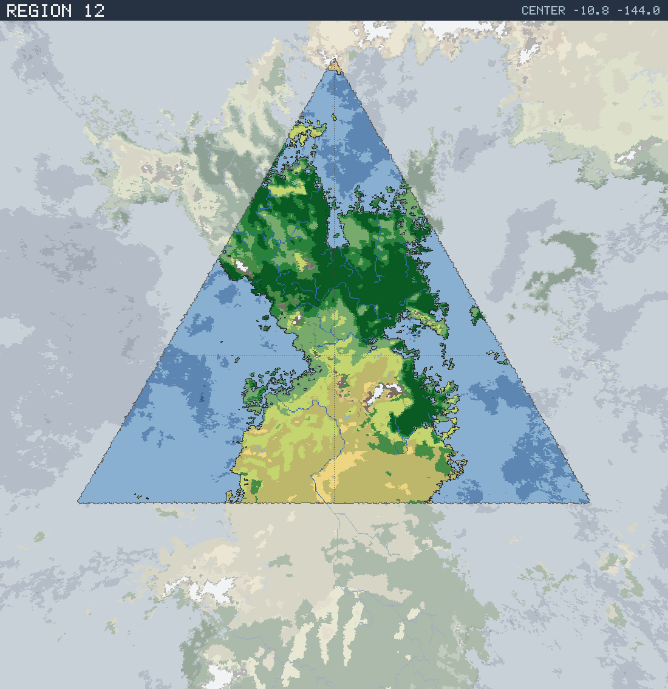

# Region 12 — Tropical multiple coastlines

Triangular face centered at 10.8°S 144.0°W · area 25,508,248 km² (1/20 of the planet).

*All percentages are area-weighted. Terrain colors are keyed in the [legend](../maps/legend.png).*

## At a Glance

| | |
|---|---|
| Hydrography | **Multiple coastlines** |
| Land share | 52.0 % (13,267,696 km²) |
| Dominant climate band | Tropical |
| Dominant terrain | Jungle, heavy |
| Mountain systems | 27 |
| Mean land temperature | 21.8 °C (Jun half-year) / 25.5 °C (Dec half-year) |
| Mean annual precipitation | 945 mm |

## Hydrography

Classified as **Multiple coastlines** (Table 15 vocabulary), based on:

- Land covers 52.0 % of the region.
- Largest land body: 12,875,515 km² (part of a larger landmass continuing into a neighboring region).
- 74 island(s) ≥ 600 km² fully inside the region; 9 landmass(es) of continental scale or continuing beyond the region's edges.
- 136,983 km² of enclosed (landlocked) water.

## Landforms

| System | Quadrant | Length × width | Trend | Peak | Mean elev. |
|---|---|---|---|---|---|
| 1 (75,292 km²) | NW | 1,197 × 323 km | NW-SE | 4.2 km at 0.6°N 155.8°W | 0.8 km |
| 2 (33,736 km²) | NW | 556 × 125 km | N-S | 4.1 km at 11.1°S 146.6°W | 0.9 km |
| 3 (29,893 km²) | NW | 520 × 93 km | NW-SE | 1.4 km at 1.9°S 147.3°W | 0.7 km |
| 4 (25,832 km²) | SW | 432 × 91 km | NW-SE | 3.0 km at 16.8°S 143.1°W | 0.9 km |
| 5 (23,630 km²) | NE | 465 × 83 km | NW-SE | 3.8 km at 5.8°S 130.6°W | 1.1 km |
| 6 (19,591 km²) | NW | 498 × 73 km | N-S | 0.3 km at 4.6°N 145.8°W | 0.1 km |
| 7 (19,577 km²) | SW | 297 × 96 km | N-S | 2.3 km at 13.7°S 144.1°W | 1.1 km |
| 8 (17,009 km²) | SE | 326 × 76 km | N-S | 2.0 km at 17.7°S 139.8°W | 0.7 km |

…plus 19 lesser system(s).

Relief of the land area:

| Lowlands (< 0.3 km) | Hills (0.3–0.8 km) | Highlands (0.8–2 km) | Mountains (> 2 km) |
|---|---|---|---|
| 61.0 % | 24.7 % | 10.2 % | 4.2 % |

## Climate

Climate-band composition of the land area (the book's five latitudinal bands, assigned from the simulated Köppen class of each cell):

| Tropical | Sub-tropical | Temperate | Sub-arctic | Arctic |
|---|---|---|---|---|
| 66.1 % | 28.0 % | 4.2 % | 0.0 % | 1.7 % |

Leading Köppen classes on land:

| Class | Type | Share of land |
|---|---|---|
| Aw | Tropical savanna | 29.4 % |
| Af | Tropical rainforest | 25.7 % |
| BSh | Hot steppe | 22.1 % |
| Am | Tropical monsoon | 10.9 % |
| BWh | Hot desert | 2.6 % |
| Cfa | Humid subtropical | 2.2 % |

## Prevailing Winds & Moisture

Wind direction is the direction the wind blows **from** (area-weighted mean over each quadrant); strength is relative to the planet-wide mean. "Variable" marks quadrants where the seasonal vectors largely cancel (monsoonal or convergence zones). Seasons follow the northern-hemisphere convention: "Jun" is the June–August half-year — southern-hemisphere summer is the Dec column.

| Quadrant | Jun wind | Dec wind | Land precip. | Regime | Rain shadow |
|---|---|---|---|---|---|
| NW | from SE, strong, variable | from NNE, moderate, variable | 1,259 mm (year-round) | humid | 15 % of land |
| NE | from SSE, moderate | from NNW, moderate | 1,299 mm (year-round) | humid | — |
| SW | from ESE, light | from SSE, moderate, variable | 620 mm (winter-wet) | sub-humid | — |
| SE | from SE, moderate, variable | from E, strong | 613 mm (year-round) | sub-humid | 20 % of land |

A pronounced rain shadow affects the SE quadrant(s), leeward of the NW mountain system.

## Predominant Terrain

Terrain classes (Table 18 vocabulary) derived per cell from Köppen class, elevation and annual precipitation:

| Terrain | Share of land |
|---|---|
| Jungle, heavy | 24.4 % |
| Scrub / brushland | 23.1 % |
| Forest, light | 14.3 % |
| Grassland / savanna | 13.9 % |
| Jungle, medium | 10.0 % |
| Marsh / swamp | 4.6 % |
| Forest, medium | 4.5 % |
| Desert, sandy | 2.6 % |
| Barren | 1.2 % |
| Steppe | 0.8 % |
| Glacier | 0.5 % |

Notable expanses (largest contiguous areas):

- A desert of 229,184 km² in the SE quadrant.
- A jungle of 3,845,861 km² in the NE quadrant.
- A forest of 853,418 km² in the NW quadrant.
- A grassland of 1,066,936 km² in the SW quadrant.

## Water Bodies

Enclosed below-sea-level seas (basins with no ocean outlet, almost certainly saline):

| Body | Kind | Area | Max. depth | Quadrant |
|---|---|---|---|---|
| 1 | great lake | 12,322 km² | 1.4 km | NE |
| 2 | great lake | 7,652 km² | 0.4 km | NE |
| 3 | great lake | 5,729 km² | 0.4 km | SE |
| 4 | great lake | 5,347 km² | 0.2 km | NE |
| 5 | great lake | 3,929 km² | 0.1 km | NW |
| 6 | great lake | 3,685 km² | 2.7 km | SW |
| 7 | great lake | 3,646 km² | 0.3 km | SE |
| 8 | great lake | 3,617 km² | 0.1 km | SE |

…plus 9 smaller enclosed water bodies.

Closed-basin (endorheic) lakes — terminal depressions where evaporation balances inflow, holding standing (saline) water with no ocean outlet:

| Lake | Area | Surface elev. | Max. depth | Quadrant |
|---|---|---|---|---|
| 1 | 6,001 km² | 53 m | 44 m | SW |
| 2 | 3,036 km² | 14 m | 3 m | SE |
| 3 | 3,012 km² | 18 m | 13 m | NW |
| 4 | 2,723 km² | 101 m | 36 m | SE |
| 5 | 2,439 km² | 239 m | 107 m | SE |

## Rivers

19 major river system(s) reach the sea (or a terminal lake) in this region — the book expects 4d6 for a typical region. Discharge is annual flow at the mouth; for scale, the Rhine carries ≈ 70 km³/yr and the Mississippi ≈ 580 km³/yr.

| River | Discharge | Main-stem length | Source | Mouth | Empties into |
|---|---|---|---|---|---|
| 1 | 946 km³/yr | 7,860 km | SE quadrant | SW, 16.6°S 152.7°W | sea |
| 2 | 518 km³/yr | 2,559 km | NW quadrant | NW, 12.4°N 153.2°W | sea |
| 3 | 291 km³/yr | 2,796 km | NW quadrant | NE, 5.3°S 135.7°W | sea |
| 4 | 186 km³/yr | 2,015 km | NW quadrant | NE, 8.3°S 138.6°W | sea |
| 5 | 141 km³/yr | 1,404 km | NE quadrant | NE, 9.1°N 137.9°W | sea |
| 6 | 127 km³/yr | 828 km | NE quadrant | NE, 4.6°N 143.3°W | sea |
| 7 | 77 km³/yr | 657 km | NE quadrant | NE, 3.7°N 133.8°W | sea |
| 8 | 72 km³/yr | 1,254 km | SE quadrant | SE, 21.4°S 131.6°W | sea |
| 9 | 57 km³/yr | 464 km | NW quadrant | NW, 4.6°N 144.6°W | sea |
| 10 | 54 km³/yr | 777 km | NE quadrant | NE, 1.3°S 130.7°W | sea |

…plus 9 lesser major rivers.

> **Method note.** Rivers and lakes are not part of the Orogen export; they are derived by this tool with standard terrain hydrology: priority-flood depression filling over the elevation raster, steepest-descent flow routing, and runoff from annual precipitation minus temperature-driven evapotranspiration (Ol'dekop curve). Only **closed-basin (endorheic) lakes** are reported as standing water: at the 0.125° grid, exorheic filled depressions are an over-detection artifact (unresolved river incision makes through-flowing valleys look ponded), whereas endorheic closure is resolution-robust — rivers are drawn straight through filled exorheic basins. The full consistency and plausibility checks are in [`HYDROLOGY_VALIDATION.md`](../HYDROLOGY_VALIDATION.md). Below-sea-level enclosed seas come directly from the export's elevation field.
