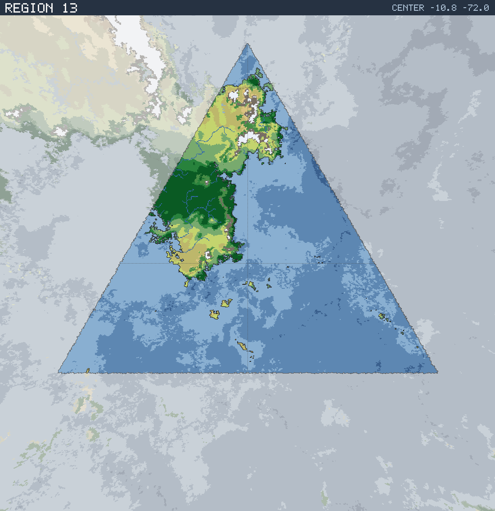

# Region 13 — Tropical multiple coastlines

Triangular face centered at 10.8°S 72.0°W · area 25,502,007 km² (1/20 of the planet).

*All percentages are area-weighted. Terrain colors are keyed in the [legend](../maps/legend.png).*

## At a Glance

| | |
|---|---|
| Hydrography | **Multiple coastlines** |
| Land share | 21.1 % (5,390,750 km²) |
| Dominant climate band | Tropical |
| Dominant terrain | Jungle, heavy |
| Mountain systems | 9 |
| Mean land temperature | 22.2 °C (Jun half-year) / 22.4 °C (Dec half-year) |
| Mean annual precipitation | 1,020 mm |

## Hydrography

Classified as **Multiple coastlines** (Table 15 vocabulary), based on:

- Land covers 21.1 % of the region.
- Largest land body: 5,233,666 km² (part of a larger landmass continuing into a neighboring region).
- 24 island(s) ≥ 600 km² fully inside the region; 4 landmass(es) of continental scale or continuing beyond the region's edges.
- 39,261 km² of enclosed (landlocked) water.

## Landforms

| System | Quadrant | Length × width | Trend | Peak | Mean elev. |
|---|---|---|---|---|---|
| 1 (106,902 km²) | NE | 1,189 × 547 km | N-S | 4.6 km at 10.1°N 67.6°W | 0.9 km |
| 2 (94,346 km²) | NW | 1,340 × 229 km | N-S | 4.9 km at 5.8°S 75.6°W | 1.0 km |
| 3 (44,580 km²) | NE | 940 × 298 km | E-W | 3.2 km at 20.2°N 73.7°W | 0.7 km |
| 4 (31,154 km²) | SW | 466 × 108 km | NE-SW | 2.3 km at 11.3°S 81.4°W | 0.7 km |
| 5 (27,539 km²) | NW | 514 × 164 km | NW-SE | 1.6 km at 4.6°N 76.6°W | 0.3 km |
| 6 (20,827 km²) | NW | 603 × 81 km | N-S | 0.8 km at 8.8°N 72.8°W | 0.2 km |
| 7 (12,697 km²) | SW | 304 × 86 km | NE-SW | 1.0 km at 10.7°S 78.7°W | 0.2 km |
| 8 (10,175 km²) | NW | 217 × 105 km | NE-SW | 1.5 km at 6.8°N 74.7°W | 0.3 km |

…plus 1 lesser system(s).

Relief of the land area:

| Lowlands (< 0.3 km) | Hills (0.3–0.8 km) | Highlands (0.8–2 km) | Mountains (> 2 km) |
|---|---|---|---|
| 42.3 % | 25.2 % | 20.0 % | 12.5 % |

## Climate

Climate-band composition of the land area (the book's five latitudinal bands, assigned from the simulated Köppen class of each cell):

| Tropical | Sub-tropical | Temperate | Sub-arctic | Arctic |
|---|---|---|---|---|
| 72.0 % | 11.1 % | 10.1 % | 0.1 % | 6.7 % |

Leading Köppen classes on land:

| Class | Type | Share of land |
|---|---|---|
| Aw | Tropical savanna | 34.3 % |
| Af | Tropical rainforest | 29.4 % |
| BSh | Hot steppe | 10.9 % |
| Am | Tropical monsoon | 8.3 % |
| Cfb | Oceanic | 6.1 % |
| ET | Tundra | 4.3 % |

## Prevailing Winds & Moisture

Wind direction is the direction the wind blows **from** (area-weighted mean over each quadrant); strength is relative to the planet-wide mean. "Variable" marks quadrants where the seasonal vectors largely cancel (monsoonal or convergence zones). Seasons follow the northern-hemisphere convention: "Jun" is the June–August half-year — southern-hemisphere summer is the Dec column.

| Quadrant | Jun wind | Dec wind | Land precip. | Regime | Rain shadow |
|---|---|---|---|---|---|
| NW | from SSW, strong, variable | from ESE, strong, variable | 1,070 mm (year-round) | humid | — |
| NE | from S, moderate, variable | from NE, moderate | 830 mm (summer-wet) | sub-humid | 14 % of land |
| SW | from SE, light | from SSE, moderate | 742 mm (year-round) | sub-humid | 25 % of land |
| SE | from SE, light | from SSE, moderate | 886 mm (winter-wet) | sub-humid | — |

A pronounced rain shadow affects the SW quadrant(s), leeward of the NE mountain system.

## Predominant Terrain

Terrain classes (Table 18 vocabulary) derived per cell from Köppen class, elevation and annual precipitation:

| Terrain | Share of land |
|---|---|
| Jungle, heavy | 28.1 % |
| Grassland / savanna | 18.4 % |
| Forest, light | 16.9 % |
| Scrub / brushland | 10.9 % |
| Jungle, medium | 7.8 % |
| Forest, medium | 6.1 % |
| Barren | 4.5 % |
| Marsh / swamp | 3.2 % |
| Glacier | 2.4 % |
| Steppe | 1.3 % |

Notable expanses (largest contiguous areas):

- A jungle of 1,593,600 km² in the NW quadrant.
- A forest of 448,769 km² in the NW quadrant.
- A grassland of 366,344 km² in the NW quadrant.

## Water Bodies

Enclosed below-sea-level seas (basins with no ocean outlet, almost certainly saline):

| Body | Kind | Area | Max. depth | Quadrant |
|---|---|---|---|---|
| 1 | great lake | 3,621 km² | 2.5 km | NW |
| 2 | great lake | 3,431 km² | 0.6 km | NW |
| 3 | great lake | 2,473 km² | 0.5 km | NW |
| 4 | great lake | 2,088 km² | 1.8 km | NE |

Closed-basin (endorheic) lakes — terminal depressions where evaporation balances inflow, holding standing (saline) water with no ocean outlet:

| Lake | Area | Surface elev. | Max. depth | Quadrant |
|---|---|---|---|---|
| 1 | 3,871 km² | 273 m | 30 m | NW |

## Rivers

10 major river system(s) reach the sea (or a terminal lake) in this region — the book expects 4d6 for a typical region. Discharge is annual flow at the mouth; for scale, the Rhine carries ≈ 70 km³/yr and the Mississippi ≈ 580 km³/yr.

| River | Discharge | Main-stem length | Source | Mouth | Empties into |
|---|---|---|---|---|---|
| 1 | 375 km³/yr | 1,980 km | NW quadrant | NW, 5.7°S 85.4°W | sea |
| 2 | 40 km³/yr | 337 km | NW quadrant | NW, 5.7°N 77.8°W | sea |
| 3 | 37 km³/yr | 1,072 km | NW quadrant | NW, 8.4°S 84.7°W | sea |
| 4 | 37 km³/yr | 804 km | NE quadrant | NE, 16.1°N 69.1°W | sea |
| 5 | 30 km³/yr | 299 km | NW quadrant | NW, 2.4°S 87.1°W | sea |
| 6 | 23 km³/yr | 430 km | NE quadrant | NE, 9.7°N 71.9°W | sea |
| 7 | 22 km³/yr | 371 km | NW quadrant | NW, 7.1°N 77.8°W | sea |
| 8 | 22 km³/yr | 255 km | NW quadrant | NW, 0.3°N 89.3°W | sea |
| 9 | 20 km³/yr | 333 km | NW quadrant | NW, 1.2°S 88.6°W | sea |
| 10 | 19 km³/yr | 712 km | NW quadrant | NW, 6.7°N 73.7°W | sea |

> **Method note.** Rivers and lakes are not part of the Orogen export; they are derived by this tool with standard terrain hydrology: priority-flood depression filling over the elevation raster, steepest-descent flow routing, and runoff from annual precipitation minus temperature-driven evapotranspiration (Ol'dekop curve). Only **closed-basin (endorheic) lakes** are reported as standing water: at the 0.125° grid, exorheic filled depressions are an over-detection artifact (unresolved river incision makes through-flowing valleys look ponded), whereas endorheic closure is resolution-robust — rivers are drawn straight through filled exorheic basins. The full consistency and plausibility checks are in [`HYDROLOGY_VALIDATION.md`](../HYDROLOGY_VALIDATION.md). Below-sea-level enclosed seas come directly from the export's elevation field.
