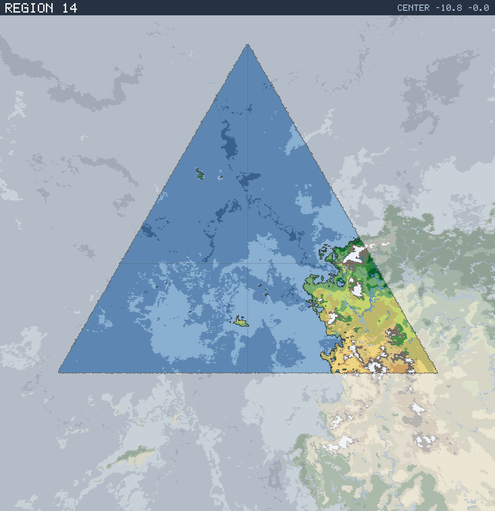

# Region 14 — Tropical coastline with offshore islands

Triangular face centered at 10.8°S 0.0°W · area 25,486,825 km² (1/20 of the planet).

*All percentages are area-weighted. Terrain colors are keyed in the [legend](../maps/legend.png).*

## At a Glance

| | |
|---|---|
| Hydrography | **Coastline with offshore islands** |
| Land share | 14.0 % (3,571,354 km²) |
| Dominant climate band | Tropical |
| Dominant terrain | Scrub / brushland |
| Mountain systems | 10 |
| Mean land temperature | 17.6 °C (Jun half-year) / 20.2 °C (Dec half-year) |
| Mean annual precipitation | 578 mm |

## Hydrography

Classified as **Coastline with offshore islands** (Table 15 vocabulary), based on:

- Land covers 14.0 % of the region.
- Largest land body: 3,491,054 km² (part of a larger landmass continuing into a neighboring region).
- 18 island(s) ≥ 600 km² fully inside the region; 1 landmass(es) of continental scale or continuing beyond the region's edges.
- 48,704 km² of enclosed (landlocked) water.

## Landforms

| System | Quadrant | Length × width | Trend | Peak | Mean elev. |
|---|---|---|---|---|---|
| 1 (87,840 km²) | SE | 1,370 × 213 km | NW-SE | 4.3 km at 17.7°S 14.7°E | 0.8 km |
| 2 (78,834 km²) | NE | 981 × 348 km | N-S | 5.9 km at 8.4°S 19.9°E | 1.6 km |
| 3 (65,417 km²) | SE | 764 × 537 km | E-W | 3.8 km at 25.7°S 21.6°E | 1.2 km |
| 4 (29,347 km²) | SE | 578 × 178 km | E-W | 3.6 km at 24.4°S 27.1°E | 1.9 km |
| 5 (21,306 km²) | SE | 223 × 142 km | E-W | 1.8 km at 14.8°S 17.3°E | 0.4 km |
| 6 (20,220 km²) | SE | 394 × 115 km | NE-SW | 3.5 km at 28.1°S 24.9°E | 2.8 km |
| 7 (12,394 km²) | SE | 287 × 86 km | E-W | 3.2 km at 25.6°S 31.3°E | 1.9 km |
| 8 (6,141 km²) | NE | 117 × 68 km | E-W | 3.4 km at 6.6°S 22.1°E | 1.6 km |

…plus 2 lesser system(s).

Relief of the land area:

| Lowlands (< 0.3 km) | Hills (0.3–0.8 km) | Highlands (0.8–2 km) | Mountains (> 2 km) |
|---|---|---|---|
| 22.5 % | 23.0 % | 29.8 % | 24.7 % |

## Climate

Climate-band composition of the land area (the book's five latitudinal bands, assigned from the simulated Köppen class of each cell):

| Tropical | Sub-tropical | Temperate | Sub-arctic | Arctic |
|---|---|---|---|---|
| 34.4 % | 32.3 % | 17.1 % | 0.0 % | 16.2 % |

Leading Köppen classes on land:

| Class | Type | Share of land |
|---|---|---|
| Aw | Tropical savanna | 27.7 % |
| BSh | Hot steppe | 24.0 % |
| ET | Tundra | 10.1 % |
| BWh | Hot desert | 8.2 % |
| BSk | Cold steppe | 7.2 % |
| EF | Ice cap | 6.0 % |

## Prevailing Winds & Moisture

Wind direction is the direction the wind blows **from** (area-weighted mean over each quadrant); strength is relative to the planet-wide mean. "Variable" marks quadrants where the seasonal vectors largely cancel (monsoonal or convergence zones). Seasons follow the northern-hemisphere convention: "Jun" is the June–August half-year — southern-hemisphere summer is the Dec column.

| Quadrant | Jun wind | Dec wind | Land precip. | Regime | Rain shadow |
|---|---|---|---|---|---|
| NW | from SSW, light | from N, light | 1,265 mm (year-round) | humid | — |
| NE | from SSW, moderate, variable | from NNW, moderate | 1,129 mm (year-round) | humid | — |
| SW | from SE, light | from SE, moderate, variable | 841 mm (winter-wet) | sub-humid | — |
| SE | from SSE, strong, variable | from SSE, strong, variable | 521 mm (winter-wet) | sub-humid | — |

## Predominant Terrain

Terrain classes (Table 18 vocabulary) derived per cell from Köppen class, elevation and annual precipitation:

| Terrain | Share of land |
|---|---|
| Scrub / brushland | 24.0 % |
| Grassland / savanna | 18.2 % |
| Barren | 10.2 % |
| Forest, light | 10.0 % |
| Steppe | 7.2 % |
| Glacier | 6.0 % |
| Desert, sandy | 5.8 % |
| Forest, medium | 5.6 % |
| Desert, rocky | 5.1 % |
| Jungle, medium | 3.0 % |
| Jungle, heavy | 2.6 % |
| Marsh / swamp | 2.2 % |

Notable expanses (largest contiguous areas):

- A desert of 211,802 km² in the SE quadrant.
- A forest of 183,737 km² in the SE quadrant.
- A grassland of 552,122 km² in the SE quadrant.

## Water Bodies

Enclosed below-sea-level seas (basins with no ocean outlet, almost certainly saline):

| Body | Kind | Area | Max. depth | Quadrant |
|---|---|---|---|---|
| 1 | great lake | 13,108 km² | 4.1 km | SE |
| 2 | great lake | 9,344 km² | 3.6 km | NE |
| 3 | great lake | 7,513 km² | 2.0 km | SE |
| 4 | great lake | 3,236 km² | 2.8 km | SE |
| 5 | great lake | 2,844 km² | 0.5 km | SE |

Lakes (computed hydrology — depressions in the terrain holding water above sea level):

| Lake | Type | Area | Surface elev. | Max. depth | Quadrant |
|---|---|---|---|---|---|
| 1 | salt (no outlet) | 16,220 km² | 143 m | 61 m | SE |
| 2 | freshwater (with outlet) | 11,733 km² | 110 m | 37 m | SE |
| 3 | freshwater (with outlet) | 6,976 km² | 114 m | 37 m | SE |
| 4 | freshwater (with outlet) | 4,704 km² | 111 m | 30 m | SE |
| 5 | freshwater (with outlet) | 3,745 km² | 109 m | 41 m | SE |
| 6 | freshwater (with outlet) | 3,590 km² | 113 m | 18 m | SE |
| 7 | freshwater (with outlet) | 3,335 km² | 110 m | 33 m | SE |
| 8 | freshwater (with outlet) | 3,216 km² | 263 m | 88 m | SE |
| 9 | freshwater (with outlet) | 3,193 km² | 45 m | 40 m | SE |
| 10 | salt (no outlet) | 3,166 km² | 341 m | 77 m | SE |

…plus 3 smaller lakes.

## Rivers

5 major river system(s) reach the sea (or a terminal lake) in this region — the book expects 4d6 for a typical region. Discharge is annual flow at the mouth; for scale, the Rhine carries ≈ 70 km³/yr and the Mississippi ≈ 580 km³/yr.

| River | Discharge | Main-stem length | Source | Mouth | Empties into |
|---|---|---|---|---|---|
| 1 | 31 km³/yr | 504 km | SE quadrant | SE, 13.7°S 18.2°E | sea |
| 2 | 21 km³/yr | 372 km | NE quadrant | NE, 9.6°S 17.7°E | sea |
| 3 | 20 km³/yr | 696 km | SE quadrant | SE, 19.8°S 22.7°E | salt lake |
| 4 | 20 km³/yr | 581 km | SE quadrant | SE, 19.3°S 21.8°E | salt lake |
| 5 | 18 km³/yr | 453 km | SE quadrant | SE, 18.6°S 20.9°E | salt lake |

> **Method note.** Rivers and lakes are not part of the Orogen export; they are derived by this tool with standard terrain hydrology: priority-flood depression filling over the elevation raster, steepest-descent flow routing, runoff from annual precipitation minus temperature-driven evapotranspiration (Ol'dekop curve), and a per-depression water balance — humid basins fill to their spill point and drain onward (freshwater), arid basins shrink to the area where evaporation matches inflow (salt lakes). Below-sea-level enclosed seas come directly from the export's elevation field.
