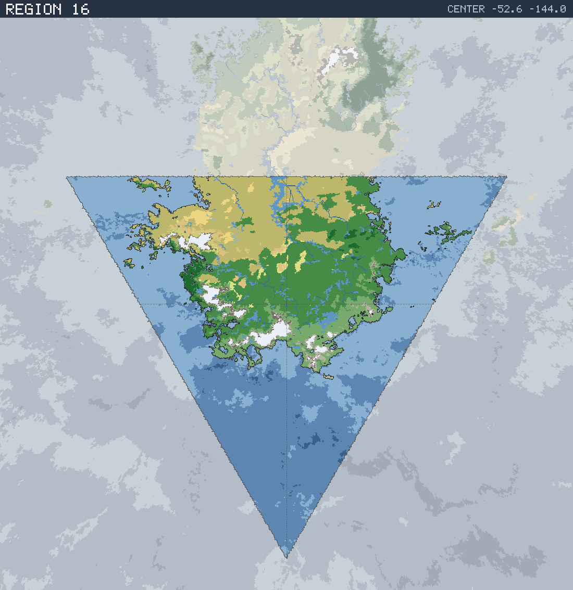

# Region 16 — Sub-tropical coastline with offshore islands

Triangular face centered at 52.6°S 144.0°W · area 25,501,188 km² (1/20 of the planet).

*All percentages are area-weighted. Terrain colors are keyed in the [legend](../maps/legend.png).*

## At a Glance

| | |
|---|---|
| Hydrography | **Coastline with offshore islands** |
| Land share | 44.1 % (11,238,751 km²) |
| Dominant climate band | Sub-tropical |
| Dominant terrain | Forest, medium |
| Mountain systems | 13 |
| Mean land temperature | 0.0 °C (Jun half-year) / 22.8 °C (Dec half-year) |
| Mean annual precipitation | 657 mm |

## Hydrography

Classified as **Coastline with offshore islands** (Table 15 vocabulary), based on:

- Land covers 44.1 % of the region.
- Largest land body: 11,020,480 km² (part of a larger landmass continuing into a neighboring region).
- 38 island(s) ≥ 600 km² fully inside the region; 1 landmass(es) of continental scale or continuing beyond the region's edges.
- 147,364 km² of enclosed (landlocked) water.

## Landforms

| System | Quadrant | Length × width | Trend | Peak | Mean elev. |
|---|---|---|---|---|---|
| 1 (78,481 km²) | SW | 1,284 × 254 km | E-W | 4.8 km at 59.2°S 150.1°W | 0.8 km |
| 2 (35,704 km²) | SE | 1,132 × 127 km | NE-SW | 2.8 km at 56.9°S 128.2°W | 0.3 km |
| 3 (26,570 km²) | NW | 373 × 182 km | E-W | 3.8 km at 40.7°S 166.7°W | 1.5 km |
| 4 (25,121 km²) | NE | 408 × 159 km | NE-SW | 1.6 km at 43.7°S 122.3°W | 0.3 km |
| 5 (23,373 km²) | NW | 525 × 106 km | NE-SW | 3.7 km at 38.6°S 168.8°W | 1.0 km |
| 6 (23,249 km²) | SW | 406 × 96 km | E-W | 2.9 km at 58.2°S 162.6°W | 0.7 km |
| 7 (21,829 km²) | SW | 388 × 103 km | E-W | 2.8 km at 53.9°S 162.4°W | 0.7 km |
| 8 (21,594 km²) | NW | 406 × 69 km | NW-SE | 2.7 km at 50.4°S 165.4°W | 0.7 km |

…plus 5 lesser system(s).

Relief of the land area:

| Lowlands (< 0.3 km) | Hills (0.3–0.8 km) | Highlands (0.8–2 km) | Mountains (> 2 km) |
|---|---|---|---|
| 55.6 % | 25.7 % | 12.8 % | 5.9 % |

## Climate

Climate-band composition of the land area (the book's five latitudinal bands, assigned from the simulated Köppen class of each cell):

| Tropical | Sub-tropical | Temperate | Sub-arctic | Arctic |
|---|---|---|---|---|
| 0.0 % | 46.0 % | 22.3 % | 24.1 % | 7.6 % |

Leading Köppen classes on land:

| Class | Type | Share of land |
|---|---|---|
| Cfa | Humid subtropical | 16.3 % |
| Dfa | Hot-summer continental | 15.2 % |
| Csa | Hot-summer Mediterranean | 15.0 % |
| BSh | Hot steppe | 13.4 % |
| Dfc | Subarctic | 12.4 % |
| Dfb | Warm-summer continental | 11.2 % |

## Prevailing Winds & Moisture

Wind direction is the direction the wind blows **from** (area-weighted mean over each quadrant); strength is relative to the planet-wide mean. "Variable" marks quadrants where the seasonal vectors largely cancel (monsoonal or convergence zones). Seasons follow the northern-hemisphere convention: "Jun" is the June–August half-year — southern-hemisphere summer is the Dec column.

| Quadrant | Jun wind | Dec wind | Land precip. | Regime | Rain shadow |
|---|---|---|---|---|---|
| NW | from NNW, strong | from WSW, strong, variable | 469 mm (summer-wet) | semi-arid | — |
| NE | from WNW, moderate | from NNW, moderate | 714 mm (year-round) | sub-humid | 11 % of land |
| SW | from SSE, strong, variable | from SSE, strong, variable | 888 mm (year-round) | sub-humid | 11 % of land |
| SE | from ESE, moderate, variable | from E, moderate, variable | 906 mm (year-round) | sub-humid | — |

## Predominant Terrain

Terrain classes (Table 18 vocabulary) derived per cell from Köppen class, elevation and annual precipitation:

| Terrain | Share of land |
|---|---|
| Forest, medium | 41.5 % |
| Scrub / brushland | 28.5 % |
| Forest, light | 12.3 % |
| Prairie | 4.2 % |
| Glacier | 3.9 % |
| Steppe | 2.4 % |
| Tundra | 2.0 % |
| Barren | 1.8 % |
| Desert, sandy | 1.3 % |
| Forest, heavy | 0.9 % |
| Marsh / swamp | 0.7 % |
| Grassland / savanna | 0.4 % |

Notable expanses (largest contiguous areas):

- A forest of 5,773,499 km² in the NE quadrant.
- A grassland of 155,892 km² in the NW quadrant.
- A glacier of 146,349 km² in the SW quadrant.

## Water Bodies

Enclosed below-sea-level seas (basins with no ocean outlet, almost certainly saline):

| Body | Kind | Area | Max. depth | Quadrant |
|---|---|---|---|---|
| 1 | great lake | 33,250 km² | 4.5 km | SW |
| 2 | great lake | 14,297 km² | 2.7 km | SE |
| 3 | great lake | 12,385 km² | 3.1 km | SW |
| 4 | great lake | 10,189 km² | 1.7 km | NW |
| 5 | great lake | 6,296 km² | 1.9 km | NW |
| 6 | great lake | 4,194 km² | 2.7 km | NW |
| 7 | great lake | 4,120 km² | 0.3 km | NE |
| 8 | great lake | 4,097 km² | 1.0 km | NW |

…plus 4 smaller enclosed water bodies.

Lakes (computed hydrology — depressions in the terrain holding water above sea level):

| Lake | Type | Area | Surface elev. | Max. depth | Quadrant |
|---|---|---|---|---|---|
| 1 | freshwater (with outlet) | 206,614 km² | 52 m | 45 m | NW |
| 2 | freshwater (with outlet) | 64,459 km² | 183 m | 82 m | SE |
| 3 | freshwater (with outlet) | 25,203 km² | 305 m | 112 m | SW |
| 4 | freshwater (with outlet) | 16,495 km² | 52 m | 24 m | NE |
| 5 | freshwater (with outlet) | 12,768 km² | 82 m | 25 m | NE |
| 6 | freshwater (with outlet) | 11,708 km² | 65 m | 15 m | NE |
| 7 | freshwater (with outlet) | 10,247 km² | 154 m | 95 m | NW |
| 8 | freshwater (with outlet) | 9,399 km² | 52 m | 22 m | NE |
| 9 | freshwater (with outlet) | 9,312 km² | 65 m | 60 m | NW |
| 10 | freshwater (with outlet) | 9,148 km² | 290 m | 280 m | NW |

…plus 57 smaller lakes.

## Rivers

7 major river system(s) reach the sea (or a terminal lake) in this region — the book expects 4d6 for a typical region. Discharge is annual flow at the mouth; for scale, the Rhine carries ≈ 70 km³/yr and the Mississippi ≈ 580 km³/yr.

| River | Discharge | Main-stem length | Source | Mouth | Empties into |
|---|---|---|---|---|---|
| 1 | 253 km³/yr | 3,022 km | SW quadrant | NW, 44.4°S 161.9°W | sea |
| 2 | 139 km³/yr | 992 km | SW quadrant | SW, 55.3°S 158.1°W | sea |
| 3 | 36 km³/yr | 320 km | NE quadrant | NE, 39.9°S 122.9°W | sea |
| 4 | 23 km³/yr | 391 km | SW quadrant | SW, 52.2°S 164.7°W | sea |
| 5 | 19 km³/yr | 324 km | SW quadrant | SW, 56.6°S 162.3°W | sea |
| 6 | 17 km³/yr | 248 km | NW quadrant | NW, 46.8°S 166.6°W | sea |
| 7 | 16 km³/yr | 216 km | NE quadrant | NE, 49.2°S 120.8°W | sea |

> **Method note.** Rivers and lakes are not part of the Orogen export; they are derived by this tool with standard terrain hydrology: priority-flood depression filling over the elevation raster, steepest-descent flow routing, runoff from annual precipitation minus temperature-driven evapotranspiration (Ol'dekop curve), and a per-depression water balance — humid basins fill to their spill point and drain onward (freshwater), arid basins shrink to the area where evaporation matches inflow (salt lakes). Below-sea-level enclosed seas come directly from the export's elevation field.
