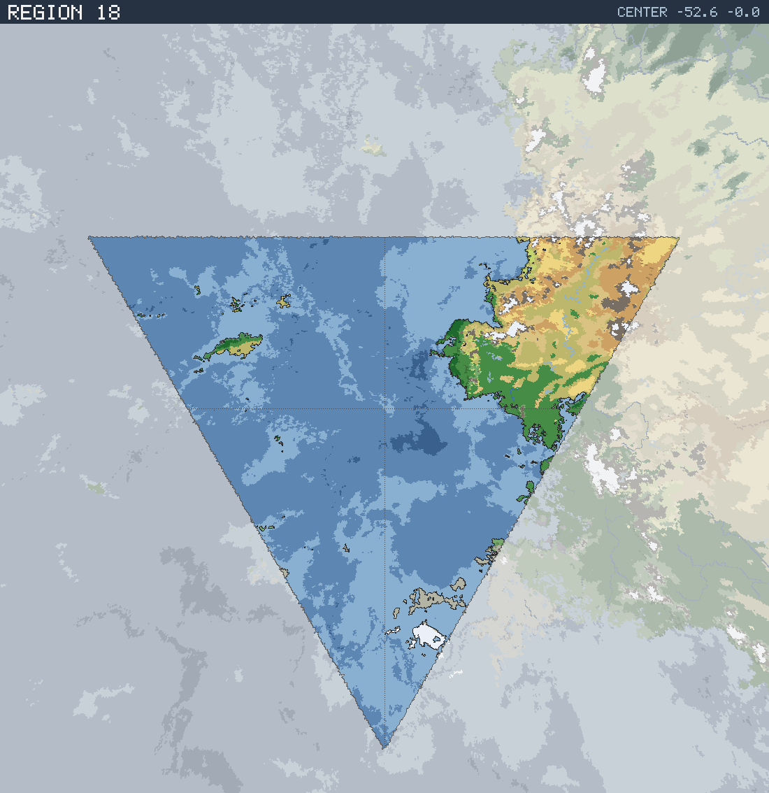

# Region 18 — Sub-tropical multiple coastlines

Triangular face centered at 52.6°S 0.0°W · area 25,510,694 km² (1/20 of the planet).

*All percentages are area-weighted. Terrain colors are keyed in the [legend](../maps/legend.png).*

## At a Glance

| | |
|---|---|
| Hydrography | **Multiple coastlines** |
| Land share | 17.8 % (4,539,641 km²) |
| Dominant climate band | Sub-tropical |
| Dominant terrain | Forest, medium |
| Mountain systems | 12 |
| Mean land temperature | 7.6 °C (Jun half-year) / 20.6 °C (Dec half-year) |
| Mean annual precipitation | 438 mm |

## Hydrography

Classified as **Multiple coastlines** (Table 15 vocabulary), based on:

- Land covers 17.8 % of the region.
- Largest land body: 4,084,939 km² (part of a larger landmass continuing into a neighboring region).
- 43 island(s) ≥ 600 km² fully inside the region; 10 landmass(es) of continental scale or continuing beyond the region's edges.
- 32,993 km² of enclosed (landlocked) water.

## Landforms

| System | Quadrant | Length × width | Trend | Peak | Mean elev. |
|---|---|---|---|---|---|
| 1 (28,298 km²) | NE | 453 × 114 km | N-S | 3.2 km at 39.2°S 18.3°E | 0.9 km |
| 2 (24,732 km²) | NE | 598 × 114 km | E-W | 2.3 km at 41.3°S 18.3°E | 0.5 km |
| 3 (23,570 km²) | NE | 414 × 79 km | N-S | 2.6 km at 47.8°S 16.2°E | 0.9 km |
| 4 (19,650 km²) | NE | 420 × 140 km | NW-SE | 2.1 km at 31.6°S 35.6°E | 1.4 km |
| 5 (18,039 km²) | NE | 585 × 102 km | NE-SW | 0.8 km at 41.3°S 11.9°E | 0.3 km |
| 6 (16,292 km²) | NE | 609 × 97 km | N-S | 2.1 km at 30.8°S 19.9°E | 0.2 km |
| 7 (15,576 km²) | NE | 243 × 77 km | N-S | 2.5 km at 44.3°S 13.4°E | 0.9 km |
| 8 (8,631 km²) | NE | 158 × 112 km | NW-SE | 2.0 km at 35.6°S 15.8°E | 0.5 km |

…plus 4 lesser system(s).

Relief of the land area:

| Lowlands (< 0.3 km) | Hills (0.3–0.8 km) | Highlands (0.8–2 km) | Mountains (> 2 km) |
|---|---|---|---|
| 28.5 % | 21.9 % | 35.6 % | 14.0 % |

## Climate

Climate-band composition of the land area (the book's five latitudinal bands, assigned from the simulated Köppen class of each cell):

| Tropical | Sub-tropical | Temperate | Sub-arctic | Arctic |
|---|---|---|---|---|
| 0.6 % | 57.2 % | 26.6 % | 2.3 % | 13.4 % |

Leading Köppen classes on land:

| Class | Type | Share of land |
|---|---|---|
| Cfa | Humid subtropical | 22.3 % |
| BSh | Hot steppe | 18.2 % |
| BWh | Hot desert | 12.6 % |
| BSk | Cold steppe | 10.8 % |
| ET | Tundra | 9.3 % |
| BWk | Cold desert | 8.9 % |

## Prevailing Winds & Moisture

Wind direction is the direction the wind blows **from** (area-weighted mean over each quadrant); strength is relative to the planet-wide mean. "Variable" marks quadrants where the seasonal vectors largely cancel (monsoonal or convergence zones). Seasons follow the northern-hemisphere convention: "Jun" is the June–August half-year — southern-hemisphere summer is the Dec column.

| Quadrant | Jun wind | Dec wind | Land precip. | Regime | Rain shadow |
|---|---|---|---|---|---|
| NW | from NW, light | from WNW, moderate, variable | 760 mm (summer-wet) | sub-humid | — |
| NE | from NW, strong, variable | from SW, strong, variable | 345 mm (year-round) | semi-arid | — |
| SW | from ESE, light, variable | from ESE, light, variable | 1,220 mm (year-round) | humid | — |
| SE | from ESE, light, variable | from ESE, light, variable | 1,027 mm (year-round) | humid | — |

## Predominant Terrain

Terrain classes (Table 18 vocabulary) derived per cell from Köppen class, elevation and annual precipitation:

| Terrain | Share of land |
|---|---|
| Forest, medium | 25.2 % |
| Scrub / brushland | 23.0 % |
| Desert, rocky | 13.1 % |
| Steppe | 10.8 % |
| Desert, sandy | 8.4 % |
| Barren | 6.1 % |
| Glacier | 4.1 % |
| Tundra | 3.2 % |
| Forest, heavy | 1.9 % |
| Marsh / swamp | 1.3 % |
| Forest, light | 1.3 % |
| Grassland / savanna | 1.3 % |

Notable expanses (largest contiguous areas):

- A desert of 356,115 km² in the NE quadrant.
- A forest of 1,027,566 km² in the NE quadrant.
- A grassland of 115,213 km² in the NE quadrant.

## Water Bodies

Enclosed below-sea-level seas (basins with no ocean outlet, almost certainly saline):

| Body | Kind | Area | Max. depth | Quadrant |
|---|---|---|---|---|
| 1 | great lake | 3,351 km² | 0.5 km | SE |

Closed-basin (endorheic) lakes — terminal depressions where evaporation balances inflow, holding standing (saline) water with no ocean outlet:

| Lake | Area | Surface elev. | Max. depth | Quadrant |
|---|---|---|---|---|
| 1 | 8,628 km² | 235 m | 151 m | NE |
| 2 | 7,709 km² | 330 m | 117 m | NE |
| 3 | 5,816 km² | 543 m | 146 m | NE |
| 4 | 5,466 km² | 120 m | 68 m | NE |
| 5 | 5,111 km² | 173 m | 100 m | NE |
| 6 | 4,738 km² | 137 m | 110 m | NE |
| 7 | 4,158 km² | 568 m | 83 m | NE |
| 8 | 3,104 km² | 786 m | 206 m | NE |
| 9 | 2,985 km² | 1,010 m | 280 m | NE |
| 10 | 2,682 km² | 269 m | 46 m | NE |

…plus 2 smaller endorheic lakes.

## Rivers

3 major river system(s) reach the sea (or a terminal lake) in this region — the book expects 4d6 for a typical region. Discharge is annual flow at the mouth; for scale, the Rhine carries ≈ 70 km³/yr and the Mississippi ≈ 580 km³/yr.

| River | Discharge | Main-stem length | Source | Mouth | Empties into |
|---|---|---|---|---|---|
| 1 | 34 km³/yr | 2,356 km | SE quadrant | NE, 45.7°S 35.4°E | sea |
| 2 | 22 km³/yr | 475 km | NE quadrant | NE, 49.3°S 25.1°E | sea |
| 3 | 17 km³/yr | 173 km | NE quadrant | NE, 47.7°S 13.2°E | sea |

> **Method note.** Rivers and lakes are not part of the Orogen export; they are derived by this tool with standard terrain hydrology: priority-flood depression filling over the elevation raster, steepest-descent flow routing, and runoff from annual precipitation minus temperature-driven evapotranspiration (Ol'dekop curve). Only **closed-basin (endorheic) lakes** are reported as standing water: at the 0.125° grid, exorheic filled depressions are an over-detection artifact (unresolved river incision makes through-flowing valleys look ponded), whereas endorheic closure is resolution-robust — rivers are drawn straight through filled exorheic basins. The full consistency and plausibility checks are in [`HYDROLOGY_VALIDATION.md`](../HYDROLOGY_VALIDATION.md). Below-sea-level enclosed seas come directly from the export's elevation field.
