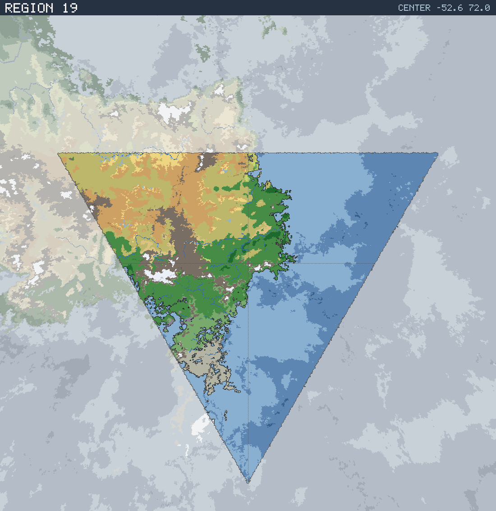

# Region 19 — Sub-tropical multiple coastlines

Triangular face centered at 52.6°S 72.0°E · area 25,507,749 km² (1/20 of the planet).

*All percentages are area-weighted. Terrain colors are keyed in the [legend](../maps/legend.png).*

## At a Glance

| | |
|---|---|
| Hydrography | **Multiple coastlines** |
| Land share | 47.8 % (12,180,920 km²) |
| Dominant climate band | Sub-tropical |
| Dominant terrain | Forest, medium |
| Mountain systems | 38 |
| Mean land temperature | 8.1 °C (Jun half-year) / 23.0 °C (Dec half-year) |
| Mean annual precipitation | 659 mm |

## Hydrography

Classified as **Multiple coastlines** (Table 15 vocabulary), based on:

- Land covers 47.8 % of the region.
- Largest land body: 12,094,316 km² (part of a larger landmass continuing into a neighboring region).
- 27 island(s) ≥ 600 km² fully inside the region; 3 landmass(es) of continental scale or continuing beyond the region's edges.
- 165,023 km² of enclosed (landlocked) water.

## Landforms

| System | Quadrant | Length × width | Trend | Peak | Mean elev. |
|---|---|---|---|---|---|
| 1 (38,706 km²) | NW | 610 × 170 km | NE-SW | 3.5 km at 34.1°S 71.3°E | 1.4 km |
| 2 (30,983 km²) | SW | 464 × 108 km | E-W | 3.9 km at 57.4°S 67.1°E | 1.5 km |
| 3 (29,212 km²) | SW | 467 × 169 km | NE-SW | 5.3 km at 52.6°S 47.4°E | 3.7 km |
| 4 (27,580 km²) | SW | 611 × 262 km | N-S | 3.7 km at 63.4°S 44.1°E | 0.9 km |
| 5 (22,862 km²) | SW | 477 × 78 km | E-W | 5.3 km at 52.2°S 41.9°E | 4.2 km |
| 6 (22,481 km²) | NW | 420 × 95 km | N-S | 5.3 km at 34.1°S 60.7°E | 2.9 km |
| 7 (22,190 km²) | NW | 397 × 146 km | NE-SW | 4.1 km at 35.6°S 56.4°E | 2.1 km |
| 8 (21,049 km²) | NW | 432 × 97 km | N-S | 3.4 km at 39.6°S 54.7°E | 2.7 km |

…plus 30 lesser system(s).

Relief of the land area:

| Lowlands (< 0.3 km) | Hills (0.3–0.8 km) | Highlands (0.8–2 km) | Mountains (> 2 km) |
|---|---|---|---|
| 8.9 % | 16.8 % | 45.5 % | 28.8 % |

## Climate

Climate-band composition of the land area (the book's five latitudinal bands, assigned from the simulated Köppen class of each cell):

| Tropical | Sub-tropical | Temperate | Sub-arctic | Arctic |
|---|---|---|---|---|
| 0.3 % | 59.2 % | 19.4 % | 10.2 % | 10.9 % |

Leading Köppen classes on land:

| Class | Type | Share of land |
|---|---|---|
| BSh | Hot steppe | 20.5 % |
| BWh | Hot desert | 19.3 % |
| Cfa | Humid subtropical | 15.8 % |
| Cfb | Oceanic | 12.6 % |
| ET | Tundra | 9.2 % |
| Dfc | Subarctic | 8.7 % |

## Prevailing Winds & Moisture

Wind direction is the direction the wind blows **from** (area-weighted mean over each quadrant); strength is relative to the planet-wide mean. "Variable" marks quadrants where the seasonal vectors largely cancel (monsoonal or convergence zones). Seasons follow the northern-hemisphere convention: "Jun" is the June–August half-year — southern-hemisphere summer is the Dec column.

| Quadrant | Jun wind | Dec wind | Land precip. | Regime | Rain shadow |
|---|---|---|---|---|---|
| NW | from NW, strong, variable | from N, strong, variable | 377 mm (year-round) | semi-arid | — |
| NE | from NW, moderate | from NNW, moderate, variable | 826 mm (year-round) | sub-humid | 16 % of land |
| SW | from SE, strong, variable | from SE, strong, variable | 1,127 mm (year-round) | humid | — |
| SE | from SE, light, variable | from SE, moderate, variable | 877 mm (year-round) | sub-humid | — |

A pronounced rain shadow affects the NE quadrant(s), leeward of the NW mountain system.

## Predominant Terrain

Terrain classes (Table 18 vocabulary) derived per cell from Köppen class, elevation and annual precipitation:

| Terrain | Share of land |
|---|---|
| Forest, medium | 28.5 % |
| Scrub / brushland | 23.4 % |
| Desert, rocky | 16.5 % |
| Barren | 12.5 % |
| Forest, light | 6.0 % |
| Tundra | 4.4 % |
| Desert, sandy | 3.1 % |
| Glacier | 1.7 % |
| Steppe | 1.6 % |
| Forest, heavy | 1.5 % |
| Moor | 0.4 % |
| Grassland / savanna | 0.3 % |

Notable expanses (largest contiguous areas):

- A desert of 1,230,823 km² in the NW quadrant.
- A forest of 4,172,416 km² in the SW quadrant.
- A glacier of 108,169 km² in the SW quadrant.

## Water Bodies

Enclosed below-sea-level seas (basins with no ocean outlet, almost certainly saline):

| Body | Kind | Area | Max. depth | Quadrant |
|---|---|---|---|---|
| 1 | great lake | 27,789 km² | 1.3 km | SW |
| 2 | great lake | 11,566 km² | 3.2 km | SW |
| 3 | great lake | 7,172 km² | 1.2 km | SW |
| 4 | great lake | 7,089 km² | 2.8 km | SW |
| 5 | great lake | 5,397 km² | 1.7 km | SW |
| 6 | great lake | 5,028 km² | 2.4 km | SW |
| 7 | great lake | 4,165 km² | 0.6 km | NE |
| 8 | great lake | 3,654 km² | 0.4 km | NE |

…plus 4 smaller enclosed water bodies.

Closed-basin (endorheic) lakes — terminal depressions where evaporation balances inflow, holding standing (saline) water with no ocean outlet:

| Lake | Area | Surface elev. | Max. depth | Quadrant |
|---|---|---|---|---|
| 1 | 32,862 km² | 254 m | 122 m | NW |
| 2 | 6,889 km² | 939 m | 152 m | NW |
| 3 | 6,336 km² | 880 m | 16 m | NW |
| 4 | 4,653 km² | 268 m | 106 m | NW |
| 5 | 3,885 km² | 430 m | 61 m | NW |
| 6 | 2,669 km² | 961 m | 6 m | NW |

## Rivers

27 major river system(s) reach the sea (or a terminal lake) in this region — the book expects 4d6 for a typical region. Discharge is annual flow at the mouth; for scale, the Rhine carries ≈ 70 km³/yr and the Mississippi ≈ 580 km³/yr.

| River | Discharge | Main-stem length | Source | Mouth | Empties into |
|---|---|---|---|---|---|
| 1 | 434 km³/yr | 2,723 km | SW quadrant | NE, 45.2°S 80.9°E | sea |
| 2 | 295 km³/yr | 1,872 km | SW quadrant | SW, 62.4°S 63.6°E | sea |
| 3 | 68 km³/yr | 430 km | SW quadrant | SW, 69.1°S 55.6°E | sea |
| 4 | 53 km³/yr | 2,375 km | NW quadrant | NE, 37.7°S 73.8°E | sea |
| 5 | 47 km³/yr | 270 km | SW quadrant | SW, 67.1°S 45.1°E | sea |
| 6 | 45 km³/yr | 456 km | SW quadrant | SW, 55.6°S 41.3°E | sea |
| 7 | 44 km³/yr | 3,044 km | NW quadrant | NW, 28.2°S 42.3°E | salt lake |
| 8 | 44 km³/yr | 2,946 km | NW quadrant | NW, 28.9°S 42.7°E | salt lake |
| 9 | 41 km³/yr | 2,879 km | NW quadrant | NW, 29.3°S 43.2°E | salt lake |
| 10 | 41 km³/yr | 2,758 km | NW quadrant | NW, 29.3°S 44.4°E | salt lake |

…plus 17 lesser major rivers.

> **Method note.** Rivers and lakes are not part of the Orogen export; they are derived by this tool with standard terrain hydrology: priority-flood depression filling over the elevation raster, steepest-descent flow routing, and runoff from annual precipitation minus temperature-driven evapotranspiration (Ol'dekop curve). Only **closed-basin (endorheic) lakes** are reported as standing water: at the 0.125° grid, exorheic filled depressions are an over-detection artifact (unresolved river incision makes through-flowing valleys look ponded), whereas endorheic closure is resolution-robust — rivers are drawn straight through filled exorheic basins. The full consistency and plausibility checks are in [`HYDROLOGY_VALIDATION.md`](../HYDROLOGY_VALIDATION.md). Below-sea-level enclosed seas come directly from the export's elevation field.
